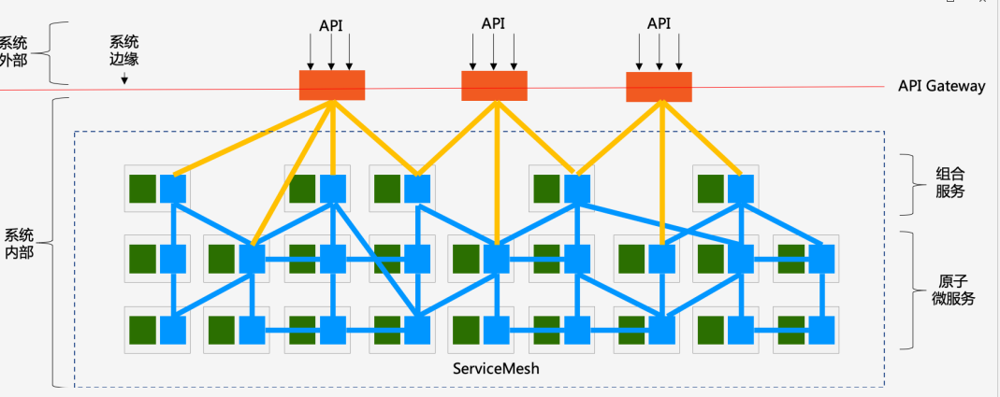
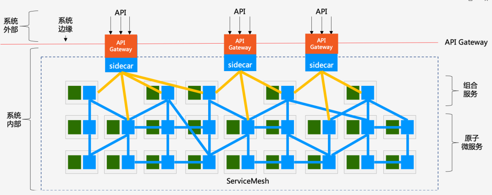
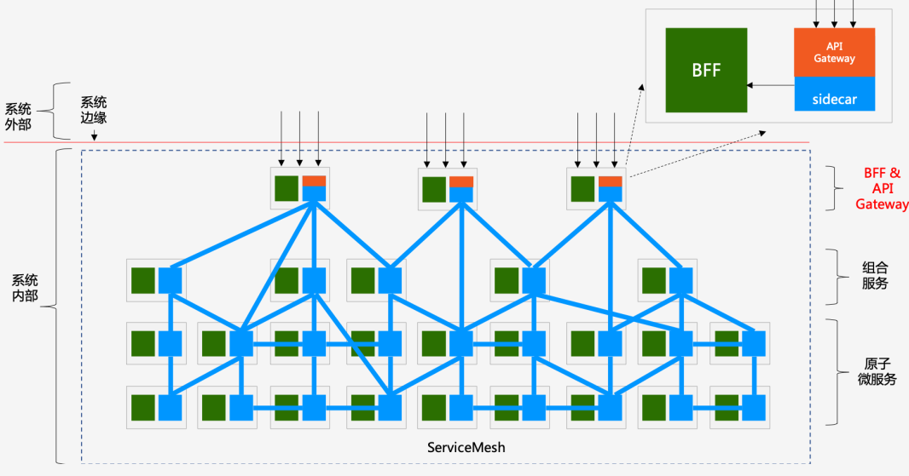

# Service Mesh 和 API Gateway 关系深度探讨

首先，Service Mesh 和 API Gateway 在功能定位和承担的职责上有非常清晰的界限：

- Service Mesh：微服务的网络通信基础设施，负责（**系统内部**的）服务间的通讯；
- API Gateway：负责将服务以 API 的形式暴露（给**系统外部**），以实现业务功能。

从功能和职责上说：

- 位于最底层的是拆分好的原子微服务，以服务的形式提供各种能力；
- 在原子微服务上是（可选的）组合服务，某些场景下需要将若干微服务的能力组合起来形成新的服务；
- 原子微服务和组合服务部署于 系统内部，在采用 Service Mesh 的情况下，由 Service Mesh 提供服务间通讯的能力；
- API Gateway 用于将系统内部的这些服务暴露给 系统外部，以 API 的形式接受外部请求。

从部署上说：

- Service Mesh 部署在系统内部：因为原子微服务和组合服务通常不会直接暴露给外部系统；
- API Gateway 部署在系统的边缘：一方面暴露在系统之外，对外提供 API 供外部系统访问；一方面部署在系统内部，以访问内部的各种服务。

术语：
- 东西向通讯：指服务间的相互访问，其通讯流量在服务间流转，**流量都位于系统内部**；
- 南北向通讯：指服务对外部提供访问，通常是通过 API Gateway 提供的 API 对外部保罗，其通讯流量是**从系统外部进入系统内部**。

所以，API Gateway 作为一个客户端访问内部服务时，到底算南北向还是东西向，就成为一个**哲学问题**：完全**取决于我们如何看待** API Gateway ，是作为一个整体，还是逻辑上分拆为对内对外两个部分。

这个哲学问题并非无厘头，在 API Gateway 的各种产品中，关于如何实现 “API Gateway 作为一个客户端访问内部服务” ，就通常分成两个流派：

- 泾渭分明：视 API Gateway 和内部服务为**两个独立事物**，API Gateway 访问内部服务的通讯机制自行实现，独立于服务间通讯的机制；
- 兼容并济：视 API Gateway 为一个**普通的内部服务的客户端**，重用其内部服务间通讯的机制。

而最终决策通常也和产品的定位有关：如果希望维持 API Gateway 的独立产品定位，希望可以在不同的服务间通讯方案下都可以使用，则通常选择前者，典型如 Kong；如果和服务间通讯方案有非常深的渊源，则通常选择后者，典型如 Spring Cloud 生态下的 Zuul 和 Spring Cloud Gateway。

但无论选择哪个流派，都改变不了一个事实，当 “API Gateway 作为一个客户端访问内部服务” 时，它的确和一个普通内部服务作为客户端去访问其他服务没有本质差异：**服务发现、负载均衡、流量路由、熔断、限流、服务降级、故障注入、日志、监控、链路追踪、访问控制、加密、身份认证**…… 当我们把网关访问内部服务的功能一一列出来时，发现几乎所有的这些功能都是和服务间调用重复。

这也就造成了一个普遍现象：如果已有一个成熟的服务间通讯框架，再去考虑实现 API Gateway，重用这些重复的能力就成为自然而然的选择。典型如前面提到的 Spring Cloud 生态下的 Zuul 以及后面开发的 Spring Cloud Gateway，就是以重用类库的方式实现了这些能力的重用。

答案不重要。

如何融合东西向和南北向的通讯方案？

其中的一个做法就是基于 Service Mesh 的 Sidecar 来实现 API Gateway，从而在南北向通讯中引入 Service Mesh 这种东西向通讯的方案。

API Gateway 这次真的可以分拆为两个独立部署的物理实体，而不是逻辑上的两个部分：

- API Gateway 本体：实现 API Gateway **除了访问内部服务之外的功能**；
- Sidecar：按照 Service Mesh 的标准做法， 我们视 API Gateway 为**一个部署于 Service Mesh 中的普通服务**，为这个服务 1:1 的部署 Sidecar。

在这个方案中，原来用于 Service Mesh 的 Sidecar，被用在了 API Gateway 中，替代了 API Gateway 中原有的客户端访问的各种功能。这个方案让 API Gateway 的实现简化了很多，也实现了东西向和南北向通讯能力的重用和融合，而 **API Gateway 可以更专注于 “API Management” 的核心功能**。

此时 Service Mesh 和 API Gateway 的关系就从“泾渭分明”变成了“兼容并济”。

而采用这个方案的公司，**通常都是先有 Service Mesh 产品，再基于 Service Mesh 产品规划（或者重新规划） API Gateway 方案**，典型如蚂蚁金服的 SOFA Gateway 产品是基于 MOSN，而社区开源产品 Ambassador 和 Gloo 都是基于 Envoy。

上述方案的优势在于 API Gateway 和 Sidecar 独立部署，职责明确，架构清晰。但是，和 Service Mesh 使用Sidecar 被质疑多一跳会造成性能开销影响效率一样，API Gateway 使用 Sidecar 也被同样的质疑：多了一跳

解决“多一跳”问题的方法简单而粗暴，基于 Sidecar，将 API Gateway 的功能加进来。这样 API Gateway 本体和 Sidecar 再次合二为一

## BFF：把融合进行到底
BFF（Backend For Frontend）的引入会让 Service Mesh 和 API Gateway 走到一个更加亲密的地步。BFF 完全收口外部流量.

此时的场景是这样：

- 流量直接打到 BFF 上（BFF 前面可能会挂其他的网络组件提供负载均衡等功能）；

- BFF 的 Sidecar 接收流量，完成 API Gateway 的功能，然后将流量转给 BFF；

- BFF 通过 Sidecar 调用内部服务（和没有合并时一致）。

## 参考链接:
- [Service Mesh 和 API Gateway 关系深度探讨](https://mp.weixin.qq.com/s/zhJ3koaApEOVfdyyXuAGUQ)

---
- [如何为服务网格选择入口网关？](https://zhaohuabing.com/post/2019-03-29-how-to-choose-ingress-for-service-mesh/): 介绍了内部服务间的通信(Cluster IP、Istio Sidecar Proxy)的优缺点。如何从外部网络访问， 如何为服务网格选择入口网关？。介绍包括Pod、Service、NodePort、LoadBalancer、Ingress、Gateway、VirtualService等，最后采用API Gateway + Sidecar Proxy作为服务网格的流量入口。还不能很好理解。
