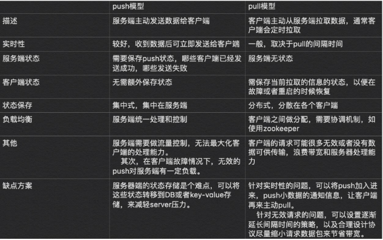

- [prometheus-book](https://yunlzheng.gitbook.io/prometheus-book/)
- [prometheus-in-action](https://www.aneasystone.com/archives/2018/11/prometheus-in-action.html)

## 基本原理
Prometheus的基本原理是通过HTTP协议周期性抓取被监控组件的状态，任意组件只要提供对应的HTTP接口就可以接入监控。不需要任何SDK或者其他的集成过程。这样做非常适合做虚拟化环境监控系统，比如VM、Docker、Kubernetes等。输出被监控组件信息的HTTP接口被叫做exporter 。目前互联网公司常用的组件大部分都有exporter可以直接使用，比如Varnish、Haproxy、Nginx、MySQL、Linux系统信息(包括磁盘、内存、CPU、网络等等)。

## 服务过程

- Prometheus Daemon负责定时去目标上抓取metrics(指标)数据，每个抓取目标需要暴露一个http服务的接口给它定时抓取。Prometheus支持通过配置文件、文本文件、Zookeeper、Consul、DNS SRV Lookup等方式**指定抓取目标**。Prometheus采用**PULL的方式进行监控**，即服务器可以直接通过目标PULL数据或者间接地通过**中间网关来Push数据**。

- Prometheus在本地存储抓取的所有数据，并通过一定规则进行清理和整理数据，并把得到的结果存储到新的时间序列中。

- Prometheus通过PromQL和其他API可视化地展示收集的数据。Prometheus支持很多方式的图表可视化，例如Grafana、自带的Promdash以及自身提供的模版引擎等等。Prometheus还提供HTTP API的查询方式，自定义所需要的输出。

- PushGateway支持Client主动推送metrics到PushGateway，而Prometheus只是定时去Gateway上抓取数据。

- Alertmanager是独立于Prometheus的一个组件，可以支持Prometheus的查询语句，提供十分灵活的报警方式。

## 三大套件

- Server 主要负责数据采集和存储，提供PromQL查询语言的支持。
- Alertmanager 警告管理器，用来进行报警。
- Push Gateway 支持临时性Job主动推送指标的中间网关。

## 数据模型
虽然 Prometheus 里存储的数据都是 float64 的一个数值，但如果我们按类型来分，可以把 Prometheus 的数据分成四大类：

- Counter
- Gauge
- Histogram
- Summary

Counter 用于计数，例如：请求次数、任务完成数、错误发生次数，这个值会一直增加，不会减少。

Gauge 就是一般的数值，可大可小，例如：温度变化、内存使用变化。

Histogram 是直方图，或称为柱状图，常用于跟踪事件发生的规模，例如：请求耗时、响应大小。它特别之处是可以对记录的内容进行分组，提供 count 和 sum 的功能。

Summary 和 Histogram 十分相似，也用于跟踪事件发生的规模，不同之处是，它提供了一个 quantiles 的功能，可以按百分比划分跟踪的结果。例如：quantile 取值 0.95，表示取采样值里面的 95% 数据。

更多信息可以参考官网文档 Metric types，Summary 和 Histogram 的概念比较容易混淆，属于比较高阶的指标类型，可以参考 Histograms and summaries 这里的说明。

---
# 监控实践

- [QUERYING PROMETHEUS](https://prometheus.io/docs/prometheus/latest/querying/basics/)

如何进行同步环比的对比： 这段时间的值/上段时间的值

注意事项： 是否能进行分段的整合？
例子： 1分钟内的p95，不等于一个小时整合60分钟的p95。还有一些其他的例子。

## 报警规则

如何避免突刺: 进行平均值的报警;通过某个报警的阈值触发了多次才报警。

如何没有数据的检查: 某段时间的最小值大于0

## 推和拉的区别

PrometheusServer 负责定时在目标上抓取 metrics（指标）数据，每个抓取目标都需要暴露一个 HTTP 服务接口用于 Prometheus 定时抓取。这种调用被监控对象获取监控数据的方式被称为 Pull（拉）。Pull 方式体现了 Prometheus 独特的设计哲学与大多数采用了 Push（推）方式的监控系统不同。

Pull 方式的优势是能够自动进行上游监控和水平监控，配置更少，更容易扩展，更灵活，更容易实现高可用。展开来说就是 Pull 方式可以降低耦合。由于在推送系统中很容易出现因为**向监控系统推送数据失败而导致被监控系统瘫痪的问题**，所以通过 Pull 方式，被采集端**无须感知监控系统的存在**，完全独立于监控系统之外，这样数据的采集完全由监控系统控制，增强了整个系统的可控性。

Prometheus 通过 Pull 方式采集数据，那么它如何获取监控对象呢？Prometheus 支持两种方式：第 1 种是通过配置文件、文本文件等进行静态配置；第 2 种是支持 ZooKeeper、Consul、Kubernetes 等方式进行动态发现，例如对于 Kubernetes 的动态发现，Prometheus 使用 Kubernetes 的 API 查询和监控容器信息的变化，动态更新监控对象，这样容器的创建和删除就都可以被 Prometheus 感知。

> 总结: 灵活，降低耦合，无须感知监控系统的存在。push: 代表sentry。 服务端需要做流量控制
    - 灵活: 采集程序可以随时去拉取时间，而推则要实现制定好策略
    - 推更低延迟，很多都是使用udp协议，来实现更低延迟的传输。
    - 推，服务端需要维护状态，哪些客户端发送成功。而拉，则是客户端需要维护状态，以待信息采集。
    - 推： 需要服务端做一些流量控制，例如sentry，避免峰值过大。而拉则更灵活调整策略,减少客户端的依赖。
