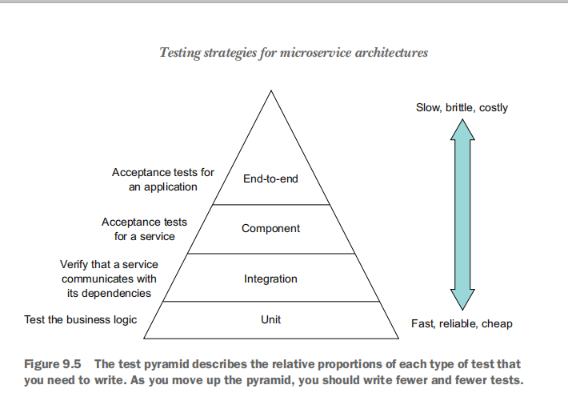

# 前言
- [代码仓库](https://git.umlife.net/adxmi/redash)

是基于redash-v8版本clone的一个仓库，然后在此基础上进行了一些定制化的更改。

# 如何构建与部署

## 构建

- [Dockerfile](https://git.umlife.net/adxmi/redash/-/blob/latest/Dockerfile)
- [docker-compose.yml](https://git.umlife.net/adxmi/redash/-/blob/latest/docker-compose.yml)
- [一个CI例子](https://git.umlife.net/adxmi/redash/-/jobs/954889)

### 前端构建

`COPY client /frontend/client` 可以看到client目录下存放的是前端的代码，然后重通过`npm run build`进行前端代码的构建

### 后端构建

使用预构建好的基础镜像`registry.umlife.net:443/adxmi/redash:base`，主要是因为旧版本的镜像安装依赖库无法正常安装。

### 数据库初始化

依赖于PG。注意本地开发的时候，通过docker-compose up 启动的时候，需要手动进行数据库的初始化：

```bash
docker-compose run --rm server create_db

docker-compose run --rm postgres psql -h postgres -U postgres -c "create database tests;"
```

### 单元测试

```bash
docker-compose run --name tests redash tests --junitxml=junit.xml --cov-report xml --cov=redash --cov-config .coveragerc tests/
```

## 部署

正式环境部署在pub-es-00，相关代码在bin/redash目录下

```yaml

services:
  server:
    <<: *redash-service
    command: server
    ports:
    - "5050:5000"
    environment:
      <<: *environment
      REDASH_WEB_WORKERS: 2
  scheduler:
    <<: *redash-service
    command: scheduler
    environment:
      <<: *environment
      QUEUES: "celery"
      WORKERS_COUNT: 2
  scheduled_worker:
    <<: *redash-service
    command: worker
    environment:
      <<: *environment
      QUEUES: "scheduled_queries,schemas"
      WORKERS_COUNT: 2
  adhoc_worker:
    <<: *redash-service
    command: worker
    environment:
      <<: *environment
      QUEUES: "queries"
      WORKERS_COUNT: 2
```

# 项目架构

[启动命令](https://git.umlife.net/adxmi/redash/-/blob/latest/bin/docker-entrypoint)

- server: 通过gunicorn启动的服务端，默认监听5000端口。
- scheduler： 调度器进程。通过celery的beat进行定时的任务队列。
- scheduled_worker: 消费调度器任务。
- adhoc_worker: 消费查询命令相关的任务。

> Ad Hoc源自于拉丁语，意思是“for this”引申为“for this purpose only”，即“为某种目的设置的，特别的”意思

## 定时任务

`redash/worker.py:celery_schedule`配置

- refresh_queries: 每30秒获取设置了定时规则的查询语句，然后进行查询任务队列的入队。
- empty_schedules： 通过每小时定时查询表，获取到已经超过设置的过期定时任务，置空其定时计划。
- refresh_schema： 定时刷新schema的信息

可以通过`redash.settings.dynamic_settings.custom_tasks`注入自己的定时任务

`scheduled_queries`队列是专门给定时查询任务的队列，而在`redash.models.DataSource`的模型中，可以设置`scheduled_queue_name`列的值，来达到某些数据源配置单独查询队列，达到分流解耦各个数据源的队列压力的作用。`queue_name`列则是相应的查询队列名称。


## 查询任务

- `/api/query_results`： 查询接口，发送查询语句触发查询任务入队列。返回一个job_id。
- `/api/jobs/job_id`: 轮询查询job_id的结果，以达到实时查询的效果，当查询队列完成后，会返回一个query_result_id。
- `/api/query_results/query_result_id`: 通过query_result_id以达到获取查询结果。
- `/api/events`: 在其中还会发送execute事件进行事件收集

[redash](https://redash-alishh.umlife.net/queries/7438/source)

- `redash.handlers.query_results.run_query`

参数渲染、然后会通过查询语句文本的hash，如果max_age参数>0，则会去query_result表查询一下最后一次查询的hash，如果是一样的话，则直接返回最后一次的查询结果id。否则的话，才进行查询队列入队。

- `redash.tasks.queries.enqueue_query`

为了避免**相同查询的重复入队**，这里采用了redis来避免重复入队列，`job_id = pipe.get(_job_lock_id(query_hash, data_source.id))`。

通过query_hash和data_source作为唯一的队列id标识，在入队的时候如果发现异步任务存在，且**未完成**，则直接复用该查询任务。

如果发现任务已经完成了，则删除redis的key，然后通过redis的事务进行异步任务的入队和redis事务的设置，再次查询。

但这里的并发限制，并不是精确的同一时间只会运行同一个查询。因为在并发的时候还是会有问题。

在pipe.multi()加一个sleep，后并发查询： 一个请求先入队set key，另一个请求入队，但set key失败。重试后，**直接拿第一个入队的锁了**。导致**无用的请求**。

> 测试的时候要注意本地dev_server是单线程的。直接用server开启多worker测试。

> 分布式锁的简化版的使用场景。场景使得并发对锁的影响处理更简单了(删除操作)。注意redis事务、watch的用法。

### 这里的锁是否有问题？

Q:在一开始的get and delete操作中，并不能保证原子性。`redis_connection.delete(_job_lock_id(query_hash, data_source.id))`当另一个程序也在执行delete的时候，是不是就造成多次delele了？虽然多次删除没造成任何影响。
A:即使多删除了，也会重新set，而且得到set的值语义上都是一样的。

Q: 另一个问题是如果job是reday的状态下，其会进行delete操作，但符合multi和watch命令之间的更改值的定义。会触发WatchError，但这时候查询已经入队了。导致一个无用的操作?

A: 不会。因为入队的判断条件是job是否存在，执行了入队，job就存在了，即使因为WatchError触发重试了，也不会重复入队。但是就是redis不会存在key。

Q: 用到事务的原因是?

A: 乐观锁，避免并发时候的覆盖更新，key的原子性。如果不用事务会造成什么后果？set了key的值，发现不是。被覆盖了，但在这个场景没有太大影响？因为返回的是job，而不是key。而且set的值，语义上都是一样的。去掉也可以？

Q: redis的分布式锁为什么没有这个场景？

A: redis的分布式锁，不会有并发修改的场景，通过set key val exp time nx 进行原子性的写操作。


Q: 并发场景？在任务入队过程中，因为redis不存在job_id的key，开启事务`pipe.multi()`，进行入队操作和redis的set job_id操作。在这操作中，如果另一个程序先于其执行该操作，会发生如下情况。因为前面通过watch命令，watch到了相应的key，所以会在`pipe.execute()`**执行中失败**。但是因为并不是**分布式事务**，redis虽然没有set到相应的key，`execute_query.apply_async`异步任务还是会**发送执行的**。也就是发送了两个执行查询任务。也就是执行两次，会发送**最多三个**查询?

A: 不会最多三个，同上。是判断job的。请求一次只会入队一次。重试不成功的情况是：redis的set失败，但返回也会有job。只能说是两个请求同时发生，一个请求先入队set key，另一个请求入队，但set key失败。重试后，**直接拿第一个入队的锁了**。导致**无用的请求**。造成这个原因是因为分布式事务。应该发生watch error的时候，需要取消无用的入队的task。

### time_limit
`time_limit = settings.dynamic_settings.query_time_limit(scheduled_query, user_id, data_source.org_id)`: 有相应的查询任务限制时间策略。通过celery的soft_time_limit进行限制，超出时间抛出SoftTimeLimitExceeded异常

time_limit=120（秒级）超过120秒直接杀死当前执行任务的worker

如果你的任务超时了，你不希望杀死而是想处理异常，可以用下面的方式： soft_time_limit=120 超时抛出异常SoftTimeLimitExceeded。

> 目前，时间限制在不支持SIGUSR1信号的平台上不起作用。实现原理？

#### 源码
```
错误类： billiard.exceptions.SoftTimeLimitExceeded
注册： celery.concurrency.asynpool.AsynPool.register_with_event_loop
逻辑处理： billiard.pool.Pool._start_timeout_handler。启动子线程。
超时判断逻辑: billiard.pool.TimeoutHandler.handle_timeouts。子线程逻辑，每秒钟判断是否超时。
信号处理： billiard/pool.py:105、billiard/pool.py

处理类： billiard.pool.TimeoutHandler。超时进行timeout callback，后进行信号传递给相关进程。
billiard.pool.TimeoutHandler.on_hard_timeout： 信号处理逻辑。self._trywaitkill(process)
billiard.pool.TimeoutHandler.on_soft_timeout: 发送SIGUSR1信号给job

通过多线程启动定时任务，子线程通过信号传递给相关执行任务，让其捕获信号后处理实现通信。
```

- [time-limits](https://docs.celeryproject.org/en/latest/userguide/workers.html#time-limits)


## 执行查询

`redash.tasks.queries.QueryExecutor.run`： 通过查询的date_source获取到相应的数据源类，然后执行各自数据源的run_query


# 如何做修改流水记录

- [表结构](https://redash-alishh.umlife.net/queries/7439/source)

## event
- "执行命令"的event事件的记录:post events的请求(/api/events)，保存的是执行时间与执行人。
- "更新数据源后执行命令"会post两个event列表的请求。 会记录更新update_data_source的行为，和上面说的“执行命令行为”。
- "更改描述"会post一个event列表：edit_name

redash通过`redash.handlers.base.record_event`进行各种事件的监听, 一般由object_type、object_id、action进行区分。

object_type包含query、query_result、group、dashboard等类型属性，通过object_id进行具体实体的定位，通过action进行各种操作记录。还可以附带额外的属性， 都通过json的形式保存到`additional_properties`里面。

而具体event的入库也是通过异步任务`redash.tasks.general.record_event`进行的。

而具体内容的变更保存则是通过Mixin类的形式`redash.models.changes.ChangeTrackingMixin`附在在相应的model上。通过捕获__setattr__进行更新属性的监听，通过`record_changes`方法记录到该models的变更前与变更后的相应值，保存在`changes`表的change字段。也是通过object_type、object_id进行实体的区分。

- [redash.handlers.queries.QueryResource](https://git.umlife.net/-/ide/project/adxmi/redash/tree/latest/-/redash/handlers/queries.py/)

# 测试

- [tests](https://git.umlife.net/-/ide/project/adxmi/redash/tree/latest/-/tests/__init__.py/)



- 单元测试:测试服务的一小部分，比如类。
- 集成测试:验证服务是否可以正常与基础设施服务（数据库等）和其他服务交互
- 组件tests:单个服务的验收测试
- 端到端tests:测试整个应用程序。

## 如何写测试

tests.factories.ModelFactory: 测试数据库工厂类，简化各种数据的生成。还可以通过指定列的Sequence，让每次调用都会生成一个全局自增值的新行。

- [test_models](https://git.umlife.net/-/ide/project/adxmi/redash/tree/latest/-/tests/test_models.py/)

tests.BaseTestCase: 接口测试的基类，封装好相关的测试环境和test_client。

## 异步队列

做单元测试而不是集成测试，测试celery异步任务调用的次数。mock掉数据库的查询方法返回值。

tests.tasks.test_queries.TestEnqueueTask: `self.assertEqual(3, execute_query.apply_async.call_count)`。 mock掉celery调用，只检查调用次数。通过`call_args`检查调用的参数检查。

tests.tasks.test_refresh_queries.TestRefreshQuery: `assert_called_with`、`assert_has_calls`、`assert_not_called`。 通过mock判断是否以什么参数调用了该方法，而不是真正发送队列或者调用。

tests.tasks.test_queries.QueryExecutorTests: 而真正的异步任务，则是直接调用方法测试其逻辑。
