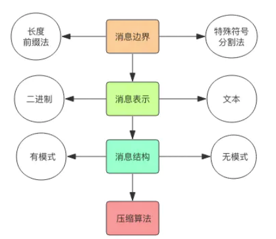
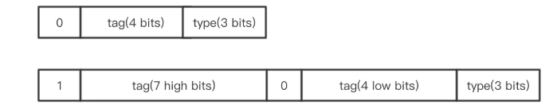
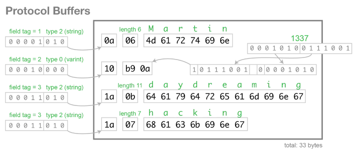

## 什么是 RPC ？

RPC (Remote Procedure Call)即远程过程调用，是分布式系统常见的一种通信方法，已经有 40 多年历史。当两个物理分离的子系统需要建立逻辑上的关联时，RPC 是牵线搭桥的常见技术手段之一。除 RPC 之外，常见的多系统数据交互方案还有分布式消息队列、HTTP 请求调用、数据库和分布式缓存等。

其中 RPC 和 HTTP 调用是没有经过中间件的，它们是端到端系统的直接数据交互。HTTP 调用其实也可以看成是一种特殊的 RPC，只不过传统意义上的 RPC 是指**长连接数据交互**，而 HTTP 一般是指即用即走的短链接。

Nginx 和后端服务之间的交互在本质上也可以理解为 RPC 数据交互。也许你会争辩说 Nginx 和后端服务之间使用的是 HTTP 协议，走的是短连接，严格上不能算是 RPC 调用。

**不过 Nginx 和后端服务之间还可以走其它的协议，比如 uwsgi 协议、fastcgi 协议等，这两个协议都是采用了比 HTTP 协议更加节省流量的二进制协议。**

比如最常见的 Hadoop 文件系统 hdfs，一般包括一个 NameNode 和多个 DataNode，NameNode 和 DataNode 之间就是通过一种称为 Hadoop RPC 的二进制协议进行通讯。

Google 开源了一个建立在 HTTP2.0 协议之上的通信框架直接取名为 gRPC，也就是 Google RPC，**这时 HTTP 和 RPC 之间已经没有非常明显的界限了**。

HTTP VS RPC （普通话 VS 方言）:但是在企业内部还是 RPC 更加高效，同一个企业公用一套方言进行高效率的交流，要比通用的 HTTP 协议来交流更加节省资源。普通话本质上也是一种方言，只不过它是官方的方言，使用最为广泛的方言，相比而言其它方言都是小语种，小语种之中也会有几个使用比较广泛比较特色的方言占比也会比较大.

# 深入 RPC 消息协议



## 消息边界

HTTP 和 Redis 协议就大量使用了\r\n 分割符。此种消息一般要求消息体的内容是文本消息。

消息发送端在每条消息的开头增加一个 **4 字节长度的整数值，标记消息体的长度**。这样消息接受者首先读取到长度信息，然后再读取相应长度的字节数组就可以将一个完整的消息分离出来。此种消息比较常用于二进制消息。

基于特殊分割符法的优点在于消息的可读性比较强，可以直接看到消息的文本内容，缺点是不适合传递二进制消息，因为二进制的字节数组里面很容易就冒出连续的两个字节内容正好就是\r\n 分割符的 ascii 值。如果需要传递的话，一般是对二进制进行 base64 编码转变成普通文本消息再进行传送。

> 特殊分割符好处异读，长度前缀法适用于二进制协议的数据。

HTTP 协议是一种基于特殊分割符和长度前缀法的混合型协议。比如 HTTP 的消息头采用的是纯文本外加\r\n 分割符，而消息体则是通过消息头中的 Content-Type 的值来决定长度。HTTP 协议虽然被称之为文本传输协议，但是也可以在消息体中传输二进制数据数据的，例如音视频图像，所以 HTTP 协议被称之为「超文本」传输协议。

## 消息的结构

每条消息都有它包含的语义结构信息，有些消息协议的结构信息是**显式**的，还有些是**隐式**的。比如 json 消息，它的结构就可以直接通过它的内容体现出来，所以它是一种显式结构的消息协议。

**json 这种直观的消息协议的可读性非常棒，但是它的缺点也很明显，有太多的冗余信息。**

**消息的结构在同一条消息通道上是可以复用的**，比如在建立链接的开始 RPC 客户端和服务器之间先交流协商一下消息的结构，后续发送消息时只需要发送一系列消息的 value 值，接收端会自动将 value 值和相应位置的 key 关联起来，形成一个完成的结构消息。在 Hadoop 系统中广泛使用的 avro 消息协议就是通过这种方式实现的，**在 RPC 链接建立之处就开始交流消息的结构，后续消息的传递就可以节省很多流量**。

> 复用结构进行流量节省

## 消息压缩

如果消息的内容太大，就要考虑**对消息进行压缩处理，这可以减轻网络带宽压力。但是这同时也会加重 CPU 的负担**，因为压缩算法是 CPU 计算密集型操作，会导致操作系统的负载加重。所以，最终是否进行消息压缩，一定要根据业务情况加以权衡。

如果确定压缩，那么在选择压缩算法包时，务必挑选那些底层用 C 语言实现的算法库，因为 Python 的字节码执行起来太慢了。比较流行的消息压缩算法有 Google 的 snappy 算法，它的运行性能非常好，压缩比例虽然不是最优的，但是离最优的差距已经不是很大。

消息传递中大部分使用的整数值都是很小的非负整数，如果全部使用 4 个字节来表示一个整数会很浪费。所以就发明了一个类型叫变长整数varint。数值非常小时，只需要使用一个字节来存储，数值稍微大一点可以使用 2 个字节，再大一点就是 3 个字节，它还可以超过 4 个字节用来表达长整形数字。

varint: 其原理也很简单，就是保留每个字节的最高位的 bit 来标识是否后面还有字节，1 表示还有字节需要继续读，0 表示到读到当前字节就结束。

zigzag 编码来了，专门用来解决负数问题。zigzag 编码将整数范围一一映射到自然数范围，然后再进行 varint 编码。zigzag 将负数编码成正奇数，正数编码成偶数。解码的时候遇到偶数直接除 2 就是原值，遇到奇数就加 1 除 2 再取负就是原值。

- [消息协议](https://juejin.im/book/5af56a3c518825426642e004/section/5af56b06518825428a25e42f)

# Redis 文本协议结构

Redis 要对外提供存储服务，客户端和服务器之间免不了也要进行 RPC 通信，Redis 作者 Antirez 为 Redis 设计了一套专用的文本通讯协议 RESP。

Antirez 认为数据库系统的瓶颈一般**不在于网络流量**，而是数据库自身**内部逻辑处理上**。所以即使 Redis 使用了浪费流量的文本协议，依然可以取得极高的访问性能。Redis 将所有数据都放在内存，用一个单线程对外提供服务，单个节点在跑满一个 CPU 核心的情况下可以达到了 10w/s 的超高 QPS。

> 瓶颈不是IO，故可读的文本协议可接受

RESP 是 Redis 序列化协议的简写。它是一种直观的文本协议，优势在于**实现异常简单，解析性能极好**。

Redis 协议将传输的结构数据分为 5 种最小单元类型，单元结束时统一加上回车换行符号\r\n。

- 单行字符串 以+符号开头；
- 多行字符串 以$符号开头，后跟字符串长度；
- 整数值 以:符号开头，后跟整数的字符串形式；
- 错误消息 以-符号开头；
- 数组 以*号开头，后跟数组的长度；

客户端向服务器发送的指令只有一种格式，多行字符串数组。比如一个简单的 set 指令`set author codehole`会被序列化成下面的字符串。

```
*3\r\n$3\r\nset\r\n$6\r\nauthor\r\n$8\r\ncodehole\r\n
```

**虽然 Redis 协议里有大量冗余的回车换行符，但是这并不影响它成为互联网技术领域非常受欢迎的一个文本协议**。有很多开源项目使用 RESP 作为它的通讯协议。因为在技术领域，性能并不总是代表一切，有时还要考虑简单性、易理解性和易实现性，这些都需要进行适当权衡。

**Redis 协议作为开源协议中的一朵奇葩，它并没有向网络流量倾斜进行极致优化，而是选择了照顾协议的直观性、可理解性。**

# Protobuf 二进制协议结构

Protobuf 提供了一种描述通讯协议的接口描述语言 IDL，通过编写接口协议，Protobuf 可以自动生成多种语言的 RPC 通讯代码，目前官方已经支持了近 10 种语言。

键 key 两部分组成：tag 和 type。

- tag

Protobuf 将对象中的每个**字段和正数序列** (tag) 对应起来，对应关系的信息是由生成的代码来保证的。在序列化的时候用**整数值来代替字段名称**，于是传输流量就可以大幅缩减。如果字段较少，它就使用 4 个 bits 来表示，最多支持 16 个字段。如果字段数量超过 16 个，那就再加 1 个字节，如果还不够那就再加 1 个字节。你也许猜到了，这个 tag 值使用的是 **varint 编码**。理论上字段的长度不设上限，因为 varint 可以通过**扩展字节数支持任意大的非负整数**。

> varint整数值代替字段名称

- type

Protobuf 将字段类型也和正数序列 (type) 对应起来，每一种原生的 java 类型都唯一对应一个正数，类型信息也非常节省。type 使用 **3 个 bits** 表示，最多支持 8 种类型。

varint 的特长就在于此，它可以无限扩展位数大小，可以表示无限的整数值。而字节数组、字符串和嵌套对象都可以使用一种称之为 **length 前缀** (length-delimited) 的类型来表示。另外 float 和 double 类型各占一个类型。最终你看，连 8 个类型都没有使用到。



### 整数

Protobuf 的整数数值使用 zigzag 编码。zigzag 编码支持负数值，varint 编码的都是非负数。这个在第三节已经讲过了，它们都是变长整数。

### 浮点数

浮点数分为 float 和 double，它们分别使用 4 个字节和 6 个字节序列化，这两个类型的 value 没有做什么特殊处理，它就是标准的浮点数。

### 字符串

Protobuf 的字符串值使用长度前缀编码。**第一个字节是字符串的长度，后面相应长度的字节串就是字符串的内容**。如果字符串长度很长，那么长度前缀就不止一个字节，它可能是两字节三字节四字节，你也许猜到了，这个**长度采用的是 varint 编码**。

### 嵌套

Protobuf 支持类型嵌套。嵌套类型的 type 同字符串的 type 一样，都是 length 前缀。**第一个字节 (varint) 表示字节长度，后面相应长度的字节串就是嵌套对象的整个内容**，这部分内容会**递归**使用 Protobuf 进行编码解码。

### 可选类型

Protobuf 支持可选类型。不过二进制流里面可没有使用任何标志为来表示字段是否可选。它只是在运行时做了检查，如果一个必须的字段的 tag 在二进制流里面没有出现，那就会抛出一个运行时异常。当Protobuf升级到3.0的时候，可选类型消失了，取而代之的是所有的类型都是可选类型。也就是说发送端即使没有填充该字段，接收端也不会抛出错误了，字段可选与否完全依赖于用户自己去检查了。

```
message Person {
    required string user_name        = 1;  // 必须字段
    optional int64  favourite_number = 2;  // 可选字段
    repeated string interests        = 3;  // 列表类型
}
```


## 小结

Protobuf 并没有定义消息边界，也就是没有消息头。**消息头一般由用户自己定义**，通常使用长度前缀法来定义边界。

同样 Protobuf 也没有定义消息类型，当服务器收到一串消息时，它必须知道对应的类型，然后选择相应消息类型的解码器来读取消息。这个类型信息也必须由用户自己在消息头里面定义。

> 可以说消息头定义了消息的边界、消息的结构。后续就传值就可以了。

# Redis 协议的缺陷

## 连接重连
当 RPC 客户端向服务器发送请求之后，连接突然断开，这个断开可能发生在请求阶段，这时服务器没有收到消息。也可能发生在响应阶段，这时服务器已经处理了消息，只是客户端没有收到回复就断开了。客户端并不总是可以轻易判断出服务器是否已经处理了消息还是根本就没收到。

然后客户端会尝试重连，连接成功后，需要重试之前的请求。这时问题就来了，如果连接的断开是在**响应阶段**，那么请求有可能会被**重复执行**。但是不重试的话，连接的断开如果发生在**请求阶段**，那就又会导致**请求丢失**。

> 发送消息，网络断了。重试还是丢弃。响应阶段、请求阶段。之前mysql的类似场景思考。
> mysql有事务的保证？跟这个问题应该没关联。MySQL直接报错。

为了解决上面的问题，客户端在构造请求时要为每个请求赋予一个唯一 ID。

服务器收到请求后会记录这个唯一 ID，当请求处理完成后，会将响应也记录下来和请求 ID 关联上。如果请求重复发送了，就可以立即识别出来。服务器遇到重复请求时，不应该直接拒绝，而是将前面记录下来的响应直接进行回复。

考虑到服务器的内存也是有限的，不可能记录下所有的请求 ID 和响应，所以一般只保留近一段时间的请求 ID 和响应。

如果仔细阅读 Redis 的客户端源码，你会发现 Redis 并没有给每个请求赋予唯一 ID，它只是简单地在遇到异常时重试一下。

> 那 Redis 究竟是如何解决重复的问题？亦或它根本就没解决？

接下来我们根据返回的错误类型逐个分析:

- ConnectionError

ConnectionError 是指在**建立连接时就出了错**，或者是从连接池里获取连接因为系统过于繁忙，总是拿不到。这种情况毫无疑问是**需要重试**的，因为客户端根本还没有尝试去发送消息。

- TimeoutError

TimeoutError 要分两种情况对待，一种是在**写消息**时遇到了超时，另一种是在**读消息**时遇到了超时。

### 写超时
写超时是指内核为当前套接字开辟的**写缓存空间已经满了**，有三种原因会导致写缓冲满。

- 写方的消息因为网络原因迟迟达到不了读方；
- 读方老是不读消息，所以没有给写方即时 ack；
- 写方因为网络原因收不到对方的 ack；
> 消息未达、达到未读、已读收不到ack、


对于写方的消息达到不了读方这种情况，我们无法预料读方在未来的某个时间点是否又可以收到消息，所以此时不可以随意重试。

对于读方老是不读消息这种情况 (accept 了连接但是没有调用 read 方法)，我们**无法预料读方在未来的某个时间是否会继续恢复读消息**，也就是无法预知服务器 (读方) 是否会处理当前的消息。这个时候选择重试只能是瞎子摸象无从得知是否会导致消息重复。

如果是因为写方临时的网络原因收不到读方的 ack 才导致的写缓冲区满，这时服务器方是已经读取了消息的并进行处理了。这样的超时理论上是不应该重试的，重试必然导致消息重复。

### 读超时

再看读超时，读超时是指消息已经写进 (send) 本地写缓冲区了，然后调用 recv 方法**等待对方响应**时很久没有收到一个**完整的响应消息**，可能是一个字节都没收到，也可能只是收到了半包消息。

消息**写进了缓冲区并不意味着读方一定可以收到**，recv 方法一个字节都没收到也不能确定是服务器方没有处理还是已经处理了但是响应消息因为网络原因到达不了写方。也只有在收取到半包消息的情况下才可以确认消息确实已经被服务器处理过了。不过就 redis 客户端的实现来说，代码里并没有明确区分是一个字节都没收到还是半包消息。所以在读超时的情况下选择重试也是一样的瞎子摸象。

也正是因为这个原因，Redis 的 Client 对象构造器提供了一个**retry_on_timeout选项来让用户自己决定要不要在TimeoutError时进行重试**，让用户自己来选择在超时出现时要丢失还是重复，客户端代码本身是无法确保消息是否会重复的。

Python 的 Redis 客户端有缺陷，那么 Java 的 Redis 客户端有没有缺陷呢？答案是「有」。因为问题的本质不在于编写客户端的程序员的代码能力问题，而是 Redis 服务器从消息协议的设计上就没有支持消息去重，无论是什么语言编写的客户端都无法解决这个问题。

> 让用户自己去决定。消息协议无法解决这个问题。


---

`thread.start_new_thread(handle_conn, (conn, addr, handlers))  # 开启新线程进行处理`

Python 里多线程使用的并不常见，因为 Python 的 GIL 致使单个进程只能占满一个 CPU 核心，多线程并不能充分利用多核的优势。所以多数 Python 服务器推荐使用多进程模型。我们将使用 Python 内置的 os.fork() 创建子进程。

fork 调用将生成一个子进程，所以这个函数会在父子进程同时返回。在父进程的返回结果是一个整数值，这个值是子进程的进程号，父进程可以使用该进程号来控制子进程的运行。fork 在子进程的返回结果是零。如果 fork 返回值小于零，一般意味着操作系统资源不足，无法创建进程。

我们可以通过 fork 调用的返回值来区分当前的进程是父进程还是子进程。
```python
pid = os.fork()
if pid > 0:
    conn.close()  # 关闭父进程的客户端套接字引用
if pid == 0:
    sock.close()  # 关闭子进程的服务器套接字引用
    handle_conn(conn, addr, handlers)
    break  # 处理完后一定要退出循环，不然子进程也会继续去 accept 连接
if pid < 0:
    # fork error
```

子进程创建后，父进程拥有的很多操作系统资源，子进程也会持有。比如套接字和文件描述符，它们本质上都是对操作系统内核对象的一个引用。如果子进程不需要某些引用，一定要即时关闭它，避免操作系统资源得不到释放导致资源泄露。

子进程创建容易，销毁难。当子进程退出后，父进程需要使用 waitpid 系统调用收割子进程，否则子进程将成为僵尸进程，僵尸进程会持续占据操作系统的资源直到父进程退出后被 init 进程接管收割后才会消失释放资源。收割子进程的逻辑处理有一定的复杂度，涉及到非常精细的信号控制逻辑。

因为进程 fork 之后，套接字会复制一份到子进程，这时父子进程将会各有自己的套接字引用指向内核的同一份套接字对象，套接字的引用计数为2。

对套接字进程 close，并不是说就是关闭套接字，其本质上只是将内核套接字对象的引用计数减一。只有当引用计数减为零时，才会关闭套接字。

如果没有上述逻辑就会导致服务器套接字引用计数不断增长，同时客户端套接字对象也得不到即时回收，这便是传说中的资源泄露。

---
# 【PreForking同步】模型
进程要比线程更加吃资源，如果来一个连接就开一个进程，当连接比较多时，进程数量也会跟着多起来，操作系统的调度压力也就会比较大。所以我们要对服务器开辟的进程数量进行限制，避免系统负载过重。这就需要掌握多进程 PreForking 模型。

## 多进程 PreForking 模型

采用 PreForking 模型可以对子进程的数量进行了限制。PreForking 是通过预先产生多个子进程，共同对服务器套接字进行竞争性的 accept，当一个连接到来时，每个子进程都有机会拿到这个连接，但是最终只会有一个进程能 accept 成功返回拿到连接。子进程拿到连接后，进程内部可以继续使用单线程或者多线程同步的形式对连接进行处理。

## accept 竞争

prefork 之后，父进程创建的服务套接字引用，每个子进程也会继承一份，它们共同指向了操作系统内核的套接字对象，共享了同一份连接监听队列。子进程和父进程一样都可以对服务套接字进行 accept 调用，从共享的监听队列中摘取一个新连接进行处理。

> 父子进程竞争拿一个连接

---
# 【单进程异步】模型

##　非阻塞 IO

操作系统提供的文件读写操作默认都是同步的，它必须等到数据就绪后才能返回，如果数据没有就绪，它就会阻塞当前的线程，其它的事什么都干不了，这是对操作系统线程资源的一种浪费。

为了解决这个问题，操作系统给文件读写提供了非阻塞选项。当我们读写文件时，提供一个 O_NONBLOCK 选项，读写操作就不会阻塞。

```python
socket = socket.socket()
socket.setblocking(0)  # 开启非阻塞模式
socket.read()  # 有多少读多少
socket.write()  # 能写多少是多少
```
## 事件轮询

非阻塞 IO 看起来很有用，但是有个问题，我们该如何知道某个套接字可读可写呢？如果我们反复去使用 read 和 write 去轮询 IO，这似乎挺费劲的，假设一个套接字长期闲置没有消息到来，结果还要调用成千上万次的 read，这是明显的在浪费 CPU 嘛。

操作系统提供了事件轮询的 API。我们使用这个 API 来查询相关套接字是否有相应的读写事件，如果有的话该 API 会立即携带事件列表返回，如果没有事件，该 API 会阻塞，阻塞多长时间可以通过参数设置。阻塞看起来似乎不太好，但是如果服务器没什么事可以干，那**睡大觉就是节省资源的最佳方式**。

> 阻塞是节省资源的最佳方式，阻塞时间参数

调用事件轮询 API 拿到读写事件后，就可以接着对事件相关的套接字进行读写操作了，这个时候读写操作都是正常进行的，而不会浪费 CPU 空读空写。

```python
read_events, write_events = select.select(read_fds, write_fds, timeout)
for event in read_events:
    handle_read(event)
for event in write_events:
    handle_write(event)
```
> select的例子

一个完整的事件循环除了要处理 IO 相关的事件外，还有一些内部的事件需要处理，比如定时任务。

Nginx/Redis/Java NIO 和各种 Web 服务器都使用了事件轮询 API，它是高性能高并发的关键技术之一。


## 用户进程读写缓冲区
非阻塞 IO 要求用户程序为每个套接字维持一个 ReadBuffer，它和操作系统内核区的 ReadBuffer 不是同一个东西。用户态的 ReadBuffer 是由用户代码来进行控制。它的作用就是保留当前的半包消息，如果消息的内容完整了，就可以从 ReadBuffer 中取出来进行处理。

这就要求用户程序为每个套接字维护一个写缓冲区，把剩下的没写完的字节都放在里面，以便后续可写事件到来时，能继续把没写完的写下去。

## asyncore

Python 内置的异步 IO 库。考虑到编写原生的事件轮询和异步读写的逻辑比较复杂，要考虑的细节非常多。所以 Python 对这一块的逻辑代码做了一层封装，简化了异步逻辑的处理，使用起来非常方便。asyncore负责socket事件轮询，用户编写代码时只需要提供回调方法即可，asyncore会在相应的事件到来时，调用用户提供的回调方法。比如当serversocket的read事件到来时，会自动调用handle_accept方法， 当socket的read事件到来时，调用handle_read方法。

我们使用了 StringIO 作为读缓冲，用于缓存半包消息和刚刚从套接字那里读取到的字节数据。消息处理完毕之后要对读缓冲进行截断处理，将已经处理的字节数据砍掉。StringIO 的读写游标要小心使用，读的时候游标从头开始，写的时候游标从尾部开始追加，seek 函数用来移动游标。

> 读的时候注意多次读取。维护程序的读缓存区。
