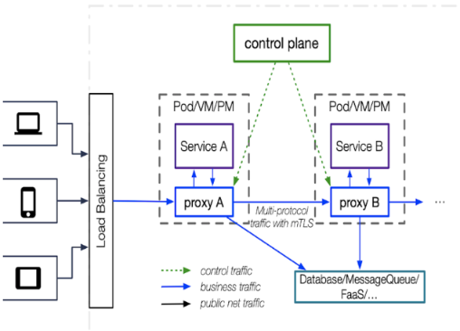
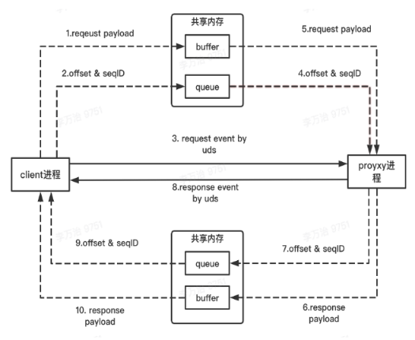

# 单体式应用程序

## 单体应用程序的优点

- 开发简洁，功能都在单个程序内部，便于软件设计和开发规划。

- 容易部署，程序单一不存在分布式集群的复杂部署环境，降低了部署难度。

- 容易测试，没有各种复杂的服务调用关系，都是内部调用方便测试。

## 缺点

1.扩展性差:

由于单体式应用程序就像一个大型容器一样，里面放置了许多服务，且他们都是**密不可分的**，这导致应用程序在**扩展**时必须以「应用程序」为单位。

当里面有个业务模块负载过高时，并不能够单独扩展该服务，必须扩展整个应用程序（就是这么霸道），这可能导致**额外的资源浪费**。

2.耦合性高

此外，单体式应用程序由于服务之间的**紧密度**、**相依性过高**，这将导致测试、升级有所困难，且**开发曲线**有可能会在后期大幅度地上升，令开发不易。

相较之下「微服务架构」能够解决这个问题。

---

# 微服务

> 2014年，Martin Fowler 与 [James Lewis](https://zh.wikipedia.org/w/index.php?title=James_Lewis&action=edit&redlink=1) 共同提出了微服务的概念，定义了微服务是由以**单一应用程序**构成的**小服务**，自己拥有**自己**的行程与轻量化处理，服务依**业务功能**设计，以**全自动**的方式部署，与其他服务使用**HTTP API**通信。同时服务会使用**最小的规模**的集中管理 (例如 [Docker](https://zh.wikipedia.org/wiki/Docker)) 能力，服务可以用**不同的编程语言**与**数据库**等组件实现 。「维基百科」

## 优点

- 技术异构性: 为不同的服务选择最适合该服务的技术，系统中不同部分也可以使用不同的存储技术
- 隔离性: 一个服务不可用不会导致另一个服务也瘫痪，因为各个服务是相互独立和自治的系统。
- 可扩展性: 庞大的单体服务如果出现性能瓶颈只能对软件整体进行扩展，可能真正影响性能的只是其中一个很小的模块，我们也不得不付出升级整个应用的代价。
- 简化部署: 各个服务的部署是独立的，如果真出了问题也只是影响单个服务，可以快速回滚版本解决。
- 易优化: 微服务架构中单个服务的代码量不会很大，这样当你需要重构或者优化这部分服务的时候，就会容易很多，毕竟，代码量越少意味着代码改动带来的影响越可控。

## 缺点

- 服务注册与发现： 微服务之间相互调用完成整体业务功能，如何在众多微服务中找到正确的目标服务地址，这就是所谓「服务发现」功能。
- 服务监控： 单体程序的监控运维还好说，大型微服务架构的服务运维是一大挑战。服务运维人员需要实时的掌握服务运行中的各种状态，最好有个控制面板能看到服务的内存使用率、调用次数、健康状况等信息。这就需要我们有一套完备的服务监控体系，包括拓扑关系、监控（Metrics）、日志监控（Logging）、调用追踪（Trace）、告警通知、健康检查等，防患于未然。
- 服务容错： 任何服务都不能保证100%不出问题，生产环境复杂多变，服务运行过程中不可避免的发生各种故障（宕机、过载等等），工程师能够做的是在故障发生时尽可能降低影响范围、尽快恢复正常服务。程序员为此避免被祭天，需要引入「熔断、隔离、限流和降级、超时机制」等「服务容错」机制来保证服务持续可用性。
- 服务安全： 有些服务的敏感数据存在安全问题，「服务安全」就是对敏感服务采用安全鉴权机制，对服务的访问需要进行相应的身份验证和授权，防止数据泄露的风险

----
# 服务治理

微服务框架： Dubbo、Tars、Motan、thrift

gRPC，是Google开发的高性能、通用的开源RPC框架，其由Google主要面向移动应用开发并基于HTTP/2协议标准而设计，基于ProtoBuf(Protocol Buffers)序列化协议开发。本身它不是分布式的，所以要实现上面的框架的功能需要进一步的开发。2015 年对外开源的跨语言 RPC 框架，支持多种语言。

## 什么是RPC
RPC (Remote Procedure Call)远程过程调用是一个计算机通信协议。我们一般的程序调用是本地程序内部的调用，RPC允许你像调用本地函数一样去调用另一个程序的函数，这中间会涉及网络通信和进程间通信，但你无需知道实现细节，RPC框架为你屏蔽了底层实现。RPC是一种服务器-客户端（Client/Server）模式，经典实现是一个通过发送请求-接受回应进行信息交互的系统。

## 两者关系
RPC和微服务框架的关系我的理解，微服务框架一般都包含了RPC的实现和一系列「服务治理」能力，是一套软件开发框架。我们可以基于这个框架之上实现自己的微服务，方便的利用微服务框架提供的「服务治理」能力和RPC能力，所以微服务框架也被有些人称作RPC框架。

---------
# Service Mesh

为什么现有微服务架构已经解决的问题还要用Service Mesh呢？这个问题问的好。

Service Mesh（服务网格）被认为是下一代微服务架构，Service Mesh并没有给我们带来新的功能，它是用于解决其他工具已经解决过的服务网络调用、限流、熔断和监控等问题，只不过这次是在Cloud Native 的 kubernetes 环境下的实现。

## 特点
Service Mesh 有如下几个特点：

- 应用程序间通讯的中间层

- 轻量级网络代理

- 应用程序无感知

- 解耦应用程序的重试/超时、监控、追踪和服务发现

## Why Service Mesh

回答问题之前，先看下istio.io上对service mesh的解释，我觉得挺好的，摘抄出来：

> As a service mesh grows in size and complexity, it can become harder to understand and manage. Its requirements can include discovery, load balancing, failure recovery, metrics, and monitoring. A service mesh also often has more complex operational requirements, like A/B testing, canary rollouts, rate limiting, access control, and end-to-end authentication.

随着服务网格在规模和复杂性上的增长，它可能变得更难理解和管理。它的需求可以包括**发现、负载平衡、故障恢复、度量和监视**。服务网格通常还具有更复杂的操作需求，如**A/B测试、金丝雀部署、速率限制、访问控制和端到端身份验证**。

> makes it easy to create a network of deployed services with load balancing, service-to-service authentication, monitoring, and more, with few or no code changes in service code.

使创建一个包含负载平衡、服务到服务身份验证、监视等的已部署服务的网络变得**容易**，而服务代码中**很少或没有代码更改**。

Service Mesh之于微服务，就像TCP/IP之于互联网，TCP/IP为网络通信提供了面向连接的、可靠的、基于字节流的**基础通信功能**，你不再需要关心底层的重传、校验、流量控制、拥塞控制。

用了Service Mesh你也不必去操心「服务治理」的细节，不需要对服务做特殊的改造，所有业务之外的功能都由Service Mesh帮你去做了。它就像一个**轻量级网络代理** 对应用程序来说是透明，所有应用程序间的**流量**都会通过它，所以对应用程序流量的**控制**都可以在 serivce mesh 中实现 。

- [面试都在问的微服务、服务治理、RPC、下一代微服务框架... 一文带你彻底搞懂！](https://xie.infoq.cn/article/0e90c253f85bcb745316dbdc8)
- TODO: [istio的那些事儿](https://github.com/rfyiamcool/share_ppt/blob/master/istio.pdf)

---
# Service Mesh 流量治理技术

- [抖音春晚活动背后的 Service Mesh 流量治理技术](https://juejin.cn/post/6969012264342913038): Service Mesh

分布式架构相对于单体架构，其稳定性和可观测性要差一些。
为了提升这些点，我们就需要在微服务框架上实现很多功能。例如：

- 微服务需要通过相互调用来完成原先单体大服务所实现的功能，这其中就涉及到相关的网络通信，以及网络通信带来的请求的序列化、响应的反序列化。
- 服务间的相互调用涉及服务发现。
- 分布式的架构可能需要不同的流量治理策略来保证服务之间相互调用的稳定性。
- 微服务架构下还需要提升可观测性能力，包括日志、监控、Tracing 等。

通过实现以上这些功能，微服务架构也能解决前面提到的一些问题。但是微服务本身又存在一些问题：

- 在多语言的微服务框架上实现多种功能，涉及的开发和运维成本非常高；
- 微服务框架上一些新 Feature 的交付或者版本召回，需要业务研发同学配合进行相关的改动和发布上线，会造成微服务框架的版本长期割裂不受控的现象。

图中蓝色矩形的 Proxy 节点是 Service Mesh 的数据面，它是一个单独的进程，和运行着业务逻辑的 Service 进程部署在同样的运行环境（同一个容器或同一台机器）中。由这个 Proxy 进程来代理流经 Service 进程的所有流量，前面提到的需要在微服务框架上实现的服务发现、流量治理策略等功能就都可以由这个数据面进程完成。

图中的绿色矩形是 Service Mesh 的控制面。我们需要执行的路由流量、治理策略是由这个控制面决定的。它是一个部署在远端的服务，由它和数据面进程下发一些流量治理的规则，然后由数据面进程去执行。

首先介绍一下流量治理的核心

- 路由：流量从一个微服务实体出发，可能需要进行一些服务发现或者通过一些规则流到下一个微服务。这个过程可以衍生出很多流量治理能力。
- 安全：流量在不同的微服务之间流转时，需要通过身份认证、授权、加密等方式来保障流量内容是安全、真实、可信的。
- 控制：在面对不同的场景时，用动态调整治理策略来保障微服务的稳定性。
- 可观测性：这是比较重要的一点，我们需要对流量的状态加以记录、追踪，并配合预警系统及时发现并解决问题。

## 稳定性策略

熔断

限流

降级

动态过载保护

负载均衡

节点分片

限流：限制并发的请求访问量，超过阈值则拒绝；

降级：服务分优先级，牺牲非核心服务（不可用），保证核心服务稳定；从整体负荷考虑；

熔断：依赖的下游服务故障触发熔断，避免引发本系统崩溃；系统自动执行和恢复

## 进程间通讯

数据面进程会代理业务进程的流量，通常是通过 iptables 的方式进行。这种方案的 overhead 非常高，所以我们采用了进程间通讯的方式，通过和微服务框架约定一个 unix domain socket 地址或者一个本地的端口，然后进行相关的流量劫持。虽然这种方式相对于 iptables 会有一些性能提升，它本身也存在的额外的一些开销。

我们是如何降低进程间通讯开销的呢？在传统的进程间通讯里，比如像 unix domain socket 或者本地的端口，会涉及到传输的内容在用户态到内核态的拷贝。比如请求转发给数据面进程会涉及到请求在用户态和内核态之间拷贝，数据面进程读出来的时候又会涉及内核态到用户态的拷贝，那么一来一回就会涉及到多达 4 次的内存拷贝。

我们的解决方案是通过共享内存来完成的。共享内存是 Linux 下最高性能的一种进程间通讯方式，但是它没有相关的通知机制。当我们把请求放到共享内存之后，另外一个进程并不知道有请求放了进来。所以我们需要引入一些事件通知的机制，让数据面进程知道。我们通过 unix domain socket 完成了这样一个过程，它的效果是可以减少内存的拷贝开销。同时我们在共享内存中引用了一个队列，这个队列可以批量收割 IO，从而减少了系统的调用。它起到的效果也是非常明显的，在抖音春晚活动的一些风控场景下，性能可以提高 24%。

完成这些优化之后，要去落地的阻力就没那么大了。
