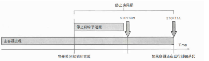

生命周期结束（End-of-Lifecycle）的问题会使任务、服务以及程序的设计和实现等过程变得复杂，而这个在程序设计中非常重要的要素却经常被忽略。一个在行为良好的软件与勉强运行的软件之间的最主要区别就是，行为良好的软件能很完善地处理失败、关闭和取消等过程。

# 背景

发现k8s上的脚本服务，对于容器的退出信号没有进行处理。

在消费kafka同步ES的脚本中，导致的结果是：

- 数据丢失。消费kafka消息的时候，同步ES的脚本，为了较少同步ES的操作，会缓存一定量的数据，然后再批量进行同步。当某一部分数据缓存在程序内存中的时候，如果程序收到退出的信号，但是没有处理这批内存中的数据的话，会造成数据的丢失。

- 数据延迟。程序退出如果没有主动close掉kafka消费者，则不能立刻关闭网络连接和套接字。如果主动关闭的话，它还将立即触发重新平衡，而不是等待组协调器发现使用者停止发送心跳信号，并且很可能已死亡，这将花费更长的时间。从而导致使用者较长时间无法使用来自分区子集的消息。


# 常见的signal

### SIGHUP(1)
检测到控制中断挂起或者控制进程死亡时，进程会收到 SIGHUP。现在操作系统，该信号通常意味着使用的 虚拟终端 已经被关闭。许多 守护进程 在接收到该信号时，会重载他们的设置和重新打开日志文件（logfiles），而不是去退出程序。nohup 命令用于无视该信号。

例如： `kill -SIGHUP $(pidof dockerd)`可以看到docker守护程序收到此信号并重新加载daemon.json配置文件。因此，在修改/etc/docker/daemon.json文件后，可以向Docker发送SIGHUP信号以重新加载配置文件，而无需重新启动docker守护程序。

### SIGINT(2)
当用户希望中断进程时，SIGINT信号由用户的控制终端发送到进程。这通常通过按下Ctrl+C来发送，但是在某些系统中，可以使用“DELETE”键或“BREAK”键。

### SIGKILL(9)
发送SIGKILL信号到一个进程可以使其立即终止(KILL)。与SIGTERM和SIGINT相不同的是，这个信号不能被捕获或忽略，接收过程在接收到这个信号时不能执行任何清理。

### SIGTERM(15)
程序结束(terminate)信号, 与SIGKILL不同的是该信号可以被阻塞和处理 。通常用来要求程序自己正常退出，shell命令kill缺省产生这个信号。如果进程终止不了，我们才会尝试SIGKILL。


# timeout

timeout -s 15 -k 10 3 python cli/update_test.py

```bash
-s 15:  --signal=SIGNAL 见'kill -l'。默认是SIGTERM
-k 10:  --kill-after=DURATION 10 在发送信号10秒钟后还是允许则直接kill掉。如果不加，则不会强制kill掉，即使处理信号的时间会很久。
3: 3秒timeout时间限制
```

# supervisor

stopsignal: Default: TERM。请求停止时用于终止程序的信号。

stopwaitsecs: Default: 10。在程序被发送停止信号后，等待操作系统向supervisord返回SIGCHLD的秒数。如果在supervisord从进程接收到SIGCHLD之前过了这段时间，supervisord将kill掉SIGCHLD。

# docker

### docker stop

当我们使用docker stop命令停止容器时，默认情况下，docker允许容器中的应用程序有10秒的时间来终止应用程序。我们可以通过在执行docker stop命令时手动指定--time/-t参数来定制停止的时间

执行docker stop命令时，会向容器中PID为1（主进程）的进程发送系统信号SIGTERM。然后等待容器中的应用程序终止执行。如果等待时间达到设置的超时时间，如默认的10秒，则继续发送SIGKILL的系统信号，强制终止进程。容器中的应用程序可以选择忽略而不处理SIGTERM信号，但一旦超时，程序将被系统强制终止。

### docker kill
默认情况下，docker kill命令不会给容器中的应用程序提供任何优雅的关闭机会。它将直接发送SIGKILL的系统信号，强制容器中的程序操作终止。
`docker kill --signal=SIGINT container_name`但与docker stop命令不同，docker kill没有任何超时设置。

### docker rm
docker rm命令用于删除已停止运行的容器。我们可以添加--force或-f参数来强制删除正在运行的容器。使用此参数后，docker会向正在运行的容器发送一个SIGKILL信号，强制容器停止运行，然后将其删除。


# k8s

通常情况下，容器运行时会发送一个 TERM 信号到每个容器中的主进程。 一旦超出了体面终止限期，容器运行时会向所有剩余进程发送 KILL 信号，之后 Pod 就会被从 API 服务器 上移除。

执行顺序如下：

1. 执行停止前钩子（如果配置了的话）， 然后等待它执行完毕
2. 向容器的主进程发送SIGTERM信号
3. 等待容器优雅地关闭或者等待终止宽限期超时
4. 如果容器主进程没有优雅地关闭， 使用SIGKILL信号强制终止进程




一般程序自身原因导致的异常退出状态区间在 1-128 (这只是一般约定，程序如果一定要用129-255的状态码也是可以的)

外界中断将程序退出的时候状态码区间在 129-255，(操作系统给程序发送中断信号，比如 kill -9 是 SIGKILL ，return 128 + 9 ，ctrl+c 是 SIGINT)

# 常见的坑

## CMD
当CMD指令执行时，shell 格式` CMD command param1 param2 `底层会调用` /bin/sh -c【command】`。而执行docker stop命令时，会向容器中**PID为1（主进程）的进程**发送系统信号SIGTERM。推荐使用Exec格式：`CMD ["executable","paraml","param2"]`

## dumb-init

dumb-init：向子进程代理发送信号和接管子进程，防止孤儿僵尸进程。

- 孤儿进程：**一个父进程已经终止的进程被称为孤儿进程**（orphan process）。没有人管的孤儿进程会被进程 ID 为 1 的进程接管。并由init进程对它完成状态收集(wait/waitpid)工作。

- 僵尸进程：子进程挂了，如果父进程不给子进程“收尸”（调用 wait/waitpid），那这个子进程就变成了僵尸进程。

- 信号传递：如果 pid 为 1 的进程，无法向其子进程传递信号，可能导致容器发送 SIGTERM 信号之后，父进程等待子进程退出。此时，如果父进程不能将信号传递到子进程，则整个容器就将无法正常退出，除非向父进程发送 SIGKILL 信号，使其强行退出。

所以init 进程有下面这几个功能

- 如果一个进程的父进程退出了，那么这个 init 进程便会接管这个孤儿进程。
- 如果一个进程的父进程未执行 wait/waitpid 就退出了，init 进程会接管子进程并自动调用 wait 方法，从而保证系统中的僵尸进程可以被移除。
- 传递信号给子进程

而**Bash会负责回收僵尸进程，但不会将该信号转发给子进程**。

还有dumb-init支持信号重写,`--rewrite=15:2` 将SIGTERM => SIGINT。而SIGINT在python里，可以直接捕获KeyboardInterrupt异常进行处理。这样子的话，程序代码能比较简单和统一处理退出信号。

## shell

当我们容器启动的是sh文件的时候，

```bash
#!/bin/sh
python signals.py
```

```
ENTRYPOINT ["./run.sh"]
```

```
$ docker exec -it python-signals ps
PID   USER     TIME  COMMAND
    1 root      0:00 {run.sh} /bin/sh ./run.sh
    6 root      0:00 python signals.py
    7 root      0:00 ps
```
需要通过exec命令解决：
```bash
#!/bin/sh
exec python signals.py
```

```
PID   USER     TIME  COMMAND
    1 root      0:00 python signals.py
   12 root      0:00 ps
```

## Istio

因为sidecar注入的时候是加到 主容器的后边。启动是串行的，k8s会先启动主容器 （执行preStart, entrypoint, postStart）后，再启动 istio-proxy。

导致的结果是sidecar(istio)在pod启动的时候比业务程序的容器慢，也导致进来有短暂时间网络异常。

还有就是k8s退出的时候，istio也有可能在主容器优雅退出的时候，已经关闭，导致优雅退出处理过程中的网络异常。

k8s的1.18版本中你可以把一个容器标记成sidecar，它会保证一定在你的程序启动前完成启动，也会保证在你的容器关闭后再关闭自己。但是阿里云的最新版本是1.16。

所以先通过SIDECAR_WAIT_PRE_STOP环境变量让istio先sleep一段时间再退出。

# 参考链接
- [pod-lifecycle](https://kubernetes.io/docs/concepts/workloads/pods/pod-lifecycle/)
- [Kubernetes故障排查指南-分析容器退出状态码](https://cloud.tencent.com/developer/article/1650332)
- [dumb-init-Docker](https://www.infoq.cn/article/2016/01/dumb-init-Docker)
- [一次 Docker 容器内大量僵尸进程排查分析](https://juejin.cn/post/6844904029248552973): 容器内的node进程无法进行回收，而且也没有退出容器，让宿主的pid1回收。chrome 主进程退出，剩下的三个孤儿僵尸进程被托管到顶层 npm 进程下，但是 npm 进程无力回收。

---

# TODO

- [ ] uwsgi的优雅退出分析
- [ ] k8s发布（金丝雀发布）


---
# dumb-init：一个 Docker 容器初始化系统

- [dumb-init：一个 Docker 容器初始化系统](https://www.infoq.cn/article/2016/01/dumb-init-Docker)

## 问题的根源

归功于 Linux 的名字空间（namespace），从容器中看，由容器创建的第一个进程 pid 为 1。而对于 Linux 来说，pid 为 1 的进程，有着特殊的使命：

1. 传递信号，确保子进程完全退出
2. 等待子进程退出


## 子进程的优雅退出

对于第一点，如果 pid 为 1 的进程，无法向其子进程传递信号，可能导致容器发送 SIGTERM 信号之后，父进程等待子进程退出。此时，如果父进程不能将信号传递到子进程，则整个容器就将无法正常退出，除非向父进程发送 SIGKILL 信号，使其强行退出。

bash 进程在接受到 SIGTERM 信号的时候，不会向 app 进程传递这个信号，这会导致 app 进程仍然不会退出。对于传统 Linux 系统（bash 进程 PID 不为 1），在 bash 进程退出之后，app 进程的父进程会被 init 进程（PID 为 1）接管，成为其父进程。但是在容器环境中，这样的行为会使 app 进程失去父进程，因此 bash 进程不会退出。

## 僵尸子进程

另一个问题是等待子进程退出。前面提到过，init 进程另一个任务，是需要接管子进程，确保其能正常退出。但是一般应用程序，不会考虑实现接管进程功能。当应用程序进程在容器中运行时，其子进程创建的子进程，就有可能成为僵尸进程。
