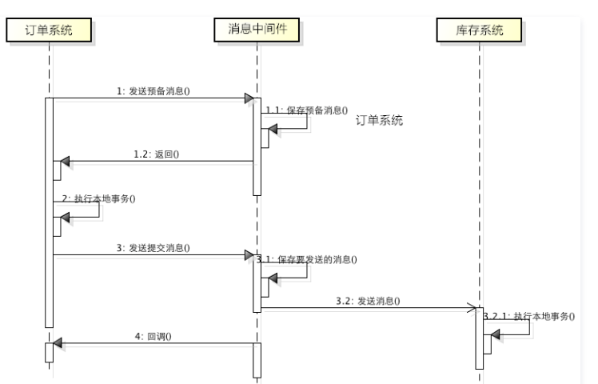

分布式事务是指会涉及到操作多个数据库的事务，其实就是将对同一库事务的概念扩大到了对多个库的事务。目的是为了保证分布式系统中的数据一致性。

分布式事务处理的关键是：

- 需要记录事务在任何节点所做的所有动作；
- 事务进行的所有操作要么全部提交，要么全部回滚。

# XA 规范

XA规范定义了交易中间件与数据库之间的接口规范（即接口函数），交易中间件用它来通知数据库事务的开始、结束以及提交、回滚等。而XA接口函数由数据库厂商提供。

二阶提交协议和三阶提交协议就是基于XA规范提出的其中，二阶段提交就是实现XA分布式事务的关键。

# 定义
二阶段提交的算法思路可以概括为：**每个参与者将操作成败通知协调者，再由协调者根据所有参与者的反馈情报，决定各参与者是否要提交操作还是中止操作**。

所谓的两个阶段分别是：

- 第一阶段：准备阶段（投票阶段）
- 第二阶段：提交阶段（执行阶段）

## 准备阶段

a. 事务询问

协调者向所有的参与者询问，是否准备好了执行事务，并开始等待各参与者的响应。

b. 执行事务

各参与者节点执行事务操作。如果本地事务成功，将Undo和Redo信息记入事务日志中，但**不提交**；否则，直接返回失败，退出执行。

c. 各参与者向协调者**反馈事务询问的响应**

如果参与者成功执行了事务操作，那么就反馈给协调者 Yes响应，表示事务可以执行提交；如果参与者没有成功执行事务，就返回No给协调者，表示事务不可以执行提交。

## 提交阶段

a. 发送提交请求

协调者向所有参与者**发出commit请求**。

b. 事务提交

参与者收到commit请求后，会正式执行事务提交操作，并在完成提交之后，**释放整个事务执行期间占用的事务资源**。

c. 反馈事务提交结果

参与者在完成事务提交之后，向协调者发送Ack信息。

d. 事务提交确认

协调者**接收到所有参与者反馈的Ack信息后，完成事务**。


---
# 二阶段提交的优缺点

## 优点

原理简单，实现方便。

## **缺点**

同步阻塞，单点问题，数据不一致，容错性不好。

### 同步阻塞
在二阶段提交的过程中，所有的节点**都在等待其他节点**的响应，无法进行其他操作。这种同步阻塞极大的限制了分布式系统的性能。

### 单点问题
协调者在整个二阶段提交过程中很重要，如果协调者在提交阶段出现问题，那么整个流程将无法运转。更重要的是，其他参与者将会处于**一直锁定**事务资源的状态中，而无法继续完成事务操作。

### 数据不一致
假设当协调者向所有的参与者发送commit请求之后，发生了局部网络异常，或者是协调者在尚未发送完所有 commit请求之前自身发生了崩溃，导致**最终只有部分参与者收到了commit请求**。这将导致严重的数据不一致问题。

### 容错性不好
如果在二阶段提交的提交询问阶段中，参与者出现故障，导致协调者**始终无法获取到所有参与者的确认信息**，这时协调者只能依靠其自身的超时机制，判断是否需要中断事务。显然，这种策略过于保守。换句话说，二阶段提交协议**没有设计较为完善的容错机制，任意一个节点是失败都会导致整个事务的失败**。

- [分布式理论(三) - 2PC协议](https://juejin.im/post/5b2664446fb9a00e4a53136e)

----
# 三阶段
与两阶段提交不同的是，三阶段提交有两个改动点。

- 引入**超时机制** - 同时在协调者和参与者中都引入超时机制。
- 在第一阶段和第二阶段中插入一个准备阶段，保证了**在最后提交阶段之前各参与节点的状态是一致的**。

## 定义
所谓的三个阶段分别是：询问，然后再锁资源，最后真正提交。

- 第一阶段：CanCommit
- 第二阶段：PreCommit
- 第三阶段：Do Commit

## 阶段一：CanCommit

3PC的CanCommit阶段其实和2PC的准备阶段很像。协调者向参与者发送commit请求，参与者如果可以提交就返回Yes响应，否则返回No响应。

a. 事务询问

协调者向参与者发送CanCommit请求。**询问是否可以执行**事务**提交**操作。然后开始等待参与者的响应。

b. 响应反馈

参与者接到CanCommit请求之后，正常情况下，如果其自身认为可以顺利执行事务，则返回Yes响应，并进入预备状态；否则反馈No。


## 2.2. 阶段二：PreCommit

协调者在得到所有参与者的响应之后，会根据结果执行2种操作：执行事务预提交，或者中断事务。

### 2.2.1. 执行事务预提交

a. 发送预提交请求

协调者向所有参与者节点发出 preCommit 的请求，并进入 prepared 状态。

b. 事务预提交

参与者受到 preCommit 请求后，**会执行事务操作**，对应 2PC 准备阶段中的 “执行事务”，也会 Undo 和 Redo 信息记录到事务日志中。

c. 各参与者响应反馈

如果参与者成功执行了事务，就反馈 ACK 响应，同时等待指令：提交（commit） 或终止（abort）。

### 2.2.2. 中断事务

a. 发送中断请求

协调者向所有参与者节点发出 abort 请求 。

b. 中断事务

参与者如果收到 abort 请求或者超时了，都会中断事务。

## 2.3. 阶段三：Do Commit
该阶段进行真正的事务提交，也可以分为以下两种情况。

### 2.3.1. 执行提交

a. 发送提交请求

协调者接收到各参与者发送的ACK响应，那么他将从预提交状态进入到提交状态。并向所有参与者发送 doCommit 请求。

b. 事务提交

参与者接收到 doCommit 请求之后，执行正式的事务提交。并在完成事务提交之后释放所有事务资源。

c. 响应反馈

事务提交完之后，向协调者发送 ACK 响应。

d. 完成事务

协调者接收到所有参与者的 ACK 响应之后，完成事务。

### 2.3.2. 中断事务

协调者没有接收到参与者发送的 ACK 响应（可能是接受者发送的不是ACK响应，也可能响应超时），那么就会执行中断事务。

a. 发送中断请求

协调者向所有参与者发送 abort 请求。

b. 事务回滚

参与者接收到 abort 请求之后，利用其在阶段二记录的 undo 信息来执行事务的回滚操作，并在完成回滚之后释放所有的事务资源。

c. 反馈结果

参与者完成事务回滚之后，向协调者发送 ACK 消息。

d. 中断事务

协调者接收到参与者反馈的 ACK 消息之后，完成事务的中断。

## 优缺点

### 优点

相对于二阶段提交，三阶段提交主要解决的**单点故障**问题，并减少了**阻塞**的时间。

因为一旦参与者无法及时收到来自协调者的信息之后，他会**默认执行 commit**。而不会一直持有事务资源并处于**阻塞**状态。

### 缺点

三阶段提交也会导致**数据一致性**问题。由于网络原因，协调者发送的 abort 响应没有及时被参与者接收到，那么参与者在**等待超时**之后执行了 commit 操作。

这样就和其他接到 abort 命令并执行回滚的参与者之间存在数据不一致的情况。

- [分布式理论(四) - 3PC协议](https://juejin.im/post/5b26648e5188257494641b9f)

> 三阶段提交也存在一些缺陷，要彻底从协议层面避免数据不一致，可以采用Paxos或者Raft 算法。

- [浅谈分布式系统一致性之3PC协议](https://mp.weixin.qq.com/s/Ee9FkPcpZ2Hc3-oG559nEw)

> Mysql的二阶段，通过保留状态（xid、undo log）进行故障恢复或者回滚，保证数据一致性。

- [二阶段](./../../mysql/事务日志.md)

---

# eBay 事件队列方案——最终一致性

它的核心思想是将**需要分布式处理的任务通过消息或者日志的方式**来**异步**执行，消息或日志可以存到本地文件、数据库或消息队列，再通过业务规则进行**失败重试**，它要求各服务的接口是**幂等**的。

论文中提出的解决方法是将更新交易表记录和用户表更新消息放在一个本地事务来完成，**为了避免重复消费用户表更新消息带来的问题，增加一个操作记录表updates_applied来记录已经完成的交易相关的信息**。

这个方案的核心在于**第二阶段的重试**和**幂等**执行。失败后重试，这是一种**补偿机制**，它是能保证系统最终一致的关键流程。

> 补偿机制: 失败重试与幂等。而数据库的幂等，则通过并发更新语句的多阶段进行保持。

## 幂等

一般幂等，我会分场景去考虑，看是强校验还是弱校验，比如跟金钱相关的场景那就很关键呀，就做强校验，别不是很重要的场景做弱校验。

### 强校验

比如你监听到用户支付成功的消息，你监听到了去加GMV是不是要调用加钱的接口，那加钱接口下面再调用一个加流水的接口，两个放在一个事务，**成功一起成功失败一起失败**。每次消息过来都要拿着订单号+业务场景这样的唯一标识（比如天猫双十一活动）去流水表查，**看看有没有这条流水**，有就直接return不要走下面的流程了，没有就执行后面的逻辑。

### 弱校验?

这个简单，一些不重要的场景，比如给谁发短信啥的，我就把这个id+场景唯一标识作为Redis的key，放到缓存里面失效时间看你场景，一定时间内的这个消息就去Redis判断。

用KV就算消息丢了可能这样的场景也没关系，反正丢条无关痛痒的通知短信嘛

> 生产环境的例子：支付系统，各个项目组的支付套餐的混合购买。购买后的分布式事务，完成套餐的最终一致性。通过本地数据库来完成本地事务一致性，然后通过异步发送和重试幂等，补偿机制来保证最终一致性。

> 之前的思考，但符合现在的应用场景是，支付与流程引擎（业务系统）之间的分布式事务。支付成功->通知业务->支付状态变更。需要细读论文验证。

---

# TCC （Try-Confirm-Cancel）补偿模式——最终一致性

服务A 需要依次调用服务B、服务C 和服务D 共同完成一个操作。当服务A 调用服务D 失败时，若要保证整个系统数据的一致性，**就要对服务B 和服务C 的invoke 操作进行回滚，执行反向的revert 操作**。回滚成功后，整个微服务系统是数据一致的。

Try: 尝试执行业务

    完成所有业务检查（一致性）

    预留必须业务资源（准隔离性）

Confirm: 确认执行业务

    真正执行业务

    不作任何业务检查

    只使用Try阶段预留的业务资源

    Confirm操作满足幂等性

Cancel: 取消执行业务

    释放Try阶段预留的业务资源

    Cancel操作满足幂等性

实现关键要素：

- 服务**调用链**必须被记录下来。
- 每个服务提供者都需要提供一组**业务逻辑相反**的操作，**互为补偿**，同时**回滚操作**要保证**幂等**。
- 必须按失败原因执行**不同的回滚策略**。


Q： 如果有一些意外的情况发生了，比如说订单服务突然挂了，然后再次重启，TCC分布式事务框架是如何保证之前没执行完的分布式事务继续执行的呢？

A： 所以，TCC事务框架都是要记录一些分布式事务的活动日志的，可以在磁盘上的日志文件里记录，也可以在数据库里记录。保存下来分布式事务运行的各个阶段和状态。


参考链接：

- [实际的例子](https://juejin.im/post/5bf201f7f265da610f63528a)

> 评论：大厂的分布式事务策略几乎清一色地选择两阶段，极少TCC/没错，tcc很少用，但是，蚂蚁金服大量的用到了tcc事务，还有很多别的公司也是，实际上两阶段最大的问题，就是他的性能比较差

----

# 选型

[](#bookmark)

对购物转账等电商和金融业务，中间件层的2PC最大问题在于业务不可见，一旦出现不可抗力或意想不到的**一致性破坏**，如数据节点永久性宕机，业务难以根据2PC的日志进行补偿。金融场景下，数据一致性是命根，业务需要对数据有百分之百的掌控力，建议使用**TCC这类分布式事务模型，或基于消息队列的柔性事务框架**，这两种方案都在**业务层实现**，业务开发者具有足够掌控力，可以结合SOA框架来架构，包括Dubbo、Spring Cloud等。

- [常用的分布式事务解决方案有哪些?](https://www.zhihu.com/question/64921387/answer/225784480)
- [幂等](https://www.zhihu.com/question/64921387/answer/1023714489)

> 选型简单的对比总结。柔性事务框架应该是成本最低且能保证一致性的。

----
# 优劣对比

横向数据扩展既可以按数据分片扩展，也可以按功能扩展。XA 与 TCC 模型在这一点上的作用类似，都能在横向扩展资源的同时，保证多资源访问的事务属性，只不过前者作用于数据分片时，后者作用于功能扩展时。

基于 XA 协议实现的分布式事务并不能提升热点并发性能，其意义在于**横向扩展资源提升非热点数据并发性能**时，能严格保证对多资源访问的事务 ACID 特性。

XA 模型另外一个意义在于其普适性，抛开性能问题的情况下，几乎可以适用于所有业务模式，这对于一些基础性的技术产品来说是非常有用的，比如分布式数据库、云服务的分布式事务框架等。

TCC 分布式事务模型直接作用于服务层。不与具体的服务框架耦合，与底层 RPC 协议无关，与底层存储介质无关，可以灵活选择业务资源的锁定粒度，减少资源锁持有时间，可扩展性好，可以说是为独立部署的 SOA 服务而设计的。

TCC 的其中一个作用就是在**按照功能横向扩展资源时，保证多资源访问的事务属性**。

TCC 的另一个作用就是把两阶段拆分成了两个独立的阶段，通过资源业务锁定的方式进行关联。资源业务锁定方式的好处在于，既不会阻塞其它事务在第一阶段对于相同资源的继续使用，也不会影响本事务第二阶段的正确执行。

TCC 模型除了跨服务的分布式事务这一层作用之外，还具有两阶段划分的功能，通过业务资源锁定，允许第二阶段的异步执行，而异步化思想正是解决**热点数据并发性能问题的利器之一**。

本文结合具体的业务场景和例子，对比分析了各分布式事务解决方案在性能、热点冲突、接入复杂度和适用场景等方面的能力，希望能帮助各位读者对分布式事务有更深一层的理解。

业务各有各的不同，有些业务能容忍短期不一致，有些业务的操作可以幂等，无论什么样的分布式事务解决方案都有其优缺点，没有一个银弹能够适配所有。因此，业务需要什么样的解决方案，还需要结合自身的业务需求、业务特点、技术架构以及各解决方案的特性，综合分析，才能找到最适合的方案。

- [分布式事务主流解决方案优缺点大pk](https://dbaplus.cn/news-159-1929-1.html)

> 还是得隔段时间后复读，没有很好理解

怎么保证数据一致性的。提交后，个别服务已提交，但是个人服务失去响应。所以协调者需要一个事务管理器，进行重试的机制。事务状态字段来标识事物当前的状态：TRYING, CONFIRMING, CANCELLING。需要保证的状态更改时的一致性，之后的提交或者回滚，该事务id的状态都是一致的，故障后，只是重试完成。

---

- [微服务下数据一致性的几种实现方式](https://mp.weixin.qq.com/s/2fr1gMcOUcwktP1lz_EGcw)


---
# 对比 5 种分布式事务方案
> - [对比 5 种分布式事务方案，还是宠幸了阿里的 Seata（原理 + 实战）](https://cloud.tencent.com/developer/article/1761074)

## **Seata 优势**

实现分布式事务的方案比较多，常见的比如基于 `XA` 协议的 `2PC`、`3PC`，基于业务层的 `TCC`，还有应用消息队列 + 消息表实现的最终一致性方案，还有今天要说的 `Seata` 中间件，下边看看各个方案的优缺点。

### 2PC

基于 XA 协议实现的分布式事务，XA 协议中分为两部分：**事务管理器和本地资源管理器**。其中本地资源管理器**往往由数据库实现**，比如 Oracle、MYSQL 这些数据库都实现了 XA 接口，而**事务管理器则作为一个全局的调度者**。

两阶段提交（`2PC`），**对业务侵⼊很小，它最⼤的优势就是对使⽤⽅透明，用户可以像使⽤本地事务⼀样使⽤基于 XA 协议的分布式事务，能够严格保障事务 ACID 特性**。

可 `2PC`的缺点也是显而易见，它是一个**强一致性的同步阻塞协议**，事务执⾏过程中需要将所需资源全部锁定，也就是俗称的 `刚性事务`。所以它比较适⽤于执⾏时间确定的短事务，整体性能比较差。

**一旦事务协调者宕机或者发生网络抖动**，会让参与者一直处于锁定资源的状态或者只有一部分参与者提交成功，导致**数据的不一致**。因此，在⾼并发性能⾄上的场景中，基于 XA 协议的分布式事务并不是最佳选择。

### 3PC

三段提交（`3PC`）是二阶段提交（`2PC`）的一种改进版本 ，为解决两阶段提交协议的阻塞问题，上边提到两段提交，当协调者崩溃时，**参与者不能做出最后的选择，就会一直保持阻塞锁定资源**。

`2PC` 中只有协调者有超时机制，`3PC` 在**协调者和参与者中都引入了超时机制**，协调者出现故障后，参与者就不会一直阻塞。而且在第一阶段和第二阶段中又插入了一个准备阶段（如下图，看着有点啰嗦），保证了在最后提交阶段之前**各参与节点的状态是一致的**。

虽然 `3PC` 用超时机制，解决了协调者故障后参与者的阻塞问题，但与此同时却多了一次网络通信，性能上反而变得更差，也不太推荐。

> 而且也有不一致问题

### TCC

所谓的 `TCC` 编程模式，也是两阶段提交的一个**变种**，不同的是 `TCC` 为在**业务层编写代码实现的两阶段提交**。`TCC` 分别指 `Try`、`Confirm`、`Cancel` ，一个业务操作要对应的写这三个方法。

以下单扣库存为例，`Try` 阶段去占库存，`Confirm` 阶段则实际扣库存，如果库存扣减失败 `Cancel` 阶段进行回滚，释放库存。

TCC **不存在资源阻塞的问题**，因为每个方法都**直接进行事务的提交**，一旦出现异常通过则 `Cancel` 来进行回滚补偿，这也就是常说的**补偿性事务**。

原本一个方法，现在却需要三个方法来支持，可以看到 TCC 对业务的侵入性很强，而且这种模式并**不能很好地被复用，会导致开发量激增**。还要考虑到网络波动等原因，为保证请求一定送达都会有重试机制，所以考虑到接口的幂等性。

> TCC每个阶段都是直接进行事务的提交。提供回滚接口来解决资源阻塞。但对业务侵入性很强。

### 消息事务（最终一致性）

消息事务其实就是基于消息中间件的两阶段提交，将本地事务和发消息放在同一个事务里，保证本地操作和发送消息同时成功。下单扣库存原理图：



*   订单系统向 `MQ` 发送一条预备扣减库存消息，`MQ` 保存预备消息并返回成功 `ACK`
*   接收到预备消息执行成功 `ACK`，订单系统执行本地下单操作，**为防止消息发送成功而本地事务失败**，订单系统会实现 `MQ` 的**回调接口**，**其内不断的检查本地事务是否执行成功**，如果失败则 `rollback` 回滚预备消息；成功则对消息进行最终 `commit` 提交。
*   库存系统消费扣减库存消息，执行本地事务，如果扣减失败，消息会**重新**投，一旦超出重试次数，则本地表持久化失败消息，并启动**定时任务做补偿**。

基于消息中间件的两阶段提交方案，通常用在高并发场景下使用，牺牲数据的强一致性换取性能的大幅提升，不过实现这种方式的成本和复杂度是比较高的，还要看实际业务情况。

> 如何保证本地事务和消息队列的原子性（类似二阶段提交的思路）： MQ的**回调**接口，**其内不断的检查本地事务是否执行成功**，如果失败则 `rollback` 回滚预备消息；成功则对消息进行最终 `commit` 提交。而且下游也有进行重试和定时补偿，重点。

---
# 小结

可以通过简单的mysql的原子性来保证单次执行（分布式锁）与最终一致性？也可以说**通过幂等性来避免分布式锁**。

场景： `update t1 set a = 2 where a = 1`; 如果是第一次更新，则返回的影响行数是1，可以直接执行下一步。

如果影响行数是0，则代表已经有其他的地方执行了，无须完成下一步。以此实现一个隐藏的锁的操作。

这类比较常见的场景的扣费的时候，需要`update t1 set money -= 10 where money > 10`;通过以旧状态的数据作为筛选条件，类似版本号的方式，以此避免读写的一致性与锁问题.

但是这里还是有问题，这里只能保证执行范围内的锁（单次执行），但是无法保证**所有范围内的锁操作**，这样会导致一些问题。

> 数据库的方案需要通过数据库的原子性，包住所有的事务，才能保证当前业务的原子性。而且也只是能解决数据库层面操作的幂等性。

例如更新完成后(a=2)，程序发生了错误。那么重新进入的时候，需要再走下一个流程，则要根据当前状态2进行下一步的操作。如果这一步也是并发的话，那么保证不了这个流程的单次的执行。避免的方案**只能是每个调用都是幂等的**。数据库的幂等则可以通过上面说的update set where 旧状态限定来保证。

> 可以理解为：消息事务（**最终一致性**）模式。

而且在一些**无法触发调用的情况，例如阶段一提交后，发送给消息队列失败了**。这时候需要存在一个定时器，找出这些状态进行推进补偿才行。而下游消费也要保证至少一次消费和幂等性(例如上面说的数据库乐观锁方案)。

这些情况跟数据库的2pc提交、根据消息号进行去重是类似的思路。

---
# 摘抄

- [关于2PC, 3PC的一点思考](https://juejin.cn/post/6850418110105665549):

    问题2：2PC被认为是强一致分布式事务协议，但是却保证不了数据一致性，这是为什么呢？

    我认为这里的强一致是一种相对的说法。它要求节点在真正行动之前达到一致的状态以提高事务成功的几率。至于到达一致状态之后，各个节点数据修改与落盘这个过程，没有任何人能保证这个过程中某个节点不出错。

- [怎么理解 3PC 解决了 2PC 的阻塞问题？](https://www.zhihu.com/question/422691164):
    - 我觉得区别主要在于3PC第一阶段是做询问(因为某些参与者是无法commit或者有网络故障)，避免了2PC第一阶段直接锁定资源的问题。

- [分布式一致性中，3PC如何解决了2PC无法保障的协调者和参与者都挂掉后，节点恢复后数据一致的问题？](https://www.zhihu.com/question/264701955/answer/470905650):
    - 我觉得3pc主要解决了2pc的阻塞问题。而且相较2pc在一定程度上减少了数据不一致的可能，在一阶段投票通过后，二阶段存活节点都是preCommit的情况下，新协调者有理由相信事务可提交的概率比较大。当然这也会造成你说的数据不一致问题。这也是为什么需要其他去中心的算法来解决这个问题。

> 缺乏实战分析，理论都是浮云！

---
# 幂等性的解决方案
> - [接口的幂等性](https://juejin.im/post/6894624582091669517): 常见的几个解决办法

## 唯一索引
使用唯一索引可以避免脏数据的添加，当插入重复数据时数据库会抛异常，保证了数据的唯一性。

## 乐观锁
这里的乐观锁指的是用乐观锁的原理去实现，为数据字段增加一个version字段，当数据需要更新时，先去数据库里获取此时的version版本号
```
select version from tablename where xxx
```

更新数据时首先和版本号作对比，如果不相等说明已经有其他的请求去更新数据了，提示更新失败。
```
update tablename set count=count+1,version=version+1 where version=#{version}
```

## 悲观锁
乐观锁可以实现的往往用悲观锁也能实现，在获取数据时进行加锁，当同时有多个重复请求时其他请求都无法进行操作

## 分布式锁
幂等的本质是**分布式锁的问题**，分布式锁正常可以通过redis或zookeeper实现；在分布式环境下，锁定全局唯一资源，使请求串行化，实际表现为互斥锁，防止重复，解决幂等。

## token机制
token机制的核心思想是为每一次操作生成一个唯一性的凭证，也就是token。一个token在操作的每一个阶段只有一次执行权，一旦执行成功则保存执行结果。对重复的请求，返回同一个结果。token机制的应用十分广泛。


---
# Seata实现分布式事务
> - [Seata实现分布式事务](https://xiyuan.blog.csdn.net/article/details/107730189)

## AT模式

**AT模式，分为两个阶段**

*   **一阶段**：业务数据和回滚日志记录在同一个本地事务中提交，释放本地锁和连接资源
*   **二阶段**：提交异步化 （ 或者事务执行失败，回滚通过一阶段的回滚日志进行反向补偿）

### **一阶段**
在一阶段，`Seata` 会拦截“业务 `SQL`”，首先解析 `SQL` 语义，找到“业务 `SQL`”要更新的业务数据，在业务数据被更新前，将其保存成“`before image`”，然后执行“业务 `SQL`”更新业务数据，在业务数据更新之后，再将其保存成“`after image`”，最后生成行锁。以上操作全部在一个数据库事务内完成，这样保证了一阶段操作的原子性。

### **二阶段：执行成功，进行分布式事务提交**
业务 `SQL`”在一阶段已经提交至数据库， 所以 `Seata` 框架只需将一阶段保存的快照数据和行锁删掉，完成数据清理即可。

### **二阶段：执行失败，进行业务回滚**
首先对比“数据库当前业务数据”和 “`after image`”，避免发生业务脏写（类似于`CAS`操作），完成校验后用“`before image`”还原业务数据，并且删除中间数据。

## TCC模式

**tcc模式主要可以分为三个阶段：**

*   **Try**：做业务检查和资源预留
*   **Confirm**：确认提交
*   **Cancel**：业务执行错误需要回滚的状态下执行分支事务的业务取消，预留资源释放

### TCC模式下常见的三种异常

**1.空回滚**

空回滚就是对于一个分布式事务，在没有调用 `TCC` 资源 `Try` 方法的情况下（如机器宕机、网络异常），调用了二阶段的 `Cancel` 方法，`Cancel` 方法需要识别出这是一个空回滚，然后直接返回成功。

解决方案

需要一张额外的事务控制表，其中有分布式事务 `ID` 和分支事务 `ID`，第一阶段 `Try` 方法里会插入一条记录，表示一阶段执行了。`Cancel` 接口里读取该记录，如果该记录存在，则正常回滚；如果该记录不存在，则是空回滚。

**2.幂等**

幂等就是对于同一个分布式事务的同一个分支事务，重复去调用该分支事务的第二阶段接口，因此，要求 `TCC` 的二阶段 `Confirm` 和 `Cancel` 接口保证幂等，不会重复使用或者释放资源。如果幂等控制没有做好，很有可能导致资损等严重问题。

解决方案

记录每个分支事务的执行状态。在执行前状态，如果已执行，那就不再执行；否则，正常执行。前面在讲空回滚的时候，已经有一张事务控制表了，事务控制表的每条记录关联一个分支事务，那我们完全可以在这张事务控制表上加一个状态字段，用来记录每个分支事务的执行状态。

**3.悬挂**

悬挂就是对于一个分布式事务，其二阶段 `Cancel` 接口比 `Try` 接口先执行。因为允许空回滚的原因，`Cancel` 接口认为 `Try` 接口没执行，空回滚直接返回成功，对于 `Seata` 框架来说，认为分布式事务的二阶段接口已经执行成功，整个分布式事务就结束了。

解决方案

二阶段执行时插入一条事务控制记录，状态为已回滚，这样当一阶段执行时，先读取该记录，如果记录存在，就认为二阶段已经执行；否则二阶段没执行。

