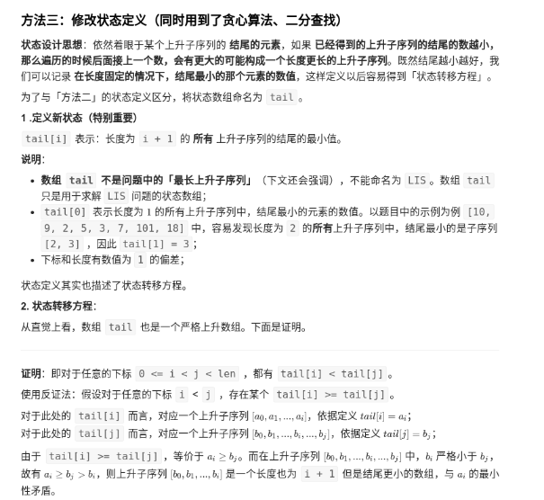
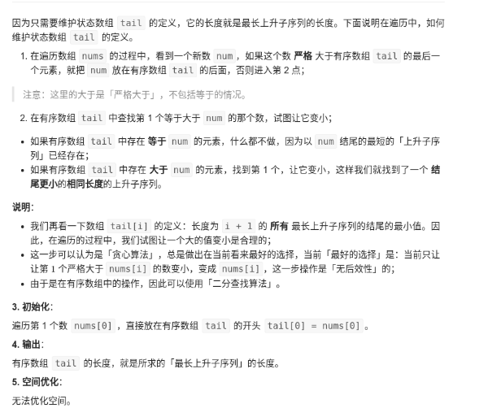

```python

"""
最长上升子序列: 给定一个无序的整数数组，找到其中最长上升子序列的长度。
https://leetcode-cn.com/problems/longest-increasing-subsequence/


dp[i] 表示以 nums[i] 这个数结尾的最长递增子序列的长度。

我们的最终结果（子序列的最大长度）应该是 dp 数组中的最大值。

我们已经知道了 dp[0...4] 的所有结果，我们如何通过这些已知结果推出 dp[5] 呢？

nums[5] = 3，既然是递增子序列，我们只要找到前面那些结尾比 3 小的子序列，然后把 3 接到最后，就可以形成一个新的递增子序列，而且这个新的子序列长度加一。

"""
from typing import List

"""时间复杂度：O(n^2)"""


class Solution:
    def lengthOfLIS(self, nums):
        if not nums:
            return 0
        d = []
        for idx, value in enumerate(nums):
            d.append(1)
            for idx_2, value_2 in enumerate(nums[:idx]):
                # 只要找到前面那些结尾比其小的最长子序列，然后接到最后，就可以形成一个新的递增子序列，而且这个新的子序列长度加一
                if value_2 < value:
                    d[idx] = max(d[idx_2] + 1, d[idx])
        return max(d)


"""
只能把点数小的牌压到点数比它大的牌上。如果当前牌点数较大没有可以放置的堆，则新建一个堆，把这张牌放进去。如果当前牌有多个堆可供选择，则选择最左边的堆放置。
"""


class SolutionHalf:

    def lengthOfLIS(self, nums):
        if not nums:
            return 0
        top = [0 for _ in nums]
        piles = 0
        # 两个问题： 什么时候新建牌堆、这个牌要放到哪个牌堆
        for idx, value in enumerate(nums):
            left, right = 0, piles
            # 二分查找堆上是否有比之大的数值
            while left < right:
                mid = (right + left) // 2
                # 如果牌堆上的中间数值比当前值要大，
                # 代表当前值肯定能放在左边（包括中间）的某一个堆上
                # 并且说明left肯定不会移动到piles上了，也就是不用新建牌堆
                if top[mid] > value:
                    right = mid
                # 如果牌堆上的中间数值比当前值要小，
                # 代表当前值要放在牌堆的右边或者新开牌堆
                # 当递归到最后，都找不到比之要小的值，left收敛于等于piles
                elif top[mid] < value:
                    left = mid + 1
                else:
                    # 原解：
                    # right = mid
                    left = mid
                    break
            # 最左边会一直往右移，并等于piles时结束，也代表要新建牌堆
            if left == piles:
                piles += 1
            # 放回牌堆
            # 右边界会一直往左移，直到找到相等或者右边界的小于左边界，也代表左边界就是比之大的最小值了。？？
            top[left] = value
        return piles


class Solution:
    def lengthOfLIS(self, nums: List[int]) -> int:
        dp = [1]
        max_dp = 1
        for idx in range(1, len(nums)):
            v = nums[idx]
            idx -= 1
            max_cur = 1
            while idx >= 0:
                if nums[idx] < v and (dp[idx] + 1) > max_cur:
                    max_cur = dp[idx] + 1
                idx -= 1
            dp.append(max_cur)
            if max_cur > max_dp:
                max_dp = max_cur
        return max_dp


arr = [10, 9, 2, 5, 3, 7, 101, 18]
print(Solution().lengthOfLIS(arr))
print(SolutionHalf().lengthOfLIS(arr))
```

https://leetcode-cn.com/problems/longest-increasing-subsequence/solution/dong-tai-gui-hua-er-fen-cha-zhao-tan-xin-suan-fa-p/

状态设计思想：依然着眼于某个上升子序列的 结尾的元素，如果 已经得到的上升子序列的结尾的数越小，那么遍历的时候后面接上一个数，会有更大的可能构成一个长度更长的上升子序列。既然结尾越小越好，我们可以记录 在长度固定的情况下，结尾最小的那个元素的数值，这样定义以后容易得到「状态转移方程」。

我们再看一下数组 tail[i] 的定义：长度为 i + 1 的 所有 最长上升子序列的结尾的最小值。因此，在遍历的过程中，我们试图让一个大的值变小是合理的；

这一步可以认为是「贪心算法」，总是做出在当前看来最好的选择，当前「最好的选择」是：当前只让让第 11 个严格大于 nums[i] 的数变小，变成 nums[i]，这一步操作是「无后效性」的；

由于是在有序数组中的操作，因此可以使用「二分查找算法」。







> 找到第一个结尾比当前大的“上升子序列”，将其结尾改成当前值，同时将下方所有的数都修改成4？


```python
"""

作者：liweiwei1419
链接：https://leetcode-cn.com/problems/longest-increasing-subsequence/solution/dong-tai-gui-hua-er-fen-cha-zhao-tan-xin-suan-fa-p/
来源：力扣（LeetCode）
著作权归作者所有。商业转载请联系作者获得授权，非商业转载请注明出处。
"""

from typing import List


class Solution:
    def lengthOfLIS(self, nums: List[int]) -> int:
        size = len(nums)
        # 特判
        if size < 2:
            return size

        # 为了防止后序逻辑发生数组索引越界，先把第 1 个数放进去
        tail = [nums[0]]
        for i in range(1, size):
            # 【逻辑 1】比 tail 数组实际有效的末尾的那个元素还大
            # 先尝试是否可以接在末尾
            if nums[i] > tail[-1]:
                tail.append(nums[i])
                continue

            # 使用二分查找法，在有序数组 tail 中
            # 找到第 1 个大于等于 nums[i] 的元素，尝试让那个元素更小
            left = 0
            right = len(tail) - 1
            while left < right:
                # 选左中位数不是偶然，而是有原因的，原因请见 LeetCode 第 35 题题解
                # mid = left + (right - left) // 2
                mid = (left + right) >> 1
                if tail[mid] < nums[i]:
                    # 中位数肯定不是要找的数，把它写在分支的前面
                    left = mid + 1
                else:
                    right = mid
            # 走到这里是因为【逻辑 1】的反面，因此一定能找到第 1 个大于等于 nums[i] 的元素，因此无需再单独判断
            tail[left] = nums[i]
        return len(tail)

```
