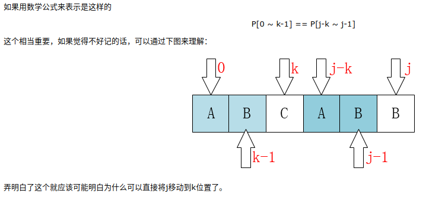
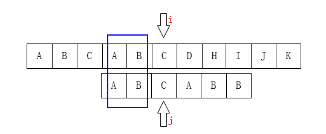
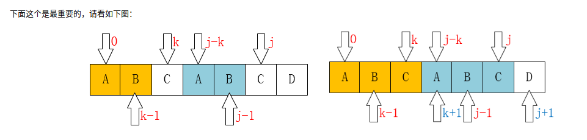
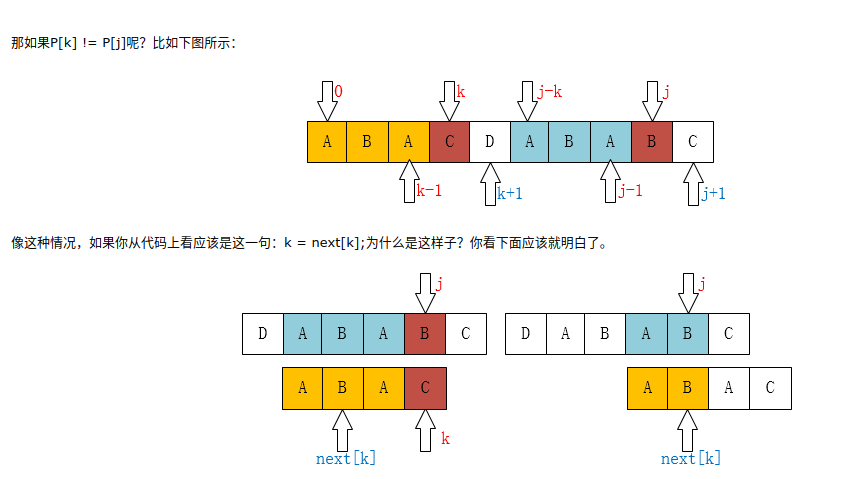

**最前面的k个字符和j之前的最后k个字符是一样的。**





## 前/后缀集
这里面的前缀集表示除去最后一个字符后的前面的所有子串集合，同理后缀集指的的是除去第一个字符后的后面的子串组成的集合。举例说明如下：

在“aba”中，前缀集就是除掉最后一个字符'a'后的子串集合{a,ab}，同理后缀集为除掉最前一个字符a后的子串集合{a,ba}，那么两者最长的重复子串就是a，k=1；

在“ababa”中，前缀集是{a,ab,aba,abab}，后缀集是{a,ba,aba,baba}，二者最长重复子串是aba，k=3；



在j位的时候，j前面的子串是**ABCAB**，前缀集是{A,AB,ABC,ABCA}，后缀集是{B,AB,CAB,BCAB}，最大重复子串是AB，个数是2个字符，因此j移到k即第2位。

next数组： 因为在P的每一个位置都可能发生不匹配，也就是说我们要计算每一个位置j对应的k，所以用一个数组next来保存，next[j] = k，**表示当T[i] != P[j]时，j指针的下一个位置**。另一个非常有用且恒等的定义，因为**下标从0**开始的，**k值实际是j位前的子串的最大重复子串的长度**。

> 要理解next数组的定义。例子ABCABJ, next[5]=2。长度6，第j=5，第6个元素的next含义。第一，其j位前（前5个子串ABCAB）的最大重复字串长度为2（AB）。第二也就是移到第k(2)位，从0开始算，也j可以移到第三个字符C上。


## P[k] == P[j]



> 当匹配串的j和k位置的字符一样的时候，next的j+1位置的值等于第k位置+1

> 例子ABCAB，最后一位是4，我们是要求该位的next位置值，反推法。所以理解为J+1=4，J为3。next[J]参照上面的说明，next[3]为0,K=0,因为前三个字串的没有最大重复字串。然后因为J位置上的字符等于K元素上的字符, 也就是匹配字符数组上3位置的字符A等于0位置上的字符A。所以得到next[J+1] = next[J] + 1 = k + 1

## P[k] != P[j]

例子： [A，B，A，C, D, A, B, A, B, C]


像上边的例子，我们已经不可能找到[ A，B，A，B ]这个最长的后缀串了，但我们还是可能找到[ A，B ]、[ B ]这样的前缀串的。所以这个过程像不像在定位[ A，B，A，C ]这个串，当C和主串不一样了（也就是k位置不一样了），那当然是把指针移动到next[k]啦。

> 等其不一样的时候，k可以继续往next[k]定义.要理解next[k]也就是等下标为k的时候，k-1的字串的最大重复子串长度。若匹配串上next[k]位置 == j位置上的值，也就是符合上面相等的情况了。

> 当k跌到-1的时候，也就是找不到匹配一样的情况了，只能让j+1的值为移到第一个元素，也即是下标0了。

```bash
public static int[] getNext(String ps) {
    char[] p = ps.toCharArray();
    # 置空都为0的数组
    int[] next = new int[p.length];
    next[0] = -1;
    int j = 0;
    int k = -1;
    while (j < p.length - 1) {
       # 设想第二个字符的场景，k为0， j为1
       # 若不等，k等于next[k]也就是-1，while
       # 会因为k==-1，所以设成0，也就是第三个(J+1=2)next的值，
       if (k == -1 || p[j] == p[k]) {
           # 匹配串上的J位置上的字符等于k位置上的字符时
           # 其next的J+1为k+1
           next[++j] = ++k;
#           if (p[++j] == p[++k]) { // 当两个字符相等时要跳过
#              next[j] = next[k];
#           } else {
#              next[j] = k;
#           }
       } else {
           # 要理解：这里的k=next[k]是为了循环定义了k
           # next[1]肯定为0,
           # 可以理解为一开始p[j]不等于p[k](第一个元素)，k一直0
           # 而k = next[0]，也就是当k = -1。也是相当于
           k = next[k];
       }
    }
    return next;
}
```
