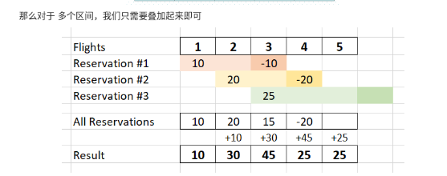

```python
"""这里有n个航班，它们分别从 1 到 n 进行编号。

有一份航班预订表bookings ，表中第i条预订记录bookings[i] = [firsti, lasti, seatsi]意味着在从 firsti到 lasti （包含 firsti 和 lasti ）的 每个航班 上预订了 seatsi个座位。

请你返回一个长度为 n 的数组answer，其中 answer[i] 是航班 i 上预订的座位总数。


示例 1：

输入：bookings = [[1,2,10],[2,3,20],[2,5,25]], n = 5
输出：[10,55,45,25,25]
解释：
航班编号        1   2   3   4   5
预订记录 1 ：   10  10
预订记录 2 ：       20  20
预订记录 3 ：       25  25  25  25
总座位数：      10  55  45  25  25
因此，answer = [10,55,45,25,25]
示例 2：

输入：bookings = [[1,2,10],[2,2,15]], n = 2
输出：[10,25]
解释：
航班编号        1   2
预订记录 1 ：   10  10
预订记录 2 ：       15
总座位数：      10  25
因此，answer = [10,25]

来源：力扣（LeetCode）
链接：https://leetcode-cn.com/problems/corporate-flight-bookings
著作权归领扣网络所有。商业转载请联系官方授权，非商业转载请注明出处。
"""
from collections import defaultdict
from typing import List


class Solution:
    def corpFlightBookings(self, bookings: List[List[int]], n: int) -> List[int]:
        """错误题解： 超出时间范围！"""
        result = defaultdict(int)
        for row in bookings:
            for i in range(row[0], row[1] + 1):
                result[i] += row[2]
        res = []
        for i in range(1, n + 1):
            res.append(result[i])
        return res


bookings = [[1, 2, 10], [2, 3, 20], [2, 5, 25]]
n = 5
exp = [10, 55, 45, 25, 25]
result = Solution().corpFlightBookings(bookings, n)
assert exp == result, result
```

```python

"""

作者：LeetCode-Solution
链接：https://leetcode-cn.com/problems/corporate-flight-bookings/solution/hang-ban-yu-ding-tong-ji-by-leetcode-sol-5pv8/
来源：力扣（LeetCode）
著作权归作者所有。商业转载请联系作者获得授权，非商业转载请注明出处。

"""

from typing import List

class Solution:
    def corpFlightBookings(self, bookings: List[List[int]], n: int) -> List[int]:
        nums = [0] * n
        for left, right, inc in bookings:
            nums[left - 1] += inc
            if right < n:
                nums[right] -= inc

        for i in range(1, n):
            nums[i] += nums[i - 1]

        return nums
```





