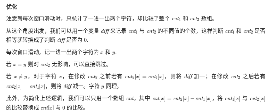

```python

"""
给你两个字符串s1和s2 ，写一个函数来判断 s2 是否包含 s1的排列。

换句话说，s1 的排列之一是 s2 的 子串 。


示例 1：

输入：s1 = "ab" s2 = "eidbaooo"
输出：true
解释：s2 包含 s1 的排列之一 ("ba").
示例 2：

输入：s1= "ab" s2 = "eidboaoo"
输出：false

来源：力扣（LeetCode）
链接：https://leetcode-cn.com/problems/permutation-in-string
著作权归领扣网络所有。商业转载请联系官方授权，非商业转载请注明出处。
"""
from collections import Counter


class Solution(object):
    def checkInclusion(self, s1, s2):
        """
        要保持窗口的长度，进行滑动
        """
        s1_c = Counter(s1)
        left = 0
        right = len(s1)
        while right <= len(s2):
            windows = s2[left:right]
            s2_c = Counter(windows)
            if all(map(lambda x: s1_c[x] <= s2_c[x], s1_c.keys())):
                return True
            left += 1
            right += 1
        return False


class Solution2(object):
    """
    维持一个跟匹配字符长度的窗口
    匹配字符的计数器应该是小于等于窗口内的计数器，

    """
    def checkInclusion(self, s1, s2):
        s1_c = Counter(s1)
        left = 0
        right = len(s1) - 1
        lookup = Counter(s2[left:right])
        while right < len(s2):
            lookup[s2[right]] += 1
            # if all(map(lambda x: s1_c[x] <= lookup[x], s1_c.keys())):
            # == ?
            if all(map(lambda x: s1_c[x] == lookup[x], s1_c.keys())):
                return True
            lookup[s2[left]] -= 1
            left += 1
            right += 1
        return False


class Solution3(object):
    def checkInclusion(self, s1, s2):
        """
        要保持窗口的长度，进行滑动
        """
        s1_c = Counter(s1)
        left = 0
        right = 0
        lookup = Counter()
        s2_l = len(s2)
        s1_l = len(s1)
        while right < s2_l:
            lookup[s2[right]] += 1
            if right - left < s1_l - 1:
                right += 1
                continue
            if all(map(lambda x: s1_c[x] <= lookup[x], s1_c.keys())):
                return True
            lookup[s2[left]] -= 1
            left += 1
            right += 1
        return False


print(Solution3().checkInclusion('ab', 'eidboaoo'))
# print(Solution().checkInclusion('ab', 'eidbaooo'))
# print(Solution().checkInclusion("adc", "dcda"))
print(Solution3().checkInclusion("adc", "dcda"))

```




```
func checkInclusion(s1, s2 string) bool {
    n, m := len(s1), len(s2)
    if n > m {
        return false
    }
    cnt := [26]int{}
    for i, ch := range s1 {
        cnt[ch-'a']--
        cnt[s2[i]-'a']++
    }
    diff := 0
    for _, c := range cnt[:] {
        if c != 0 {
            diff++
        }
    }
    if diff == 0 {
        return true
    }
    for i := n; i < m; i++ {
        x, y := s2[i]-'a', s2[i-n]-'a'
        if x == y {
            continue
        }
        // 修改之前相同，需要加上
        if cnt[x] == 0 {
            diff++
        }
        // 修改之后相同，需要减去。其实就是要区分-1和0的时候，diff的变更情况
        cnt[x]++
        if cnt[x] == 0 {
            diff--
        }
        if cnt[y] == 0 {
            diff++
        }
        cnt[y]--
        if cnt[y] == 0 {
            diff--
        }
        if diff == 0 {
            return true
        }
    }
    return false
}

作者：LeetCode-Solution
链接：https://leetcode-cn.com/problems/permutation-in-string/solution/zi-fu-chuan-de-pai-lie-by-leetcode-solut-7k7u/
来源：力扣（LeetCode）
著作权归作者所有。商业转载请联系作者获得授权，非商业转载请注明出处。
```
