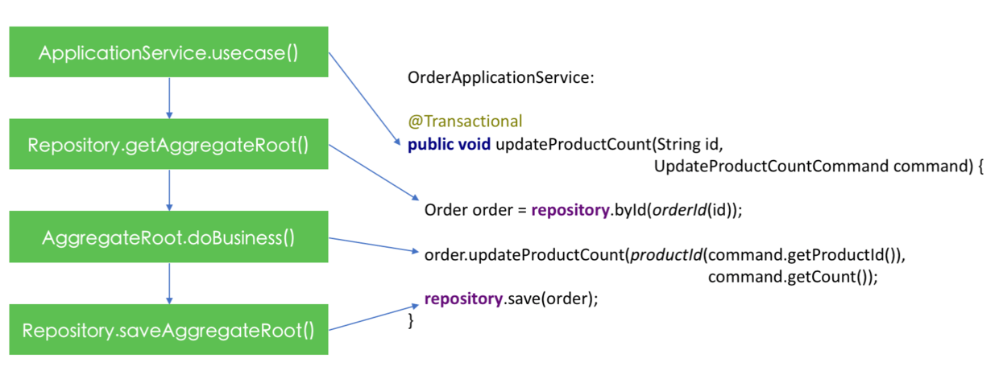

# 领域驱动设计(DDD)编码实践
> - [后端开发实践系列——领域驱动设计(DDD)编码实践 - Thoughtworks洞见](https://insights.thoughtworks.cn/backend-development-ddd/)

ApplicationService需要遵循以下原则：

* 业务方法与业务用例一一对应：前面已经讲到，不再赘述。
* 业务方法与事务一一对应：也即每一个业务方法均构成了独立的事务边界，在本例中，`OrderApplicationService.changeProductCount()`方法标记有Spring的`@Transactional`注解，表示整个方法被封装到了一个事务中。
* 本身不应该包含业务逻辑：业务逻辑应该放在领域模型中实现，更准确的说是放在聚合根中实现，在本例中，`order.changeProductCount()`方法才是真正实现业务逻辑的地方，而ApplicationService只是作为代理调用`order.changeProductCount()`方法，因此，ApplicationService应该是很薄的一层。
* 与UI或通信协议无关：ApplicationService的定位并不是整个软件系统的门面，而是领域模型的门面，这意味着ApplicationService不应该处理诸如UI交互或者通信协议之类的技术细节。在本例中，Controller作为ApplicationService的调用者负责处理通信协议(HTTP)以及与客户端的直接交互。这种处理方式使得ApplicationService具有普适性，也即无论最终的调用方是HTTP的客户端，还是RPC的客户端，甚至一个Main函数，最终都统一通过ApplicationService才能访问到领域模型。
* 接受原始数据类型：ApplicationService作为领域模型的调用方，领域模型的实现细节对其来说应该是个黑盒子，因此ApplicationService不应该引用领域模型中的对象。此外，ApplicationService接受的请求对象中的数据仅仅用于描述本次业务请求本身，在能够满足业务需求的条件下应该尽量的简单。因此，ApplicationService通常处理一些比较原始的数据类型。在本例中，`OrderApplicationService`所接受的Order ID是Java原始的String类型，在调用领域模型中的Repository时，才被封装为`OrderId`对象。


## 聚合根的家——资源库

通俗点讲，资源库(Repository)就是用来持久化聚合根的。从技术上讲，Repository和DAO所扮演的角色相似，不过DAO的设计初衷只是对数据库的一层很薄的封装，而Repository是更偏向于领域模型。另外，在所有的领域对象中，只有聚合根才“配得上”拥有Repository，而DAO没有这种约束。

在OrderRepository中，我们只定义了save()和byId()方法，分别用于保存 / 更新聚合根和通过 ID 获取聚合根。这两个方法是 Repository 中最常见的方法，有的 DDD 实践者甚至认为一个纯粹的 Repository 只应该包含这两个方法。读到这里，你可能会有些疑问：为什么 OrderRepository中没有更新和查询等方法？

事实上，Repository 所扮演的角色只是向领域模型提供聚合根而已，就像一个聚合根的 “容器” 一样，这个 “容器” 本身并不关心客户端对聚合根的操作到底是新增还是更新，你给一个聚合根对象，Repository 只是负责将其状态从计算机的内存同步到持久化机制中，从这个角度讲，Repository 只需要一个类似save()的方法便可完成同步操作。

当然，这个是从概念的出发点得出的设计结果，在技术层面，新增和更新还是需要区别对待，比如 SQL 语句有insert和update之分，只是我们将这样的技术细节隐藏在了save()方法中，客户方并无需知道这些细节。

应用服务作为总体协调者，先通过资源库获取到聚合根，然后调用聚合根中的业务方法，最后再次调用资源库保存聚合根。




# DDD在Golang中的落地

- 摘抄自《DDD在Golang中的落地》

1、用户接口层​

这一层主要负责直接面向外部用户或者系统，接收外部输入，并返回结果。​

用户接口层是比较轻的一层，不含业务逻辑。可以做一些简单的入参校验，也可以记录一下访问日志，对异常进行统一的处理。同时，对返回值的封装也应当在这层完成。​

2、应用层​

应用层通常是用户接口层的直接使用者。​

但是在应用层中并不实现真正的业务规则，而是根据实际的 use case 来协调调用领域层提供的能力。也即，应用层主要做的是编排工作。​

另外，应用层还负责了事务这个比较重要的功能。​

3、领域层​

领域层是整个业务的核心层。​

我们一般会使用充血模型来建模实际的对象。​

同时，由于业务的核心价值在于其运作模式，而不是具体的技术手段或实现方式。因此，领域层的编码是不允许依赖其他外部对象的。​

4、基础设施层​

基础设施层是在技术上具体的实现细节，它为上面各层提供通用的技术能力。​

比如我们使用了哪种数据库，数据是怎么存储的，有没有用到缓存、消息队列等，都是在这一层要实现的。​


```bash
.
├── app # 应用层
│   ├── assembler # 服务领域服务与 presentation DTO 的转化
│   ├── cqe       # 定义应用服务的 Command、Query、Event DTO
│   └── order_app_service.go
├── domain # 领域层
│   ├── service     # 放置领域服务
│   ├── factory     # 放置领域工厂
│   ├── repo        # 放置仓储
│   └── entity      # 放置聚合根、实体、值对象，枚举、事件的定义放在idl里
├── infra # 基础设施层层
│   ├── cache          # 本地缓存、redis等
│   ├── mq             # 主要是处理消息的发送
│   ├── persistence    # 数据库相关
│   │   ├── convertor # 领域对象与 PO 之间的转化
│   │   ├── dal       # 对 PO 的定义和 db 的 crud 操作
│   │   └── order_repo.go
│   └── sal            # 对rpc、http服务的访问，通常是对领域服务接口的实现
│       └── ...        # 一个文件对应领域服务里一个接口的实现
├── conf # kitex生成的配置dir
│   └── kitex.yml
├── idl  # 当前服务的idl，放在其他地方也行
│   ├── base.thrift
│   └── exam.thrift
├── script  # kitex生成
│   ├── bootstrap.sh
│   └── settings.py
├── README.md
├── handler.go
├── main.go
├── build.sh
└── wire.go # 解决应用的依赖注入问题
```

## 2.2.5 聚合根

聚合是 DDD 中较为难以理解的一个概念。

很多刚刚接触 DDD 的同学，常犯的错误是设计出一个囊括天地万物的大聚合。这在战略设计阶段往往看不出什么问题，但是一旦要落实到代码层面，就会发现根本行不通。

当我们回归到小聚合的设计后，就会发现，聚合根的实现方式跟实体是非常类似的。这也是为什么将聚合根和实体放在一起说的原因。


但是，我们至少要知道，设计小聚合是很重要的一条原则。​

小聚合的前提是要保证聚合内的一致性条件不被破坏。[这里有篇文章可以帮助大家更好的理解>>](http://noddd.cn/posts/10b4b980-d4e9-11eb-8739-c101f88c7d5c/)​

更多的原则[参考这里>>](https://weread.qq.com/web/reader/f5032ce071fd5a64f50b0f6kad63251024aad61ab143c7e)​

​
上面这个写法显然是多余的，Product 是实体，但是在聚合根里不包含其他属性时，Product 本身也可以当做聚合根来用。

同理，可以推广到稍复杂的情况。 比如在一个订单中，通常会包含总价、支付方式、订单项、地址等内容，如果我们强制区分实体和聚合根的话。但在实际开发中，可以在 Order 中直接引用 OrderItem，这样就省去了对 OrderAggregate 的维护，Order 也变成了实体加聚合根的双重身份

使用聚合根时，还有一个经常容易犯的错误，就是在一个聚合根中引用了另外一个聚合根。​

正确的做法是**通过全局唯一标识来引用外部的聚合**。​

原因就在于，一个事务中原则上只能修改一个聚合，在不持有对象引用的情况下，就避免了对其他聚合的修改。​

如果在你的代码里，**一个事务必须要修改多个聚合**，这个时候就要考虑聚合设计的是否合理，这种情况通常意味着聚合的一致性边界是错误的。


## 2.3 领域服务​

领域服务最主要的功能是对多个领域对象的逻辑进行封装。​

有的时候，我们会面临这样的窘境，一段逻辑无论放到单独的一个实体中，还是值对象中，都有些不太合适。​

比如给某篇文章添加评论。​

我们需要判断文章是否开启了评论功能，评论的用户是否被禁言，评论的内容需要进行内容审查。这个时候就需要在实体、值对象的基础之上引入领域服务。​

2.3.1 什么时候需要一个领域服务​

首要的一个原则是，如非必要，不要使用领域服务！！！​

因为创建领域服务的成本并不高，所以很容易不管三七二十一就把业务逻辑都写到服务里面了。​

这会造成实体、值对象的贫血。​

要判断到底需不需要创建一个领域服务，其实就是确定哪些逻辑是不适合放到实体和值对象里的。​

1、实体里需要用到资源库​

定义在实体里的某个方法需要调用资源库的某个方法，那么推荐将这个逻辑提到领域服务里面。

这里的资源库只是一种具体的表现，我们其实可以进而推广到更一般的情况，即当需要与外部资源进行交互时，都可以用领域服务来实现，比如某个逻辑里需要调用 RPC。

2、多个实体之间有交互

3、无法放到某个实体上的逻辑

## 2.3.2 实现领域服务
1、 领域服务代码应该放在单独一个包中​

有的同学在组织代码结构的时候喜欢按照业务分包，比如在一个博客系统中，会涉及文章、评论等，如果按照业务分包就会有如下的结构：​

```
├── domain​
│ ├── comment​
│ └── post​
```
​

与文章相关的 Entity、ValueObject 等都放到 domain.post 这个包下，与评论相关的 Entity、ValueObject 等都放到 domain.comment 这个包下。​

同理，文章和评论相关的领域服务也应该分别放到 domain.post 、domain.comment 包下。​

这种方式看上去比较美好，但实际上是有很严重问题的。​

在领域服务中可能会用到多个实体，这种情况下很难保证彼此之间的引用是单向的。而且，不仅仅是领域服务存在这个问题，实体之间如果有一些通用的结构也是会导致循环依赖的。​

那么，一种解决方案，是将彼此依赖的内容下沉到一个独立的包中，但是需要注意的是，这种下沉可能会让你的代码看上去特别混乱。​

推荐的做法是不要按业务分包，而是按照功能分包，将业务上不同功能的代码放到对应的包里，比如这样：​

```
├── domain​
│ ├── entity \# 业务所有的实体，不同的业务实体可以放到不同的go文件里​
│ ├── vo \# 值对象​
│ ├── repository \# 仓储​
│ └── service \# 领域服务​
```
​

因为我们现在很少会开发大的单体应用，在一个服务里基本上都是单一的业务或者相关性比较强几个功能，因此，**将所有的业务实体放到一个包下是可行的**。​

不同的实体可以再按照划分放到不同的 go 文件中。领域服务类似，所有的领域服务代码在开始的时候可以统一放到 domain.service 下面。​

有的同学可能会担心随着业务变得复杂，service 包下的 go 文件会越来越多，从而变得难以管理。​

其实这个问题基本上不会发生，在本文的后面会讲到 CQRS，而领域服务的代码基本上对应的都是 Command ，所以是不会变得特别多的。

2、保持领域服务的无状态性

确定了领域服务代码放在什么地方，接下来就是如何实现的问题了。

一个很重要的原则是：要保持领域服务的无状态性


3、通过依赖反转解耦对具体技术的直接引用

在领域服务中毕竟需要用到一些技术层面的能力，比如数据库访问，rpc调用等，这些具体的技术实现是不能放在领域层的。

这个时候，我们可以采用独立接口的形式来达到依赖反转的目的。

## 3. 应用层实现

## 3.1 定位与实现原则​

应用服务是领域模型的直接客户！！！​

通常我们会遵循下面的几个原则来构建应用服务：​

1. 应用服务上的一个业务方法对应了一个业务用例，它们彼此是一一对应的关系；​

2. 每个业务方法都应当被封装到一个事务中，其与事务也是一一对应的；​

3. 在应用服务中不处理具体的业务逻辑，也不需要对参数进行业务校验，外部需要保证参数的基本合法性；​

4. 应用服务的定位是领域模型的门面，不应该处理一些具体的技术细节，也即不能跟具体的框架绑定在一起；​

5. 可以处理跟安全相关的一些操作，比如权限控制，但是更推荐将这种功能放到切面中；​

总的来说，领域模型和领域服务中承载了所有的业务逻辑，而**应用服务在复杂模型的基础上提供了一个统一的出口，这个出口通过协调对模型的一些操作，来实现外部的用例要求**。​

因此，**应用层在实现上通常是很薄的一层，因为这里不涉及具体的业务逻辑和技术细节**。


> 应用层通过统一的出口、依赖注入等，进行外部用例的mock？

## 3.2 应用服务的实现

### 3.2.1 代码应该放于何处

从分层架构上来看，应用服务和领域模型是处于两个不同的层级的，因此，在落实到代码上时，应用服务和领域模型也应该处于不同的包下。

可以**在跟 domain 包平级的地方创建一个 application 包，包中依据不同的领域，可以创建不同的 service 文件，每个 service 文件作为具体某个应用服务的载体**。

这里采用 application 包名的话，虽然很直观，但是 application 这个单词有点长，在不影响对代码理解的前提下，可以使用 app 作为 application 的缩写，这样在使用时稍微简单点，直接 app.xxx 就可以了。
```
├── app  # application
│   ├── ...  # 其他包，如果有的话
│   ├── order_service.go
│   ├── product_service.go
│   └── inventory_service.go
├── domain
│   ├── entity
│   ├── event
│   ├── repository
│   ├── service
│   └── vo
```
3.2.2 服务的定义

通常的做法是直接定义一个结构体，而非使用独立接口模式。

在应用服务层，原则上是可以访问领域层和基础设施层的，因此这里不存在需要分离接口和实现的必要。

但是，**也不推荐直接定义 func 来实现某个应用服务功能，因为在应用服务中通常需要引用 Repository 或者领域服务**。

如下定义了一个 OrderApplicationService，代码放在 app.order_service.go 文件内。

其内部属性一般是对 Repository 或领域服务的引用，它们大部分（部分领域服务并不是采用的独立接口模式）是以接口的形式存在的：
```
package app

type OrderApplicationService struct {
    orderRepo repository.OrderRepository
    ... // 对其他服务的引用等
}
```
为了能够对 OrderApplicationService 进行实例化以及属性的依赖注入，我们同时还要提供一个构造方法：
```
func NewOrderApplicationService(orderRepo repository.OrderRepository, ...) *OrderApplicationService {
    return &OrderApplicationServce{
    orderRepo: orderRepo,
    ...
    }
}
```
这里仅以 repository.OrderRepository 为例来说明构造方法的参数类型。

也即，构造方法的参数类型跟结构体中的属性类型是一致的，比如属性中是一个接口，那么这里的参数类型也必须是一个接口。

**严禁参数是接口的具体某个实现，使用接口形式的参数，方便我们充分利用多态的能力。**

## 4. 基础设施层实现​

## 4.1 仓储​

### 4.1.1 接口定义

**仓储接口的定义是跟领域对象放在一起**的，如下面的目录结构所示：

简单来说，仓储就是用来持久化聚合根的，但其跟我们平时使用的dal又有所不同。​

dal 是对具体数据库的直接操作，是跟数据库类型强相关的，而仓储只服务于聚合根，而且其也只是在概念上规定了对聚合根的持久化，不关心具体存到哪里以及如何存的问题。

因为 domain 层原则上不能依赖任何其他层，因此，**domain 下所有文件里都不应该 import 任何其他层的代码**。​

> 那domain_service的作用之一，不是为了调用仓库么？那为什么domain_service放在domain层呢？

这也就意味着，我们在 repo.go 文件中定义的 Repository 接口的入参、出参都应当是领域层的结构体或者go里的简单类型。​

其次，因为 Repo 不关心底层具体的存储到底是什么，所以我们在命名方法时，应当避免使用带有明显技术色彩的词语，比如inser、update、select、delete这种。通常建议使用save、find、remove这类更加笼统的词汇。​

前面在介绍工厂方法时，提到了如果使用公司的 IdGenerator 来生成唯一 id 的话，可以通过在仓储中定义一个 NextIdentity 方法来实现。

### 4.1.2 实现仓储接口​

**仓储接口定义在domain层，而具体实现是定义在基础设施层的。​**

```
├── domain
│   └── repo
│       └── order_repo.go
├── infra
│   ├── persistence
│   │   ├── converter  # 可能存在这样一个层，用来做领域模型与数据模型之间的转化
│   │   ├── dal
│   │   └── order_repo_impl.go
```
在上面的代码结构中，repo.OrderRepo 接口对应的实现 OrderRepository 放在 order\_repo\_impl.go 文件中。​

dal 中放置的是具体的对数据库表的访问。​

converter 这个包可能存在也可能不存在，其主要作用是对领域模型和数据模型进行互转。

为了区分基础设施层不同的功能模块，可以对基础设施层进一步划分，而仓储相关的代码可以统一放到 infra.persistence 包下。

在上面代码中，converter 的作用是负责领域模型与数据模型之间的转化，数据模型我们一般用 PO （Persistant Object）表示。​

converter 存在的价值在于，数据模型与领域模型并非是完全一致的，converter 负责管理了彼此之间的映射关系。​

对于聚合根不是特别复杂的情况，上面的实现方式虽然存在无用 DB 操作，但也还能接受。​

在对聚合的设计中有一条规则是要设计小聚合，其原因也在于此。​

那如果很不幸我们有一个很大的聚合，无法接受全量更新，要怎么办呢？​

通常有两种方法：​

一种是基于 Snapshot 的，当聚合根取出后，在内存中先保存一份snapshot，在聚合根写入时，将其跟snapshot做一下diff。​

另一种是将聚合根上可以修改的属性设置成私有的，然后通过类似Setter的方法来进行赋值，这样，在setter被调用时我们就知道哪里被修改了。​

业界使用较多的，包括在其他语言中，都是采用第一种 Snapshot 的形式，其实现起来相对简单，副作用较少


# 总结

1. domain分层不是按业务进行划分包
2. 聚合根和实体的区别可以混合，实体，但是在聚合根里不包含其他属性时可以使用实体作为聚合根。通过全局唯一标识来引用外部的聚合
3. repo是domain的聚合根的持久化的具体实现。仓储接口定义在domain层，而具体实现是定义在基础设施层的。​
4. 领域服务最主要的功能是对多个领域对象的逻辑进行封装。​无法放到某个实体上的逻辑、多个实体之间有交互、实体里需要用到资源库。
5. 应用服务和领域模型也应该处于不同的包下，应用层在实现上通常是很薄的一层，因为这里不涉及具体的业务逻辑和技术细节。


代码逻辑:
- repo可以放在domain里，但会引用了基础设施层的存储。
- domain里面也有repository，也就是use case层?

Q: domain层需要依赖db吗？持久化放在哪里？

A: 我觉得是不应该的，应该放在调用domain的service层？

A: 一些查询应该是依赖domain的函数。

Q: 领域服务究竟能不能用到资源库？

A: 能用非领域实现的资源库，能用其他基础设施的库？因为领域实现的资源库，都有在domain上直接定义接口了，直接使用接口的形式进行使用。

# DDD领域驱动设计架构思考

> 摘抄自《DDD领域驱动设计架构思考》

## 5 领域模型​

领域模型：失血模型，贫血模型，充血模型，胀血模型​

​

大多数的代码中，我们在 service 层通过的 manager 去 manage 大部分的逻辑，POJO（Plain Ordinary Java Object）作为数据在 manager 手（上帝之手）里不停地变换和组合，service 层在这里是一个巨大的加工工厂（很重的一层），围绕着数据库这份 DNA，完成业务逻辑。这就是一个典型的失血模型​

​

| 概述​ | service​ | model​ | 优点​ | 缺点​ |
| --- | --- | --- | ---| --- |
| 失血模型​ | Object只有属性的Get Set方法。所有业务逻辑都由service层来完成。Service直接操作数据库。​ | 所有的服务逻辑​ | 只包含数据对象和get set方法​ | 写代码方便，所有业务都在service层串联​ | service过重，业务中出现大量重复调用的问题，代码膨胀​ |
| 贫血模型​ | Object包含了不依赖持久化的原子领域逻辑，而组合逻辑在service层​ | 组合领域Object逻辑和Dao的持久化​ | get set方法，原子服务，不包含依赖持久层的业务逻辑​ | 各层级机构清楚，容易编写和维护。​ | Object持久化部分在service中，过于厚重​ |
| 充血模型​ | 绝大多数业务逻辑都放在Object里，包括持久化。service很薄，甚至不和DAO层打交道​ | 调用领域服务层​ | get set方法，原子服务和持久化服务​ | 对象的自我表达能力很强，适合复杂的企业业务逻辑。​ | DAO和domain object形成双向依赖​ |
| 胀血模型​ | 取消了service层，迁移到object层​ | 无·​ | 所有逻辑​ | 简单​ | 不稳定，其实和失血模型一样​ |

​

领域模型的演进就是service层和model层职责的划分演进。从上到下，model层（领域层）逐渐提供更多的能力，血液越来越丰富。​

四种模型中，失血和胀血模型，不应该被提倡，因为弊大于利。而贫血，充血这两种在技术上已经很成熟了。但是推荐使用贫血模型，模型层会更加清晰和易于维护。​


