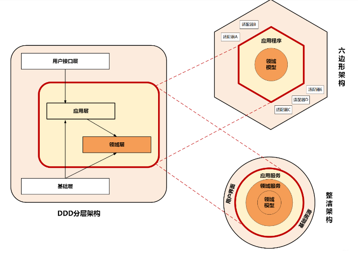

# 简洁架构

标签（空格分隔）： 未分类

---
> - [【译】The Clean Architecture](https://zhuanlan.zhihu.com/p/64343082)

尽管这些架构在一些细节上都有不同，它们仍是相似的。他们都有同样的目标，隔离关注点。他们都通过将软件分层来达到隔离。每个都至少有一层业务规则，另一层作为接口。

每个这些架构产出的系统都是：

1. 独立的框架。架构不依赖一些存在类库的特性。这样你可以像工具一样使用这种框架，而不需要让你的系统受到它的约束条件。
2. 可测试。业务规则可以脱离UI，数据库，web服务器或其他外部元素进行测试。
3. 独立的UI。UI可以很容易的更换，系统的其他部分不需要变更。例如，Web UI可以被换成控制台UI，不需要变更业务规则。
4. 独立的数据库。你可以交换Oracle或SQL Server，用于Mongo，BigTable，CouchDB或其他的东西。你的业务规则不与数据库绑定。
5. 独立的外部代理。实际你的业务规则并不知道关于外部世界的任何事情。

这篇文章上面的图试着将以上所有架构整合成一个可执行的想法。

## 依赖规则

同心圆表示软件的不同部分。大体上，你走的越远，软件的级别更高。外部的圆是机制，内部的圆是策略。

让这个架构工作的覆盖规则是依赖规则。这个规则说明了源代码依赖只能向内。**内部圆不能知道任何外部圆的事**。实践中，**外部圆里一些声明的名字不能被内部圆里的代码提到**。这包括，函数，类，变量或其他任何软件实体。

同样的，**外部圆使用的数据格式不应该被内部圆使用**，尤其是当这些格式是被外部圆使用的**框架生成的时候**。我们不想让外部圆的东西影响到内部圆。

> 尽量减少内外部的耦合

## 实体(Entitles)

实体封装企业域范围的业务规则。实体可以是一个有方法的对象，也可以是**一组数据结构和函数**。只要企业里不同的应用可以使用这些实体就可以。

如果你不是企业级，而只是写一个单体应用，那么这些实体就是应用的业务对象。它们封装了最通用和高层的规则。当外部变化时**它们基本不太会变化**。例如，你不会认为这些对象会因为页面导航或安全方面的变化而改变。任何特定应用的操作都不应该影响实体层。

> 基本数据结构，变化较少。对比模型层， Models。

## 用例(Use cases)

这层的软件包含特定应用的业务规则。它封装并实现了系统的所有用例。这些用例**组织了实体中的数据流向**，并指挥这些实体使用他们的企业域业务规则来完成用例的目标。

我们**不期望这层影响实体**。我们也不希望这层会在如数据库，UI，或其他常用框架这样的**外部变化时被影响**。这层隔离了以上关注点。

当然我们期望对于**应用操作的变化会影响用例而进一步影响到这层的软件**。 如果一个用例的细节变化了，那么这层的代码肯定也会被影响。

> 用户业务逻辑代码。不要给实体、外部服务影响。Domain，可以说是领域层。对比用例层Usecase

## 接口适配器

这层的软件是一组适配器，**其将数据从用例和实体最合适的格式，转换成对于一些类似数据库或网站这种外部设施最合适的格式**。在这一层，举个例子，会包含GUI的MVC架构。Presenters, Views,与Controllers都属于这里。模型基本就是从controllers传递到用例的数据结构，并从用例返回到presenters和views。

类似的，数据被转换了，在这层，从对于实体和用例合适的结构，变成**对于持久层框架使用的结构**。这圈内的代码不应该知道数据库。如果数据库是一个SQL数据库，那么所有SQL都应该在这层内，特别是此层与数据库有关的部分。

这层其他适配器也需要将数据从类似外部服务的外部的结构，转换成用例和实体使用的内部结构。

> 主要是说业务调用外部服务，数据结构转换成外部服务相关结构。对比仓库层，Repository。

## 框架与驱动

最外层主要**组合**了数据库，网络框架这样的**框架和工具**。在这层你除了写一些与内层环通信的胶水代码，基本不会有其他代码。

这层是所有细节存在的地方。网络是细节。数据库是细节。 我们将这些东西放在外部保证它们不会影响其他部分。

## 只有四个圈？

不是的，圆圈是个示意。你可能发现你需要不止4个。没有规则说你一定要有四个。 实际上，依赖规则一直存在。源代码依赖一直指向内部。当你向内部移动时抽象的层次在增加。最外部的圆是很低层的具体细节。当你**内移时软件变得更抽象，并封装了高一级的策略规则**。**最内部的圆是最普遍的抽象层级**。

## 跨越边界

在图的右下方是我们穿越圆圈边界的示例。它展示了Controller和Presenter与下一层的用例进行通信。**注意控制流**。它从controller出发，穿过用例，然后在presenter里执行。也注意下源码依赖。它们每个都指向内部的用例。

我们通常使用**依赖反转原则解决这个明显的问题**。在java这样的语言中，我们会整理源码依赖与控制流相反的接口和继承关系，让它们从边界正确的穿过。

例如，用例需要调用presenter。但是，**这个调用不能直接进行因为会违反依赖规则**。**外圈的名字不能被内圈提到**。所以我们的用例**调用内圈的一个接口**（在这个例子里是Use Case Output Port），并让外圈的presenter实现它。

架构里所有的边界穿越都用这个技巧。我们使用动态多态来创建与控制流相反的源码依赖，以便于无论在控制流的任何方向都不会违反依赖规则。

> 内圈不能直接调用外圈的接口，而是通过依赖反转的方式，通过内圈的接口，并让外圈实现它。

> 也可以理解为要通过依赖注入的方式来进行

## 什么样的数据会穿越边界

正常来说穿过边界的数据是**简单数据结构**。你可以使用基本结构或简单的Data Transfer 对象。或者可以方便的进行函数赋值的数据。或者你可以打包进一个hashmap，或者将它组装成一个对象。重要的是穿过边界的是隔离，简单的数据结构。我们不想搞变通传递实体或数据库行数据。我们不想数据结构有任何违反依赖规则的依赖。

例如，很多数据库框架在查询后返回一个**方便的数据格式**。我们可以叫它RowStructure(行结构)。我们**不想**将这个行机构通过边界传递给内部的圈。这会**导致内部圈需要知道外部圈的内容进而违反依赖规则**。

所以当我们在边界传递数据是，要注意其应该是**内部圈的格式**。

> 这是一个很重要的原则：例如ORM生成的数据结构，不应该传递给内圈。

## 结论

遵从这些**简单规则并不难**，并且能帮你减少以后的问题。通过将软件隔离分层，并遵从**依赖规则**，你可以建立一个真正可测试的系统，包含了以上所有好处。当任何系统额外部部分过时了，比如数据库或web框架，你可以**容易的替换这些过时的元素**。

---
# 在Golang中尝试简洁架构

> - [go-clean-arch](https://github.com/bxcodec/go-clean-arch)

## 模型层（ Models ）

与实体（ Entities ）一样，模型会在每一层中使用，在这一层中将存储对象的结构和它的方法。例如： Article， Student， Book。

## 仓库层（ Repository ）

仓库将存放所有的数据库处理器，查询，创建或插入数据库的处理器将存放在这一层，该层仅对数据库执行 CRUD 操作。该层**没有业务流程**。只有操作数据库的普通函数。

这层也负责选择应用中将要使用什么样的数据库。 可以是 Mysql， MongoDB， MariaDB，Postgresql，无论使用哪种数据库，都要在这层决定。

如果使用 ORM， 这层将控制输入，并与 ORM 服务对接。

如果调用微服务， 也将在这层进行处理。创建 HTTP 请求去请求其他服务并清理数据，这层必须完全充当仓库。 处理所有的数据输入，输出，并且**没有特定的逻辑交互**。

该仓库层（ Repository ）将依赖于连接数据库 或其他微服务（如果存在的话）

## 用例层（ Usecase ）

这层将会扮演业务流程处理器的角色。**任何流程都将在这里处理**。该层将**决定哪个仓库层被使用**。并且负责提供数据给服务以便交付。处理数据进行计算或者在这里完成任何事。

用例层将**接收来自传递层的所有经过处理的输入**，然后将处理的输入存储到数据库中， 或者从数据库中获取数据等。

用例层将依赖于仓库层。

## 表现层（ Delivery ）

这一层将作为表现者。决定数据如何呈现。任何传递类型都可以作为是 REST API， 或者是 HTML 文件，或者是 gRPC

这一层将**接收**来自用户的输入， 并**清理数据**然后**传递**给用例层。

## 层与层之间的通信

除了模型层， 每一层都需要通过接口进行通信。例如，用例（ Usecase ）层需要仓库（ Repository ）层，那么它们该如何通信呢？仓库（ Repository ）层将提供一个接口作为他们沟通桥梁。

> use case必须要实现相关约定接口吗？个人觉得不是的，组合接口达到相应的业务逻辑

# 小结

通过单一职责的模式进行各个模板与职责的解耦，避免相互依赖与耦合，方便后续更改相应的部分组件。

通过依赖倒转的原则，进行各种模块间的调用。高层模块不直接依赖低层的实现，而是依赖于低层模块的抽象。（依赖注入）

> Q: 对于不同的实体，如果在仓库层已经足够，则没有必要进行用例层的实现？A: 不能？避免仓库层暴露给表现层？

> UseCase、Repo、表现层都是放在同一个包里，也就是一个领域里的。

---
# 参考链接
- [The Clean Code Blog](https://blog.cleancoder.com/uncle-bob/2012/08/13/the-clean-architecture.html): by Robert C. Martin (Uncle Bob)
- [Clean架构探讨](https://www.jianshu.com/p/66e749e19f0d)
- [Applying The Clean Architecture to Go applications](https://manuel.kiessling.net/2012/09/28/applying-the-clean-architecture-to-go-applications/)
- [golang-clean-archithecture](https://medium.com/hackernoon/golang-clean-archithecture-efd6d7c43047), [翻译： 在Golang中尝试简洁架构](https://studygolang.com/articles/12909?fr=sidebar)
- [trying-clean-architecture-on-golang-2](https://medium.com/hackernoon/trying-clean-architecture-on-golang-2-44d615bf8fdf), [翻译： 在 Golang 上使用整洁架构（Clean Architecture）- 2](https://makeoptim.com/golang/clean-architecture-2): void cyclic dependencies

---
# 分层架构

> - [互联网主流微服务架构模型对比分析](https://blog.csdn.net/qq_33589510/article/details/109025639)

> - [DDD及开发模式对比](https://hjwjw.gitee.io/posts/156e5ee9)

## 整洁架构
又名“洋葱架构”（看图就懂），体现了分层思想。

同心圆代表应用软件的不同部分，由内到外依次是

- 领域模型
- 领域服务
- 应用服务
- 容易变化的内容, 比如用户接口和基础设施。

该架构最主要原则：依赖原则，它定义了各层依赖关系，越往内依赖越低，代码级别越高，能力越核心。外圈代码依赖只能指向内圈，内圈无需知道外圈任何情况。

## 六边形架构
又名“端口适配器架构”。

核心理念： 应用通过端口与外部交互

红圈内的核心业务逻辑（应用程序和领域模型）与外部资源（包括APP、Web应用以及数据库资源等）**完全隔离**，仅通过适配器交互。它解决了业务逻辑与用户界面的代码交错问题，很好实现前后端分离。六边形架构各层的依赖关系与整洁架构一样，都是由外向内依赖。

## 架构模型对比分析

**虽然DDD分层架构、整洁架构、六边形架构的架构模型表现形式不同，但设计思想正是微服务架构高内聚低耦合原则的完美体现，而它们身上闪耀的正是以领域模型为中心的设计思想。**

红色实线边框用于将核心业务逻辑与外部应用、基础资源进行隔离。

红框内部主要实现核心业务逻辑，但核心业务逻辑也有差异，有属于领域模型，有属于面向用户的用例和流程编排能力。按这种功能差异，在这三种架构划分了应用层和领域层，承担不同业务逻辑。

- 领域层实现面向领域模型，实现领域模型的核心业务逻辑，属原子模型，需保持领域模型和业务逻辑稳定，对外提供稳定的细粒度领域服务，所以是架构核心。

- 应用层实现面向用户操作相关的用例和流程，对外提供粗粒度API服务。适配前台应用和领域层，接收前台需求，随时做出响应和调整，尽量避免将前台需求传到领域层。应用层作为配速齿轮位于前台应用和领域层间。

**这三种架构都考虑了前端需求的变与领域模型的不变**。需求变幻无穷，但变化总是有矩可循的，用户体验、操作习惯、市场环境以及管理流程的变化，往往会导致界面逻辑和流程的多变。但核心领域逻辑基本不大变，领域模型相对稳定，用例和流程则会随外部需求而随时调整。

架构模型通过分层控制需求变化从外到里对系统影响，从外向里受需求影响逐步减小。面向用户的前端可以快速响应外部需求进行调整和发布，应用层通过服务组合和编排来实现业务流程的快速适配上线，减少传到领域层的需求，使领域层保持长期稳定。

这样设计的好处，可保证领域层核心业务逻辑不会因外部需求和流程的变动而调整。

## 应用和资源的解耦与适配

传统**以数据为中心的设计模式**，应用会对数据库、缓存、文件系统**等基础资源产生严重依赖**。

**一旦更换基础资源就会对应用产生很大的影响，因此需要为应用和资源解耦**。

在微服务架构中，**应用层、领域层和基础层解耦是通过仓储模式，采用依赖倒置的设计方法来实现的**。在应用设计中，我们会同步考虑和基础资源的代码适配，那么一旦基础设施资源出现变更（比如换数据库），就**可以屏蔽资源变更对业务代码的影响，切断业务逻辑对基础资源的依赖，最终降低资源变更对应用的影响**。

## 总结
DDD分层架构、整洁架构、六边形架构都是以领域模型为核心，实行分层架构，内部核心业务逻辑与外部应用、资源隔离并解耦。
