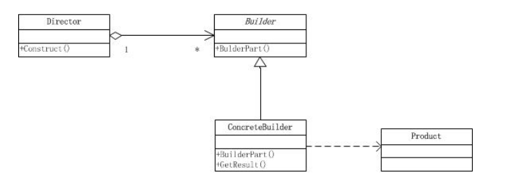
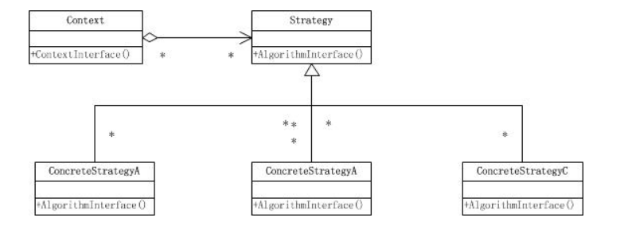

- 某类产品的构建由很多复杂组件组成；
- 这些组件中的某些细节不同，构建出的产品表象会略有不同；
- 通过一个指挥者按照产品的创建步骤来一步步执行产品的创建；
- 当需要创建不同的产品时，只需要派生一个具体的建造者，重写相应的组件构建方法即可。


- 建造者模式：将复杂对象的创建与表示分开，使得相同的创建过程可以有不同的表示。用户只需制定需要建造的类型，不需要知道建造的过程和细节。
- 建造者隐藏了产品的组装细节，若需要改变一个产品的内部表示，可以再定义一个具体的建造者。


```
class PersonDirector():
    pb = None

    def __init__(self, pb):
        self.pb = pb

    def CreatePereson(self):
        self.pb.BuildHead()
        self.pb.BuildBody()
        self.pb.BuildArm()
        self.pb.BuildLeg()
```

> 跟策略者模式好像？




但是从功能上来说两者相差很远：

（1）建造者模式是**创建型的**，也就是说用来**创建对象的**，而策略模式属于**行为型模式**，通过**将行为封装成对象来降低类之间的耦合度**；

（2）策略模式的抽象类仅仅定义了一个算法接口，而建造者模式的抽象类则已经定义好了算法骨架或者过程的步骤，也就是说策略模式的各具体策略在实现上可以差之千里，但是建造者模式的具体建造者必须按照接口中定义好的骨架或步骤去实现；

（3）策略模式的StrategyContext类通过提供一个上下文环境来维护具体策略；而建造者模式的Director类则是封装了Product类的创建细节，便于客户端程序调用。

- [策略模式和建造者模式](https://www.cnblogs.com/jjhe369/archive/2011/07/03/2096881.html)

> 这就是策略模式定义好接口，各自接口实现好各自的策略，而建造者则是接口定义好骨架或者步骤去实现。而提供Context类维护具体的策略, 而建造者模式的Director类 好像都是差不多的意思。
