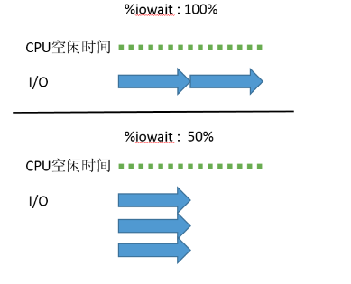

# 进程状态
> - [进程生命周期与PCB（进程控制块）](https://www.cnblogs.com/mickole/p/3185889.html)

进程的三种基本状态

## 就绪(Ready)状态

当进程已分配到除CPU以外的所有必要的资源，只要获得处理机便可立即执行，这时的进程状态称为就绪状态。

## 执行（Running）状态
当进程已获得处理机，其程序正在处理机上执行，此时的进程状态称为执行状态。

## 阻塞(Blocked)状态
正在执行的进程，由于等待某个事件发生而无法执行时，便放弃处理机而处于阻塞状态。引起进程阻塞的事件可有多种，例如，等待I/O完成、申请缓冲区不能满足、等待信件(信号)等。

以上是最经典也是最基本的三种进程状态，但现在的操作系统都根据需要重新设计了一些新的状态。

如linux：

- 运行状态（TASK_RUNNING）：**是运行态和就绪态的合并**，表示进程正在运行或准备运行，Linux 中使用TASK_RUNNING 宏表示此状态

- 可中断睡眠状态（浅度睡眠）（TASK_INTERRUPTIBLE）：进程正在睡眠（被阻塞），**等待资源到来是唤醒，也可以通过其他进程信号或时钟中断唤醒**，进入运行队列。Linux 使用TASK_INTERRUPTIBLE 宏表示此状态。

- 不可中断睡眠状态（深度睡眠状态）（TASK_UNINTERRUPTIBLE）：其和浅度睡眠基本类似，但有一点就是**不可被其他进程信号或时钟中断唤醒**。Linux 使用TASK_UNINTERRUPTIBLE 宏表示此状态。

- 暂停状态（TASK_STOPPED）：进程暂停执行接受某种处理。如**正在接受调试的进程**处于这种状态，Linux 使用TASK_STOPPED 宏表示此状态。

- 僵死状态（TASK_ZOMBIE）：进程已经结束但未释放PCB，Linux 使用TASK_ZOMBIE 宏表示此状态


---
# Cpu概述

- `%user`：Percentage of CPU utilization that occurred while executing at the user level (application). Note that this field includes time spent running virtual processors. （未标志nice值的）用户态程序的CPU占用率。

- `%nice`：Percentage of CPU utilization that occurred while executing at the user level with nice priority. 标志了nice值的用户态程序的CPU占用率。

- `%system`：Percentage of CPU utilization that occurred while executing at the system level (kernel). Note that this field includes time spent servicing hardware and software interrupts. 系统态（内核）程序的CPU占用率。

- `%iowait`：Percentage of time that the CPU or CPUs were idle during which the system had an outstanding disk I/O request. I/O等待的CPU占用率。

- `%steal`: Percentage of time spent in involuntary wait by the virtual CPU or CPUs while the hypervisor was servicing another virtual processor. 这个一般是在虚拟机中才能看到数值，比如：我的VPS供应商CPU overcommitment很严重，故我偶尔能看到%steal值有点高。

- `%idle`：Percentage of time that the CPU or CPUs were idle and the system did not have an outstanding disk I/O request. %idle越高，说明CPU越空闲。 除了上面的WIO以外的空闲情况，显示了没有本地磁盘I/O时cpu空闲或等待的时间百分比。

Linux的Load（系统负载），是一个让新手不太容易了解的概念。top/uptime等工具默认会显示1分钟、5分钟、15分钟的平均Load。具体来说，平均Load是指，在**特定的一段时间内统计的正在CPU中运行的(R状态)、正在等待CPU运行的、处于不可中断睡眠的(D状态)的任务数量的平均值**。

一般来说，对于Load的数值不要大于系统的CPU核数（或者开启了超线程，超线程也当成CPU core吧）。当然，有人觉得Load等于CPU core数量的2倍也没事，不过，我自己是在Load达到CPU core数量时，一般都会去查看下是什么具体原因导致load较高的。


参考链接:

- [LINUX系统的CPU使用率和LOAD](http://smilejay.com/2014/06/cpu-utilization-load-in-linux-system/)
- [10分钟教会你看懂top](https://juejin.cn/post/6844903919588491278): 比较贴切实际
- [性能分析Linux服务器CPU利用率](https://www.cnblogs.com/shengs/p/5148284.html): 除了上面的WIO以外的空闲情况，显示了没有本地磁盘I/O时cpu空闲或等待的时间百分比。
- [cpu显示信息](https://www.cnblogs.com/yjf512/p/3383915.html): 乏善可陈

---
## cpu信息

- [Linux CPU使用率含义及原理](https://www.cnblogs.com/aresxin/p/9152127.html)

Load Average: 在一段时间内，CPU正在处理以及等待CPU处理的进程数之和。 所以一般来说Load Average的数值别超过这台机器的总核数，就基本没啥问题。

## 一般场景
典型的用户态空间程序有：Shell、数据库、web服务器。

**分配内存、IO操作、创建子进程……都是内核操作。这也表明，当IO操作频繁时，System参数会很高。**

id: Idle time,空闲的cpu时间比。一般而言，idel + user + nice 约等于100%。

# Load average

> - [为什么磁盘慢会导致Linux负载飙升？](https://blog.csdn.net/T146lLa128XX0x/article/details/100914642)

众所周知，sleep状态的进程是不需要CPU的，即使所有的CPU都空闲，正在sleep的进程也是运行不了的，所以sleep进程的数量绝对不适合用作衡量CPU负载的指标，Linux把uninterruptible sleep进程算进load average的做法直接颠覆了load average的本来意义。

从另一个方面来说，也就可以解释为什么磁盘慢时（大量磁盘使用时），CPU负载会飙高了。**基本上我碰到CPU负载高的情况就两种情况：CPU本身处理太多任务，再加上软中断和上下文切换太频繁导致负载高；再就是磁盘太慢导致了不可中断睡眠太多导致CPU负载高。**

> CPU本身处理太多任务，再加上软中断和上下文切换太频繁导致负载高；再就是磁盘太慢导致了不可中断睡眠太多导致CPU负载高。


# Linux Load Averages：什么是平均负载？
> - [Linux Load Averages：什么是平均负载？](https://zhuanlan.zhihu.com/p/75975041): 好文。从源码变更提交分析，使用 bcc／eBPF 测量了不间断状态下的堆栈的 trace 和时间.

“平均负载”的目的是从人的角度得出一个与系统繁忙程度相关的数字。任务不可中断意味着（意味着？）进程正在等待磁盘读取之类的东西，这会增加系统负载。一个磁盘空间很大的系统可能会非常缓慢，但它的任务平均运行时间只有0.1，这对任何人都没有帮助。

---
# 中断

## Interruptible Sleep 和 Uninterruptible Sleep

> - [linux进程的interruptible sleep状态和uninterruptible sleep状态](https://blog.csdn.net/luckywang1103/article/details/86636916)

linux进程有两种sleep状态，一种是interruptible sleep，处在这种状态的进程是**可以接收外部信号的**，

另一种是uninterruptible sleep，处在这种状态的进程**不接收外来的任何信号**，所以用kill -9也杀不掉这种进程。

TASK_UNINTERRUPTIBLE存在的意义是**内核的某些流程是不能被打断的**，如果响应异步信号，程序的执行流程就会被处理异步信号的流程打断了。

比如进程在**对某些硬件进行操作时**(比如进程调用read系统调用对某个设备进行读操作，而read系统调用最终执行到对应设备驱动的代码，并与对应的物理设备进行IO交互，这些物理设备包括磁盘IO，网络IO及其他外设IO)，可能需要使用TASK_UNINTERRUPTIBLE对进程进行保护，以**避免进程与设备交互的过程被打断，造成设备陷入不可控状态**。一般这种TASK_UNINTERRUPTIBLE状态**很短暂，通过ps命令基本上捕捉不到**。如果TASK_UNINTERRUPTIBLE状态时间很长，倒是可以通过ps命令看到。


## 软中断的诞生

> - [软中断会吃掉你多少CPU？](https://zhuanlan.zhihu.com/p/80513852)

CPU正常情况下都是**专心处理用户的进程的**，当外部的硬件或软件有消息想要通知CPU，就会通过中断请求（interrupt request，IRQ）的方式来进行。比如当你的鼠标有了点击产生，再比如磁盘设备完成了数据的读取的时候，都会**通过中断通知CPU工作已完成**。

但是当**中断机制应用到网络IO的时候**，就产生了一点点问题。网络包收到后的处理工作，不像鼠标、键盘、磁盘IO读取完成那样简单，而是要**进行大量的内核协议栈的处理，最终才能放到进程的接收缓存区中**。假如只用一种中断（硬终端）的方式来处理网络IO，由于**硬中断的优先级又比较高，这样CPU就会忙于处理大量的网络IO而不能及时响应键盘鼠标等事情，导致操作系统实时性变差，你会感觉机器以卡一卡的**。

> 硬中断应用到网络IO的时候出现性能问题，因为需要进行大量的内核协议栈的处理

所以现代的Linux又发明了软件中断，配合硬中断来处理网络IO。 硬中断你可以理解只是个收包的，把包收取回来放到“家里”就完事，很快就能完成，这样不耽误CPU响应其它外部高优先级的中断。而**软中断优先级较低，负责将包进行各种处理，完成从驱动层、到网络协议栈，最终把处理出来的数据放到socker的接收buffer中**。

**软中断消耗的CPU周期相对比硬中断要多不少**，所以我们本文来重点关注软中断的开销。

计算每次软中断的耗时: CPU大约花费了1.2%的时钟周期在软中断上，也就是说每个核要花费12ms。该机器是16核的物理实机，故可以得出每个软中断需要的CPU时间是=12ms/(56000/16)次=3.428us

前文我们计算出了一个相对比较精确的开销时间。这个时间里其实包含两部分，**一是上下文切换开销，二是软中断内核执行开销**。 其中上下文切换和**系统调用、进程上下文切换**有很多相似的地方。

《深入理解Linux内核-第五章》开头的一句话，很形象地把中断和系统调用两个不相关的概念联系了起来，巧妙地找到了这二者之间的相似处。“**你可以把内核看做是不断对请求进行响应的服务器，这些请求可能来自在CPU上执行的进程，也可能来自发出中断的外部设备。老板的请求相当于中断，而顾客的请求相当于用户态进程发出的系统调用**”。

软中断和系统调用一样，**都是CPU停止掉当前用户态上下文，保存工作现场，然后陷入到内核态继续工作**。二者的**唯一区别是系统调用是切换到同进程的内核态上下文，而软中断是则是切换到了另外一个内核进程ksoftirqd上**。

> 系统调用是切换到**同进程的内核态上下文**，而软中断是则是切换到了**另外一个内核进程**ksoftirqd上

而事实上，早期的系统调用也还真的是通过汇编指令int（中断）来实现的，当用户态进程发出int $0x80指令时，CPU切换到内核态并开始执行system_call函数。后来大家觉得系统调用实在是太慢了，因为**int指令要执行一致性和安全性检查**。后来内核又该用了Intel提供的“**快速系统调用**”的sysenter指令，才算是和中断脱离了一点点干系。而**软中断必须得进行这些检查**，所以从这点上来看，**中断的开销应该是比系统调用的开销要多的**。

> 系统调用类比中断，早期也是通过中断实现。但是因为软中断需要进行int指令要执行一致性和安全性检查导致会比“快速系统调用”的sysenter指令慢

和进程上下文切换比较起来，进程上下文切换是从用户进程A切换到了用户进程B。而软中断切换是从用户进程A切换到了内核线程ksoftirqd上。 而ksoftirqd作为一个**内核控制路径**，其处理程序比一个用户进程要**轻量**，所以上下文切换开销相对比进程切换要稍快一些。

> 进程上下文切换>软中断>系统调用

> 根据前文的实验结果，进程上下文切换开销是3us-5us。系统调用开销是200ns起步。一次软中断CPU开销大约3.4us左右


---
# IO WAIT

%iowait 是 “sar -u” 等工具检查CPU使用率时显示的一个指标，在Linux上显示为 %iowait，在有的Unix版本上显示为 %wio，含义都是一样的。这个指标常常被误读，很多人把它当作**I/O问题的征兆**，我自己每隔一段时间就会遇到对 %iowait 紧张兮兮的客户，不得不费尽唇舌反复解释。事实上这个指标所含的信息量非常少，不能单独用来判断系统有没有I/O问题。


Linux和HP-UX的man page分别从两个角度描述了这个指标：Linux着眼于I/O，强调的是仍有未完成的I/O请求；而HP-UX着眼于进程，强调的是仍有进程在等待I/O。二者所说的是同一件事的两个方面，合在一起就完整了，就是：**至少有一个I/O请求尚未完成，有进程因为等待它而休眠**。


我们不妨采纳Linux的措辞，%iowait 表示**在一个采样周期内有百分之几的时间属于以下情况：CPU空闲、并且有仍未完成的I/O请求**。

> 在一个采样周期内有百分之几的时间属于以下情况：CPU空闲、并且有仍未完成的I/O请求

## 误解

对 %iowait 常见的误解有两个：

- 一是误以为 %iowait 表示CPU不能工作的时间
- 二是误以为 %iowait 表示I/O有瓶颈

第一种误解太低级了，%iowait 的首要条件就是CPU空闲，既然**空闲**当然就**可以接受运行任务**，只是因为没有可运行的进程，CPU才进入**空闲状态**的。那为什么没有可运行的进程呢？因为进程都处于**休眠状态**、在等待某个特定事件：比如等待定时器、或者来自网络的数据、或者键盘输入、或者等待I/O操作完成，等等。

> 关键：CPU是空闲的，因为都进程处于休眠状态

第二种误解更常见，为什么人们会认为 %iowait 偏高是**有I/O瓶颈**的迹象呢？他们的理由是：”%iowait  的第一个条件是CPU空闲，意即所有的进程都在休眠，第二个条件是仍有未完成的I/O请求，意味着进程休眠的原因是等待I/O，而 %iowait 升高则表明**因等待I/O而休眠的进程数量更多**了、或者**进程因等待I/O而休眠的时间更长**了。“ 听上去似乎很有道理，但是**不对**


可见，I/O并没有变化，%iowait 却升高了，原因仅仅是CPU的空闲时间增加了。请记住，系统中有成百上千的进程数，任何一个进程都可以引起CPU和I/O的变化，**因为 %iowait、%idle、%user、%system 等这些指标都是全局性的，并不是特指某个进程**。


2个I/O使 %iowait 达到了100%，3个I/O的 %iowait 却只有50%，**显然 %iowait 的高低与I/O的多少没有必然关系，而是与I/O的并发度相关**。所以，**仅凭 %iowait 的上升不能得出I/O负载增加 的结论**。

> I/O 高低跟I/O多少没有必然关系，与I/O并发度相关

这就是为什么说 %iowait 所含的信息量非常少的原因，它是一个非常模糊的指标，如果看到 %iowait 升高，**还需检查I/O量有没有明显增加**，avserv/avwait/avque等指标有没有明显增大，应用有没有感觉变慢，**如果都没有，就没什么好担心的**。

参考链接：
- [理解 %IOWAIT (%WIO)](http://linuxperf.com/?p=33)
- [%iowait和CPU使用率的正确认知](https://www.cnblogs.com/echo1937/p/6240020.html)


---
## IO问题

> - [重大事故！IO问题引发线上20台机器同时崩溃](https://juejin.im/post/6875176737274724366)

所谓的I/O（Input/Output）操作实际上就是输入输出的数据传输行为。程序员最关注的主要是磁盘IO和网络IO，因为这两个IO操作和应用程序的关系最直接最紧密。

磁盘IO：磁盘的输入输出，比如磁盘和内存之间的数据传输。

网络IO：不同系统间跨网络的数据传输，比如两个系统间的远程接口调用。

背景： CPU 在等待磁盘IO操作上花费的时间占比是76.6% （上图中红框 wa）

原因： 到现在可以确定，问题肯定发生在IO等待上。利用监控系统和jstack命令，最终定位问题发生在文件写入上。**大量的磁盘读写导致了JVM线程资源耗尽（注意，不代表系统CPU耗尽）**。最终导致订单服务无法响应上游服务的请求。

> 大量的磁盘读写导致了JVM线程资源耗尽（注意，不代表系统CPU耗尽）。是jvm线程其他资源被耗尽

## IO和CPU的关系

不少攻城狮会这样理解，如果CPU空闲率是0%，就代表CPU已经在满负荷工作，没精力再处理其他任务了。真是这样的吗？

我们先看一下计算机是怎么管理磁盘IO操作的。计算机发展早期，磁盘和内存的数据传输是由CPU控制的，也就是说从磁盘读取数据到内存中，是需要CPU存储和转发的，期间CPU一直会被占用。我们知道磁盘的读写速度远远比不上CPU的运转速度。这样在传输数据时就会占用大量CPU资源，造成CPU资源严重浪费。

**后来有人设计了一个IO控制器，专门控制磁盘IO。当发生磁盘和内存间的数据传输前，CPU会给IO控制器发送指令，让IO控制器负责数据传输操作，数据传输完IO控制器再通知CPU。因此，从磁盘读取数据到内存的过程就不再需要CPU参与了，CPU可以空出来处理其他事情，大大提高了CPU利用率。这个IO控制器就是“DMA”，即直接内存访问，Direct Memory Access。现在的计算机基本都采用这种DMA模式进行数据传输。**

> IO控制器就是“DMA”

通过上面内容我们了解到，IO数据传输时，是不占用CPU的。当应用进程或线程发生IO等待时，CPU会及时释放相应的时间片资源并把时间片分配给其他进程或线程使用，从而使CPU资源得到充分利用。**所以，假如CPU大部分消耗在IO等待（wa）上时，即便CPU空闲率（id）是0%，也并不意味着CPU资源完全耗尽了，如果有新的任务来了，CPU仍然有精力执行任务**。

> DMA：I/O控制器。I/O等待不占用CPU。空闲率排除掉wa

在DMA模式下执行IO操作是不占用CPU的，所以CPU IO等待（上图的wa）**实际上属于CPU空闲率的一部分**。所以我们执行top命令时，除了要关注CPU空闲率，CPU使用率（us，sy），还要关注IO Wait（wa）。**注意，wa只代表磁盘IO Wait，不包括网络IO Wait**。

当我们用jstack查看Java线程状态时，会看到各种线程状态。当发生IO等待时（比如远程调用时），线程是什么状态呢，Blocked还是Waiting？

答案是Runnable状态，是不是有些出乎意料！实际上，**在操作系统层面Java的Runnable状态除了包括Running状态，还包括Ready（就绪状态，等待CPU调度）和IO Wait等状态**。

如上图，Runnable状态的注解明确说明了，在JVM层面执行的线程，在操作系统层面可能在等待其他资源。如果等待的资源是CPU，在操作系统层面线程就是等待被CPU调度的Ready状态；**如果等待的资源是磁盘网卡等IO资源，在操作系统层面线程就是等待IO操作完成的IO Wait状态**。

有人可能会问，为什么**Java线程没有专门的Running状态呢**？

> jvm的running状态

目前绝大部分主流操作系统都是以时间分片的方式对任务进行轮询调度，时间片通常很短，大概几十毫秒，也就是说一个线程每次在cpu上只能执行几十毫秒，然后就会被CPU调度出来变成Ready状态，等待再一次被CPU执行，**线程在Ready和Running两个状态间快速切换**。通常情况，**JVM线程状态主要为了监控使用，是给人看的。当你看到线程状态是Running的一瞬间，线程状态早已经切换N次了**。所以，再给线程专门加一个Running状态也就没什么意义了。

所以在一次网络IO读取过程中，数据并不是直接从网卡读取到用户空间中的应用程序缓冲区，而是先从网卡拷贝到内核空间缓冲区，然后再从内核拷贝到用户空间中的应用程序缓冲区。对于网络IO写入过程，过程则相反，先将数据从用户空间中的应用程序缓冲区拷贝到内核缓冲区，再从内核缓冲区把数据通过网卡发送出去。

对于磁盘文件访问的操作，可以采用线程池方式，并设置线程上线，从而避免整个JVM线程池污染，进而导致线程和CPU资源耗尽。

---
## CPU占用率不准确

发生CPU占用率不准确的原因是：在一个时钟中断周期内，发生了多次进程调度。时钟中断的精度是1/HZ秒。

top命令CPU使用率准确吗？只有在一个时钟中断周期内发生多次进程调度，才会出现CPU占用率不准的情况。

那么top命令中CPU使用率是否准确与进程调度频率有关。若HZ的值为250，则ticks值为4ms；若HZ值为1000，则ticks值为1ms。在HZ为250时，只要进程的调度间隔大于4ms，CPU占用率就准确。HZ为1000时，调度间隔大于1ms，CPU占用率计算就准确。进程调度次数少，CPU占用率就准确；调度时间间隔小于时钟中断，就可能不准确。那么进程调度的时机是怎样的？如何观察进程调度次数？

---
# Nice

- [Understand what is using up “nice” CPU](https://stackoverflow.com/a/26183000)
- [What does 'nice' mean on CPU utilization graphs?](https://serverfault.com/a/116954)

On a CPU graph NICE time is time spent running processes with positive nice value (ie low priority). This means that it is consuming CPU, but will give up that CPU time for most other processes. Any USER CPU time for one of the processes listed in the above ps command will show up as NICE.

- [what-does-the-nice-value-mean-in-cpu-utilization-statistics](https://askubuntu.com/questions/399357/what-does-the-nice-value-mean-in-cpu-utilization-statistics)

> the time the CPU has spent running users' processes that have been "niced".


（摘自man top）“niced”过程是一个具有正nice值的过程。因此，**如果处理器的nice值很高，这意味着它正在处理一些低优先级的进程**。因此，当您看到高CPU利用率，并且您担心这种高负载会对您的系统产生不良影响时，此指示器非常有用：

- 高CPU利用率和高nice值：没什么好担心的，没有那么重要的任务也在做他们的工作，**重要的进程将很容易得到CPU时间**，**如果他们需要的话**。这种情况并不是真正的瓶颈。

- 高CPU利用率和低nice值：有点担心，因为CPU都在**处理重要的进程**，所以这些**新的进程**将**不得不等待**。这种情况是一个真正的瓶颈。

> 高cpu和高nice值不需要担心，证明更改nice值的程序能相应获得更多的处理时间。但是高cpu，低nice则是有问题了。跟下面的有些矛盾呀。

---
## 进程优先级、进程nice值和%nice的解释
> - [进程优先级，进程nice值和%nice的解释](https://blog.csdn.net/longdel/article/details/7317511): 概念

PRI ：进程优先权，代表这个进程可被执行的优先级，其值越小，优先级就越高，越早被执行

NI ：进程Nice值，代表这个进程的优先值

%nice ：改变过优先级的进程的占用CPU的百分比


PRI是比较好理解的，即进程的优先级，或者通俗点说就是程序被CPU执行的先后顺序，此**值越小进程的优先级别越高**。那NI呢？就是我们所要说的nice值了，其表示进程可被执行的优先级的修正数值。如前面所说，PRI值越小越快被执行，那么加入nice值后，将会使得PRI变为：PRI(new)=PRI(old)+nice。由此看出，PR是根据NICE排序的，规则是**NICE越小PR越前**（小，优先权更大），即其优先级会变高，则其越快被执行。如果NICE相同则进程uid是root的优先权更大。

在LINUX系统中，Nice值的范围从-20到+19（不同系统的值范围是不一样的），正值表示低优先级，负值表示高优先级，值为零则表示不会调整该进程的优先级。具有**最高优先级的程序，其nice值最低**，所以在LINUX系统中，值-20使得一项任务变得非常重要；与之相反，如果任务的nice为+19，则表示它是一个高尚的、无私的任务，允许所有其他任务比自己享有宝贵的CPU时间的更大使用份额，这也就是**nice的名称的来意**。

> 的确很nice

进程在创建时被赋予不同的优先级值，而如前面所说，nice的值是表示进程优先级值可被修正数据值，因此，每个进程都在其计划执行时被赋予一个nice值，这样系统就可以根据系统的资源以及具体进程的各类资源消耗情况，主动干预进程的优先级值。在通常情况下，子进程会继承父进程的nice值，比如在系统启动的过程中，**init进程会被赋予0，其他所有进程继承了这个nice值**（因为其他进程都是init的子进程）。

对nice值一个形象比喻，假设在一个CPU轮转中，有2个runnable的进程A和B，如果他们的nice值都为0，假设内核会给他们每人分配1k个cpu时间片。但是假设进程A的为0，但是B的值为-10，那么此时CPU可能分别给A和B分配1k和1.5k的时间片。故可以形象的理解为，nice的值影响了内核分配给进程的cpu时间片的多少，时间片越多的进程，其优先级越高，其优先级值（PRI）越低。%nice，就是**改变过优先级的进程的占用CPU的百分比**，如上例中就是**0.5k/2.5k=1/5=20%**。

> 上面的例子比较深刻

## nice很高问题

> - [嵌入式top nice很高问题](https://blog.csdn.net/heliangbin87/article/details/88052356)

%nic：表示**修改优先级的进程占CPU的百分比**，**很高说明不停的有进程切换优先级**。

**发现相应进程一直死循环执行，没有主动退出机制，导致内核不停动态调整优先级，以便其他进程得以运行。**

解决方法：

只要增加一个休眠机制即可解决问题。

> 这个例子值得参考

- [一个php进程cpu %nice很高的原因详解](https://www.aikaiyuan.com/8698.html)

判断问题：

1. NICE资源一般是用户端控制的行为产生；
2. 除非**程序中有大量的使用sleep**，或者是**调用了nice等函数**，对自定义了优先级别，但一般程序不会这么变态；

> nice值高，可以说是改变过优先级的进程的占用CPU百分比。一般高，说明不停的有进程切换优先级。


---
# Linux系统的ECS实例中如何查看物理CPU和内存信息

说明：

```
总核数 = 物理CPU个数 × 每颗物理CPU的核数
总逻辑CPU数 = 物理CPU个数 × 每颗物理CPU的核数 × 超线程数
```

- 查看物理CPU个数: `cat /proc/cpuinfo| grep "physical id"| sort| uniq| wc -l`
- 查看每个物理CPU中core的个数，即CPU核数: `cat /proc/cpuinfo| grep "cpu cores"| uniq`
- 查看逻辑CPU的个数: `cat /proc/cpuinfo| grep "processor"| wc -l`
- 查看CPU型号: `cat /proc/cpuinfo | grep name | cut -f2 -d: | uniq -c`
- 查看内存信息: `cat /proc/meminfo`

参考链接：
- [Linux系统的ECS实例中如何查看物理CPU和内存信息](https://help.aliyun.com/document_detail/41569.html)
- [云产品定价](https://cn.aliyun.com/price/product#/ecs/detail)

## Cpuinfo

> - [你以为你的多核CPU都是真的吗？多核“假象”](https://zhuanlan.zhihu.com/p/79272141)

那么是否就说明我的机器安装的CPU真的有24核？其实不是的，我们通过top命令看到的CPU核也叫做逻辑核。 说到这里我们先来普及一下基本概念：

- 物理CPU：主板上**真正安装的CPU的个数**，通过physical id可以查查看
- 物理核：一个CPU会**集成多个物理核心**，通过**core id可以查看到物理核的序号**
- 逻辑核： intel运用了**超线程技术**，一个物理核可以被**虚拟出来多个逻辑核**，**processor是逻辑核序号**

```bash
#查看物理CPU
cat /proc/cpuinfo | grep "physical id" | sort | uniq
#物理核
cat /proc/cpuinfo| grep "cpu cores"| uniq
#查看逻辑CPU
cat /proc/cpuinfo  | grep -E "core id|process|physical id"
```

processor就是逻辑核的序号，可以看出该机器总共有24个逻辑核。大家注意看processor 0和processor 12的**physical id、core id都是一样的**，也就说他们他们也处在同一个物理核上。但是他们的processor编号却不一样，一个是0，一个是12。这就是说，这两个核实际上是一个核，只是通过虚拟技术虚拟出来的而已。

## 超线程作用
超线程里的2个逻辑核实际上是在一个物理核上运行的，**模拟双核心运作，共享该物理核的L1和L2缓存**。物理计算能力并没有增加，**超线程技术只有在多任务的时候才能提升机器核整体的吞吐量**。而且据Intel官方介绍，相比实核，**平均性能提升只有20-30%左右**。也就是说，在我刚才的机器上看到的24核的处理能力，整体上**只比不开超线程的12核性能高30%**。让我们再用开发者使用的进程来看，由于**你的进程被其它进程分享了L1、L2，这就导致cache miss变多，性能会比不开超线程要差**。


---
# 进程和线程切换

为什么进程切换会比线程切换消耗的资源要多

## 前置背景
- 「切换」指的是上下文切换，「进程切换」 和 「线程切换」都是 「 CPU上下文切换 」 的一种 。
- 「 CPU上下文切换 」指的是把当前任务的「寄存器」（存储私有变量） + 「程序计数器」（程序执行到哪里）保存起来，加载新的任务的上下文到「寄存器」 + 「计数器」

## 进程切换的流程
- 保存「用户态的上下文（进程虚拟内存地址，私有变量， 程序执行栈 ）」 + 「内核态的上下文」（因为一个进程有可能会进行系统调用，比如读写文件，所以也会有内核态的上下文）
- 将新的进程的「用户态上下文」 + 「内核态上下文」，加载进「寄存器」 + 「程序计数器」，将切换的进程的虚拟地址 刷进 TLB （保存物理地址和虚拟地址的映射关系的页表）

## 线程切换的流程（ 特指同个进程下的线程上下文切换 ）
因为线程切换都是基于同个进程的，比起进程切换，不需要保存线程虚拟地址。其他流程基本相同

## 两者切换区别
从上面两个流程的比较，最大的区别是进程切换需要刷新 TLB，而切换时刷新 TLB。就意味着要重新建立物理内存地址和虚拟内存地址的映射关系，这个过程是很耗时且耗费 CPU 资源的

## 参考链接
a [https://segmentfault.com/a/1190000019750164](https://segmentfault.com/a/1190000019750164)
b [https://zhuanlan.zhihu.com/p/52845869](https://zhuanlan.zhihu.com/p/52845869)
c [https://blog.csdn.net/dl674756321/article/details/108360663](https://blog.csdn.net/dl674756321/article/details/108360663)
