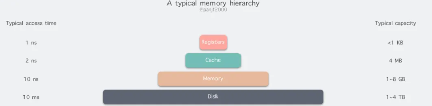

# 深入剖析虚拟内存工作原理

> - [深入剖析虚拟内存工作原理](https://mp.weixin.qq.com/s/c81Fvws0J2tHjcdTgxvv6g)

## 计算机存储器

存储器是计算机的核心部件之一，在完全理想的状态下，存储器应该要同时具备以下三种特性：

- 速度足够快：存储器的存取速度应当快于 CPU 执行一条指令，这样 CPU 的效率才不会受限于存储器
- 容量足够大：容量能够存储计算机所需的全部数据
- 价格足够便宜：价格低廉，所有类型的计算机都能配备

但是现实往往是残酷的，我们目前的计算机技术无法同时满足上述的三个条件，于是现代计算机的存储器设计采用了一种分层次的结构：

从顶至底，现代计算机里的存储器类型分别有：**寄存器、高速缓存、主存和磁盘**，这些存储器的速度逐级递减而容量逐级递增。存取速度最快的是寄存器，因为寄存器的制作材料和 CPU 是相同的，所以速度和 CPU 一样快，CPU 访问寄存器是没有时延的，然而因为价格昂贵，因此容量也极小，一般 32 位的 CPU 配备的寄存器容量是 32✖️32 Bit，64 位的 CPU 则是 64✖️64 Bit，不管是 32 位还是 64 位，寄存器容量都小于 1 KB，且寄存器也必须通过软件自行管理。

第二层是高速缓存，也即我们平时了解的 CPU 高速缓存 L1、L2、L3，一般 L1 是每个 CPU 独享，L3 是全部 CPU 共享，而 L2 则根据不同的架构设计会被设计成独享或者共享两种模式之一，比如 Intel 的多核芯片采用的是共享 L2 模式而 AMD 的多核芯片则采用的是独享 L2 模式。

第三层则是主存，也即主内存，通常称作随机访问存储器（Random Access Memory, RAM）。是与 CPU 直接交换数据的内部存储器。它可以随时读写（刷新时除外），而且速度很快，通常作为操作系统或其他正在运行中的程序的临时资料存储介质。

最后则是磁盘，磁盘和主存相比，每个二进制位的成本低了两个数量级，因此容量比之会大得多，动辄上 GB、TB，而缺点则是访问速度则比主存慢了大概三个数量级。机械硬盘速度慢主要是因为机械臂需要不断在金属盘片之间移动，等待磁盘扇区旋转至磁头之下，然后才能进行读写操作，因此效率很低

在计算机领域有一句如同摩西十诫般神圣的哲言："**计算机科学领域的任何问题都可以通过增加一个间接的中间层来解决**"，从内存管理、网络模型、并发调度甚至是硬件架构，都能看到这句哲言在闪烁着光芒，而虚拟内存则是这一哲言的完美实践之一。

## 虚拟内存
虚拟地址空间按照固定大小划分成被称为页（Page）的若干单元，物理内存中对应的则是页框（Page Frame）。这两者一般来说是一样的大小，如上图中的是 4KB，不过实际上计算机系统中一般是 512 字节到 1 GB，这就是**虚拟内存的分页技术**。因为是虚拟内存空间，每个进程分配的大小是 4GB (32 位架构)，而实际上当然不可能给所有在运行中的进程都分配 4GB 的物理内存，所以虚拟内存技术还需要利用到一种 交换（swapping）技术，也就是通常所说的**页面置换算法**，在进程运行期间只分配映射当前使用到的内存，暂时不使用的数据则写回磁盘作为副本保存，需要用的时候再读入内存，动态地在磁盘和内存之间交换数据。

## 页表
页表（Page Table），每次进行**虚拟地址到物理地址的映射**之时，都需要读取页表，从数学角度来说页表就是一个函数，入参是**虚拟页号**（Virtual Page Number，简称 VPN），输出是**物理页框号**（Physical Page Number，简称 PPN，也就是物理地址的基址）。

页表由**多个页表项**（Page Table Entry, 简称 PTE）组成，页表项的结构取决于机器架构，不过基本上都大同小异。一般来说页表项中都会**存储物理页框号、修改位、访问位、保护位和 "在/不在" 位（有效位）**等信息。

## 地址翻译

进程在运行期间产生的内存地址都是虚拟地址，如果计算机没有引入虚拟内存这种存储器抽象技术的话，则 CPU 会把这些地址直接发送到内存地址总线上，然后访问和虚拟地址相同值的物理地址；如果使用虚拟内存技术的话，**CPU 则是把这些虚拟地址通过地址总线送到内存管理单元（Memory Management Unit，简称 MMU），MMU 将虚拟地址翻译成物理地址之后再通过内存总线去访问物理内存**

第 1 步：处理器生成一个虚拟地址 VA，通过总线发送到 MMU；

第 2 步：MMU 通过虚拟页号得到页表项的地址 PTEA，通过内存总线从 CPU 高速缓存/主存读取这个页表项 PTE；
> 这一步的理解应该是va还得通过存储器拿到这个页表项PTE，而不是在mmu直接进行地址转换。页表一般是保存在内存中的一块固定的存储区，多了一次内存访问

第 3 步：CPU 高速缓存或者主存通过内存总线向 MMU 返回页表项 PTE；

第 4 步：MMU 先把页表项中的物理页框号 PPN 复制到寄存器的高三位中，接着把 12 位的偏移量 VPO 复制到寄存器的末 12 位构成 15 位的物理地址，即可以把该寄存器存储的物理内存地址 PA 发送到内存总线，访问高速缓存/主存；

第 5 步：CPU 高速缓存/主存返回该物理地址对应的数据给处理器

## 缺页中断

在 MMU 进行地址转换时，如果页表项的有效位是 0，则表示**该页面并没有映射到真实的物理页框号** PPN，则会引发一个**缺页中断**，CPU 陷入操作系统内核，接着操作系统就会**通过页面置换算法**选择一个页面将其换出 (swap)，以便为即将调入的新页面腾出位置，如果要换出的页面的页表项里的修改位已经被设置过，也就是**被更新过**，则这是一个脏页 (Dirty Page)，**需要写回磁盘更新该页面在磁盘上的副本**，如果该页面是"干净"的，也就是没有被修改过，则直接用调入的新页面**覆盖掉被换出的旧页面即可**。

## 虚拟内存和高速缓存

如果一台计算机同时配备了虚拟内存技术和 CPU 高速缓存，那么 MMU **每次都会优先尝试到高速缓存中进行寻址，如果缓存命中则会直接返回，只有当缓存不命中之后才去主存寻址**。

通常来说，大多数系统都会选择利用物理内存地址去访问高速缓存，因为高速缓存相比于主存要小得多，所以使用物理寻址也不会太复杂；另外也因为高速缓存容量很小，所以系统需要尽量在多个进程之间共享数据块，而使用物理地址能够使得多进程同时在高速缓存中存储数据块以及共享来自相同虚拟内存页的数据块变得更加直观。

## 加速翻译&优化页表

经过前面的剖析，相信读者们已经了解了虚拟内存及其分页&地址翻译的基础和原理。现在我们可以引入虚拟内存中两个核心的需求，或者说瓶颈：

- 虚拟地址到物理地址的映射过程必须要非常快，地址翻译如何加速。
- 虚拟地址范围的增大必然会导致页表的膨胀，形成大页表。

**加速地址翻译过程的方案目前是通过引入页表缓存模块 -- TLB，而大页表则是通过实现多级页表或倒排页表来解决。**

### TLB 加速

翻译后备缓冲器（Translation Lookaside Buffer，TLB），也叫快表，是用来加速虚拟地址翻译的，因为虚拟内存的分页机制，**页表一般是保存在内存中的一块固定的存储区**，而 MMU 每次翻译虚拟地址的时候都需要从页表中匹配一个对应的 PTE，**导致进程通过 MMU 访问指定内存数据的时候比没有分页机制的系统多了一次内存访问**，一般会多耗费几十到几百个 CPU 时钟周期，性能至少下降一半，如果 PTE 碰巧缓存在 CPU L1 高速缓存中，则开销可以降低到一两个周期，但是我们不能寄希望于每次要匹配的 PTE 都刚好在 L1 中，因此需要引入加速机制，即 TLB 快表。

TLB 可以简单地理解成页表的高速缓存，保存了**最高频被访问的页表项 PTE**。**由于 TLB 一般是硬件实现的，因此速度极快**，MMU 收到虚拟地址时一般会先通过硬件 TLB 并行地在页表中匹配对应的 PTE，若命中且该 PTE 的访问操作不违反保护位（比如尝试写一个只读的内存地址），则直接从 TLB 取出对应的物理页框号 PPN 返回，若不命中则会穿透到主存页表里查询，并且会在查询到最新页表项之后存入 TLB，以备下次缓存命中，如果 TLB 当前的存储空间不足则会替换掉现有的其中一个 PTE。

### 多级页表

理论上一台 32 位的计算机的寻址空间是 4GB，也就是说每一个运行在该计算机上的进程理论上的虚拟寻址范围是 4GB。到目前为止，我们一直在讨论的都是单页表的情形，如果每一个进程都把理论上可用的内存页都装载进一个页表里，但是实际上进程会真正使用到的内存其实可能只有很小的一部分，而我们也知道页表也是保存在计算机主存中的，那么势必会造成大量的内存浪费，甚至有可能导致计算机物理内存不足从而无法并行地运行更多进程。

这个问题一般通过多级页表（Multi-Level Page Tables）来解决，通过把一个大页表进行拆分，形成多级的页表，我们具体来看一个二级页表应该如何设计：假定一个虚拟地址是 32 位，由 10 位的一级页表索引、10 位的二级页表索引以及 12 位的地址偏移量，则 PTE 是 4 字节，页面 page 大小是 2^12 = 4KB，总共需要 2^20 个 PTE，一级页表中的每个 PTE 负责映射虚拟地址空间中的一个 4MB 的 chunk，每一个 chunk 都由 1024 个连续的页面 Page 组成，如果寻址空间是 4GB，那么一共只需要 1024 个 PTE 就足够覆盖整个进程地址空间。二级页表中的每一个 PTE 都负责映射到一个 4KB 的虚拟内存页面，和单页表的原理是一样的。

多级页表的关键在于，**我们并不需要为一级页表中的每一个 PTE 都分配一个二级页表，而只需要为进程当前使用到的地址做相应的分配和映射**。因此，对于大部分进程来说，它们的一级页表中有大量空置的 PTE，那么这部分 PTE 对应的二级页表也将无需存在，这是一个相当可观的内存节约，事实上对于一个典型的程序来说，理论上的 4GB 可用虚拟内存地址空间绝大部分都会处于这样一种未分配的状态；更进一步，在程序运行过程中，只需要把一级页表放在主存中，虚拟内存系统可以在实际需要的时候才去创建、调入和调出二级页表，这样就可以确保只有那些最频繁被使用的二级页表才会常驻在主存中，此举亦极大地缓解了主存的压力。

### 倒排页表

倒排页表在寻址空间更大的 CPU 架构下尤其高效，或者应该说更适合那些『虚拟内存空间/物理内存空间』比例非常大的场景，因为这种设计是以实际物理内存页框作为 PTE 索引，而不是以远超物理内存的虚拟内存作为索引。

倒排页表虽然在节省内存空间方面效果显著，但同时却引入了另一个重大的缺陷：地址翻译过程变得更加低效。

这时候又是我们的老朋友 -- TLB 出场的时候了，我们只需要把高频使用的页面缓存在 TLB 中，借助于硬件，在 TLB 缓存命中的情况下虚拟内存地址的翻译过程就可以像普通页表那样快速，然而当 TLB 失效的时候，则还是需要通过软件的方式去扫描整个倒排页表，线性扫描的方式非常低效，**因此一般倒排页表会基于哈希表来实现**，假设有 1G 的物理内存，那么这里就一共有 2^18 个 4KB 大小的页框，**建立一张以 PPN 作为 key 的哈希表**，则可以划分成 2^18 个 4KB 大小的页框，假设 0 作为 PPN 的起点，则 `[0, 2^18 - 1]` 就是 PPN 的取值范围，以此作为 Hash map 的 key，然后实现一个哈希函数，使用 VPN 作为入参，使得哈希函数最后输出的哈希值落在 `[0, 2^18 - 1]` 区间内，每一个 key 值对应的 value 中存储的是 (VPN, PNN)，那么所有具有相同哈希值的 VPN 会被链接在一起形成一个冲突链，如果我们把哈希表的槽数设置成跟物理页框数量一致的话，那么这个倒排哈希表中的冲突链的平均长度将会是 1 个 PTE，可以大大提高查询速度。当 VPN 通过倒排页表匹配到 PPN 之后，这个 (VPN, PPN) 映射关系就会马上被缓存进 TLB，以加速下次虚拟地址翻译。

## 总结
现在让我们来回顾一下本文的核心内容：虚拟内存是存在于计算机 CPU 和物理内存之间一个中间层，主要作用是高效管理内存并减少内存出错。虚拟内存的几个核心概念有：

- **页表**：从数学角度来说页表就是一个函数，入参是虚拟页号 VPN，输出是物理页框号 PPN，也就是物理地址的基址。页表由页表项组成，页表项中保存了所有用来进行地址翻译所需的信息，页表是虚拟内存得以正常运作的基础，每一个虚拟地址要翻译成物理地址都需要借助它来完成。
- **TLB**：计算机硬件，主要用来解决引入虚拟内存之后寻址的性能问题，加速地址翻译。如果没有 TLB 来解决虚拟内存的性能问题，那么虚拟内存将只可能是一个学术上的理论而无法真正广泛地应用在计算机中。
- **多级页表和倒排页表**：用来解决虚拟地址空间爆炸性膨胀而导致的大页表问题，多级页表通过将单页表进行分拆并按需分配虚拟内存页而倒排页表则是通过反转映射关系来实现节省内存的效果。

---
# 虚拟内存解决了什么问题

> - [虚拟内存解决了什么问题](https://www.yuque.com/go-interview/set/daily-qa-202104#tf0Ef)

1. 进程隔离，当没有虚拟内存的时候，会直接操作物理内存，会**导致不同进程对同一物理地址进行抢占和覆盖造成程序上不可预知的错误**
2. 缓存作用，虚拟内存的**访问速度比磁盘快**很多，所以可以将磁盘一些热度数据放到虚拟内存中提高访问速度
3. 内存管理，如果直接使用程序操作物理内存会让开发者在开发中要顾及十分复杂的操作方式，所以虚拟内存同时也**把物理内存抽象成页表结构进行管理**，方便程序运行时对内存的申请，释放等一系列操作

---
# Go内存分配那些事
> - [Go内存分配那些事](https://lessisbetter.site/2019/07/06/go-memory-allocation/): 虚拟内存、栈和堆、堆内存管理。比较偏向go内存的主题，要先补习下操作系统相关的知识。

访问内存，实际访问的是虚拟内存，**虚拟内存通过页表查看**，当前要访问的虚拟内存地址，是否已经加载到了物理内存，如果已经在物理内存，则取物理内存数据，如果没有对应的物理内存，则从磁盘加载数据到物理内存，并把**物理内存地址和虚拟内存地址更新到页表**。

有没有Get到：物理内存就是磁盘存储缓存层。

另外，在没有虚拟内存的时代，物理内存对所有进程是共享的，多进程同时访问同一个物理内存存在并发访问问题。**引入虚拟内存后，每个进程都要各自的虚拟内存，内存的并发访问问题的粒度从多进程级别，可以降低到多线程级别。**

> 对物理内存做了一个映射表，屏蔽层？

# 什么是 copy on write
> - [什么是 copy on write](https://www.yuque.com/go-interview/set/daily-qa-202104#tf0Ef)

• 什么是写时拷贝

写时拷贝是一种优化策略，当多个调用者如果同时请求相同的资源时，他们会共同获取**相同指针指向相同资源**，直到某个调用者**需要修改时**，才会真正复制一份专属于对应调用者的副本，其他调用者访问的资源仍然保持只读不变

• 写时拷贝实现原理

fork 后，父进程fork 出一个子进程，会共享同一个物理地址，**但虚拟地址不一样**。并且会将共享的内存页设置为**只读**。当父子进程进行写操作时，就会**触发异常页错误**，之后会**单独复制一份副本给要写操作的进程**。

• 写时拷贝解决了什么问题

ⅰ. 避免性能抖动，**避免了 fork 时的复制和分配资源时的性能抖动**
ⅱ. **减少了不必要的资源分配**，比如 fork 进程时，**不是所有的页面都需要复制的**

• 写时拷贝有什么缺点

应用了写时拷贝技术后，**如果会出现大量的写操作，会触发异常页中断，从用户态切换内核态，开销很大**。所以写时拷贝最好应用**在写操作少的场景**，比如 redis 的 RDB 持久化

> redis的RDB, docker镜像层

> fork会造成性能抖动、而且没有必要复制所有。但是写时拷贝在写操作多的场景，会触发异常页中断。内核态开销很大。

> 那为什么redis还用写时拷贝？对于大多数的 Redis 服务或者数据库，**写请求往往都是远小于读请求的**

---
# 为什么 Redis 快照使用子进程
> - [为什么 Redis 快照使用子进程](https://draveness.me/whys-the-design-redis-bgsave-fork/)

RDB 会每隔一段时间中对 Redis 服务中当下的数据集进行快照，除了 Redis 的配置文件可以对快照的间隔进行设置之外，Redis 客户端还同时提供两个命令来生成 RDB 存储文件，也就是 SAVE 和 BGSAVE，通过命令的名字我们就能猜出这两个命令的区别。

写时拷贝（Copy-on-Write）的出现就是为了解决这一问题，就像我们在这一节开头介绍的，写时拷贝的主要作用就是**将拷贝推迟到写操作真正发生时**，这也就避免了大量无意义的拷贝操作。在一些早期的 *nix 系统上，系统调用 fork 确实会立刻对父进程的内存空间进行复制，但是在今天的多数系统中，fork 并不会立刻触发这一过程

在 fork 函数调用时，父进程和子进程会被 Kernel **分配到不同的虚拟内存空间中**，所以**在两个进程看来它们访问的是不同的内存**：

- 在真正访问虚拟内存空间时，Kernel 会将虚拟内存映射到物理内存上，所以父子进程共享了物理上的内存空间；

- 当父进程或者子进程对共享的内存进行修改时，共享的内存才会**以页为单位进行拷贝**，父进程会保留原有的物理空间，而子进程会使用拷贝后的新物理空间；

在 Redis 服务中，子进程只会读取共享内存中的数据，它并不会执行任何写操作，只有父进程会在写入时才会触发这一机制，而对于大多数的 Redis 服务或者数据库，**写请求往往都是远小于读请求的**，所以使用 fork 加上写时拷贝这一机制能够带来非常好的性能，也让 BGSAVE 这一操作的实现变得非常简单。

---
# fork()系统调用

> - [fork()之父子进程页表权限的设置](https://blog.csdn.net/wangwei222/article/details/80927255)

fork()系统调用用来生成子进程，而现有Linux系统运行在写时拷贝的机制下，于是fork()函数在为子进程建立内核中各种管理结构的时候，并没有将真实的物理资源分配给子进程，而只是将父进程的物理资源共享给子进程，比如：fork()函数会将父进程的物理内存共享给子进程，即将父进程多级页表的内容**复制到子进程新建立的多级页表**中。然而在这种机制下，对于父进程中那些原本可读可写的页，一旦被共享给子进程之后，两个进程中任何一个对该物理页内容进行了修改，将会影响另外一个进程的正常使用，于是，内核解决此问题的方法是：在将父进程的多级页表复制到子进程的多级页表中时，会将之前对于父进程来说可写的物理页对应的页表项，在父子进程的多级页表中**都设置为只读**，因此，一旦两个进程中的任何一个对某个写保护（只读）的物理页发生了写操作，就会**导致pagefault**，相应的内核函数会处理并识别出这种写时拷贝机制导致的错误，并**复制该物理页的内容到一个新的物理页，并将新的物理页链接到发生写操作的进程的多级页表中，最后恢复该物理页对应表项的写权限，恢复进程对该物理页的写操作，做到进程无感知的处理**。
