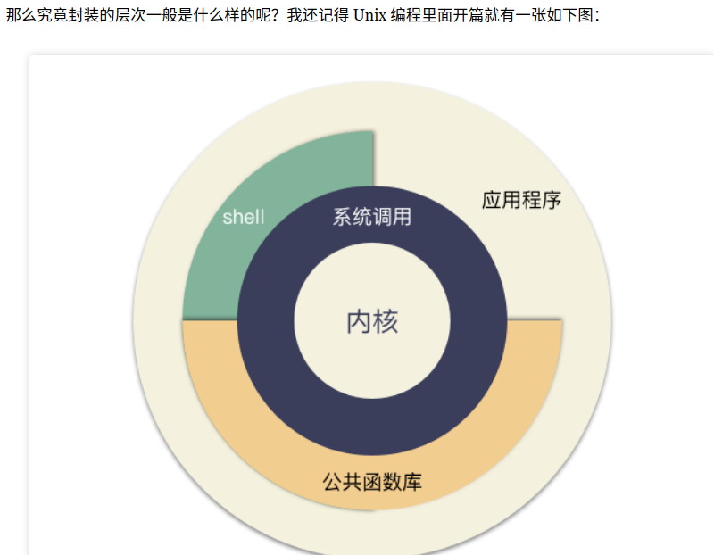

# nvm

```bash
nvm ls-remote
nvm install 14.16.0
nvm alias default 12.18.1
nvm ls
npm config set registry=http://registry.npm.taobao.org -g
```

# gitbook

```bash

nvm install 12.18.1
nvm use 12.18.1
npm install -g gitbook-cli
npm install -g gitbook-summary
book sm
gitbook fetch 3.2.3
nvm use 10.15.1
gitbook uninstall 3.2.3
gitbook fetch 3.0.0

npm uninstall -g gitbook
npm uninstall -g gitbook-cli
npm install gitbook -g
npm install -g gitbook-cli

npm i gitbook-plugin-page-toc-button

gitbook init
gitbook serve

book sm
```

- [Gitbook build stopped to work in node 12.18.3 ](https://github.com/GitbookIO/gitbook-cli/issues/110)
- [左侧目录可折叠](https://segmentfault.com/a/1190000019806829): bug与解决

# gitbook2pdf

如何将gitbook转换成pdf

```bash
docker run --rm  --network=host  -v /usr/share/fonts:/usr/share/fonts -v `pwd`/output:/app/output soulteary/docker-gitbook-pdf-generator "http://localhost:4000/"
```

```python
# 241行添加文件名称作为书签
            class_ = get_level_class(level)
            string = f"<h1 class='{class_}'>{title}</h1>"
            text = string + ChapterParser(metatext, title, level + 1, ).parser()
```

```bash
#hack进去改代码，执行
docker run --rm  --network=host -v /usr/share/fonts:/usr/share/fonts -v `pwd`/output:/app/output -it --entrypoint=sh soulteary/docker-gitbook-pdf-generator
```

- [gitbook2pdf](https://github.com/fuergaosi233/gitbook2pdf)
- [ebook-convert](https://www.mapull.com/gitbook/comscore/extend/pdf.html): 官方不支持的原因
- [Python - HTML转换为PDF文件wkhtmltopdf](https://www.jianshu.com/p/b718b77d4c93)

---
# pycharm调试docker

```bash
apt update

apt install -y openssh-server

mkdir /var/run/sshd

echo 'root:123' | chpasswd

sed -i 's/PermitRootLogin prohibit-password/PermitRootLogin yes/' /etc/ssh/sshd_config

sed -i 's/#PermitRootLogin/PermitRootLogin/' /etc/ssh/sshd_config

sed 's@session\s*required\s*pam_loginuid.so@session optional pam_loginuid.so@g' -i /etc/pam.d/sshd

echo "export VISIBLE=now" >> /etc/profile

service ssh restart

docker port [your_container_name] 22
```
- https://zhuanlan.zhihu.com/p/52827335

注意ssh进容器里面的环境变量是没有的。可以通过pycharm的env文件配置一下。


---

# xkbset

```bash
xkbset ma [delay] [interval] [time to max] [max speed] [curve]

xkbset ma 60 10 40 40 100
xkbset ma 60 9 50 70 200

xkbset ma 60 9 1000 5000 200
```
- [acceleration](https://askubuntu.com/questions/473326/increasing-mouse-key-acceleration)

## xdotool
- [xdotool](https://www.semicomplete.com/projects/xdotool/)
- [is-there-any-way-of-enabling-middle-click-scrolling](https://askubuntu.com/questions/49310/is-there-any-way-of-enabling-middle-click-scrolling): xdotool 设置快捷键 按住
- [命令模拟鼠标移动](http://justcode.ikeepstudying.com/2018/03/shell%E8%84%9A%E6%9C%AC%EF%BC%9A%E5%9C%A8linux%E4%B8%AD%E6%A8%A1%E6%8B%9F%E5%87%BB%E9%94%AE%E5%92%8C%E9%BC%A0%E6%A0%87%E7%A7%BB%E5%8A%A8-%E9%94%AE%E7%9B%98%E7%B2%BE%E7%81%B5-xdotool-%E6%A8%A1/)

移动屏幕到另一边：
```python
#!/usr/bin/env python3
import subprocess
# just a helper function
get = lambda cmd: subprocess.check_output(cmd).decode("utf-8")
# get the current mouse position
current = [int(n) for n in [it.split(":")[1] for it in get(["xdotool", "getmouselocation"]).split()[:2]]]
# get the x/y size of the left screen
screendata = [(s.split("x")[0], s.split("x")[1].split("+")[0]) for s in get(["xrandr"]).split() if "+0+0" in s ][0]
xy = [int(n) for n in screendata]
# see if the mouse is on the left- or right screen
if current[0] < xy[0]:
    # if the mouse currently is on the left screen, move it to the right (from the middle of the left screen)
    command = ["xdotool", "mousemove", "--sync", str(current[0]+xy[0]), str(xy[1]/2)]
else:
    # if the mouse currently is on the left screen, move it to the right (from the middle of the left screen)
    command = ["xdotool", "mousemove", "--sync", str(current[0]-xy[0]), str(xy[1]/2)]

subprocess.Popen(command)
# optional: click after the mouse move: comment out if not needed / wanted
# subprocess.Popen(["xdotool", "click", "1"]
```

通过系统自带的快件建设置 xdotool click 4 xdotool click 4 来控制鼠标滚，遇到的问题就是不能一直按住，需要重复按住。应该是系统设计的快捷键不允许按住重复触发

---
# 时区
中国的时区为什么是Asia/Shanghai，而不是Asia/Beijing？

原因是1949年以前，中国一共分了5个时区，以哈尔滨 （Asia/Harbin）、上海（Asia/Shanghai）、重庆（Asia/Chongqing）、乌鲁木齐（Asia/Urumqi）、喀什（Asia/Kashgar）为代表——分别是：长白时区GMT+8:30、中原标准时区

GMT+8、陇蜀时区GMT+7、新藏时区GMT+6和昆仑时区GMT+5:30。它是1912年北京观象台制订，后由内政部批准过。而且从国际标准本身的角度来看，北京和上海处于同一时区，只能保留一个。而作为时区代表上海已经足够具有代表性，因此其维护者没有足够的动力做出改变。所以目前还没有Asia/beijing。

django没有北京时区

```
from pytz import all_timezones
'Asia/Beijing' in all_timezones
```

---
#　sentry

sentry并不是返回完整的数据的，会有字符长度的限制： https://docs.sentry.io/accounts/quotas/#attributes-limits

---
# corb Cross-Origin Read Blocking

- https://juejin.im/post/5cc2e3ecf265da03904c1e06

## cors请求头被隐藏

请求头被隐藏一个原因是：from disk 或者from cache

还有就是跨域，网上有教程，通过禁止site-isolation恢复。但并没有作用.再找到这个处理方法，然后试了一下，直接disable network service 就解决了。which makes network requests through a separate process

参考链接：
* https://blog.ermer.de/2018/06/11/chrome-67-provisional-headers-are-shown/
* https://www.chromium.org/Home/chromium-security/site-isolation#TOC-Known-Issues
* https://stackoverflow.com/a/55865689/6274400

---
# pytest

- https://github.com/pytest-dev/pytest-django/issues/570
- https://docs.pytest.org/en/latest/unittest.html#mixing-pytest-fixtures-into-unittest-testcase-subclasses-using-marks
- http://axil.github.io/pytest-vs-standard-django-tests.html

---
# 屏幕间的窗口移动
安装compizconfig
put to next output 选项


---
# vim 多行注释

多行注释：

进入命令行模式，按ctrl + v进入 visual block模式（可视快模式），然后按j, 或者k选中多行，把需要注释的行标记起来

按大写字母I，再插入注释符，例如//

按esc键就会全部注释了（我的是按两下）

取消多行注释：

进入命令行模式，按ctrl + v进入 visual block模式（可视快模式），按小写字母l横向选中列的个数，例如 // 需要选中2列

按字母j，或者k选中注释符号

按d键就可全部取消注释

---
# timeout

timeout -s 15 -k 10 3 python cli/update_test.py

默认是signal.SIGTERM信号

```python

import signal
import time
import sys

def sigterm_handler(signal, frame):
    # save the state here or do whatever you want
    print('booyah! bye bye')
    time.sleep(100)
    sys.exit(0)

signal.signal(signal.SIGTERM, sigterm_handler)
```

```
-s  --signal=SIGNAL 见'kill -l'
-k  --kill-after=DURATION 10 在发送信号10秒钟后还是允许则直接kill掉。如果不加，则不会强制kill掉。即使处理信号的时间会很久。
3 3秒timeout时间限制
```

```
1	SIGHUP	终止	终止控制终端或进程
2	SIGINT	终止	由键盘引起的终端(Ctrl-c)
9	SIGKILL	终止	强制杀死进程(大招, 进程不可捕获)
14	SIGALRM	终止	时钟中断(闹钟)
15	SIGTERM	终止	进程终止(进程可捕获)
```
- [Python和Signal](https://www.jianshu.com/p/c8edab99173d)
- [Containers: Terminating with grace](https://itnext.io/containers-terminating-with-grace-d19e0ce34290)
- [dumb-init-Docker](https://www.infoq.cn/article/2016/01/dumb-init-Docker)


?: `Process finished with exit code 129 (interrupted by signal 1: SIGHUP)`

## quit
除了intr之外，还有另外一种键盘信号quit，可以用来停止程序。quit键通常是^\。

intr和quit之间有什么区别呢？区别并不大。以前quit主要由需要终止测试程序的高级程序员使用。当按下^\时，它不仅停止程序，而且还会告诉Unix为此时内存中的内容制作一份副本。该信息存储在一个磁芯文件(core file)中，也就是一个名为core的文件中。然后程序员可以使用特殊的工具分析磁芯文件，查找什么地方出了问题。

现在程序员拥有了更好的调试工具，因此在大多数系统上，quit信号不再生成磁芯文件，尽管一些编程环境仍在使用磁芯文件帮助调试。如果没有调试过程序，但是一个名为core的文件神秘地出现在你的一个目录中，那么这意味着你运行的程序出现了严重的错误而中止。除非真的需要这个文件，否则可以删除它。实际上，你应该删除这个文件，因为core文件相当庞大，没有理由去浪费空间。
- [停止或暂停程序的信号: intr、quit、stop](https://my.oschina.net/u/2914561/blog/808585)

---
# sh疑问
set -e 开头是什么意思？
会导致

```
PYFILES="$(git diff --name-only --diff-filter=AM --cached HEAD | grep \\.py$)"
```
找不到就中止

PYFILES是空的时候
会导致

```
PYFILES=$(find $PYFILES -not -name '*_pb2.py' -not -name '*_pb2_grpc.py')
```

返回很多不知道是哪里的路径

---
# less

less 复制单行长文本会变成多行

解决办法： 往上滚超出该行，再往下滚，就没有问题了。

https://unix.stackexchange.com/a/445590

---
# Extreme programming
阅读Extreme programming（XP）第6,7章： 主要讲的是结对编程的好处，并且要如何做

例如： 更有效率，相信对方之类的

重构（名词）：对软件内部结构的一种调整，目的是在不改变“软件之可察行为”前提下，提高其可理解性，降低其修改成本。

重构(动词):通过应用一系列的重构而不改变软件的可观察行为来重构软件


您将时间划分为两个不同的活动:*添加功能和重构*。添加函数时，不应该更改现有代码;您只是在添加新功能。您可以通过添加测试并使测试工作来度量您的进度。当您进行重构时，您会强调不添加函数;您只需要重新构造代码。您不需要添加任何测试(除非您找到您之前遗漏的案例)

*添加功能和重构会在开发过程中交替着进行*。您首先尝试添加一个新函数，并且您意识到如果代码的结构不同，那么这将容易得多。因此您需要交换帽子并重构一段时间。一旦代码结构变得更好，就可以交换帽子并添加新函数。一旦您让新函数开始工作，您就会意识到您以一种难以理解的方式对它进行了编码，因此您需要再次交换帽子并进行重构。

- 重构改进了软件的设计：重构更像是整理代码。要做的工作是删除那些不是真正在正确位置的代码块。消除重复代码。

- 重构使软件更容易理解： 以便后续维护和理解，重构使我对代码有了更深层次的理解
- 重构使我对代码有了更深层次的理解
- 重构可以帮助您更快地编写程序

### 什么时候重构：

重构并不是一件需要你腾出时间去做的事情。重构是你每时每刻都在做的事情。你不是决定重构，而是因为你想做别的事情，而重构可以帮助你做别的事情

1. 三次法则 第一次做某件事时只管去做，第二次做类似的事会产生反感，但无论如何还是做了；第三次再做类似的事，你就应该重构。
事不过三，三则重构（Three strikes and you refactor）
2. 添加功能时一并重构
3. 修补错误时一并重构
4. 复审代码时一并重构

### 重构倾向于把大对象分解成几个小对象，把大方法分解成几个小方法

- 使逻辑能够共享： 抽取公用类
- 分别解释意图和执行: 类和方法的名称能清晰说明意图，
- 隔离变化： 子类
- 对条件逻辑进行编码： 多态

### 重构的问题

> 现在的重构就是这样。我们知道重构的好处。我们知道，它们可以对我们的工作产生明显的影响。但我们还没有足够广泛的经验来了解这些限制适用于何处

- 数据库： 更换后需要重构？添加一个中间层
- 接口： 改变软件模块的实现，而不是改变接口。如果是重构发布对外的接口, 多版本兼容。不用过多、过早发布对外接口
- 系统设计改变的重构是困难的: 在一个项目中，将一个没有安全需求的系统重构成一个具有良好安全性的系统是困难的，但也是可能的。想象重构，预估重构的困难，选择简单的设计，即使无法覆盖所有的潜在需求

### 何时重构

- 请记住，在重构之前，代码必须基本正确地工作
- 但是，除非你离最后期限很近了，否则你不应该因为没有时间而推迟重构。
- 允许遗留一定的技术债务


> 设计让我的思维非常敏捷，但我的思维却漏洞百出

重构可以替代预先设计。 啥都不想，先做，后续重构。极限编程
重构重点更改，随着时间更了解更能提出更适合的解决办法，前面的方案也可能不会适用。我希望构建一个能够经得起我所预见的更改的设计。更灵活成本更高。有些灵活也不是必须的。

一旦你对那些容易重构的东西有了一个大致的概念，你就不会再去想那些灵活的解决方案了。如果时机成熟，你有信心进行重构。你建造的是最简单的东西。至于灵活、复杂的设计，大多数时候您并不需要它

### 重构与性能
重构当然会使软件运行得更慢，但它也使软件更易于进行性能调优。除了硬实时环境外，快速软件的秘密是首先编写可调软件，然后进行调优以获得足够的速度。有些性能要求是必须的，但有些是可接受的。

提高性能的变化通常会使程序更难使用。这减缓了发展。如果得到的软件速度更快，这将是值得付出的代价，但通常不是。性能改进散布在整个程序中，并且每一个改进都是从狭隘的角度来看待程序的行为。

一般都是一小部分代码中浪费了大部分时间 。后续通过性能分析，把注意力集中在一个热点上，你的工作就会少很多。

拥有一个经过良好分解的程序在两个方面有助于这种优化风格。首先，它为您提供了用于性能调优的时间。因为您有经过良好分解的代码，所以可以更快地添加功能。这给了你更多的时间来关注性能。剖析可以确保你把时间集中在正确的地方。其次，使用经过良好分解的程序，您可以为性能分析提供更细的粒度。您的分析器会将您引向更小的代码部分，这些代码更容易调优。因为代码更清晰，所以您可以更好地理解您的选项，以及什么样的调优可以工作.


---
# 测试

有些时间花在弄清楚应该做什么，有些时间花在设计上，但大多数时间花在调试上。

当功能测试人员或用户发现软件中的错误时，至少需要两件事情来修复它。当然，您必须更改生产代码来删除错误。但是您还应该添加一个暴露bug的单元测试。

编写并运行不完整的测试比不运行完整的测试要好

寻找边界的另一部分是寻找可能导致测试失败的特殊条件。

不要因为担心测试不能捕获所有bug而停止编写能够捕获大多数bug的测试


---
# mysqlToUml

可以用 [ddl2plantuml](https://github.com/wangyuheng/ddl2plantuml) 这个库

```bash
java -jar ddl2plantuml.jar ./ddl.sql ./er_by_jar.puml
```

---
# 文件 IO

> - [Go 存储基础 — 文件 IO 的姿势](): TODO



这张图就非常形象的讲明白了整个 Unix 体系结构。

内核是最核心的实现，包括了和 **IO 设备，硬件交互**等功能。与内核紧密的一层是内核提供给外部调用的系统调用，**系统调用提供了用户态到内核态调用的一个通道**；

对于系统调用，各个语言的标准库会有一些封装，比如 C 语言的 libc 库，Go 语言的 os ，syscall 库都是类似的地位，这个就是所谓的**公共库**。这层封装的作用最主要是**简化普通程序员使用效率，并且屏蔽系统细节**，为跨平台提供基础（同样的，为了跨平台的特性，可能会**阉割很多不兼容的功能**，所以才会有直接调用系统掉调用的需求）；

当然，我们右上角还看到一个缺口，应用程序除了可以使用公共函数库，其实是可以直接调用系统调用的，但是由此带来的复杂性又应用自己承担。这种需求也是很常见的，标准库封装了通用的东西，同样割舍了很多系统调用的功能，这种情况下，只能通过系统调用来获取；
