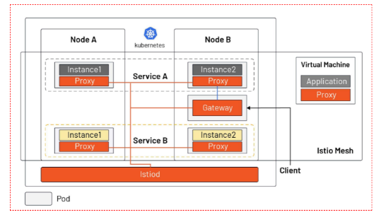

# wiki摘抄

Kubernetes在设计结构上定义了一系列的构建模块，其目的是为了提供一个可以共同提供部署、维护和扩展应用程序的机制。组成Kubernetes的组件设计概念为松耦合和可扩展的，这样可以使之满足多种不同的工作负载。可扩展性在很大程度上由Kubernetes API提供，此API主要被作为扩展的内部组件以及Kubernetes上运行的容器来使用。

### Pod
Kubernetes的基本调度单元称为“pod”。通过该种抽象类别可以把更高级别的抽象内容增加到容器化组件。一个pod一般包含一个或多个容器，这样可以保证它们一直位于主机上，并且可以共享资源。Kubernetes中的每个pod都被分配一个唯一的（在集群内的）IP地址这样就可以允许应用程序使用同一端口，而避免了发生冲突的问题。 Pod可以定义一个卷，例如本地磁盘目录或网络磁盘，并将其暴露在pod中的一个容器之中。。pod可以通过Kubernetes API手动管理，也可以委托给控制器来实现自动管理。

### 标签和选择器
Kubernetes使客户端（用户或内部组件）将称为“标签”的键值对附加到系统中的任何API对象，如pod和节点。相应地，“标签选择器”是针对匹配对象的标签的查询方法。

标签和选择器是Kubernetes中的主要分组机制，用于确定操作适用的组件。

例如，如果应用程序的Pods具有系统的标签 tier (比如"front-end"、"back-end") 和一个 release_track (比如"canary"、"production")，那么对所有"back-end" 和 "canary" 节点的操作可以使用如下所示的标签选择器：

tier=back-end AND release_track=canary

### 控制器

控制器是通过管理一组pod来实现来将实际集群状态转移到所需集群状态的对帐循环机制。一种控制器指的是一组具有*相同特征*的“复制控制器”，控制器通过在集群中运行指定数量的pod副本来处理复制和缩放。在基础节点出现故障的情况下，它还可以用于*处理创建替换pod*。其它控制器也是核心Kubernetes系统的一部分，包括“DaemonSet控制器”为每台机器（或机器的一些子集）上运行的单个pod，和用于运行pod的“作业控制器”。 控制器管理的pod组由作为控制器定义的部分的*标签选择器*来确定。

### 服务
Kubernetes服务本质是**一组协同工作的pod，类同多层架构应用中的一层**。构成服务的pod组通过标签选择器来定义。Kubernetes通过给*服务分配静态IP地址和域名*来提供服务发现机制，并且以*轮循调度*的方式将流量负载均衡到能与选择器匹配的pod的IP地址的网络连接上（即使是故障导致pod从一台机器移动到另一台机器）。 默认情况下，服务任务会暴露在集群中（例如，多个后端pod可能被分组成一个服务，前端pod的请求在它们之间负载平衡）；除此以外，服务任务也可以暴露在集群外部（例如，从客户端访问前端pod）

## 建构

### Kubernetes architecture diagram
Kubernetes遵循主从式架构设计。Kubernetes的组件可以分为管理单个的 node 组件和控制平面部分的组件。

Kubernetes Master是集群的主要控制单元，其用于*管理其工作负载并指导整个系统的通信*。Kubernetes控制平面由各自的进程组成，每个组件都可以在单个主节点上运行，也可以在支持high-availability clusters的多个主节点上运行。是Kubernetes控制平面的各种组件如下：

### etcd
etcd 是由CoreOS开发，用于可靠地存储集群的配置数据的一种持久性，轻量型的，分布式的键-值数据存储组件。该组件*可表示在任何给定时间点处的集群的整体状态*。其他组件在注意到存储的变化之后，会变成相应的状态。

### API服务器
API服务器是一个关键组件 并使用 Kubernetes API 和 JSON over HTTP来*提供了Kubernetes的内部和外部接口*。 API服务器处理和验证 REST请求并更新 API 对象的状态etcd，从而*允许客户端在Worker节点之间配置工作负载和容器*。

### 调度器
T调度程序是可插拔式组件，其基于资源可用性来选择未调度的pod（由调度程序管理的基本实体）应该运行哪个节点。调度程序跟踪每个节点上的资源利用率，以确保工作负载不会超过可用资源。为此，调度程序必须知道资源需求，资源可用性以及各种其他用户提供的约束和策略指令，例如服务质量，亲和力/反关联性要求，数据位置等。实质上，调度程序的作用是*将资源“供应”与工作负载“需求”相匹配以维持系统的稳定和可靠*。

### 控制器管理
控制器管理器是核心Kubernetes控制器，其包括DaemonSet控制器和复制控制器等。该控制器可与API服务器进行通信以在需要时创建，*更新和删除他们管理的资源（pod，服务端点等）*

### Kubernetes 节点
Node也称为Worker或Minion，是部署容器（工作负载）的单机器（或虚拟机）。集群中的每个节点都必须具备容器的运行环境（runtime） ——比如 Docker，以及下面提到的其他组件，以便与这些容器的网络配置进行通信。

### Kubelet
Kubelet负责*每个节点的运行状态（即确保节点上的所有容器都正常运行）*。它按照控制面板的指示来处理启动，停止和维护应用程序容器（按组织到pod中）。

Kubelet会监视pod的状态，如果不处于所需状态，则pod将被重新部署到同一个节点。节点状态每隔几秒就会传递消息至中继主机。主控器检测到节点故障后，复制控制器将观察此状态更改，并在其他健康节点上启动pod]

### 容器
容器从属于pod。在运行应用、库及其依赖的微服务中，*容器是最低层级的*。通过绑定一个外部IP，容器可以被外网访问。

### Kube代理
Kube代理是*网络代理和负载均衡的实现*，支持服务抽象以及其他网络操作。根据传入请求的IP和端口，该组件会将流量转发到指定的合适的容器中。

### cAdvisor
cAdvisor 是监视和收集例如每个节点上的容器的CPU，内存，文件和网络使用情况等的资源使用情况和性能指标的代理组件。

[wiki](https://zh.wikipedia.org/wiki/Kubernetes)

---

与你过去使用的其他系统不同，Kubernetes不直接运行容器;相反，它将一个或多个容器封装到一个称为Pod的高级结构中。相同Pod中的任何容器都将共享相同的名称空间和本地网络。容器可以很容易地与其他容器在相同的容器中进行通信，就像它们在同一台机器上同时保持一定程度的隔离。

Pod被用作Kubernetes的复制单元。如果你的应用程序太受欢迎，单个的Pod实例无法承载负载，那么可以配置Kubernetes以在必要时将你的Pod的新副本部署到集群。即使在没有重载的情况下，在生产系统中任何时候都要有多个副本，以保证负载均衡和故障抵抗。

**Pod可以容纳多个容器，但在可能的情况下应该限制自己**。因为Pod作为一个单位被放大和缩小时，所有在一个Pod里的容器都必须在一起缩放，不管它们是否需要。这将导致资源的浪费和成本增加。为了解决这个问题，Pod应该保持尽可能小的大小，通常只保留一个主进程和紧密耦合的辅助容器(这些辅助容器通常被称为“侧三轮摩托车”)。

- [Kubernetes入门：Pod、节点、容器和集群都是什么？](https://zhuanlan.zhihu.com/p/32618563)

---
# Kubernetes参考
- [Kubernetes](https://blog.csdn.net/estarhao/article/details/114703958)

## 简述 Kubernetes 和 Docker 的关系？

Docker 提供容器的生命周期管理和，Docker 镜像构建运行时容器。它的主要优点是将将软件/应用程序运行所需的设置和依赖项打包到一个容器中，从而实现了可移植性等优点。

Kubernetes 用于关联和编排在多个主机上运行的容器。

## 简述 Kubernetes 中什么是 Minikube、Kubectl、Kubelet？
Minikube 是一种可以在本地轻松运行一个单节点 Kubernetes 群集的工具。

Kubectl 是一个命令行工具，可以使用该工具控制 Kubernetes 集群管理器，如检查群集资源，创建、删除和更新组件，查看应用程序。

Kubelet 是一个代理服务，它在每个节点上运行，并使从服务器与主服务器通信。

## 简述 Kubernetes 如何实现集群管理？
在集群管理方面，Kubernetes 将集群中的机器划分为一个 Master 节点和一群工作节点 Node。其中，在 Master 节点运行着集群管理相关的一组进程 kube-apiserver、kube-controller-manager 和 kube-scheduler，这些进程实现了整个集群的资源管理、Pod 调度、弹性伸缩、安全控制、系统监控和纠错等管理能力，并且都是全自动完成的。

## 简述 Kubernetes 相关基础概念？
- master：k8s 集群的管理节点，负责管理集群，提供集群的资源数据访问入口。拥有 Etcd 存储服务（可选），运行 Api Server 进程，Controller Manager 服务进程及 Scheduler 服务进程。
- node（worker）：Node（worker）是 Kubernetes 集群架构中运行 Pod 的服务节点，是 Kubernetes 集群操作的单元，用来承载被分配 Pod 的运行，是 Pod 运行的宿主机。运行 docker eninge 服务，守护进程 kunelet 及负载均衡器 kube-proxy。
- pod：运行于 Node 节点上，若干相关容器的组合。Pod 内包含的容器运行在同一宿主机上，使用相同的网络命名空间、IP 地址和端口，能够通过 localhost 进行通信。Pod 是 Kurbernetes 进行创建、调度和管理的最小单位，它提供了比容器更高层次的抽象，使得部署和管理更加灵活。一个 Pod 可以包含一个容器或者多个相关容器。
- label：Kubernetes 中的 Label 实质是一系列的 Key/Value 键值对，其中 key 与 value 可自定义。Label 可以附加到各种资源对象上，如 Node、Pod、Service、RC 等。一个资源对象可以定义任意数量的 Label，同一个 Label 也可以被添加到任意数量的资源对象上去。Kubernetes 通过 Label Selector（标签选择器）查询和筛选资源对象。
- Replication Controller：Replication Controller 用来管理 Pod 的副本，保证集群中存在指定数量的 Pod 副本。集群中副本的数量大于指定数量，则会停止指定数量之外的多余容器数量。反之，则会启动少于指定数量个数的容器，保证数量不变。Replication Controller 是实现弹性伸缩、动态扩容和滚动升级的核心。
- Deployment：Deployment 在内部使用了 RS 来实现目的，Deployment 相当于 RC 的一次升级，其最大的特色为可以随时获知当前 Pod 的部署进度。
- HPA（Horizontal Pod Autoscaler）：Pod 的横向自动扩容，也是 Kubernetes 的一种资源，通过追踪分析 RC 控制的所有 Pod 目标的负载变化情况，来确定是否需要针对性的调整 Pod 副本数量。
- Service：Service 定义了 Pod 的逻辑集合和访问该集合的策略，是真实服务的抽象。Service 提供了一个统一的服务访问入口以及服务代理和发现机制，关联多个相同 Label 的 Pod，用户不需要了解后台 Pod 是如何运行。
- Volume：Volume 是 Pod 中能够被多个容器访问的共享目录，Kubernetes 中的 Volume 是定义在 Pod 上，可以被一个或多个 Pod 中的容器挂载到某个目录下。
- Namespace：Namespace 用于实现多租户的资源隔离，可将集群内部的资源对象分配到不同的 Namespace 中，形成逻辑上的不同项目、小组或用户组，便于不同的 Namespace 在共享使用整个集群的资源的同时还能被分别管理。

## 简述 Kubernetes 集群相关组件？
Kubernetes Master 控制组件，调度管理整个系统（集群），包含如下组件:

Kubernetes API Server：作为 Kubernetes 系统的入口，其封装了核心对象的增删改查操作，以 RESTful API 接口方式提供给外部客户和内部组件调用，集群内各个功能模块之间数据交互和通信的中心枢纽。
- Kubernetes Scheduler：为新建立的 Pod 进行节点(node)选择(即分配机器)，负责集群的资源调度。
- Kubernetes Controller：负责执行各种控制器，目前已经提供了很多控制器来保证 Kubernetes 的正常运行。
- Replication Controller：管理维护 Replication Controller，关联 Replication Controller 和 Pod，保证 Replication Controller 定义的副本数量与实际运行 Pod 数量一致。
- Node Controller：管理维护 Node，定期检查 Node 的健康状态，标识出(失效|未失效)的 Node 节点。
- Namespace Controller：管理维护 Namespace，定期清理无效的 Namespace，包括 Namesapce 下的 API 对象，比如 Pod、Service 等。
- Service Controller：管理维护 Service，提供负载以及服务代理。
- EndPoints Controller：管理维护 Endpoints，关联 Service 和 Pod，创建 Endpoints 为 Service 的后端，**当 Pod 发生变化时，实时更新 Endpoints**。
- Service Account Controller：管理维护 Service Account，为每个 Namespace 创建默认的 Service Account，同时为 Service Account 创建 Service Account Secret。
- Persistent Volume Controller：管理维护 Persistent Volume 和 Persistent Volume Claim，为新的 Persistent Volume Claim 分配 Persistent Volume 进行绑定，为释放的 Persistent Volume 执行清理回收。
- Daemon Set Controller：管理维护 Daemon Set，负责创建 Daemon Pod，保证指定的 Node 上正常的运行 Daemon Pod。
- Deployment Controller：管理维护 Deployment，关联 Deployment 和 Replication Controller，保证运行指定数量的 Pod。当 Deployment 更新时，控制实现 Replication Controller 和 Pod 的更新。
- Job Controller：管理维护 Job，为 Jod 创建一次性任务 Pod，保证完成 Job 指定完成的任务数目
- Pod Autoscaler Controller：实现 Pod 的自动伸缩，定时获取监控数据，进行策略匹配，当满足条件时执行 Pod 的伸缩动作。

## 简述 Kubernetes Replica Set 和 Replication Controller 之间有什么区别？
Replica Set 和 Replication Controller 类似，都是确保在任何给定时间运行指定数量的 Pod 副本。不同之处在于 RS 使用基于集合的选择器，而 Replication Controller 使用基于权限的选择器。

## 简述 Kubernetes 创建一个 Pod 的主要流程？
Kubernetes 中创建一个 Pod 涉及多个组件之间联动，主要流程如下：

客户端提交 Pod 的配置信息（可以是 yaml 文件定义的信息）到 kube-apiserver。
- Apiserver 收到指令后，通知给 controller-manager 创建一个资源对象。
- Controller-manager 通过 api-server 将 pod 的配置信息存储到 ETCD 数据中心中。
- Kube-scheduler 检测到 pod 信息会开始调度预选，会先过滤掉不符合 Pod 资源配置要求的节点，然后开始调度调优，主要是挑选出更适合运行 pod 的节点，然后将 pod 的资源配置单发送到 node 节点上的 kubelet 组件上。
- Kubelet 根据 scheduler 发来的资源配置单运行 pod，运行成功后，将 pod 的运行信息返回给 scheduler，scheduler 将返回的 pod 运行状况的信息存储到 etcd 数据中心。

## 简述 Kubernetes 各模块如何与 API Server 通信？
Kubernetes API Server 作为集群的核心，负责集群各功能模块之间的通信。

集群内的各个功能模块通过 API Server 将**信息存入** etcd，当需要获取和操作这些数据时，则通过 API Server 提供的 REST 接口（用 GET、LIST 或 WATCH 方法）来实现，从而实现各模块之间的信息交互。

如 kubelet 进程与 API Server 的交互：每个 Node 上的 kubelet 每隔一个时间周期，就会调用一次 API Server 的 REST 接口**报告自身状态**，API Server 在接收到这些信息后，会将节点状态信息更新到 etcd 中。

如 kube-controller-manager 进程与 API Server 的交互：kube-controller-manager 中的 Node Controller 模块通过 API Server 提供的 Watch 接口**实时监控 Node 的信息**，并做相应处理。

如 kube-scheduler 进程与 API Server 的交互：Scheduler 通过 API Server 的 Watch 接口**监听到新建 Pod 副本的信息后**，会检索所有符合该 Pod 要求的 Node 列表，开始执行 Pod 调度逻辑，在调度成功后将 Pod 绑定到目标节点上。

## 简述 Kubernetes Scheduler 作用及实现原理？
Kubernetes Scheduler 是负责 Pod 调度的重要功能模块，Kubernetes Scheduler 在整个系统中承担了“**承上启下**”的重要功能，“承上”是指**它负责接收 Controller Manager 创建的新 Pod，为其调度至目标 Node**；“启下”是指**调度完成后，目标 Node 上的 kubelet 服务进程接管后继工作，负责 Pod 接下来生命周期**。

Kubernetes Scheduler 的作用是将待调度的 Pod（API 新创建的 Pod、Controller Manager 为补足副本而创建的 Pod 等）按照特定的调度算法和调度策略绑定（Binding）到集群中某个合适的 Node 上，并**将绑定信息写入 etcd 中**。

在整个调度过程中涉及三个对象：

分别是待调度 Pod 列表、可用 Node 列表，以及调度算法和策略。

Kubernetes Scheduler 通过调度算法调度为待调度 Pod 列表中的每个 Pod 从 Node 列表中选择一个最适合的 Node 来实现 Pod 的调度。

随后，目标节点上的 kubelet 通过 API Server 监听到 Kubernetes Scheduler 产生的 Pod 绑定事件，然后获取对应的 Pod 清单，下载 Image 镜像并启动容器。

## 简述 Kubernetes kubelet 的作用？
在 Kubernetes 集群中，在每个 Node（又称 Worker）上**都会启动一个 kubelet 服务进程**。

该进程用于**处理 Master 下发到本节点的任务，管理 Pod 及 Pod 中的容器**。

每个 kubelet 进程都会在 API Server 上注册节点自身的信息，**定期向 Master 汇报节点资源的使用情况**，并通过 cAdvisor **监控容器和节点资源**。

## 简述 Kubernetes kubelet 监控 Worker 节点资源是使用什么组件来实现的？
kubelet 使用 cAdvisor 对 worker 节点资源进行监控。

在 Kubernetes 系统中，cAdvisor 已被默认集成到 kubelet 组件内，当 kubelet 服务启动时，它会自动启动 cAdvisor 服务，然后 cAdvisor 会实时采集所在节点的性能指标及在节点上运行的容器的性能指标。

> - Kubernetes API Server 作为集群的核心，负责集群各功能模块之间的通信。
> - kube-controller-manager： 各种资源的控制。 其中的 Node Controller 模块通过 API Server 提供的 Watch 接口**实时监控 Node 的信息**，并做相应处理。
> - Kubernetes Scheduler： 接收 Controller Manager 创建的新 Pod，为其调度至目标 Node。调度完成后，目标 Node 上的 kubelet 服务进程接管后继工作，负责 Pod 接下来生命周期
> - kubelet： 根据 scheduler 发来的资源配置单运行 pod，定期汇报容器和节点资源返回给 scheduler，scheduler 将返回的 pod 运行状况的信息存储到 etcd 数据中心。

## 简述 kube-proxy 作用？
kube-proxy 运行在所有节点上，它监听 apiserver 中 service 和 endpoint 的变化情况，创建路由规则以提供服务 IP 和负载均衡功能。简单理解此进程是 Service 的透明代理兼负载均衡器，其核心功能是将到某个 Service 的访问请求转发到后端的多个 Pod 实例上。

## 简述 kube-proxy iptables 原理？
Kubernetes 从 1.2 版本开始，将 iptables 作为 kube-proxy 的默认模式。iptables 模式下的 kube-proxy 不再起到 Proxy 的作用，其核心功能：通过 API Server 的 Watch 接口实时跟踪 Service 与 Endpoint 的变更信息，并更新对应的 iptables 规则，Client 的请求流量则通过 iptables 的 NAT 机制“直接路由”到目标 Pod。

## 简述 Kubernetes Service 类型？
通过创建 Service，可以为一组具有相同功能的容器应用提供一个统一的入口地址，并且将请求负载分发到后端的各个容器应用上。其主要类型有：

- ClusterIP：虚拟的服务 IP 地址，该地址用于 Kubernetes 集群内部的 Pod 访问，在 Node 上 kube-proxy 通过设置的 iptables 规则进行转发；
- NodePort：使用宿主机的端口，使能够访问各 Node 的外部客户端通过 Node 的 IP 地址和端口号就能访问服务；
- LoadBalancer：使用外接负载均衡器完成到服务的负载分发，需要在 spec.status.loadBalancer 字段指定外部负载均衡器的 IP 地址，通常用于公有云。

## 简述 Kubernetes 外部如何访问集群内的服务？
对于 Kubernetes，集群外的客户端默认情况，无法通过 Pod 的 IP 地址或者 Service 的虚拟 IP 地址:虚拟端口号进行访问。

通常可以通过以下方式进行访问 Kubernetes 集群内的服务：

- 映射 Pod 到物理机：将 Pod 端口号映射到宿主机，即在 Pod 中采用 hostPort 方式，以使客户端应用能够通过物理机访问容器应用。
- 映射 Service 到物理机：将 Service 端口号映射到宿主机，即在 Service 中采用 nodePort 方式，以使客户端应用能够通过物理机访问容器应用。
- 映射 Sercie 到 LoadBalancer：通过设置 LoadBalancer 映射到云服务商提供的 LoadBalancer 地址。这种用法仅用于在公有云服务提供商的云平台上设置 Service 的场景。

## 简述 Kubernetes ingress？
Kubernetes 的 Ingress 资源对象，**用于将不同 URL 的访问请求转发到后端不同的 Service，以实现 HTTP 层的业务路由机制**。

Kubernetes 使用了 Ingress 策略和 Ingress Controller，两者结合并实现了一个完整的 Ingress 负载均衡器。

使用 Ingress 进行负载分发时，Ingress Controller 基于 Ingress 规则将客户端请求直接转发到 Service 对应的后端 Endpoint（Pod）上，**从而跳过 kube-proxy 的转发功能，kube-proxy 不再起作用**，全过程为：ingress controller + ingress 规则 ----> services。

同时当 Ingress Controller 提供的是对外服务，则实际上实现的是边缘路由器的功能。

## 简述 Kubernetes 网络模型？
Kubernetes 网络模型中**每个 Pod 都拥有一个独立的 IP 地址**，并假定所有 Pod 都在一个可以直接连通的、扁平的网络空间中。

所以**不管它们是否运行在同一个 Node（宿主机）中，都要求它们可以直接通过对方的 IP 进行访问**。

设计这个原则的原因是，**用户不需要额外考虑如何建立 Pod 之间的连接，也不需要考虑如何将容器端口映射到主机端口等问题**。

同时为每个 Pod 都设置一个 IP 地址的模型使得**同一个 Pod 内的不同容器会共享同一个网络命名空间**，也就是同一个 Linux 网络协议栈。这就意味着同一个 Pod 内的容器可以通过 localhost 来连接对方的端口。

在 Kubernetes 的集群里，IP 是以 Pod 为单位进行分配的。

一个 Pod 内部的所有容器共享一个网络堆栈（相当于一个网络命名空间，它们的 IP 地址、网络设备、配置等都是共享的）。

---
# 浅谈 kubernetes service 那些事
> - [浅谈 kubernetes service 那些事](https://zhuanlan.zhihu.com/p/39909011)

## **什么是service**

是发现后端pod服务；

是为一组具有相同功能的容器应用提供一个统一的入口地址；

是将请求进行负载分发到后端的各个容器应用上的控制器。

## **对service的访问来源**

访问service的请求来源有两种：k8s集群内部的程序（Pod）和 k8s集群外部的程序。

## endpoint

endpoint是k8s集群中的一个资源对象，存储在etcd中，用来记录一个service对应的所有pod的访问地址。

service配置selector，endpoint controller才会自动创建对应的endpoint对象；否则，不会生成endpoint对象.

**endpoint controller**

endpoint controller是k8s集群控制器的其中一个组件，其功能如下：

- 负责生成和维护所有endpoint对象的控制器

- 负责监听service和对应pod的变化

- 监听到service被删除，则删除和该service同名的endpoint对象

- 监听到新的service被创建，则根据新建service信息获取相关pod列表，然后创建对应endpoint对象

- 监听到service被更新，则根据更新后的service信息获取相关pod列表，然后更新对应endpoint对象

- 监听到pod事件，则更新对应的service的endpoint对象，将podIp记录到endpoint中

## **kube-proxy**

kube-proxy负责service的实现，即实现了k8s内部从pod到service和外部从node port到service的访问。

kube-proxy采用iptables的方式配置负载均衡，基于iptables的kube-proxy的主要职责包括两大块：一块是侦听service更新事件，并更新service相关的iptables规则，一块是侦听endpoint更新事件，更新endpoint相关的iptables规则（如 KUBE-SVC-链中的规则），然后将包请求转入endpoint对应的Pod。如果某个service尚没有Pod创建，那么针对此service的请求将会被drop掉。

可以看出当集群中服务数量达到5千个时，路由延迟成倍增加。添加 IPTables 规则的延迟，有多种产生的原因，如：

添加规则不是增量的，而是先把当前所有规则都拷贝出来，再做修改然后再把修改后的规则保存回去，这样一个过程的结果就是 IPTables 在更新一条规则时会把 IPTables 锁住，这样的后果在服务数量达到一定量级的时候，性能基本不可接受：在有5千个服务（4万条规则）时，添加一条规则耗时11分钟；在右2万个服务（16万条规则）时，添加一条规则需要5个小时。

这样的延迟时间，对生产环境是不可以的，那该性能问题有哪些解决方案呢？从根本上解决的话，可以使用 “IP Virtual Server”(IPVS )来替换当前 kube-proxy 中的 IPTables 实现，这样能带来显著的性能提升以及更智能的负载均衡功能如支持权重、支持重试等等。

那什么是 “IP Virtual Server”(IPVS ) 呢？

## **ipvs 简介**

k8s 1.8 版本中，社区 SIG Network 增强了 NetworkPolicy API，以支持 Pod 出口流量策略，以及允许策略规则匹配源或目标 CIDR 的匹配条件。这两个增强特性都被设计为 beta 版本。 SIG Network 还专注于改进 kube-proxy，除了当前的 iptables 和 userspace 模式，kube-proxy 还引入了一个 alpha 版本的 IPVS 模式。

## **ipvs 负载均衡器常用调度算法**

### 轮询（Round Robin）

LB认为集群内每台RS都是相同的，会轮流进行调度分发。从数据统计上看，RR模式是调度最均衡的。

### 加权轮询（Weighted Round Robin）

LB会根据RS上配置的权重，将消息按权重比分发到不同的RS上。可以给性能更好的RS节点配置更高的权重，提升集群整体的性能。

### 最少连接调度

LB会根据和集群内每台RS的连接数统计情况，将消息调度到连接数最少的RS节点上。在长连接业务场景下，LC算法对于系统整体负载均衡的情况较好；但是在短连接业务场景下，由于连接会迅速释放，可能会导致消息每次都调度到同一个RS节点，造成严重的负载不均衡。

### 加权最少连接调度

最小连接数算法的加权版。

### 原地址哈希，锁定请求的用户

根据请求的源IP，作为散列键（Hash Key）从静态分配的散列表中找出对应的服务器。若该服务器是可用的且未超载，将请求发送到该服务器。

---
# Ingress
> - [k8s中的Service与Ingress](https://blog.haohtml.com/archives/19945)

Service可以看作是一组提供相同服务的Pod对外的访问接口。借助Service，应用可以方便地实现服务发现和负载均衡。

当需要从集群外部访问k8s里的服务的时候，方式有四种：ClusterIP（默认）、NodePort、LoadBalancer、ExternalName 。

上面我们提到有一个叫作 `LoadBalancer` 类型的 `Service`，它会为你在 Cloud Provider（比如：Google Cloud 或者 OpenStack）里创建一个与该 Service 对应的负载均衡服务。但是，相信你也应该能感受到，由于每个 Service 都要有一个负载均衡服务，所以这个做法实际上既浪费成本又高。作为用户，我其实更希望看到 Kubernetes 为我内置一个全局的负载均衡器。然后，通过我访问的 URL，把请求转发给不同的后端 Service。这种全局的、为了代理不同后端 Service 而设置的负载均衡服务，就是 Kubernetes 里的 `Ingress` 服务。

Ingress 的功能其实很容易理解：所谓 Ingress 就是 Service 的“Service”，这就是它们两者的关系。

## Ingress 规则

每个 HTTP 规则都包含以下信息：

*   `host`。可选项。如果未指定`host`，则该规则适用于通过指定 IP 地址的所有入站 HTTP 通信。 如果提供了`host`，则`rules`适用于该`host`。
*   `paths` 路径列表 paths（例如，`/testpath`）,每个路径都有一个由`serviceName`和`servicePort`定义的关联后端。 在负载均衡器将流量定向到引用的服务之前，主机和路径都必须匹配传入请求的内容。
*   `backend`（后端）是[Service 文档](https://kubernetes.io/zh/docs/concepts/services-networking/service/)中所述的服务和端口名称的组合。 与规则的`host`和`path`匹配的对 Ingress 的 HTTP（和 HTTPS ）请求将发送到指定对应的`backend`。

## 小结
通过上面的介绍，不难看到所谓 Ingress 对象，其实就是 Kubernetes 项目对“`反向代理`”的一种抽象。

一个 `Ingress` 对象的主要内容，实际上就是一个“反向代理”服务（比如：Nginx）的配置文件的描述。而这个代理服务对应的转发规则，就是 `IngressRule`。

这就是为什么在每条 IngressRule 里，需要有一个 host 字段来作为这条 IngressRule 的入口，然后还需要有一系列 path 字段来声明具体的转发策略。这其实跟 Nginx、HAproxy 等项目的配置文件的写法是一致的。

在实际使用中，我们一般选择一种 `Ingress Controller`, 将其部署在k8s集群中，这样它就会根据我们定义的 Ingress 对象来提供对应的代理功能。

业界常用的各种反向代理项目，比如 Nginx、HAProxy、Envoy、Traefik 等，都已经为 Kubernetes 专门维护了对应的 `Ingress Controller`。

---
# 什么是 Istio？为什么 Kubernetes 需要 Istio？
> - [什么是 Istio？为什么 Kubernetes 需要 Istio？](https://jimmysong.io/blog/what-is-istio-and-why-does-kubernetes-need-it/)

## Kubernetes 中如何做服务管理？

下图展示的是 Kubernetes 中的服务模型。

从上图中我们可以看出：

*   同一个服务的的不同示例可能被调度到不同的节点上；
*   Kubernetes 通过 Service 对象将一个服务的多个实例组合在了一起，统一对外服务；
*   Kubernetes 在每个 node 中安装了 `kube-proxy` 组件来转发流量，它拥有的简单的负载均衡功能；
*   Kubernetes 集群外部流量可以通过 Ingress 进入集群中（Kubernetes 还有其他几种暴露服务的方式，如 NodePort、LoadBalancer 等）；

Kubernetes 是用于资源集约管理的工具。但在为应用分配好资源后，如何保证应用的健壮性、冗余性，如何实现更细粒度的流量划分（不是根据服务中实例个数来实现），如何保障服务的安全性，如何进行多集群管理等，这些问题 Kubernetes 都不能很好地解决。

服务具有多个版本，需要迭代和上线，在新版发布的时候需要切分流量，实现金丝雀发布；同时我们应该假定服务是不可靠的，可能因为各种原因导致请求失败，需要面向失败来编程，如何监控应用程序的指标，了解每个请求的耗时和状态？Istio 的发起这们就想到了在每个 pod 中注入一个代理，将代理的配置通过一个控制平面集中分发，然后将从 pod 中应用容器发起的每个请求都劫持到 sidecar 代理中，然后转发，这样不就可以完美的解决以上问题了吗？Kubernetes 优秀的架构和可扩展性，例如 CRD，pod 内的部署模式，可以完美的解决大量 sidecar 的注入和管理问题，使得 Istio 的实现成为可能。

## Istio 的基本原理

下图是 Istio 中的服务模型，它既可以支持 Kubernetes 中的工作负载，又可以支持虚拟机。

从图中我们可以看出：

*   Istiod 作为控制平面，将配置下发给所有的 sidecar proxy 和 gateway（为了美观，图中没有画 Istiod 及 sidecar 之间的连接）
*   Istio 不再使用 `kube-proxy` 组件做流量转发，而是依托在每个 pod 中注入的 sidecar proxy，所有的 proxy 组成了 Istio 的数据平面；
*   应用程序管理员可以和管理 Kubernetes 中的工作负载一样，通过声明式 API 操作 Istio mesh 中流量的行为；
*   Ingress 被 Gateway 资源所替代，Gateway 是一种特殊的 proxy，实际上也是复用的 Sidecar proxy；
*   可以在虚拟机中安装 sidecar proxy，将虚拟机引入的 Istio mesh 中；

实际上在 Istio 之前，人们可以使用 SpringCloud、Netflix OSS 等，通过在应用程序中集成 SDK，编程的方式来管理应用程序中的流量。但是这通常会有编程语言限制，而且在 SDK 升级的时候，需要修改代码并重新上线应用，会增大人力负担。Istio 使得流量管理变得对应用程序透明，使这部分功能从应用程序中转移到了平台层，成为了云原生基础设施。

正是因为 Istio 补足了 Kubernetes 对于云原生应用的流量管理、可观察性和安全方面的短板，在 2017 年由 Google、IBM 和 Lyft 共同发起的这个服务网格开源项目，并在三年来取得了长足的发展。关于 Istio 核心功能的介绍可以参考 [Istio 文档](https://istio.io/latest/docs/concepts/what-is-istio/)。

## 总结

*   Service Mesh 相当于云原生时代的 TCP/IP，解决应用程序网络通信、安全及可见性问题；
*   Istio 是目前最流行的 service mesh 实现，依托于 Kubernetes，但也可以扩展到虚拟机负载；
*   Istio 的核心由控制平面和数据平面组成，Envoy 是默认的数据平面代理；
*   Istio 作为云原生基础设施的网络层，对应用透明。

---
# 参考链接
- [service](https://kubernetes.io/zh/docs/concepts/services-networking/service/)
- [Ingress](https://kubernetes.io/zh/docs/concepts/services-networking/ingress/)
