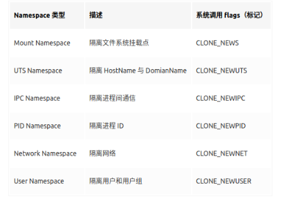

# Docker 原理知识
- [Docker 原理知识](https://juejin.cn/post/6844904143660777485)

## 容器 vs 虚拟机

虚拟机（VM）是计算机系统的仿真器，通过软件模拟具有完整硬件系统功能的、运行在一个完全隔离环境中的完整计算机系统，能提供物理计算机的功能。

虚拟机通过在当前的真实操作系统上通过 Hypervisor 技术进行虚拟机运行环境与体系的建立并通过该技术进行资源控制，一个性能较好的物理机通常可以承载多个虚拟机，每个虚拟机都会有自己操作系统

从图中可以看出，虚拟机提供了物理机硬件级别的操作系统隔离，这让不同虚拟机之间的隔离很彻底，但也需要消耗更多资源，而有时不需要这么彻底的隔离，而更希望不消耗那么多资源，此时就可以使用容器技术。

容器可以提供操作系统级别的进程隔离，以 Docker 为例，当我们运行 Docker 容器时，此时容器本身只是操作系统中的一个进程，只是利用操作系统提供的各种功能实现了进程间网络、空间、权限等隔离，让多个 Docker 容器进程相互不知道彼此的存在

虚拟机技术与容器技术的最大区别在于：**多个虚拟机使用多个操作系统内核，而多个容器共享宿主机操作系统内核**。

## Docker 资源隔离: Linux Namespace

Linux Namespace（Linux 命名空间）是 Linux 内核（Kernel）提供的功能，它可以隔离一系列的系统资源，如 PID（进程 ID，Process ID）、User ID、Network、文件系统等。

Linux 提供了 3 个系统 API 方便我们使用 Namespace：

- clone () 创建新进程，根据系统调用 flags 来决定哪种类型 Namespace 将会被创建，而该进程的子进程也会包含这些 Namespace。
- setns () 将进程加入到已存在的 Namespace 中。
- unshare () 将进程移出某个 Namespace

**Docker 利用 Linux Namespace 功能实现多个 Docker 容器相互隔离**，具有独立环境的功能，Go 语言对 Namespce API 进行了相应的封装，从 Docker 源码中可以看到相关的实现。

## Docker 资源限制：Linux Cgroups

Linux Cgroups（Linux Contorl Groups，简称 Cgroups）可以对一组进程及这些进程的子进程进行资源限制、控制和统计的能力，其中包括 CPU、内存、存储、网络、设备访问权限等，通过 Cgroups 可以很轻松的限制某个进程的资源占用并且统计该进程的实时使用情况。

Cgroups 由 3 个组件构成，分别是 cgroup（控制组）、subsystem（子系统）以及 hierarchy（层级树），3 者相互协同作用。

- cgroup 是对进程分组管理的一种机制，一个 cgroup 通常包含一组（多个）进程，**Cgroups 中的资源控制都以 cgroup 为单位实现**。
- subsystem 是一组（多个）**资源控制的模块**，每个 subsystem 会管理到某个 cgroup 上，对该 cgroup 中的进程做出相应的限制和控制。
- hierarchy 会将一组（多个）cgroup 构建成一个**树状结构**，Cgropus 可以利用该结构实现继承等功能

3 者具体如何相互协同作用？

Cgroups 会将系统进程分组（cgroup）然后通过 hierachy 构建成独立的树，树的节点就是 cgroup（进程组），每颗树都可以与一个或多个 subsystem 关联，subsystem 会对树中对应的组进行操作。

有个几个规则需要注意。

1. 一个 subsystem **只能附加**到一个 hierarchy，而一个 hierarchy 可以附加多个 subsystem
2. 一个进程可以作为多个 cgroup 的成员，但这些 cgroup 只能在不同的 hierarchy 中
3. 一个进程 fork 出子进程，此时子进程与父进程默认是在同一个 cgroup 中，可以根据需要移动到其他 cgroup

本质上来说，cgroups 是内核附加在程序上的一系列钩子（hooks），通过程序运行时对资源的调度触发相应的钩子以达到资源追踪和限制的目的。实现 cgroups 的主要目的是为不同用户层面的资源管理，提供一个统一化的接口。从单个进程的资源控制到操作系统层面的虚拟化。

## Docker 分层结构：Union File System

我们都知道 Docker 镜像是一种分层结构，每一层构建在其他层之上，从而实现增量增加内容的功能，这是如何实现的？

要理解这个问题，首先需要理解 Union File System（简称，UnionFS），它是为 Linux 系统设计的**将其他文件系统联合到一个联合挂载点的文件系统服务**。

UnionFS 使用 branch（分支）将**不同文件系统的文件和目录透明地叠加覆盖，形成一个单一一致的文件系统**，此外 UnionFS **使用写时复制**（Copy on Write，简称，CoW）技术来**提高合并后文件系统的资源利用**。

Docker 使用的第一种存储驱动为 AUFS（Advanced Multi-layered unification filesytem），AUFS 完全重写了早期的 UnionFS，目的是**提高其性能与可靠性，此外还引入了如 branch 负载均衡等新功能**。

与 UnionFS 类似，AUFS 可以在基础的文件系统上增量的增加新的文件系统，通**过叠加覆盖的形式最终形成一个文件系统**。通常 AUFS **最上层是可读可写层，而其他层只是只读层，每一层都只是一个普通的文件系统**。

Docker **镜像分层、增量增加等功能正是通过利用 AUFS 的分层文件系统结构、增量增加等功能实现**，这也导致了运行 Docker 容器如果没有指定 volume（数据卷）或 bind mount，则 Docker 容器结束后，运行时产生的数据便丢失了。

Docker 存储驱动除了 AUFS 外，还有 OverlayFS、Devicemapper、Btrfs、ZFS 等，本文不多讨论。

## 总结
至此，我们知道了 Docker 核心功能的基本原理，Docker 利用 Linux Namespace 进行网络、用户、进程等不同资源的隔离，使用 Linux Cgroups 技术对资源的使用进行限制与监控，通过 AUFS 等存储驱动实现分层结构与增量更新等功能。

现实世界中的 Docker 还使用了很多其他技术，但最核心且最基本的就是 Linux Namespace、Linux Cgrpus 与 AUFS。

---
# Docker 核心技术与实现原理

- [Docker 核心技术与实现原理](https://draveness.me/docker/)

## Namespaces
Linux 的命名空间机制提供了以下七种不同的命名空间，包括 CLONE_NEWCGROUP、CLONE_NEWIPC、CLONE_NEWNET、CLONE_NEWNS、CLONE_NEWPID、CLONE_NEWUSER 和 CLONE_NEWUTS，通过这七个选项我们能在创建新的进程时设置新进程应该在哪些资源上与宿主机器进行隔离。

### 进程
这就是在使用 clone(2) 创建新进程时传入 CLONE_NEWPID 实现的，也就是使用 Linux 的命名空间实现进程的隔离，Docker 容器内部的任意进程都对宿主机器的进程一无所知。

在 setNamespaces 方法中不仅会设置进程相关的命名空间，还会设置与用户、网络、IPC 以及 UTS 相关的命名空间

### 网络

如果 Docker 的容器通过 Linux 的命名空间完成了与宿主机进程的网络隔离，但是却又没有办法通过宿主机的网络与整个互联网相连，就会产生很多限制，所以 Docker 虽然可以通过命名空间创建一个隔离的网络环境，但是 Docker 中的服务仍然需要与外界相连才能发挥作用。

每一个使用 docker run 启动的容器其实都具有单独的网络命名空间，Docker 为我们提供了四种不同的网络模式，Host、Container、None 和 Bridge 模式。

在这一部分，我们将介绍 Docker 默认的网络设置模式：**网桥模式**。在这种模式下，**除了分配隔离的网络命名空间之外**，Docker 还会**为所有的容器设置 IP 地址**。当 Docker 服务器在主机上**启动之后会创建新的虚拟网桥 docker0**，**随后在该主机上启动的全部服务在默认情况下都与该网桥相连**。

在默认情况下，每一个容器在创建时都会创建一对虚拟网卡，两个虚拟网卡组成了数据的通道，其中一个会放在创建的容器中，会加入到名为 docker0 网桥中。

docker0 会**为每一个容器分配一个新的 IP 地址并将 docker0 的 IP 地址设置为默认的网关**。网桥 docker0 通过 iptables 中的配置与宿主机器上的网卡相连，**所有符合条件的请求都会通过 iptables 转发到 docker0 并由网桥分发给对应的机器**。

**当有 Docker 的容器需要将服务暴露给宿主机器，就会为容器分配一个 IP 地址，同时向 iptables 中追加一条新的规则。**

> Docker 通过 Linux 的**命名空间实现了网络的隔离**，**又通过 iptables 进行数据包转发**，让 Docker 容器能够优雅地为宿主机器或者其他容器提供服务。

模式 | 配置 | 说明
--- | --- | ---
host模式 |	–net=host   |	容器和宿主机共享Network namespace。
container模式 |  –net=container:NAME_or_ID |	容器和另外一个容器共享Network namespace。 kubernetes中的pod就是多个容器共享一个Network namespace。
none模式 | 	–net=none |	容器有独立的Network namespace，但并没有对其进行任何网络设置，如分配veth pair 和网桥连接，配置IP等。
bridge模式 |	–net=bridge |	（默认为该模式）

## CGroups

我们通过 Linux 的命名空间为新创建的进程隔离了文件系统、网络并与宿主机器之间的进程相互隔离，但是命名空间并不能够为我们提供物理资源上的隔离，比如 CPU 或者内存，如果在同一台机器上运行了多个对彼此以及宿主机器一无所知的『容器』，这些容器却共同占用了宿主机器的物理资源。

如果其中的某一个容器正在执行 CPU 密集型的任务，那么就会影响其他容器中任务的性能与执行效率，导致多个容器相互影响并且抢占资源。如何对多个容器的资源使用进行限制就成了解决进程虚拟资源隔离之后的主要问题，而 Control Groups（简称 CGroups）就是能够隔离宿主机器上的物理资源，例如 CPU、内存、磁盘 I/O 和网络带宽。

每一个 CGroup 都是一组被相同的标准和参数限制的进程，不同的 CGroup 之间是有层级关系的，也就是说它们之间可以从父类继承一些用于限制资源使用的标准和参数。

在 CGroup 中，所有的任务就是一个系统的一个进程，而 CGroup 就是一组按照某种标准划分的进程，在 CGroup 这种机制中，所有的资源控制都是以 CGroup 作为单位实现的，每一个进程都可以随时加入一个 CGroup 也可以随时退出一个 CGroup。

大多数 Linux 的发行版都有着非常相似的子系统，而之所以将上面的 cpuset、cpu 等东西称作子系统，是因为它们能够为对应的控制组分配资源并限制资源的使用。

如果我们想要创建一个新的 cgroup 只需要在想要分配或者限制资源的子系统下面创建一个新的文件夹，然后这个文件夹下就会自动出现很多的内容，如果你在 Linux 上安装了 Docker，你就会发现所有子系统的目录下都有一个名为 docker 的文件夹

每一个 CGroup 下面都有一个 tasks 文件，其中存储着属于当前控制组的所有进程的 pid，作为负责 cpu 的子系统，cpu.cfs_quota_us 文件中的内容能够对 CPU 的使用作出限制，如果当前文件的内容为 50000，那么当前控制组中的全部进程的 CPU 占用率不能超过 50%。

如果系统管理员想要控制 Docker 某个容器的资源使用率就可以在 docker 这个父控制组下面找到对应的子控制组并且改变它们对应文件的内容，当然我们也可以直接在程序运行时就使用参数，让 Docker 进程去改变相应文件中的内容。

当我们使用 Docker 关闭掉正在运行的容器时，Docker 的子控制组对应的文件夹也会被 Docker 进程移除，Docker 在使用 CGroup 时其实也只是做了一些创建文件夹改变文件内容的文件操作，不过 CGroup 的使用也确实解决了我们限制子容器资源占用的问题，系统管理员能够为多个容器合理的分配资源并且不会出现多个容器互相抢占资源的问题。

## UnionFS

Docker 镜像其实本质就是一个压缩包，我们可以使用下面的命令将一个 Docker 镜像中的文件导出

Docker 使用了一系列不同的存储驱动管理镜像内的文件系统并运行容器，这些存储驱动与 Docker 卷（volume）有些不同，存储引擎管理着能够在多个容器之间共享的存储。

当镜像被 docker run 命令创建时就会**在镜像的最上层添加一个可写的层，也就是容器层，所有对于运行时容器的修改其实都是对这个容器读写层的修改**。

容器和镜像的区别就在于，**所有的镜像都是只读的，而每一个容器其实等于镜像加上一个可读写的层，也就是同一个镜像可以对应多个容器**。

### AUFS
UnionFS 其实是一种为 Linux 操作系统设计的用于把多个文件系统『联合』到同一个挂载点的文件系统服务。而 AUFS 即 Advanced UnionFS 其实就是 UnionFS 的升级版，它能够提供更优秀的性能和效率。

AUFS 作为联合文件系统，它能够将不同文件夹中的层联合（Union）到了同一个文件夹中，这些文件夹在 AUFS 中称作分支，整个『联合』的过程被称为联合挂载（Union Mount）

每一个镜像层或者容器层都是 /var/lib/docker/ 目录下的一个子文件夹；在 Docker 中，所有镜像层和容器层的内容都存储在 /var/lib/docker/aufs/diff/ 目录中

而 /var/lib/docker/aufs/layers/ 中存储着镜像层的元数据，每一个文件都保存着镜像层的元数据，最后的 /var/lib/docker/aufs/mnt/ 包含镜像或者容器层的挂载点，最终会被 Docker 通过联合的方式进行组装。

上面的这张图片非常好的展示了组装的过程，每一个镜像层都是建立在另一个镜像层之上的，同时所有的镜像层都是只读的，只有每个容器最顶层的容器层才可以被用户直接读写，所有的容器都建立在一些底层服务（Kernel）上，包括命名空间、控制组、rootfs 等等，**这种容器的组装方式提供了非常大的灵活性，只读的镜像层通过共享也能够减少磁盘的占用**。

> 这种容器的组装方式提供了非常大的灵活性，只读的镜像层通过共享也能够减少磁盘的占用

---
# CPU限制

- [Configure the default CFS scheduler](https://docs.docker.com/config/containers/resource_constraints/#configure-the-default-cfs-scheduler)

--cpuset-shares：指定容器中进程的shares值

    shares值即CFS中每个进程的(准确的说是调度实体)权重(weight/load)，普通进程(区别于实时进程，实时进程使用实时调度类、普通进程使用CFS调度类，Linux的调度我将在后续文章中分析)的shares值是根据其静态优先级优先级计算而来。一般普通进程的静态优先级为120，其对应的shares值为1024(至于为什么是1024又是一个复杂的问题，我将在后续文章中分析)。docker的--cpuset-shares参数就直接指定了容器中进程的shares值，默认也是1024。

    shares的大小决定了在一个CFS调度周期中，进程占用的比例，比如进程A的shares是1024，B的shares是512，假设调度周期为3秒，那么A将只用2秒，B将使用1秒，再次注意，这A使用这1秒的过程中除非其主动释放CPU，否则将一直占据，因为这是在一个调度周期，当然调度周期不会这么大

    CFS提出了shares的概念,CFS保证了每个进程根据shares来瓜分CPU.CFS更为核心是决定在内核发出调度命令时,该调度那个进程去执行

--cpus-period:调度周期,这里的调度周期和CFS调度周期是两个概念,为了区分,我们称之为重分配周期,默认是100ms

--cpus-quota:占用周期,其表示在在一个重分配周期中,容器最多可以占用的CPU时间,注意,这个是可以大于重分配周期,因为系统可能有多个CPU,也就说--cpus-quota的最大值是core数×重分配周期,默认值是-1,即不做限制

--cpus:是1.13版本的新特性,他是为了简化设置而出现的,如--cpus=1.5,也就是以为着--cpus-period值为100ms,--cpus-quota值为150ms

那么重分配周期和占用周期怎么来限制CPU使用呢,你需要知道他们是通过Cgroup的cpu子系统来控制的,cpu子系统则是通过CFS来实现的，当然，绝对不是一开始设计的CFS，因为最初的CFS仅仅是使用shares来限制.是Google在实现cgroup时,对CFS进行了扩展,提出了"CPU bandwidth control for CFS",论文在这里.简单说就是添加了重分配周期和占用周,当进程在一个重分配周期中获得CPU时间达到占用周期时,将不再被调度,直到下一个重分配周期.

