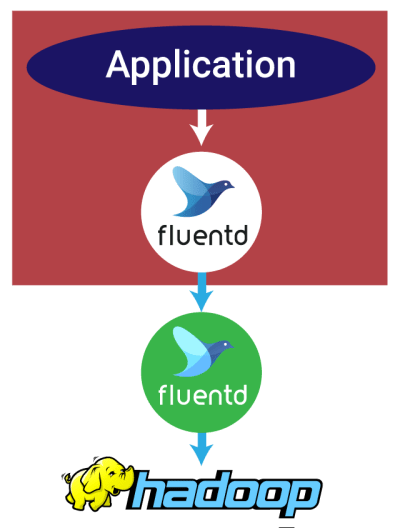

## 背景

理论上，由单体架构产生的数据很容易追踪。按定义说，系统是中心化的，它生成的日志都可以使用相同的模式格式化。微服务，就我们所知道，不是这样的。不同服务的日志有自己的模式，或者**根本就没有模式可言**！因此，简单地从不同的服务收集日志，再将它们转成可读的格式，是一个难以解决的数据基础架构问题。

> 在容器化的世界里，我们必须从不同的角度考虑日志记录。

### 问题:
- 传统上，日志用它们的来源服务器的 IP 地址标记。这不适用于容器，容器**阻隔了固定的服务器和角色之间的映射**。
- 另一个问题是日志文件的存储。容器是不可变的，用后即可丢弃的，所以存在**容器里的日志会随着容器实例结束而消失**。

为了使我们的数据基础架构具有可扩展性和可恢复性，有一些问题需要提前考虑。

- 网络流量。数据在所有的这些节点之间来回转发，我们需要一个“流量警察”，以**确保网络不会过载或丢失数据**。
- CPU 负载。在来源端解析数据和在聚合器上对其**格式化**是非常消耗计算资源的。同样，我们也需要一个系统来管理这些资源，防止我们的 **CPU 超载**。
- 冗余。弹性需要冗余。我们需要使**聚合器冗余**，以防止单点故障时造成数据丢失。
- 控制延迟。**没有办法避免系统中的延迟**。我们不能完全摆脱延迟，但我们需要控制它，这样我们才知道什么时候，系统中发生了什么。

### 聚合模式
最佳的配置是同时在来源端和目标端设置聚合器，同样，我们要权衡利弊，这样会导致有更多的节点，比之前的配置稍复杂。但是好处是显而易见的：
- 目标端的改变不会影响来源端，总体维护成本更低。
- 更好的性能。有了来源端的独立的聚合器，我们可以调整聚合器，减少对 Store 的写请求，这让我们可以选择性能和扩展问题更少的标准数据库。

不同来源的日志可能是结构化或者非结构化的格式, **收集器节点**通过将原始日志**转换**为结构化数据（例如，JSON 中的键值对，消息包或者其他标准格式。在容器里运行的收集器节点代理，将结构化的数据实时的（或者微批量的）转发到聚合器节点。**聚合器节点**的工作是将多个小的日志流组**合成**一个数据流，更容易处理和收集到 Store 节点，在那里它们将被持久化以备日后使用。

在来源端聚合的另一个好处是容错性。在现实世界中，服务器是可能宕掉的。在处理由大量微服务连续不断生成的日志时，过重的负载更可能让服务器崩溃。当这种情况发生时，在宕机期间产生的事件会永久丢失，如果你的系统宕机时间过长，**即使有来源端缓冲**（如果你用的日志平台有来源端缓冲 — 超过一分钟）也会溢出，导致永久性的数据丢失。**目标端聚合通过增加冗余提高了容错能力**。通过在容器和数据库之间多加一层，相同的数据副本会被发送给多个聚合器，而不是用并发连接过载你的数据库。

---
## fluentd 介绍

Fluentd是一个开源的数据收集器，专为处理数据流设计，有点像 syslogd ，但是使用JSON作为数据格式。它采用了插件式的架构，具有高可扩展性高可用性，同时还实现了高可靠的信息转发。

据分(Y)析(Y)，Fluentd是由Fluent+d得来，d生动形象地标明了它是**以一个守护进程的方式运行**。官网上将其描述为data collector，在使用上，我们可以把各种不同来源的信息，首先发送给Fluentd，接着Fluentd根据配置通过**不同的插件把信息转发到不同的地方**，比如文件、SaaS Platform、数据库，甚至可以转发到另一个Fluentd。

总结一下，数据流殊途，同归与Fluentd，Fluentd做**一些诸如过滤、缓存、路由等工作，将其转发到不同的最终接收方**。

用Fluentd处理数据还能保证一定的实时性，其提供种类丰富的客户端lib，很适合处理单位时间emit出log数量巨大的场景。

> TODO: 原理

---
## 最佳实践

### 简单转发+垂直扩展
在每个容器中启用直接把日志转发到 Fluentd 实例, 通过几个**并发连接**存在标准的 MySQL 数据库中。

类比：过sidecar容器直接把日志文件发送到远程存储

### 来源端聚合 + 垂直扩展
可能的配置是在来源端使用 Fluentd 聚合，并用插件，将**聚合好的日志**发送至一个 NoSQL 数据库存储。

类比： 在 Node 上部署 logging agent。

### 来源端／目标端聚合 + 水平扩展
如果你需要处理大量的复杂数据，最好的办法是同时在**来源端和目标端设置聚合节点**，利用 Fluentd 的多种设置模式。使用 Docker 附带的 Fluentd 日志驱动程序，你的应用程序可以将其日志写到 STDOUT 输出流。Docker 会自动把它们转发到本地的 Fluentd 实例上，然后按顺序聚合并通过 TCP 连接把它们再转发到目标端的 Fluentd 聚合器上。Fluentd 聚合器再同步到Store节点上。

这就是 Fluentd 强大的功能和灵活性的体现。在这种构架中，Fluentd **默认启用具有自动故障转移功能的循环负载平衡**。这很适合水平扩展的架构，因为每个新节点都根据下游实例的流量负载平衡。另外，**内置的缓冲存储插件**能使其在传输过程中的每个阶段提自动防止数据丢失。它甚至包括自动的损坏检测（启动上传重试，直到完成全部数据传送）以及数据去重 API。

---
## k8s容器日志收集方案

### 在 Node 上部署 logging agent，将日志文件转发到后端存储里保存起来。

**以 DaemonSet 的方式运行在节点上， 将宿主机上的容器日志目录挂载进去，最后由 logging-agent 把日志转发出去**。**只需要部署一个agent**，并且不会对应用和pod有任何**入侵性**。要求应用输出的日志，都**必须是直接输出**到容器的stdout和stderr里。

集群启动时会在每个机器启动一个Fluentd agent收集日志然后发送给Elasticsearch, 实现方式是每个agent挂载目录/var/lib/docker/containers使用fluentd的tail插件扫描每个容器日志文件，直接发送给Elasticsearch。

### sidecar重新输出

当容器的日志**只能输出到某些文件里的时候**，我们可以**通过一个sidecar容器**把这些日志文件**重新输出**到sidecar的stdout和stderr。

sidecar跟主容器之间是共享Volume的，所以这里的sidecar方案的二外**性能损耗并不高**，也就多占用一点cpu和内存。但是，这时候宿主机上世纪会**存在两份相同的日志文件**：一份是应用自己写入的；另一份是sidecar的stdout和stderr对应的json文件。这对磁盘是很大的浪费。

> 日志存于容器文件中

### 通过sidecar容器直接把日志文件发送到远程存储

相当于把方案一里的logging agent，放在了应用pod里， sidecar跟主容器之间是共享Volume的。在这种方案里，你的应用还**可以直接把日志输出到固定的文件里而不是stdout**，你的logging-agent还可以使用fluentd，后端存储还可以是ElasticSearch。只不过，fluentd的输入源变成了应用的日志文件。

这种方案部署简单，并且最宿主机非常友好，但是**这个sidecar容器很可能会消耗较多的资源，甚至拖垮应用容器**。建议将100m CPU和200Mi内存的资源约束附加到此容器。

> 建议你将应用日志输出到stdout和stderr，然后通过在宿主主机部署logging-agent的方式集中处理日志、这种方案不但简单，而且kubectl logs依然可以使用，也是官方推荐的一种。

---
## Docker logdriver

TODO

---
## 疑问

-p 只能看前一个的container？如果container一直在重启pod，日志是怎么样的呢？

应该是只能看前一个的，适合崩了，重启正常pod的情况？

> You can use kubectl logs to retrieve logs from a previous instantiation of a container with --previous flag, in case the container has crashed. If your pod has multiple containers, you should specify which container’s logs you want to access by appending a container name to the command.

> By default, if a container restarts, the kubelet keeps one terminated container with its logs. If a pod is evicted from the node, all corresponding containers are also evicted, along with their logs.

参考链接：

- [k8s容器日志收集方案](https://juejin.im/post/5cb939b0e51d456e311649e0)
- [容器时代的分布式日志架构](https://juejin.im/entry/5870f966a22b9d00588bafce)
- [kubernetes logging](https://kubernetes.io/docs/concepts/cluster-administration/logging/)
- [fluentd 安装、配置、使用介绍](https://blog.laisky.com/p/fluentd/)
- [Docker实践(七): EFK Stack搭建日志管理系统](https://blog.51cto.com/3241766/2389762)
