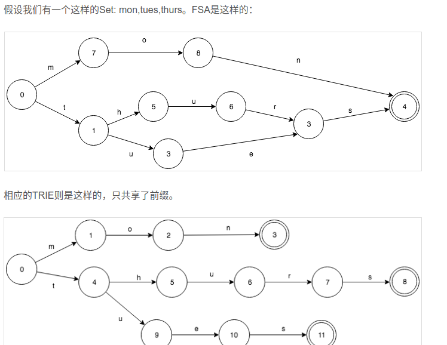
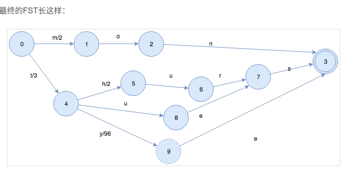

lucene 从 4+版本后开始大量使用的数据结构是 FST。FST 有两个优点：

（1）空间占用小。通过对词典中**单词前缀和后缀的重复利用，压缩了存储空间**；

（2）查询速度快。**O(len(str))的查询时间复杂度**。

**FST，不但能共享前缀还能共享后缀。不但能判断查找的key是否存在，还能给出响应的输入output**。 它在时间复杂度和空间复杂度上都做了最大程度的优化，使得Lucene能够将Term Dictionary完全加载到内存，快速的定位Term找到响应的output（posting倒排列表）。

核心是在于如何快速的依据查询词快速的查找到所有的相关文档，这也是倒排索引（Inverted Index）的核心思想。

简单来说，我们可以采用HashMap， TRIE， Binary Search Tree， Tenary Search Tree等各种数据结构来实现。

Lucene采用了一种称为FST（Finite State Transducer）的结构来构建词典，这个结构保证了时间和空间复杂度的均衡，是Lucene的核心功能之一。

# 名词解释

关于FST（Finite State Transducer）,FST类似一种**TRIE树**。

使用FSM(Finite State Machines)作为数据结构

## FSM
FSM(Finite State Machines)有限状态机

表示有限个状态（State）集合以及这些状态之间转移和动作的数学模型。其中一个状态被标记为开始状态，0个或更多的状态被标记为final状态。

## FSA
确定无环有限状态接收机（Deterministric acyclic finite state acceptor, FSA）

FSA是一个FSM(有限状态机)的一种

- 确定：意味着指定任何一个状态，只可能最多有一个转移可以访问到。
- 无环： 不可能重复遍历同一个状态
- 接收机：有限状态机只“接受”特定的输入序列，并终止于final状态。

使用：
- 无法移动了，就知道不在这个集合里了
- 已经没有输入了。而状态2并不是final状态，所以也不在这个集合里。
- 查找这个key是否在集合内的时间复杂度，取决于key的长度，而不是集合的大小
- 这里变化很小，没有增加新的状态，只是多了一个转移而已

这个算法时间复杂度O(n),n是集合里所有的key的大小, 空间复杂度O(k),k是结合内最长的key字段length。

## FST
确定无环有限状态转换器（Deterministic acyclic finite state transducer， FST）

FST是也一个有限状态机（FSM）

- 确定：意味着指定任何一个状态，只可能最多有一个转移可以遍历到。
- 无环： 不可能重复遍历同一个状态
- transducer：接收特定的序列，终止于final状态，同时会输出一个值。

FST和FSA很像，给定一个key除了能回答是否存在，还能输出一个关联的值。

构建FST在很大程度上和构建FSA是一样的，主要的不同点是，**怎么样在转移上放置和共享outputs**。

FST保证了不同的转移有唯一的值，但同时也复用了大部分的数据结构。
实现共享状态的关键点是：每一个key,都在FST中对应一个唯一的路径。因此，对于任何一个特定的key，总会有一些value的转移组合使得路径是唯一的。我们需要做的就是如何来在转移中分配这些组合。

上面的这个例子，其实有点简单化，并且局限。假如这些关联的value并不是int呢？ 实际上，FST对于关联value(outputs)的类型是要求必须有以下操作（method）的：
- 加
- 减
- 取前缀

## TRIE树
**单词查找树, 利用字符串的公共前缀来减少查询时间，最大限度地减少无谓的字符串比较，查询效率比哈希树高。**

TRIE可以看做是一个FSA,唯一的一个不同是TRIE只共享前缀，而**FSA不仅共享前缀还共享后缀**。

构建一个TRIE树是相当简单的。插入1个key，只需要做简单的查找就可以了。如果输入先结束，那么当前状态设置为final；如果无法转移了，那么就直接创建新的转移和状态。不要忘了最后一个创建的状态设置为final就可以了。

构建FST在很大程度上和构建FSA是一样的，主要的不同点是，**怎么样在转移上放置和共享outputs**。

除了在Term词典这块有应用，FST在整个lucene内部使用的也是很广泛的，基本把hashmap进行了替换。

- 自动联想：suggester
- charFilter: mappingcharFilter
- 同义词过滤器
- hunspell拼写检查词典

## 总结

FST，**不但能共享前缀还能共享后缀**。**不但能判断查找的key是否存在，还能给出响应的输入output**。 它**在时间复杂度和空间复杂度上都做了最大程度的优化**，**使得Lucene能够将Term Dictionary完全加载到内存，快速的定位Term找到响应的output**（posting倒排列表）。

- [关于Lucene的词典FST深入剖析](https://www.shenyanchao.cn/blog/2018/12/04/lucene-fst/): 通俗易懂
- https://www.amazingkoala.com.cn/Lucene/yasuocunchu/2019/0220/35.html
