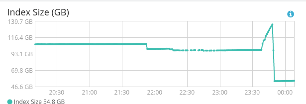

# 磁盘使用调优
> - [tune-for-disk-usage](https://www.elastic.co/guide/en/elasticsearch/reference/5.5/tune-for-disk-usage.html): 如何节省磁盘的建议

## Disable the features you do not need

例如，如果您有一个称为foo的数字字段，需要在其上运行直方图**聚合**，但您永远不需要对其进行**过滤**，则可以安全地在映射中禁用对此字段的索引。

```
PUT index
{
  "mappings": {
    "type": {
      "properties": {
        "foo": {
          "type": "integer",
          "index": false
        }
      }
    }
  }
}
```

文本字段在索引中存储规范化因子，以便能够对文档进行评分。如果您**只需要文本字段上的匹配功能**，而**不关心生成的分数**，则可以将elasticsearch配置为不向索引写入规范: `"norms": false`

默认情况下，文本字段还存储**索引中的频率和位置**。频率用于计算分数，位置用于运行短语查询。如果**不需要运行短语查询**，可以告诉elasticsearch不要索引位置: `"index_options": "freqs"`

## Don’t use default dynamic string mappings

**默认的动态字符串映射**会将字符串字段作为text和keyword索引。如果你只需要其中一个，这是浪费。通常，id字段只需要作为关键字编制索引，而body字段只需要作为文本字段编制索引。

## Disable _all

all字段索引文档中所有字段的值，可以使用有效空间。如果**不需要同时搜索所有字段，则可以禁用它**

## Use best_compression

**_source和stored字段**很容易占用不可忽略的磁盘空间。它们可以通过使用best_compression进行更积极的压缩

## Use the smallest numeric type that is sufficient

为数字数据选择的类型可能会对磁盘使用率产生重大影响。特别是，整数应使用整数类型（byte、short、integer或long）存储，浮点应存储在适当的按比例浮点或适合用例的最小类型中：使用float over double或half_float over float将有助于节省存储

---
# 字段

## _source字段

该 _source字段包含在索引时传递的**原始 JSON 文档正文**。该 _source 字段**本身不被索引（因此是不可搜索的）**，但它被存储，以便在执行撷取请求时可以返回，例如 get 或 search。

默认情况下，Elasticsearch 用 JSON 字符串来表示文档主体保存在 _source 字段中。像其他保存的字段一样，_source 字段也会在写入硬盘前**压缩**

### _source字段的作用
- 搜索结果中能**得到完整的文档** —— 不需要额外去别的数据源中查询文档
- 如果缺少 _source 字段，**部分 更新 请求不会起作用**
- 当你的映射有变化，而且你**需要重新索引数据时**，你可以直接在 Elasticsearch 中操作而不需要重新从别的数据源中取回数据。
- 你可以从 _source 中通过 get 或 search 请求**取回部分字段**，而不是整个文档。
- 这样更容易排查错误，因为你可以准确的看到每个文档中包含的内容，而不是只能从一堆 ID 中猜测他们的内容。

即便如此，存储 _source 字段还是要占用硬盘空间的。

### 禁用的影响
用户经常禁用 _source 字段而不考虑后果，然后为此后悔。 如果 _source 字段不可用，则不支持许多功能 ：

1. update，update_by_query，reindex APIs.
2. 高亮
3. 将索引从一 个Elasticsearch 索引 reindex（**重索引**）到另一个索引的能力，以更改映射或分析，或将索引升级到新的主要版本。
4. 通过查看索引时使用的原始文档来**调试查询或聚合的能力**。
5. 潜在的未来可能会自动修复索引损坏的能力。

> 如果磁盘空间是瓶颈，应是增加压缩级别而不是禁用 _source。

### **禁用_source的适用场景**

- **指标用例**与其他基于时间或日志记录的用例不同，因为有许多小型文档只包含数字，日期或关键字。
- **没有更新，没有高亮的请求，并且数据快速老化，因此不需要 reindex**。
- 搜索请求**通常使用简单查询来按日期或标签过滤数据集，结果作为聚合返回**。
- 在这种情况下，禁用 指标用例的_source 字段将**节省空间并减少 I/O**。

_source字段默认是存储的， 什么情况下不用保留_source字段？如果某个字段内容非常多，业务里面**只需要能对该字段进行搜索**，最后**返回文档id**，**查看文档内容会再次到mysql或者hbase中取数据**，把大字段的内容存在Elasticsearch中只会增大索引，这一点文档数量越大结果越明显，如果一条文档节省几KB，放大到亿万级的量结果也是非常可观的。

### 参考链接

- [图解Elasticsearch中的_source、_all、store和index属性](https://blog.csdn.net/napoay/article/details/62233031)
- [_source field](https://elasticsearch.apachecn.org/#/docs/311)
- [_source field官方](https://www.elastic.co/guide/en/elasticsearch/reference/5.5/mapping-source-field.html)


## store

默认情况下，**字段值会被索引使他们能搜索，但他们不会被 stored（存储）。意思就是这个字段能查询，但不能取回他的原始值**。

**通常**这并不重要。字段值**已经是默认存储**的_source字段的一部分。如果你**只想取回一个字段或者少部分字段的值**，而不是整个_source, 则可以通过source filtering筛选来实现。

为了保持一致，存储的字段始终以数组形式返回，因为无法知道原始字段值是单个值，多个值还是空数组。如果需要原始值，则应改为从_source字段检索它。

1.在某种情况下可以有意识的去 store（存储）一个字段。

例如，你有一个包含title（标题）， date（时间）和一个很大的 content（内容）字段，你仅仅只想取回 title 和 date ，而**不需要从整个 _source字段提取内容**。如果这时_source 是开启的，title字段store为true 会单独从获取title的store内容，而不是从_source 字段提取内容

但是如果你设了10个字段为store，这时候要每个字段都各自load，可能会比一次_source 获取要慢。

> 也就是不想从_source这个大字段提取相关的单个字段的时候，可以直接设为store来减少，但是注意不是原始值，而且多个单独字段可能更慢

具体例子：nested为比较大的时候，从_source获取可能会比较慢。

2.可以合理地存储字段的另一种情况是，对于那些未出现在_source字段（例如copy_to字段）中的字段。

> 在 Elasticsearch 中，**单独设置储存字段不是一个好做法**。完整的文档已经被保存在 _source 字段中。通常最好的办法会是使用 _source 参数来过滤你需要的字段。

> 如果想要对某个字段**实现高亮功能**，_source和store**至少保留一个**。下面会给出测试代码。

参考链接:

- [store（存储）](https://elasticsearch.apachecn.org/#/docs/337)
- [store](https://www.elastic.co/guide/en/elasticsearch/reference/5.5/mapping-store.html)
- [图解Elasticsearch中的_source、_all、store和index属性](https://blog.csdn.net/napoay/article/details/62233031)
- [store和_source的区别](https://stackoverflow.com/a/38787619)


---
## _all字段

它将所有其他字段的值连接成一个大字符串，使用**空格作为分隔符**，然后对其进行**分词和索引，但不存储**。 这意味着它**可以被检索，但不能取回**。

~~_all字段默认是关闭的~~（并不是，默认是开启的。不知道从哪里看到，被误导了）, 该 _all 字段并不轻量 : 它需要额外的 *CPU *并使用更多的磁盘空间。 如果不需要，它可以完全禁用或个别字段定制。

用法： 个别字段整合一起查询。

_all 字段不在 *_source *字段中，而且默认情况下不存储stored，因此无法高亮显示。

解决办法：
1. 存储 _all 字段，store is set to true
2. 高亮显示 原始字段 。原始字段设为： require_field_match： False

- [_all field](https://elasticsearch.apachecn.org/#/docs/304)
- [mapping-all-field](https://www.elastic.co/guide/en/elasticsearch/reference/5.5/mapping-all-field.html)

---
## fielddata

Fielddata 会消耗很多堆空间,尤其是加载高基数的 text 字段的时候.一旦 fielddata 加载到堆中,它在 segment（片段）中的生命周期还是存在的.此外,加载 fielddata 是一件非常昂贵的过程,会导致用户体验到延迟的感觉.这就是为什么 fielddata 默认关闭.

在你开启 fielddata 之前,**考虑一下为什么你要在脚本中使用 text 来聚合,排序.通常这么做是没有意义的**.


## 规格容量评估

- [阿里云-规格容量评估](https://help.aliyun.com/document_detail/72660.html)

## 定期删除

由于在 Lucene 中段具有不变性，每次进行删除操作后不会立即从硬盘中进行实际的删除，而是产生一个 .del 文件记录删除动作。

随着删除操作的增长，.del 文件会越来也多。当我们进行查询操作的时候，**被删除的数据还会参与检索中**，然后根据 .del 文件进行过滤。.del 文件越多，查询过滤过程越长，进而影响查询的效率。

当机器空闲时，我们可以通过如下命令删除文件，来提升查询的效率：
```
$ curl -XPOST localhost:9200/chandler/_forcemerge?only_expunge_deletes=true
{"_shards":{"total":10,"successful":5,"failed":0}}
```
定期对不再更新的索引做 optimize (ES 2.0 以后更改为 Force Merge API)。

这 Optimze 的实质是对 Segment File 强制做合并，可以节省大量的 Segment Memory

- [超详细的Elasticsearch高性能优化实践](https://www.codercto.com/a/80212.html)

正式例子

```shell script

POST /appinfo/_forcemerge?only_expunge_deletes=true
POST /appinfo/_forcemerge?max_num_segments=1
```

通过`only_expunge_deletes=true`去合并那些删除文档占分段数目10%的分段，而不是所有

而`max_num_segments=1`则会合并成一个，但是注意单个分段过大导致合并更慢，可以通过`max_merged_segment`避免大段的合并

合并把删除的文档清理后，节省的空间跟deleted count和文档大小有关，也加快了查询的速度。

1000万到40万，节省了98.2G到54.5G空间


