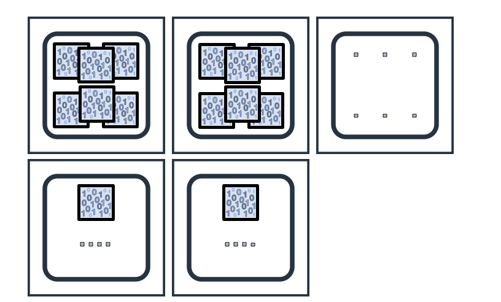

数据倾斜

# routing
通过routing（类似分区）进行**查询文档数的过滤**，以增快查询速度。

ES中的路由（routing）机制决定一个document存储到索引的哪个shard上面去，即文档到shard的路由。计算公式为：

`
shard_num = hash(_routing) % num_primary_shards
`

造成的问题：数据倾斜

可以配置索引，使得**自定义路由值**将转到**分片的子集**，而不是**单个分片**。这有助于减轻最终产生不平衡群集的风险，同时还可以**减少搜索的影响**。routing相同的文档映射到集群分片的一个子集上，这样一方面可以减少查询的分片数，另一方面又可以在一定程度上防止数据倾斜。

这是通过在索引创建时提供索引级别设置 `index.routing_partition_size`来完成的。随着配置**分区大小的增加**，数据的分布**越均匀**，必须以每个请求搜索更多的分片为代价。

`
(shard_num = (hash(_routing) + hash(_id) % routing_partition_size) % num_primary_shards
`

也就是说，*routing*字段用于计算索引中的一组分片，然后使用 *_id*来选择该组内的分片。

> 分析: 对于同一个routing值，hash(_routing)的结果固定的，hash(_id) % routing_partition_size的结果有 routing_partition_size 个可能的值，两个组合在一起，对于同一个routing值的多个doc，也就能计算出 routing_partition_size 可能的shard了，即一个shard集合。

要启用此功能，**index.routing_partition_size** 应具有大于1且小于 **index.number_of_shards**的值。

- https://elasticsearch.apachecn.org/#/docs/310


---
# 多索引

如果您有多个索引，则每个节点的存储将会不均匀。例如，假设您的应用程序每天生成 1GB 的日志数据，而您的 VPC 流日志每天生成 10GB 的日志数据。对于这两个数据流，您按照每个分区不超过 50GB 的最佳实践，使用一个主分区和一个副本。再假设您的集群中有六个节点。在七天后，每个索引总计将有 **14 个分区**（每天一个主分区和一个副本）。您的集群可能会看起来与以下类似 — 在最佳情景中，您的数据分布是均匀的。

在最差的情景中，假设您有五个节点，并且您的分区数量不能用节点数整除，因此较大的分区可能占据一个节点，如下图所示。含有较大分区的节点使用的存储量是含有较小分区的节点的十倍。





因为**索引的分片分配节点是互相没有关联的**。所以会有这种最差的情况。

> 原因： 索引的分片分配节点是互相没有关联的

可以通过滚动进行优化

**_rollover** API 会在您触及您在调用中定义的阈值时创建新的索引。您首先会**创建一个 _alias 用于读取和写入当前索引**。然后您使用 cron 或其他调度计划工具来**定期调用** _rollover API，例如每分钟一次。当您的索引**超过阈值时**，Elasticsearch 会在别名后**创建新的索引**，并且您继续向该别名写入。


```bash

POST _aliases
{
  "actions": [
    {
      "add": {
        "index": "weblogs-000001",
        "alias": "weblogs",
        "is_write_index": true
      }
    }
  ]
}

```

您必须将 is_write_index 设置为 true 以告诉 _rollover 它需要更新哪个索引。

当您调用 _rollover API 时：

```bash
POST /weblogs/_rollover
{
  "conditions": {
    "max_size":  "10gb"
  }
}
```

您将收到一条应答，详细说明哪个条件（如有）为真，以及 Elasticsearch 是否因为该调用而创建了新的索引。如果您**通过添加结尾编号**的方式为索引命名（例如 -000001），Elasticsearch 会在创建下一个索引时**递增该编号**。如果为哪种情况，您都可以继续不间断地向别名写入。

> 为什么能达到防止数据倾斜的原因呢？因为倾斜的原因是因为多索引，例子是每天一个。而rollover根据设定的条件进行合并。类似成做周维度的索引。减少了索引的数量，而rollover能减少代码层的嵌入，根据当前时间写入哪个表。而且也更可控进行数据量的控制。

- [使用 Elasticsearch 的 _rollover API 以提高存储分配的效率](https://aws.amazon.com/cn/blogs/china/open-distro-for-elasticsearch-rollover-storage-best-practice/)
- [冷热隔离](优化冷热隔离.md): _rollover冷热隔离策略

---
# preference

还有一种可能就是preference按照官方文档建议的配置下，将preference设为绑定用户相关的，导致某个用户查询量较大，因为该用户的相同查询都是落在固定分片上，导致某些节点过热。

方案： 按正常情况来说，这些用户的请求量都是平均的，不应该出现这类问题。如果真的有这类问题，可以将preference设定为用户+随机范围的数一起作用。类似routing_partition_size的做法。问题就是会出现刷新结果不一样。

- [preference-cache-optimization](https://www.elastic.co/guide/en/elasticsearch/reference/master/tune-for-search-speed.html#preference-cache-optimization)
