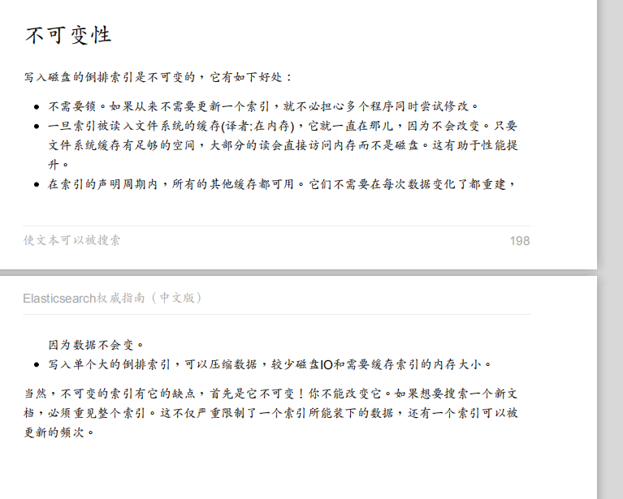

# 深入分片

- 为什么搜索是近实时的？
- 为什么文档的CRUD操作是实时的？
- ES怎样保证更新持久化，即使断电也不会丢失？
- 为什么删除文档不会立即释放空间？
- 什么是 refresh，flush, optimize API ，以及什么时候你该使用它们？


## 倒排索引

倒排索引存储了比包含了一个特定term的文档列表**多对多的信息**。它可能存储包含每个term的文档数量，一个term出现在指定文档中的频次，每个文档中term的顺序，每个文档的长度，所有文档的平均长度，

在全文检索的早些时候，会为整个文档集合建立一个大索引，并且写入磁盘。只有新的索引准备好了，它就会替代旧的索引，最近的修改才可以被检索。

### 不变性

倒排索引被写入磁盘后是**不可改变**的:它永远不会修改。 **不变性有重要的价值**：

- 不需要锁。如果你从来不更新索引，你就**不需要担心多进程同时修改数据的问题**。
- 一旦索引被读入内核的文件系统缓存，便会留在哪里，由于其不变性。只要文件系统缓存中还有足够的空间，那么**大部分读请求会直接请求内存**，而不会命中磁盘。这提供了很大的性能提升。
- **其它缓存(像filter缓存)，在索引的生命周期内始终有效**。它们不需要在每次数据改变时被重建，因为数据不会变化。
- 写入单个大的倒排索引**允许数据被压缩**，减少磁盘 I/O 和 需要被缓存到内存的索引的使用量。





## 动态索引
下一个需要解决的问题是如何在保持不可变好处的同时更新倒排索引。答案是，使用多个索引。

不是重写整个倒排索引，而是**增加额外的索引反映最近的变化**。每个倒排索引都可以按顺序查询，从最老的开始，最后把结果聚合。

Elasticsearch 基于 Lucene, 这个 java 库引入了 **按段搜索** 的概念。

每一个段(segment)是有**完整功能的倒排索引**，但是现在Lucene中的索引指的是**段的集合**，再加上**提交点**(commit point，包括所有段的文件)

> Lucene中的索引指的是**段的集合**

当一个请求被接受，所有段**依次查询**。所有段上的**Term统计信息被聚合**，确保每个term和文档的相关性被正确计算。通过这种方式，新的文档以较小的代价加入索引。


## 删除和更新
段是不可变的，所以文档既不能从旧的段中移除，旧的段也不能更新以反映文档最新的版本。相反，**每一个提交点包括一个.del文件**，包含了段上**已经被删除的文档**。

当一个文档被删除，它实际上只是在.del文件中被标记为删除，依然可以匹配查询，但是最终返回之前会被**从结果中删除**。

文档的**更新操作**是类似的：当一个文档被更新，**旧版本的文档被标记为删除**，新版本的文档 在新的段中索引。也许该文档的不同版本都会匹配一个查询，但是更老版本会**从结果中删除**。

在合并段这节，我们会展示删除的文件是如何从文件系统中清除的。

## 近实时搜索

磁盘是瓶颈。提交一个新的段到磁盘需要 fsync 操作，**确保段被物理地写入磁盘**，即时电源失效也不会丢失数据。但是 fsync 是**昂贵**的，它**不能**在**每个文档被索引的时就触发**。

在Elasticsearch和磁盘之间是文件系统缓存。但是这里新段会被先写入到**文件系统缓存**。​这一步代价会**比较低**，稍后再被刷新到磁盘​这一步代价比较高。不过只要文件已经在缓存中， 就可以像**其它文件一样被打开和读取了**。

> 先写到文件系统缓存中.但也会消耗文件句柄，故需要段合并。

但是**一旦一个文件被缓存**（内存、文件缓存），它也可以被**打开和读取**，就像其他文件一样。Lucene**允许新段写入打开**，好让它们包括的文档可搜索，而**不用执行一次全量提交**。

在Elesticsearch中，这种**写入打开一个新段的轻量级过程**，叫做**refresh**。默认情况下，每个分片每秒自动刷新一次。这就是为什么说Elasticsearch是近实时的搜索了：**文档的改动不会立即被搜索，但是会在一秒内可见**。

### refresh场景使用
尽管刷新是比提交轻量很多的操作，它还是会**有性能开销**。当写**测试**的时候， 手动刷新很有用，但是不要在生产环境下每次索引一个文档都去手动刷新。 相反，你的应用需要意识到 Elasticsearch 的**近实时的性质**，并**接受它的不足**。

并不是所有的情况都需要每秒刷新。可能你正在使用 Elasticsearch 索引大量的日志文件， 你可能想**优化索引速度而不是近实时搜索**， 可以**通过设置 refresh_interval ， 降低每个索引的刷新频率**：

refresh_interval 可以在既存索引上进行动态更新。 在生产环境中，当你正在**建立一个大的新索引时**，可以先**关闭自动刷新**，待开始使用该索引时，再把它们调回来：


## 持久化变更

当我们通过每秒的刷新获得近实时的搜索，我们依然需要**定时地执行全提交确保能从失败中恢复**。

ES增加了**事务日志**（ translog ），来**记录每次操作**。有了事务日志，过程现在如下：

1. 当一个文档被索引，它被加入到**内存缓存**，**同时加到事务日志**
2. refresh使得分片的进入如下图描述的状态。每秒分片都进行refeash：
    - **内存缓冲区的文档写入到段中，但没有fsync**。
    - 段被**打开**，使得新的文档可以**搜索**。
    - **缓存被清除**
3. 随着更多的文档加入到缓存区，写入日志，这个过程会继续
4. 不时地，比如日志**很大**了，**新的日志会创建**，会进行一次**全提交**：
   - 内存缓存区的所有文档会写入到新段中。
   - 清除缓存
   - 一个提交点写入硬盘
   - 文件系统缓存通过**fsync操作flush到硬盘**
   - **事务日志被清除**

事务日志记录了**没有flush到硬盘的所有操作**。当故障重启后，ES会用**最近一次提交点从硬盘恢复所有已知的段**，并且从**日志里恢复所有的操作**。

> 段：文件系统缓存。重启会丢失

事务日志还用来提供实时的CRUD操作。当你尝试用**ID进行CRUD时**，它在检索相关段内的文档前会首先检查**日志最新的改动**。这意味着ES可以**实时地获取文档的最新版本**。

## flush
进行一次提交并删除事务日志的操作叫做 flush 。**分片每30分钟**，或**事务日志过大**会进行一次flush操作

你很少需要手动 flush ，通常自动的就够了。

当你要**重启或关闭一个索引**，flush该索引是很有用的。当ES尝试恢复或者重新打开一个索引时，它必须重放所有事务日志中的操作，所以日志越小，恢复速度越快。


## Translog 有多安全

translog 的目的是保证操作不会丢失。这引出了这个问题： Translog 有多安全？

在文件被 fsync 到磁盘前，被写入的文件在重启之后就会丢失。默认 translog 是**每 5 秒被 fsync 刷新到硬盘**， 或者在**每次写请求完成之后执行**

这个过程在主分片和复制分片都会发生。最终， 基本上，这意味着在整个请求被 fsync 到主分片和复制分片的translog之前，你的客户端不会得到一个 200 OK 响应。

> 也就是默认的每次的写入都是需要等待translog的写入完成后，才能得到200

在每次请求后都执行一个 fsync 会带来一些性能损失，尽管实践表明这种**损失相对较小**（特别是bulk导入，它在一次请求中平摊了大量文档的开销）。

但是对于一些大容量的偶尔**丢失几秒数据问题也并不严重的集群**，使用**异步的 fsync**还是比较有益的。比如，写入的数据被**缓存到内存中**，再**每5秒执行一次 fsync**。

```bash
PUT /my_index/_settings
{
    "index.translog.durability": "async",
    "index.translog.sync_interval": "5s"
}
```


## 合并段

通过**每秒自动刷新创建新的段**，用不了多久段的数量就爆炸了。有太多的段是一个问题。
- 每个段消费**文件句柄**，内存，cpu资源。
- 更重要的是，**每次搜索请求都需要依次检查每个段。段越多，查询越慢。**

ES通过**后台合并段**解决这个问题。**小段被合并成大段，再合并成更大的段。**

这时旧的文档从文件系统删除的时候。**旧的段不会再复制到更大的新段中。**

合并大的段会**消耗很多IO和CPU**，如果**不检查会影响到搜素性能**。默认情况下，ES会**限制合并过程**，这样搜索就可以有足够的资源进行。

optimize API 最好描述为**强制合并段API**。它强制分片合并段以**达到指定 max_num_segments 参数**。这是为了**减少段的数量**（通常为1）达到**提高搜索性能的目的**。

在**特定的环境下**， optimize API 是有用的。典型的场景是**记录日志**，这中情况下日志是按照每天，周，月存入索引。旧的索引一般是**只可读的**，它们是**不可能修改的**。 这种情况下，把每个索引的**段降至1是有效的**。搜索过程就会用到更少的资源，性能更好。

> 因为没有更新，合并消耗一次IO和CPU就可以了。但如果是经常更新的话，合并后不久新的段也产生了。

---
# 写入原理
总结一下，数据先写入内存 buffer，然后每隔 1s，将数据 refresh 到 os cache(文件系统缓存)，到了 os cache 数据就能被搜索到（所以我们才说 es 从写入到能被搜索到，中间有 1s 的延迟）。每隔 5s，将数据写入 translog 文件（这样如果机器宕机，内存数据全没，最多会有 5s 的数据丢失），translog 大到一定程度，或者默认每隔 30mins，会触发 commit 操作，将缓冲区的数据都 flush 到 segment file 磁盘文件中。

参考链接：

- [ElasticSearch写入数据的工作原理是什么？](https://www.cnblogs.com/yuxiang1/p/10601253.html)
- [分片内部原理](https://www.elastic.co/guide/cn/elasticsearch/guide/current/inside-a-shard.html)
