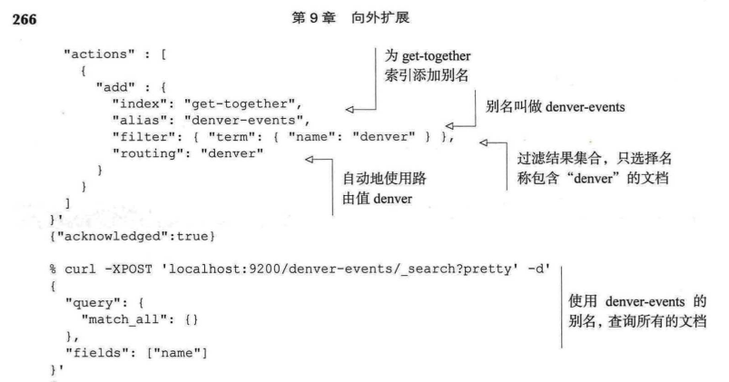

# ES实战

标签（空格分隔）： es

---

# 8 文档间的关系
## 8.1 文档间关系

> 常见的各种场景的分析和对比。什么时候选择对象类型、嵌套类型、父子关系、反规范化。

# 9 向外扩展
## 9.1

## 9.2 发现节点

> 是如何发现新的节点的: 广播、单播。

### 选举

当集群只有一个节点的时候，该节点先等待一段时间，如果没有发现任何其他集群的节点，它就将自己选为主节点。

如果节点数量不会随着时间而变化，可以将**最小数量设置为集群的总节点数**，或者遵循一个常用的规则，将其设置为集群节点数除以2再加上1。将minimum master_nodes 设置为高于1 的数量，可以**预防集群产生脑裂**（split brain）的问题。遵守常用规则，3个节点的集群其

#### 什么是脑裂
脑裂这个词描述了这样的场景∶（通常是在**重负荷或网络存在问题的情况下**）Ealsticsearch 集群中**一个或多个节点失去了和主节点的通信，开始选举新的主节点**，并且继续处理请求。这个时候，可能有两个不同的Elasticsearch集群相互独立地运行着，这就是"脑裂"一词的由来，因为**单一的集群已经分裂成了两个不同的部分**，和左右大脑类似。为了防止这种情况的发生，你需要根据集群节点的数量来设置`discovery.zen.minimum_master_nodes`。如果节点的数量不变，将其设置为集群节点的总数;否则将**节点数除以2并加1**是一个不错的选择，因为这就意味着如果**一个或多个节点**失去了和其他节点的通信，它们**无法选举新的主节点来形成新集群**，因为对于它们**不能获得所需的节点（可成为主节点的节点）数量（超过一半)**。

### 错误的识别
每个节点每隔`discovery.zen.fd.ping_interval`的时间（默认是1s）发送一个ping请求，等待`discovery.zen.fd.ping_timeout`的时间（默认是30s），并尝试最多`discovery.zen.fd.ping_retries`次（默认3），然后宣布节点失联，并且在需要的时候进行新的分片路由和主节点选举。如果你的环境有很高的延迟，请确定修改这些值。

### 停用节点
如果想关闭节点的同时保持集群为绿色状态，可以先停用节点，这个操作会将待停用节点上的所有分片转移到集群中的其他节点。系统通过集群设置的临时修改，来为你实现节点的停用，如`exclude.ip`。

### Elasticsearch 索引能处理多大的数据
很好的问题!不幸的是，单一索引的极限取决于存储索引的机器之类型、你准备如何处理数据以及索引备份了多少副本。通常来说，一个Lucene 索引（也就是一个**Elastcsearch分片**）不能处理多于**21亿篇文档**，或者多于2740亿的唯一词条，但是在达到这个极限之前，你可能就已经没有足够的磁盘空间了。确定是否能将数据存储于单个索引内的最好方式是，在一个非生产环境中尝试，按需调整参数获得理想的性能。一旦索引创建，你就**不能修改主分片的数量了，只能修改副本分片的数量**，所以请事先计划周详。

## 升级
### 轮流重启
对于多数人来说，**升级过程中不在集群中转移数据是很合理的**。可以通过设置`cluster.routing.allocation.enable`选项为none做到这一点。为了清晰起见，整个过程梳理如下。
- 关闭集群的分配设置。
- 关闭即将升级的节点。
- 升级节点。
- 启动升级后的节点。
- 等待升级后的节点加入集群。
- 开启集群的分配设置。
- 等待集群恢复绿色的状态。

为每个需要升级的节点**重复这个过程**。为了关闭集群的分配设置，可以使用集群的设置API 进行如下设置。

> 重复这个过程，需要等待绿色的状态

一旦你运行了这个命令，Elasticsearch就不会在集群中重新均衡分片。例如，如果索引的一个主分片由于其所在主机的关闭而丢失，那么Elasticsearch**仍然会将副本分片转变为新的主分片，但是不会创建新的副本分片**。在这种状态下，可以安全地关闭单独的Elstisearch节点并进行升级。

节点升级完毕后，**请确保重新开启了集群的分配设置**，否则你会奇怪为什么从此以后Elasticsearch不会自动复制数据!可以通过设置cluster.routing.allocation.enable选项为all来重新开启分配

对于集群中每个升级的节点，都需要执行开始和收尾这两个步骤，即关闭分配和重启分配。如果只在整个升级开始和结束的时候**各执行一次**，那么每次升级一个节点的时候，Elasticsearch不会**分配该节点上的分片**，一旦升级多个节点集群就可能会变为**红色状态**。每个节点升级后，**重新开启分配选项并等待集群变为绿色状态**，这样当进行下一个节点升级的时候，你的数据就是可分配、可用的。为每个待升级的节点重复这些步骤，直到你升级了整个集群。

### 最小化重启后的恢复时间

你可能注意到了在升级单个节点时，即使采取了关闭和开启分配选项的步骤，集群**仍然需要一些时间回归到绿色的状态**。很不幸，这是由于Elasticsearch使用的**复制策略是针对每个分片的分段，而不是文档**。这就意味着，当Elasticsearch节点发送副本数据时会问"你有分段segments1吗?"

如果没有这个文件，或者文件不一致，**整个分段文件都会被复制**"。在**文档都是相同的情况下，大量的数据被复制**。在主分片和副本分片之间复制数据的时候，Elstisearch不得不复制任何不同的文件，除非它有办法验证写人分段文件的最后一篇文档。

> 即使文档相同，但是因为之前的分段在副本上不一致，所以导致不得不大量的复制。故需要一下的合并或者重新同步。

有两种不同的方法使得主分片和副本分片上的分段文件完全相同。
- 第一种是使用第10章我们将要谈及的优化API，它为主分片和副本分片创建一个单独的、大的分块。
- 第二种是将副本分片的数量切换到0然后再切换到某个更高的值。这确保了所有副本分片拥有和主分片同样的分段文件。不过这意味着短期内，你只有一个单独的数据副本，所以在生产环境中请慎用!

最后，为了最小化恢复的时间，在进行节点升级的时候，你也可以停止将新的数据索引到集群。

## 9.6 扩展策略

### 9.6.1 过度分片
通常来说，规划生产环境的Elasticsearch集群至少有3件事情需要考虑∶过度分片、将数据切分为索引和分片、最大化吞吐量。

让我们从过度分片开始说起。过度分片（over-sharding）是指你有意地为索引创建大量分片，用于未来增加节点的过程。

Elasticsearch管理每个分片都隐含着额外的开销。这是因为正如你在第1章所看到的那样，每个分片都是完整的Lucene索引，它需要为索引的每个分段**创建一些文件描述符**，增加相应的**内存开销**。如果为索引创建了过多的分片，可能会**占用了本来支撑性能的内存**，或者**触及机器文件描述符或内存的极限**。此外，在压缩数据的时候，需要将**数据分为100份不同的内容**，同合理切分相比这样操作会**降低压缩的比例**。

### 9.6.2 切分为索引

不幸的是，现在还没有方法让我们增加或者减少某个索引中的主分片数量，但是你总是可以对数据进行规划，让其**横跨多个索引**。这是另一种完全合理的切分数据的方式。

当创建索引的时候，不要忘记由于**每个索引有自己的分片**，你的操作仍然会导致**创建分片的负载**，所以请确保不要使用**过多的索引来创建过多的分片**，不要**占用处理请求的资源**。一旦你理解了数据是如何在集群中分布的，就可以开始调整节点的配置，最大化你的吞吐量。

> 分片数过多也会导致查询（索引？）的效率较低

### 最大化吞吐量

最大化吞吐量是最为模糊的词语之一，意味着相当多的含义。你试图最大化索引的吞吐量?还是让搜索更快一些?一次执行多次搜索?可采用不同的方式来调节Elasticsearch使其完成每项任务。例如，如果你接受了上千的新分组和活动，如何尽快地索引它们?加速索引的一个方法是**临时地减少集群中副本分片的数量**。索引数据的时候，默认情况下，在数据更新到主分片和所有副本分片之前，请求是不会完成的。所以，在索引的阶段将副本分片的数量减少到1（甚至是0，如果你愿意承担风险）是有利的，然后在集中索引阶段结束后将这个数量重新增加为1个或多个。

那么搜索的时候呢?通过**加入更多的副本分片**，搜索可以更快，这是因为无论是主分片还是副本分片都可以用于搜索。为了解释这一点，请参考图9.-9，它展示了一个3节点的集群，其中最后一个节点无法处理搜索的请求，直到它拥有了相应数据的副本。

但是，不要忘记了在 Elasticsearch集群中创建**更多的分片确实增加了少量的文件描述符和内存负载**。如果搜索请求的量太大，集群中的节点很难应付，那么考虑加入节点时将这些节点的node.data和node.master设置为false。这些节点就可以被用于处理不断涌入的请求，将**请求分发到数据节点，收集返回的结果**。而另一方面，搜索分片的数据节点则**不必处理和搜索客户端之间的连接，只需要搜索分片就行**。

## 9.8 路由

定制路由允许你将分享**同一个路由值的多篇文档归集到单个分片中**，而一旦这些文档放入到同一索引，就可以路由某些查询，让它们可以在索引分片的子集中执行。听上去很困惑?我们将深入细节进行阐述。

将这一点延伸到成百上千的分组和城市的情况，在索引和查询的时候指定每个分组的路由，你可以**限制搜索请求的查询范围**。这对于拥有100个分片的索引而言是很好的扩展性提升;如此一来，查询被限制范围后就不用在全部100个分片上执行，它可以运行得更快，对于Elasticsearch集群的影响也更小。

> 路由，相当于分区表，确定搜索的分片子集。而不是搜索节点。preformance才是。

### 9.8.5 结合路由和别名

假设别名指向一个单独的索引，那么它们也可以和路由一起使用，在查询或索引的时候自动地使用路由值。如果某个别名指向了多个索引，而你试图将文档索引到该别名，那么Elasticsearch就会返回一个错误。





# 10 提升性能

如图10-3所示，满足下列条件之一就会触发冲刷操作。
- 内存缓冲区已满。
- 自上次冲刷后超过了一定的时间。
- 事物日志达到了一定的阈值。

> 所以refresh_interval为-1的时候，触发条件是内存缓冲区满后进行事务日志的冲刷，然后也就能可查了。

这告诉我们合并分段的两个目的∶**第一个是将分段的总数量保持在受控的范围内（这用来保障查询的性能）。第二个是真正地删除文档。**

合并的最终目的是提升搜索的性能而均衡IO和CPU计算能力。合并发生在索引、更新或者删除文档的时候，所以合并的越多、这些操作的成本就越昂贵。反之，如果想快速地索引，你需要较少的合并，而且牺牲一些查询的性能。

> **合并的一些配置项**

```
curl-XPUT localhost:9200/get-together/settings -d ' {
"index.merge":{
"policy": {
    "segments per_tier":5,
    "maxmerge_at_once":5,
    "max_merged_segment":"1gb"},
"scheduler.max_thread_count":1
}}
```

## 优化索引

有了刷新和冲刷，你可以手动触发一次合并。一次强制性的合并也被称为优化（optimize），之所以起这样的名字是因为通常是在一个今后不会更改的索引上运行这个操作，将其**优化到一定（较低）数量的分段，使得更快的搜索成为可能**。

对于激进的合并而言，**优化是非常消耗I/O的，而且使得许多缓存失效**。**如果你持续地索引、更新和删除索引文件中的文档，新的分段就会被创建，而优化操作的好处就无法体现出来**。因此，在一个不断变化的索引上，如果希望分段的数量较少，那么你应该调优合并的策略。

在静态的索引上优化是很有意义的。例如，如果索引了社会媒体的数据，而且每天新建一个索引，那么你知道自己永远不会修改昨天的索引，直到有一天永远删除它。这种情况下，将分段优化为较少的数量可能是很有帮助的，如图10-5所示。图10-5中，**系统会减少分段的总数量，一旦缓存再次被预热加载，就会加速查询**。

## 10.2.3 存储和存储限流

在Elasticsearch的早期版本中，过度的合并将会拖慢集群，以至于索引和搜索请求慢得无法接受，或者是所有的节点都无法响应。这都是因为合并时对IO产生了压力，导致新分段的写人很缓慢。此外，由于I/O的等待，CPU的负载也会很高。

鉴于此，Elasticsearch目前使用了存储限流，来**限制合并可以使用的I**/O吞吐量。默认情况下有一个节点层级的设置，称为`indices.store.throttle.max bytes per sec`，在版本1.5 中其默认值是20mb 字节。

这个限制在很多应用中对于稳定性而言是很好的，但不是对所有场景都是最佳的。如果你有高速的机器和许多索引，即使**有足够的 CPU和IO来执行合并**，由于限流的原因合并还是无法跟上节奏。在这种情况下，Elastisearch 只使用单个线程来进行内部的索引，将其速度放缓，使得合并可以跟得上。最后，如果你的机器足够快，索引可能会被存储限流。对于使用SSD 硬盘的节点，通常可以将这个限流值增大到100~200MB字节。

### 文件类型

默认的存储实现将索引文件存放到文件系统，多数情况下这没有什么问题。为了访问Lucene 的分段文件，默认的存储实现使用了Lucene的MMapDirectory，它通常用于大型的文件，或者是需要随机访问的文件，如词条字典。对于其他类型的文件，如存储字段，Elstisearch使用了Lucene 的NIOFSDirectory。

#### MMapDirectory
MMapDirectory利用了**文件缓存**，请求操作系统**将所需的文件映射到虚拟内存**，这样能更快地直接访问这些内存。对于 Elasticsearch而言，看上去所有的文件都是可以在内存中访问的，但是实际情况不必如此。如果你的内存规模大于可用的物理内存，操作系统会将没有使用的文件移出缓存，为需要读取的新文件腾出空间。如果 Elasticsearch再次需要哪些未被缓存的文件，这些文件会被加载到内存，而其他没有使用的文件被挪出内存等如此反复。MMapDirectory使用的虚拟内存和系统的虚拟内存（交换空间）工作方式相似。对于系统的虚拟内存，操作系统将没有使用的内存空间放入磁盘，这样整个系统就能够服务于多个应用程序。

#### NIOFSDirectory

内存映射的文件，也会导致额外的负载，因为应用程序必须要告诉操作系统在访问文件之前先对其进行映射。为了减小这个开销，Elasticsearch为某些类型的文件使用了NIOFsDirectory。NIOFSDirectory是**直接访问文件的，但是它必须将所需的数据复制到JVM堆的缓存中**。对于小型的、按序访问的文件这样操作没有问题，而同时MMapDirectory 能很好地工作于大型随机访问的文件。

对于多数情况，默认的存储实现就已经很棒了。但是，可以将索引设置中 index.store.type的 default 修改为其他值来选择不同的实现。

- mmapfs——该选项只会使用MMapDirectory。如果你**有一个相对静止的索引，而且物理内存也能放下该索引**，那么这种选择也会运作得很好。
- niofs——该选项只会使用NIOFSDirectory，在32位系统上可以很好地运作。因为在32位系统中，**虚拟内存的寻址空间被限制在4GB**。这种大小也使得用于更大索引的mmapfs 或 default选项不太适合。

#### 文件打开和虚拟内存的限制

存储于磁盘上的 Lucene 分段可以分布在多个文件中，当搜索运行时，操作系统需要打开很多文件。同样，当你使用默认的存储类型或mmapfs时，操作系统不得不将一些存储的文件映射为内存——即使这些文件实际上并不在内存中，应用程序还是认为它们位于内存里，而系统内核负责将这些文件加载到缓存和移出缓存。Linux 系统已经配置了一定的限制，防止应用程序一次性打开过多的文件而消耗过大的内存。对于Eastisearch部署的需求而言，这些设置通常过于保守，所以我们建议增加这个设置。如果你是从DEB或RPM包安装的Elasticsearch，不必担心这一点，因为默认情况下就会增加这个值。在可以在/etc/defalteastisearch或/etc/sysconfiglelasticsearch中找到这些变量

> 提示: 从版本2.0的Elasticsearch开始，你可以将index.codec设置为best_compression，来压缩存储字段（以及_source）。默认的值（名为default，存储类型自带的）仍然会使用LZ4算法来压缩存储字段，但是best_compression使用的是**deflate压缩算法**。更高的压缩率会拖慢需要_source的操作，如获取结果或者是关键词高亮。其他的操作，如聚集，应该是差不多快的，因为整体的索引规模会更小，也更容易缓存.

### 10.3 充分利用缓存

在本节中，我们将讨论过滤器缓存以及其他两种类型的缓存∶分片查询缓存以及操作系统缓存。在静态索引上运行聚聚集的时候，分片查询缓存非常有用，因为它缓存了整个结果。而操作系统缓存，通过将索引缓存到内存中，来保持高速的I/O吞吐量。

- 过滤器缓存

在某些使用场景中，过滤器缓存条目的生命周期非常短暂。举个例子，用户经常使用特定的主题来过滤 get-together活动，修改查询直到发现他们所想要的，然后离开。如果没有其他人搜索同样主题的活动，那么相应的缓存条目在内存中逗留却无法发挥作用，直到最终被回收。**回收操作很多的缓存会使得性能下降**。因为每次搜索时，都要回收旧的缓存条目来容纳新的条目，这需要消耗 CPU的计算周期。

在这种情况下，为了防止恰好在查询执行的时候发生回收，**设置缓存条目的生存时间（TTL）是很有意义的**。你可以调整每个索引的`index.cache.filter.expire`来实现这个目的。例

你需要经常组合过滤器。例如，当搜索特定时间范围内的活动时，你还想限定特定的参与者数量。为了最好的性能，需要确保当过滤器组合之后，缓存得到良好的使用，而且过滤器是按照正确的顺序运行的。


- 分片查询缓存

随着请求的不同，分片查询缓存条目也有所不同，所以它们**只适用于很小范围的请求**。如果搜索不同的词条或者运行了稍有不同的聚集，缓存就无法命中。此外，当发生**刷新或者分片内容改变**的时候，所有分片查询的缓存条目都将失效。否则，即使新的匹配文档已经加入了索引，你得到的仍然是来自缓存的过期结果。

这种缓存的局限性意味着，只有**在分片很少变化而且你有很多相同请求的时候，分片查询缓存才能体现出价值**。例如，如果你在索引日志，而且索引是基于时间的，你可能经常在较早的索引上运行聚集，而这些索引一成不变直到被删除。那么这些较早的索引就是分片查询缓存的理想候选者。


#### 10.3.3 jvm堆和操作系统的缓存

当JVM堆的资源很紧张的时候，即使在日志中没有看见 out-of-memory的异常，节点还是可能变得没有响应。这可能是因为，内存不够迫使垃圾回收器（GC）运行得更久或者更频繁来释放空闲的内存。由于GC消耗了更多的CPU资源，节点花费在服务请求甚至是应答主节点ping 的计算能力就更少了，最后导致节点被移出集群。

尽管增加堆的大小是很明显的解决方案，这并非总是可能的。增加数据节点同样如此。然而，你可以参考一些技巧来降低堆的使用。
- 减小索引缓冲区的大小，如10.2节所述。
- 减少过滤器缓存和分片查询缓存的大小。
- 减少搜索和聚集请求中size参数的值（对于聚集，还需要考虑到shard_size）。
- 如果必须处理大规模的数据，你可以增加一些非数据节点和非主节点来扮演客户端的角色。它们将负责聚合每个分片的搜索结果，以及聚集操作。

最后，Elasticsearch 使用另一种缓存类型来回避Java垃圾回收的方式。新的对象分配到名为新生代的空间。如果新对象存活得足够久，或者太多的新对象分配到新生代导致其被占满，这些新对象就会被"提升"到老年代。尤其是在聚集的时候，需要遍历大量的文档并创建很多可能被重用的对象，后一种填满新生代的情况就会出现。

通常，你希望将这些可能被聚集重用的对象提升到老年代，而不是新生代填满后恰巧放到老年代的一些随机的、临时的对象。为了实现这个目标，Elastisearch实现了一个页面缓存回收器（PageCacheRecycler），其中被聚集所使用的大数组被保留下来，不会被垃圾回收。默认的页面缓存是整个堆的10%，某些情况下这个值可能太大（例如，你有30GB的堆内存，页面缓存就有3GB了）。可以设置elasticsearch.yml中的`cache.recycler.page.limit.heap`来控该制缓存的大小。不过，有的时候还是需要调优JVM的设置（尽管默认已经很好了），例如，你的内存基本够用，但是当一些罕见的长时间GC停顿产生的时候，集群还是会遇到麻烦。有一些设置让垃圾回收发生得更频繁，但是停顿时间更短，降低一些整体的吞吐量来换取更少的延迟∶

- 增加幸存者区（Survivor）的空间（降低-XXSurvivorRatio"）或者是整个新生代在堆中的占比（降低-XX∶NewRatio°。你可以监控不同的年代来判断这些是否需要。提升到老年代需要花费更长的等待时间，而更富裕的空间使得新生代的垃圾回收有较多的时间来清理临时存在的对象，避免它们被提升到老年代。但是，将新生代设置得过大，将使得新生代的垃圾回收过于频繁而且变得效率低下，这是因为生存周期更长的对象需要在两个幸存者空间来回复制。
- 使用G1的垃圾回收（-XX∶+UseG1GC），会动态地为不同年代分配空间，而且是针对大内存、低延迟的使用场景而优化的。在版本1.5中这不是默认的设置，原因是在32位的机器上还有一些bug，所以在生产环境中使用G1之前，请确保你进行了彻底的调试。

#### 可以拥有一个超大的堆吗

很显然堆太小了是不利的，但是堆太大了也不是好事。超过32GB的堆会自动地使用未压缩指针，并且浪费了内存。内存有多浪费?这取决于使用的场景∶如果多数是进行聚集操作（使用指针很少的大数组），它可能是32GB中的1GB那么点。如果经常使用过滤器缓存（有很多指针的大量小条目），它可能就是10GB那么多。如果你真的需要多于32GB的堆，有时最好在同一台机器上运行两个或更多的节点，每个节点的堆少于32GB，并且通过分片机制来切分数据。

低于32GB的大堆可能仍然不理想（实际上，正好32GB的时候你已经失去了压缩指针，所以最多只用31GB）。服务器上未被JVM占用的内存，通常被**操作系统用于缓存磁盘上的索引**。如果你使用的是磁性或网络存储，这一点尤其重要，因为在运行查询的时候从磁盘获取数据，将会导致查询响应变慢。即使使用更快的SSD存储，如果节点所存储的数据量可以放入操作系统缓存，那么你仍然能够获得更好的性能。

现在，我们已经理解了由于垃圾回收和out-of-memory的问题，太小的堆是不利的。同时，由于减少了操作系统的缓存，太大的堆也是不利的。那么，合适的堆大小应该是多少?

#### 一半原则
在不知道堆的实际使用情况时，经验法则是将节点内存的一半分配给Elasticsearch，但是不要超过32GB。这个"一半"法则通常给出了堆大小和系统缓存之间良好的均衡点。

Elasticsearch将所有的词条加载到内存中用于统计。如果你不知道会有怎样的高峰冲击，经验法则同样是一半∶将堆大小设置为比常规高出50%。

使用基于时间的索引，最新的索引相对于整个数据集而言更可能放进操作系统缓存，这使得大多数的操作都会更快。而搜索较旧的数据通常不得不访问磁盘，不过对于时间跨度很长的少数搜索，用户更容易接受较长的响应时间。总体来说，如果可以使用基于时间的索引、基于用户的索引或者路由，将"热门"数据放入同一组索引或分片，那么你将充分地利用操作系统的缓存。


- 预热器

### 10.4 其他的性能权衡
#### 10.4.1 大规模的索引还是昂贵的搜索
#### 10.4.2 调优脚本或者别用它
#### 10.4.3 网络开销
#### 10.4.4 内存、深度分页

## 10.5 小结

本章探讨了一系列的优化，来增加集群的处理能力和响应速度。

- 使用 bulk批量API接口将多个index、create、update或者delete操作**合并到同一个请求。**
- 为了组合多个get或多个search请求，你分别可以使用**多条获取或多条搜索的API**。
- 当索引缓冲区已满、事物日志过大或上次冲刷过去太久的时候，**冲刷**的操作将内存中的Lucene分段提交到磁盘。
- 刷新使得新的分段，无论是否冲刷，都可以用于搜索。在**索引操作密集**的时候，最好**降低刷新的频率或者干脆关闭刷新**。
- 合并的策略可以根据分段的多少来调优。**较少的分段使得搜索更快**，不过**合并需要花费更多的CPU间**。较多的分段使得合并时间更少、索引更快，但是会导致搜索变慢。
- 优化的操作会**强制合并**，对于处理很多搜索请求的**静态索引**，这可以很好的运作。
- **存储限流**可能会**使合并落后于更新，限制了索引的性能**。如果你的高速的I/O，放宽或者取消这个限制。
- 组合使用在bool 过滤中的**位集合过滤器**和and/or/not过滤中的非位集合过滤器。
- 如果你的索引是静态不变的，在**分片查询缓存**中缓存**数量和聚集**。
- 监控JVM堆的使用情况，**预留足够的内存空间**，这样就不会遇到频繁的垃圾回收或者out-of-memory错误，但是同时也要给操作系统的缓存留出一些内存。
- 如果首次查询太慢，而且你也不介意**较慢的索引过程**，请使用**索引预热器**。
- 如果有足够的**空间存储较大的索引**，请使用**N元语法和滑动窗口**而不是**模糊、通配或词组查询**，这会使你的搜索运行得更快。
- 在索引之前，使用所需的数据在文档中创建新的字段，这样通常可以**避免使用脚本**。
- 合适的时候，**在脚本中尝试使用Lucene表达式、词条统计和字段数据**。
- 如果脚本不会经常变化，请参考附录B，学习如何在 Elasticsearch 插件中**书写一个本地脚本**。
- 如果在**多个分片之中没有均衡的文档频率**，使用dfs_query_then_fetch。
- 如果不需要任何命中的文档，请使用**count搜索类型**。如果需要很多命中的文档，请使用**scan搜索类型**。
