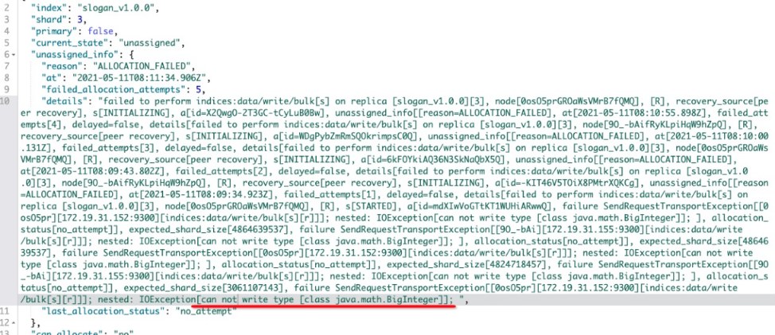

# 大数故障

时间： 2021.05.11

## 背景

程序对于大数之前是转换了字符，然后同步到es。更改某个逻辑的时候忘了转字符，但本地测试的时候，es也是能正常写入的，而且隐式帮忙转换成字符了。

但不知道为什么某些场景会是大数类型，让**主分片写入了大数**，导致副本分片同步不成功，如下：



## 方案

先通过写个脚本更新一下数据，后恢复了：

```bash
GET slogan_v1.0.0/_update_by_query?conflicts=proceed
{
  "query": {
    "bool": {
      "filter": {
        "exists": {
          "field": "brand_id_list"
        }
      },
      "must": [
        {
          "range": {
            "log_list": {
              "gte": "2021-05-11"
            }
          }
        }
      ]
    }
  },
  "script": {
    "inline": "List x = new ArrayList(); for (v in ctx._source.brand_id_list) {x.add(v+'')} ctx._source.brand_id_list=x",
    "lang": "painless"
  }
}
```


测试命令, 隐式转换成了字符：

```bash

GET /slogan/slogan_data/cf3690cd0b5c9da6efa63e3a32db82a9

POST /slogan/slogan_data/cf3690cd0b5c9da6efa63e3a32db82a0/_update
{
   "doc" : {
      "brand_id_list": [9823372036854775807]
   }
}

GET slogan/_search
{
  "query": {
    "bool": {
      "filter": {
        "term": {
          "_id": "cf3690cd0b5c9da6efa63e3a32db82a0"
        }
      },
      "must": [
        {
          "script": {
            "script": "for (v in doc['brand_id_list']) {if (v instanceof String) {return true}} return false;"
          }
        }
      ]
    }
  }
}

```


# 如何合并流


自己订阅多个topic？ksql?

“kafka agg two stream elasticsearch”
"kafka consumer subscribe multiple topics"

问题： 多个流读取的顺序并不是并行的，会先读完某个流的数据，导致另一个流的数据延迟很久。

方案： 暂时通过多个流并行合并写到同一个流，然后读取出来维护大窗口去重进行解决。

- https://www.cloudkarafka.com/blog/2019-09-11-a-dive-into-multi-topic-subscriptions-with-apache-kafka.html
- https://stackoverflow.com/questions/56250934/stream-join-example-with-apache-kafka
- https://stackoverflow.com/questions/49225747/how-to-join-multiple-kafka-topics
- Real Time Aggregation with Kafka ,Spark Streaming and ElasticSearch

---
# 节点升级过程

观察到的情况：

- 逐个节点停机升级，节点名字是否发生变化（应该没）？。
- 不知道是怎么开始的（直接停掉某个节点，还是说先移动主分片到另一个节点，确定该节点没有主分片再停机的）
- 分片会移来移去，甚至把空间压榨到5g。应该是节点停机导致的。
- 磁盘不够导致挂？（应该不是磁盘最小还是挺多的）

- 有一个节点没有停机。没有，都停了。85最先停的。9点17分。也是主分片最多的。停机之后在2020-07-07 21:23:47.158，全是副本分片。28分钟的时候，某些副本分片变成了主分片了（怎么变的？）然后越来越多变成主分片了。应该就是那些分片移动变成的

relocating

- 升级之后主分片不平衡。有两个节点，其分片都是大多都是主分片。写入只能在主分片完成，节点压力会过大？

- 是不是逐个节点停机升级应该要先停止分片的移动？

- 主节点挂了会怎么样？

- kibana是能够看到那时候的分片情况的。

A: 分析原因：[升级过程](/notebook/elasticsearch/升级.md)


---

# 机器配置(2020-04-18)

5节点、1副本、

每个节点8G内存、200G 、40G内存

已使用：5.8G JVM、128.3G

价格大概为4k

Nodes: 5
Indices: 89
Memory: 23GB / 37GB
Total Shards: 375
Unassigned Shards: 0
Documents: 996,944,007
Data: 621GB
Uptime: 8 months
Version: 5.5.3
Health: Health: green Green
Disk Available: 277GB / 984GB  (28.10%)
JVM Heap: 69.85%  (26GB / 37GB)

advertisement索引配置:

number_of_shards:5个分片

refresh_interval： 20s

---
# 自定义map reduce函数

脚本范围
脚本度量聚合在执行的 4 个阶段使用脚本：

### init_script
在收集任何文件之前执行。允许聚合设置任何初始状态。
在上面的示例中，init_script 在 state 对象中创建一个数组 transactions。

### map_script

每个收集的文档执行一次。这是必需的脚本。如果未指定 combine_script，则需要将结果状态存储在 state 对象中。

在上面的示例中，map_script 检查类型字段的值。如果值为 sale，则金额字段的值将添加到交易数组中。如果类型字段的值不是 sale，则金额字段的取反值将添加到交易中。

### combine_script

文档收集完成后，对**每个分片执行一次**。这是必需的脚本。允许聚合合并从每个分片返回的状态。

在上面的示例中，combine_script 遍历所有存储的交易，对 profit 变量中的值求和，最后返回 profit。

### reduce_script

所有分片均返回其结果后，在协调节点上执行一次。这是必需的脚本。该脚本可以访问变量 states，该变量是每个分片上 combine_script 结果的数组。

在上面的示例中，reduce_script 通过每个分片返回的 profit 进行迭代，然后在返回最终的合并利润之前返回每个合并的值，该合并后的利润将被返回。

```
GET advertisement/data/_search
{
  "query": {
    "bool": {
      "filter": [{
        "terms": {
          "channel_id": [
            "102"
          ]
        }
      },
      {
        "terms": {
          "_id": ["1670970", "5515605", "6213612"]
        }
      },
      {
        "terms": {
          "log_summary_list": ["2019-02-14"]
        }
      }
      ]
    }
  },
  "size": 0,
  "_source": ["tag_list"],
  "aggs": {
    "profit": {
      "scripted_metric": {
        "init_script": "params._agg.transactions = new HashMap()",
        "map_script": "params._agg.transactions = ['1':1]",
        "combine_script": "return params._agg",
        "reduce_script": "return 1;"
      }
    }
  }
}

```

`"map_script": "params._agg.transactions = ['1':1]"`
里面的key是数值会偶尔报 ClassCastException:null异常

- https://www.elastic.co/guide/en/elasticsearch/reference/5.6/search-aggregations-metrics-scripted-metric-aggregation.html
- https://learnku.com/docs/elasticsearch73/7.3/5111-scripted-metric-aggregation/7319
---
# cross_fields 得到负数的分数

```
GET ag_advertisement_test/data/_search
{
  "query": {
    "bool": {
      "should": [
        {
          "multi_match": {
              "type": "cross_fields",
              "query": "桃子 苹果",
              "operator": "and",
              "fields": [
                  "slogan.raw",
                  "description.raw",
                  "ocr_video_word_list.raw",
                  "ocr_image_word_list.raw"
              ]
          }
        }
      ]
    }
  }
}
```
数据：
```
{
  "description": null,
  "ocr_video_word_list": [],
  "ocr_image_word_list": [
    "orange",
    "eac",
    "banana",
    "偶润",
    "桃子",
    "艾坡",
    "苹果",
    "桔子",
    "香蕉"
  ],
  "slogan": "这样学英语太有趣啦！3天搞定500个单词！"
}

```

* 问题分析:
    ocr_video_word_list 、ocr_image_word_list 是数组，导致跟slogan这些类型组合的时候有问题

* 解决办法：
    按类型分来进行cross_fields查询

https://github.com/elastic/elasticsearch/pull/35865


---
# highlight异常
例子：

```
GET advertisement/data/_search
{
    "size": 60,
    "highlight": {
        "require_field_match": true,
        "pre_tags": [
            "<em class=\"highlight\">"
        ],
        "fields": {
            "*": { }
        },
        "post_tags": [
            "</em>"
        ],

        "number_of_fragments": 0
    },
    "_source": [
        "slogan"
    ],
    "from": 0,
    "query": {
        "function_score": {
            "query": {
                "bool": {
                    "should": [
                        {
                            "multi_match": {
                                "operator": "or",
                                "type": "best_fields",
                                "fields": "slogan^128",
                                "query": "七猫免费小说",
                                "tie_breaker": 1,
                                "minimum_should_match": "100%"
                            }
                        }
                    ],
                    "minimum_should_match": 0,
                    "filter": [
                        {
                            "terms": {
                                "_id": [
                                    10429603
                                ]
                            }
                        }
                    ]
                }
            },
            "boost_mode": "sum",
            "score_mode": "max",
            "functions": [ ]
        }
    },
    "sort": [
        {
            "_score": "desc"
        },
        {
            "updatedAt": "desc"
        }
    ],
    "min_score": 0
}

{
  "took": 5,
  "timed_out": false,
  "_shards": {
    "total": 5,
    "successful": 5,
    "failed": 0
  },
  "hits": {
    "total": 1,
    "max_score": null,
    "hits": [
      {
        "_index": "advertisement_v6.5.1",
        "_type": "data",
        "_id": "10429603",
        "_score": 0,
        "_routing": "1b7b41902751fb952202366795ecabc3",
        "_parent": "1b7b41902751fb952202366795ecabc3",
        "_source": {
          "slogan": "边看小说边赚钱，看了15分钟就赚了30块！"
        },
        "highlight": {
          "slogan": [
            """边看<em class="highlight">小说</em>边赚钱，看了15分钟就赚了30块！"""
          ]
        },
        "sort": [
          0,
          1557745262000
        ]
      }
    ]
  }
}
```


分析： score为0分，表示并没有命中查询规则，但是还是进行字段的高亮?

https://github.com/elastic/elasticsearch/issues/6787

---
# 重叠不高亮

这是因为ES的本身限制是导致的。“看这里”拆成了"看这"、“这里”，两个都匹配了，但是这两个词有重叠了，所以只高亮了第一个。

问题分析: his behavior is due to the way FastVectorHighlighter discards matches that have overlapping offsets

解决办法：

1. 优化关键词库的时候把“看这里”、“常用”等一些重叠的但是有含义的词收录到关键词库里？
2. edge ngram tokenizer

- https://jira.umlife.net/browse/AG-3182?filter=11617

- https://stackoverflow.com/questions/49096468/elasticsearch-highlighter-false-positives

- https://github.com/elastic/elasticsearch/issues/2824#issuecomment-18500114

- https://github.com/elastic/elasticsearch/issues/10071

---
# 自定义桶聚合

```
GET advertisement_v5.3/slogan_data/_search
{
  "size": 0,
  "query": {
    "range": {
      "updatedAt": {
        "gte": "2018-11-01 00:00:00",
        "lte": "2018-12-20 00:00:00"
      }
    }
  },
  "aggs": {
    "N1": {
      "nested": {
        "path": "tag_list"
      },
      "aggs": {
        "N2": {
          "terms": {
            "field": "tag_list.tagid",
            "size": 100,
            "order": {
              "N3>N4": "asc"
            }
          },
          "aggs": {
            "N6": {
              "bucket_script": {
                "buckets_path": {
                  "v1":"N3>N4",
                  "v2":"N5"
                },
                "script": "params.v1*params.v2"
              }
            },
            "N5": {
              "sum": {
                "field": "tag_list.method"
              }
            },
            "N3": {
              "reverse_nested": {
              },
              "aggs": {
                "N4": {
                  "cardinality": {
                    "script": {
                      "inline": "List x = new ArrayList(); for (v in doc['log_list']) {if (v >= 1541030400000L && v < 1545264000000L) {x.add(v)}} return x;"
                    }
                  }
                }
              }
            }
          }
        }
      }
    }
  }
}

```
