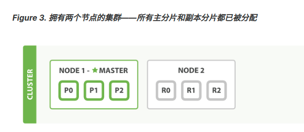
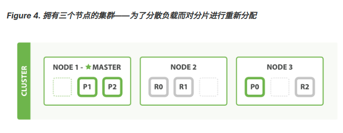
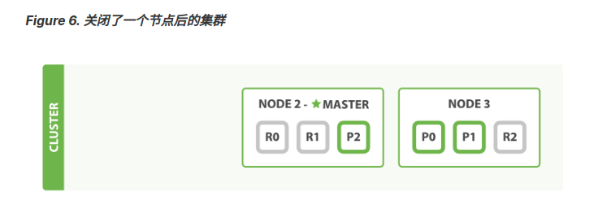
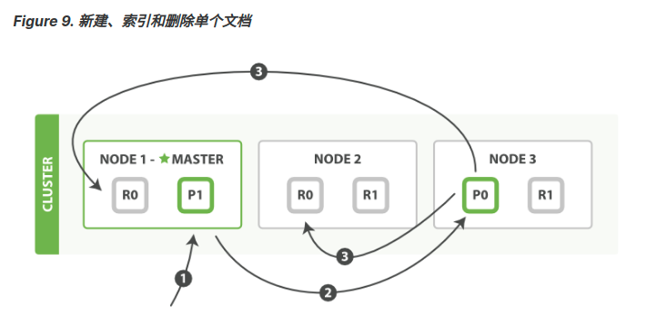
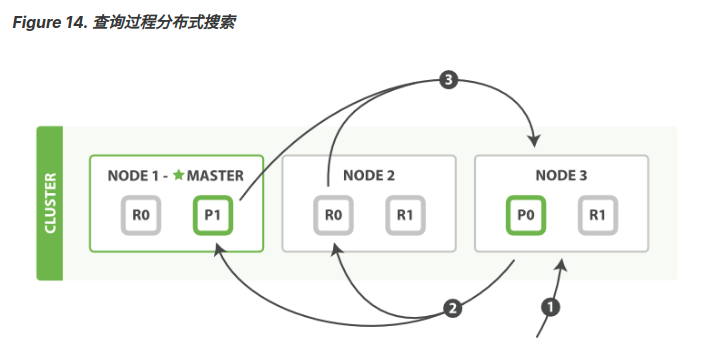

# cluster

cluster（集群）是**一个或者多个节点的集合**，它们一起保存数据并且提供所有节点联合索引以及搜索功能。集群存在一个唯一的名字身份且默认为 “elasticsearch”。这个名字非常重要，因为如果节点安装时通过它自己的名字加入到集群中的话，那么一个节点只能是一个集群中的一部分。

## node
node（节点）是一个**单独的服务器**，它是集群的一部分，存储数据，参与集群中的索引和搜索功能。像一个集群一样，一个节点通过一个在它启动时默认分配的一个随机的 UUID（通用唯一标识符）名称来识别。如果您不想使用默认名称您也可自定义任何节点名称。这个名字是要识别网络中的服务器对应这在您的 Elasticsearch 集群节点管理的目的是很重要的。

节点可以通过配置 **cluster name** 来加入到指定的集群中。默认情况下，每个节点安装时都会加入到名为 elasticsearch 的集群中，这也就意味着如果您在网络中启动许多节点--假设它们可以发现彼此–它们全部将**自动的构成并且加入到一个名为 elasticsearch 的单独的集群中**。

当一个节点被选举成为 主 节点时， 它将**负责管理集群范围内的所有变更，例如增加、删除索引，或者增加、删除节点等**。 而主节点并**不需要涉及到文档级别的变更和搜索等操作**，所以当集群只拥有一个主节点的情况下，即使流量的增加它也不会成为瓶颈。 任何节点都可以成为主节点。我们的示例集群就只有一个节点，所以它同时也成为了主节点。

_作为用户，我们可以将请求发送到 集群中的任何节点_ ，包括主节点。 **每个节点都知道任意文档所处的位置，并且能够将我们的请求直接转发到存储我们所需文档的节点**。 无论我们将请求发送到哪个节点，它都能负责从各个包含我们所需文档的节点**收集回**数据，并将最终结果返回給客户端。 Elasticsearch 对这一切的管理都是透明的。

### 节点类型与职责
TODO

## Shards & Replicas（分片 & 副本）

索引可以存储大量数据，可以超过单个节点的硬件限制。例如，十亿个文档占用了 *1TB *的磁盘空间的单个索引可能不适合放在单个节点的磁盘上，并且从单个节点服务请求会变得很慢。

> 每个 Elasticsearch 分片是一个 **Lucene 索引**。在单个 Lucene 索引中有一个**最大的文档数量限制**


为了解决这个问题，Elasticsearch 提供了把 Index（索引）拆分到多个 Shard（分片）中的能力。在创建索引时，您可以简单的定义 Shard（分片）的数量。
Sharding（分片）非常重要两个理由是 :

- 水平的拆分/扩展。
- 分布式和**并行跨 Shard 操作**（可能在多个节点），从而提高了性能/吞吐量。
Shard 的分布式机制以及它的文档是如何聚合支持搜索请求是完全由 Elasticsearch 管理的，并且是对用户透明的

副本非常重要的两个理由是 :

- 在 shard/node 故障的情况下提供了高可用性。为了达到这个目的，需要注意的是在原始的/主 Shard 被复制时副本的 Shard **不会**被分配到**相同的节点上**。
- 它可以让你水平扩展搜索量/吞吐量，因为搜索可以在所有的副本上并行执行。

**总而言之，每个索引可以被拆分成多个分片，一个索引可以设置 0 个（没有副本）或多个副本。开启副本后，每个索引将有主分片（被复制的原始分片）和副本分片（主分片的副本）。分片和副本的数量在索引被创建时都能够被指定。在创建索引后，您也可以在任何时候动态的改变副本的数量，但是不能够改变分片数量。**

- [基础概念](https://elasticsearch.apachecn.org/#/docs/1)
- [集群内的原理](https://www.elastic.co/guide/cn/elasticsearch/guide/current/distributed-cluster.html)

Elasticsearch 是利用分片将数据分发到集群内各处的。分片是数据的容器，文档保存在分片内，分片又被分配到集群内的各个节点里。 当你的集群规模扩大或者缩小时， Elasticsearch 会自动的在各节点中迁移分片，使得数据仍然均匀分布在集群里。

一个分片可以是 主 分片或者 副本 分片。 索引内任意一个文档都归属于一个主分片，所以主分片的数目决定着索引能够保存的最大数据量。

一个副本分片只是一个主分片的**拷贝**。副本分片作为硬件故障时保护数据不丢失的冗余备份，并为搜索和返回文档等**读操作**提供服务。

在索引建立的时候就已经确定了主分片数，但是副本分片数可以随时修改。

- [添加索引](https://www.elastic.co/guide/cn/elasticsearch/guide/current/_add-an-index.html)

---
# 集群内的原理

## 空集群

一个运行中的 Elasticsearch 实例称为一个节点，而集群是由一个或者多个拥有相同 cluster.name 配置的节点组成， 它们共同承担数据和负载的压力。当有节点加入集群中或者从集群中移除节点时，集群将会重新平均分布所有的数据。

当一个节点被选举成为 主 节点时， 它将**负责管理集群范围内的所有变更，例如增加、删除索引，或者增加、删除节点等**。 而主节点**并不需要涉及到文档级别的变更和搜索等操作**，所以当集群只拥有一个主节点的情况下，即使流量的增加它也不会成为瓶颈。 任何节点都可以成为主节点。我们的示例集群就只有一个节点，所以它同时也成为了主节点。

作为用户，我们可以将请求发送到 集群中的任何节点 ，包括主节点。 每个节点都知道任意文档所处的位置，并且能够将我们的请求直接转发到存储我们所需文档的节点。 无论我们将请求发送到哪个节点，它都能负责从各个包含我们所需文档的节点收集回数据，并将最终结果返回給客户端。 Elasticsearch 对这一切的管理都是透明的。

## 集群健康
status 字段指示着当前集群在总体上是否工作正常。它的三种颜色含义如下：

- green：所有的主分片和副本分片都正常运行。
- yellow：所有的主分片都正常运行，但**不是所有的副本分片都正常运行**。
- red：有主分片没能正常运行。

## 添加索引

实际上，所有3个副本分片都是 unassigned —— 它们都没有被分配到任何节点。 **在同一个节点上既保存原始数据又保存副本是没有意义的**，因为一旦失去了那个节点，我们也将丢失该节点上的所有副本数据。


## 故障转移

当集群中只有一个节点在运行时，意味着会有一个单点故障问题——没有冗余。 幸运的是，我们只需再启动一个节点即可防止数据丢失。

所有**新近被索引的文档都将会保存在主分片上，然后被并行的复制到对应的副本分片上**。这就保证了我们既可以从主分片又可以从副本分片上获得文档。




## 水平扩容

Node 1 和 Node 2 上各有一个分片被迁移到了新的 Node 3 节点，现在每个节点上都拥有2个分片，而不是之前的3个。 这表示每个节点的硬件资源（CPU, RAM, I/O）将被更少的分片所共享，每个分片的性能将会得到提升。

分片是一个功能完整的搜索引擎，它拥有使用一个节点上的所有资源的能力。 我们这个拥有6个分片（3个主分片和3个副本分片）的索引可以最大扩容到6个节点，每个节点上存在一个分片，并且每个分片拥有所在节点的全部资源。

当然，在同样数量的节点上增加更多的复制分片并不能提高性能，因为这样做的话平均 每个分片的所占有的硬件资源就减少了（译者注：大部分请求都聚集到了分片少的节 点，导致一个节点吞吐量太大，反而降低性能），你需要增加硬件来提高吞吐量。

但是更多的副本分片数提高了数据冗余量：按照上面的节点配置，我们可以在失去2个节点的情况下不丢失任何数据。

> 所以有多少个分片就应该有多少个节点是最好的？这样子的话，可以看作单独一个节点享受所有的硬件资源。类似kafka的分区？



## 应对故障



我们关闭的节点是一个主节点。而集群**必须拥有一个主节点来保证正常工作**，所以发生的第一件事情就是选举一个新的主节点： Node 2 。

在我们关闭 Node 1 的同时也失去了主分片 1 和 2 ，并且在缺失主分片的时候索引也不能正常工作。 如果此时来检查集群的状况，我们看到的状态将会为 red ：不是所有主分片都在正常工作。

幸运的是，在其它节点上存在着这两个主分片的完整副本， 所以新的主节点立即将这些分片在 Node 2 和 Node 3 上对应的副本分片提升为主分片， 此时集群的状态将会为 yellow 。 这个**提升主分片的过程是瞬间发生的，如同按下一个开关一般**。
> 提升主分片的过程是瞬间发生的，如同按下一个开关一般

如果我们重新启动 Node 1 ，集群可以将缺失的副本分片再次进行分配，那么集群的状态也将如之前一样。如果 Node 1 依然**拥有着之前的分片**，它将尝试去**重用它们**，同时仅从主分片**复制发生了修改的数据文件**。

> 旧节点恢复，尝试重用数据，只复制发生修改的数据

- [集群内的原理](https://www.elastic.co/guide/cn/elasticsearch/guide/current/distributed-cluster.html)

----
# 分片

## 选择分片数
 了解存储需求之后，您可以研究索引策略。每个Elasticsearch索引都分成若干个分片。因为您不能轻易更改现有索引的主分片数量，所以在对第一个文档建立索引之前，应确定分片计数。

 选择许多分片的总体目标是在群集中的所有数据节点之间平均分配索引。但是，这些碎片不应太大或太多。一个好的经验法则是尝试将分片大小保持在**10-50 GiB**之间。大型分片可能会使Elasticsearch难以从**故障中恢复**，但是由于每个分片都使用**一定数量的CPU和内存**，因此拥有**过多的小分片**会导致性能问题和内存不足错误。换句话说，分片应足够小，以使基础的Amazon ES实例可以处理它们，

**索引开销大概为数量的10%**

 > （源数据+增长空间）*（1 +索引开销）/所需分片大小=主分片的大概数量

为什么主分片的数量只能在创建索引时定义且不能修改：**如果主分片的数量在未来改变了，所有先前的路由值就失效了，文档也就永远找不到了。**

## 分片的代价
**一个分片并不是没有代价的**。记住：

- 一个分片的底层即为一个 Lucene 索引，会**消耗一定文件句柄、内存、以及 CPU 运转**。
- 每一个搜索请求都需要命中索引中的每一个分片，如果每一个分片都处于不同的节点还好， 但如果多个分片都需要**在同一个节点上竞争**使用相同的资源就有些糟糕了。
- 用于计算相关度的**词项统计信息是基于分片的**。如果有许多分片，每一个都只有很少的数据会导致很低的相关度。

参考链接：

- https://www.elastic.co/guide/cn/elasticsearch/guide/current/shard-scale.html
- [海量分片](https://www.elastic.co/guide/cn/elasticsearch/guide/current/kagillion-shards.html)

### Elasticsearch 索引能处理多大的数据

> - [Elasticsearch 索引能处理多大的数据](/notebook/elasticsearch/读书笔记/ES实战.md#Elasticsearch-索引能处理多大的数据)

_很好的问题!不幸的是，单一索引的极限取决于存储索引的机器之类型、你准备如何处理数据以及索引备份了多少副本。通常来说，一个Lucene 索引（也就是一个**Elastcsearch分片**）不能处理多于**21亿篇文档**，或者多于2740亿的唯一词条，但是在达到这个极限之前，你可能就已经没有足够的磁盘空间了。确定是否能将数据存储于单个索引内的最好方式是，在一个非生产环境中尝试，按需调整参数获得理想的性能。一旦索引创建，你就**不能修改主分片的数量了，只能修改副本分片的数量**，所以请事先计划周详。_


---
## 结果震荡（Bouncing Results）、cache

preference：控制要对其执行搜索请求的**分片副本**的首选项。默认情况下，**操作在分片副本之间是随机化的**。

一个可能的用例是使用每个副本缓存，比如请求缓存。但是，这样做违背了搜索并行化的思想，并且会在某些节点上创建热点，因为负载可能**不再均匀分布**。
使用用户标识进行分配，这是一种有效的策略，可以增加对重复运行类似搜索的唯一用户的**请求缓存**的使用，方法是始终**命中同一个缓存**，而不同用户的请求仍然**分布**在所有碎片副本上。

默认情况下，请求缓存将仅缓存size为0的搜索请求的结果，因此它不会缓存hits，但将缓存hit.total、aggregations, and suggestions.

> 每个分片有各自的分片结果缓存，但是分片汇总后得到的汇总结果能在节点进行缓存？所以命中同一个节点，可以命中同样的缓存

> routing控制的是分片的路由搜索（可以得到过滤无关数据的目的）、preference控制的是分片副本的请求（达到重复搜索命中缓存、固定返回顺序的目的）。

仅限本地首选项(_only_local)保证仅在本地节点上使用碎片副本，这有时对故障排除很有用。所有其他选项都不能完全保证在搜索中使用任何特定的碎片副本，而在不断变化的索引上，这可能意味着，如果在处于不同刷新状态的不同碎片副本上执行重复搜索，则可能会产生不同的结果。

- https://www.elastic.co/guide/en/elasticsearch/reference/current/search-request-body.html#request-body-search-preference

> 也就是说preference能控制查询的分片副本固定，不然是随机的，以此来达到分片缓存和固定查询顺序。

想像一下，你正在按照 timestamp 字段来对你的结果排序，并且有两个document有相同 的timestamp。由于搜索请求是在所有有效的分片副本间轮询的，**这两个document可能 在原始分片里是一种顺序，在副本分片里是另一种顺序**。
这就是被称为结果震荡（bouncing results）的问题：用户每次刷新页面，结果顺序会发 生变化。避免这个问题方法是对于同一个用户总是使用同一个分片。方法就是使用一个 随机字符串例如用户的会话ID（session ID）来设置 preference 参数。

- https://elasticsearch.cn/article/334
- [_search_options: Bouncing Results](https://www.elastic.co/guide/cn/elasticsearch/guide/current/_search_options.html)

TODO: 评论： 请问，为什么副本的分片顺序是不一样的？如何大家都是保持顺序进行写入的话，不是顺序应该一样吗？那如果不是顺序的，是什么导致这个特性？

原因：基于文档的复制

当主分片转发更改给复制分片时，**并不是转发更新请求，而是转发整个文档的新版本**。记住这些修改转发到复制节点是异步的，它们**并不能保证到达的顺序与发送相同**。如果Elasticsearch转发的仅仅是修改请求，修改的顺序可能是错误的，那得到的就是个损坏的文档。

来源：https://es.xiaoleilu.com/040_Distributed_CRUD/25_Partial_updates.html


---
# 数据输入、输出、分布式增删改查

- [数据输入和输出](https://www.elastic.co/guide/cn/elasticsearch/guide/current/data-in-data-out.html)
- [分布式文档存储](https://www.elastic.co/guide/cn/elasticsearch/guide/current/distributed-docs.html)

在前面的章节，我们介绍了如何索引和查询数据，不过我们忽略了很多底层的技术细节， 例如文件是如何分布到集群的，又是如何从集群中获取的。 Elasticsearch 本意就是隐藏这些底层细节，让我们好专注在业务开发中，所以其实你不必了解这么深入也无妨。

在这个章节中，我们将深入探索这些核心的技术细节，这能帮助你更好地理解数据如何被存储到这个分布式系统中。

## 路由一个文档到一个分片中

当索引一个文档的时候，文档会被存储到一个主分片中。 Elasticsearch 如何知道一个文档应该存放到哪个分片中呢？

首先这肯定不会是随机的，否则将来要获取文档的时候我们就不知道从何处寻找了。实际上，这个过程是根据下面这个公式决定的：

`shard = hash(routing) % number_of_primary_shards`

routing 是一个可变值，默认是文档的 _id ，也可以设置成一个自定义的值。 **routing 通过 hash 函数生成一个数字，然后这个数字再除以 number_of_primary_shards （主分片的数量）后得到 余数** 。这个分布在 0 到 number_of_primary_shards-1 之间的余数，就是我们所寻求的文档所在分片的位置。

这就解释了为什么我们要在创建索引的时候就**确定好主分片的数量**并且永远不会改变这个数量：因为如果数量变化了，那么所有之前路由的值都会无效，文档也再也找不到了。

## 主分片和副本分片如何交互

我们可以发送请求到集群中的任一节点。 每个节点都有能力处理任意请求。 **每个节点都知道集群中任一文档位置，所以可以直接将请求转发到需要的节点上**。 在下面的例子中，将所有的请求发送到 Node 1 ，我们将其称为 协调节点(coordinating node) 。

> 当发送请求的时候， 为了扩展负载，更好的做法是轮询集群中所有的节点。


## 检索文档取回单个文档

在处理读取请求时，协调结点在每次请求的时候都会**通过轮询所有的副本分片来达到负载均衡**。

> 通过轮询所有的副本分片来达到负载均衡

在文档被检索时，已经被索引的文档可能已经存在于主分片上但是还没有复制到副本分片。 在这种情况下，副本分片**可能会报告文档不存在**，但是主分片可能成功返回文档。 一旦索引请求成功返回给用户，文档在主分片和副本分片都是可用的。


## 新建、索引和删除文档

**新建、索引和删除请求都是写(write)操作，它们必须在主分片上成功完成才能复制到相关的复制分片上**



以下是在主副分片和任何副本分片上面 成功新建，索引和删除文档所需要的步骤顺序：

1. 客户端向 Node 1 发送新建、索引或者删除请求。
2. 节点使用文档的 _id 确定文档属于分片 0 。**请求会被转发到 Node 3**，因为分片 0 的主分片目前被分配在 Node 3 上。
3. Node 3 在主分片上面执行请求。如果成功了，它将请求**并行转发到 Node 1 和 Node 2 的副本分片上**。一旦所有的副本分片都报告成功, Node 3 将向协调节点报告成功，协调节点向客户端报告成功。

> 默认主分片在尝试写入时需要规定数量(quorum)或过半的分片（可以是主节点或复制节点）可用。这是防止数据被写入到错的网络分区。

在客户端收到成功响应时，文档变更已经在主分片和所有副本分片执行完成，变更是安全的。

有一些可选的请求参数允许您影响这个过程，可能以数据安全为代价提升性能。这些选项很少使用，因为Elasticsearch已经很快。

### replication

复制默认的值是 sync 。这将**导致主分片得到复制分片的成功响应后才返回**。

如果你设置 replication 为 async ，请求在主分片上被执行后就会返回给客户端。它依旧会 转发请求给复制节点，但你将不知道复制节点成功与否。

上面的这个选项不建议使用。默认的 sync 复制允许Elasticsearch强制反馈传输。 async 复制 可能会因为在**不等待其它分片就绪的情况下发送过多的请求而使Elasticsearch过载**。

### consistency
consistency 允许的值为 one （只有一个主分片）， all （所有主分片和复制分片）或者**默认的 quorum 或过半分片**。类比kafka的ack。

**这个值已经被废弃了**: 更改为wait-for-active-shards。默认**是只需要主分片**就可以了。

> wait-for-active-shards。默认**是只需要主分片**就可以了

为了提高写入系统的弹性，可以将索引操作配置为在继续操作之前**等待一定数量的活动碎片副本**。如果所需数量的活动分片副本不可用，则**写入操作必须等待并重试**，直到所需的分片副本已启动或发生超时。默认情况下，写入操作仅等待主碎片处于活动状态后才能继续

需要注意的是，此设置大大降低了写入操作无法写入所需数量的碎片副本的可能性，但并不能完全消除这种可能性，因为此检查发生在写入操作开始之前。一旦写入操作正在进行，复制仍有可能在任意数量的分片拷贝上失败，但在主拷贝上仍然成功。

- [wait-for-active-shards](https://www.elastic.co/guide/en/elasticsearch/reference/current/docs-index_.html#index-wait-for-active-shards): 有具体的参数例子

### timeout
如果没有足够的副本分片会发生什么？ Elasticsearch会等待，希望更多的分片出现。默认情况下，它最多等待1分钟。 如果你需要，你可以使用 timeout 参数 使它更早终止： 100 100毫秒，30s 是30秒。

## 多文档模式
mget 和 bulk API与单独的文档类似。差别是请求节点知道每个文档所在的分片。它把多文档请求拆成每个分片的对文档请求，然后转发每个参与的节点。

一旦接收到每个节点的应答，然后整理这些响应组合为一个单独的响应，最后返回给客户端。

### 奇怪的格式

为什么 bulk API需要带换行符的奇怪格式，而不是像 mget API一样使用JSON数组？

但需要**大量的RAM来承载本质上相同的数据**，还要**创建更多的数据结构使得JVM花更多的时间执行垃圾回收**。

取而代之的，Elasticsearch则是从网络缓冲区中一行一行的直接读取数据。它使用换行符识别和解析action/metadata行，以决定哪些分片来处理这个请求。


## 分布式搜索



查询阶段包含以下三个步骤:

1. 客户端发送一个 search 请求到 Node 3 ， Node 3 会创建一个大小为 from + size 的空优先队列。
2. Node 3 将查询请求转发到索引的每个主分片或副本分片中。每个分片在本地执行查询并添加结果到大小为 from + size 的本地有序优先队列中。
3. 每个分片返回各自优先队列中所有文档的 ID 和排序值给协调节点，也就是 Node 3 ，它合并这些值到自己的优先队列中来产生一个全局排序后的结果列表。

当一个搜索请求被发送到一个节点Node，这个节点就变成了协调节点。这个节点的工作是向**所有相关的分片广播搜索请求**并且把它们的响应整合成一个全局的有序结果集。这个结果集会被返回给客户端。

协调节点将这些分片级的结果合并到自己的有序优先队列里。这个就代表了最终的全局有序 结果集。到这里，查询阶段结束。 整个过程类似于归并排序算法，先分组排序再归并到一起，对于这种分布式场景非常适用

> 避免深分页的问题：每个分片必须构造一个长度为 from+size 的优先队列

---
## 版本控制

### 悲观并发控制（Pessimistic concurrency control）
这在关系型数据库中被广泛的使用，假设冲突的更改经常发生，为了解决冲突我们把访问区块化。典型的例子是在读一行数据前锁定这行，然后确保只有加锁的那个线程可以修改这行数据。

### 乐观并发控制（Optimistic concurrency control）：
被Elasticsearch使用，假设冲突不经常发生，也不区块化访问，然而，如果在读写过程中数据发生了变化，更新操作将失败。这时候由程序决定在失败后如何解决冲突。实际情况中，可以重新尝试更新，刷新数据（重新读取）或者直接反馈给用户。

当我们之前讨论 index ， GET 和 delete 请求时，我们指出每个文档都有一个 _version （版本）号，当文档被修改时版本号递增。 Elasticsearch 使用这个 _version 号来确保变更以正确顺序得到执行。如果旧版本的文档在新版本之后到达，它可以被简单的忽略。

- https://es.xiaoleilu.com/030_Data/40_Version_control.html

---
## scroll（滚屏）

一个滚屏搜索允许我们做一个初始阶段搜索并且**持续批量**从Elasticsearch里拉取结果直到没有结果剩下。这有点像传统数据库里的cursors（游标）。

滚屏搜索会**及时制作快照**。**这个快照不会包含任何在初始阶段搜索请求后对index做的修改**。 它通过将旧的数据文件保存在手边，所以可以保护index的样子看起来像搜索开始时的样子。


## scan（扫描）

深度分页代价最高的部分是对**结果的全局排序**，但如果**禁用排序**，就能以很低的代价获得全部返回结果。为达成这个目的，可以采用 scan（扫描） 搜索模式。扫描模式让Elasticsearch**不排序，只要分片里还有结果可以返回，就返回一批结果**。


 ?scroll=1m 。滚屏的终止时间会在我们每次执行滚屏请求时刷新，所以他只需要给我们足够的时间来处理当前批次的结果而不是所有的匹配查询的document。

这个过期时间的参数很重要，因为保持这个游标查询窗口需要消耗资源，所以我们期望如果不再需要维护这种资源就该早点儿释放掉。 设置这个超时能够让 Elasticsearch 在稍后空闲的时候**自动释放这部分资源**。

- https://github.com/looly/elasticsearch-definitive-guide-cn/blob/master/060_Distributed_Search/20_Scan_and_scroll.md
- https://www.elastic.co/guide/cn/elasticsearch/guide/current/scroll.html

---
# 避免脑裂

> - [技术专栏丨从原理到应用，Elasticsearch详解](https://zhuanlan.zhihu.com/p/66768463)

脑裂问题是采用master-slave模式的分布式集群普遍需要关注的问题，脑裂一旦出现，会导致集群的状态出现不一致，导致数据错误甚至丢失。

ES避免脑裂的策略：过半原则，可以在ES的集群配置中添加一下配置，避免脑裂的发生

```
#一个节点多久ping一次，默认1s
discovery.zen.fd.ping_interval: 1s
##等待ping返回时间，默认30s
discovery.zen.fd.ping_timeout: 10s
##ping超时重试次数，默认3次
discovery.zen.fd.ping_retries: 3
##选举时需要的节点连接数，N为具有master资格的节点数量
discovery.zen.minimum_master_nodes=N/2+1
```

注意问题

*   配置文件中加入上述避免脑裂的配置，对于网络波动比较大的集群来说，增加ping的时间和ping的次数，一定程度上可以增加集群的稳定性
*   动态的字段field可能导致元数据暴涨，新增字段mapping映射需要更新mater节点上维护的字段映射信息，master修改了映射信息之后再同步到集群中所有的节点，这个过程中数据的写入是阻塞的。所以建议关闭自动mapping，没有预先定义的字段mapping会写入失败
*   通过定时任务在集群写入的低峰期，将索引以及mapping映射提前创建好


---
# Elasticsearch分布式一致性原理剖析(三)-Data篇
> - [Elasticsearch分布式一致性原理剖析(三)-Data篇](https://zhuanlan.zhihu.com/p/35299145)

## 1. 为什么第一步要检查Active的Shard数？

这个参数默认是1，即只要Primary在就可以写入，起不到什么作用。如果配置大于1，可以起到一种保护的作用，保证写入的数据具有更高的可靠性。但是这个参数只在写入前检查，并不保证数据一定在至少这些个副本上写入成功，所以并不是严格保证了最少写入了多少个副本。

## 2. 写入Primary完成后，为何要等待所有Replica响应(或连接失败)后返回

在更早的ES版本，Primary和Replica之间是允许异步复制的，即写入Primary成功即可返回。但是这种模式下，如果Primary挂掉，就有丢数据的风险，而且从Replica读数据也很难保证能读到最新的数据。所以后来ES就取消异步模式了，改成Primary等Replica返回后再返回给客户端。

因为Primary要等所有Replica返回才能返回给客户端，那么延迟就会受到最慢的Replica的影响，这确实是目前ES架构的一个弊端。之前曾误认为这里是等wait\_for\_active\_shards个副本写入成功即可返回，但是后来读源码发现是等所有Replica返回的。

如果Replica写入失败，ES会执行一些重试逻辑等，但最终并不强求一定要在多少个节点写入成功。在返回的结果中，会包含数据在多少个shard中写入成功了，多少个失败了：

## 3. 如果某个Replica持续写失败，用户是否会经常查到旧数据？

这个问题是说，假如一个Replica持续写入失败，那么这个Replica上的数据可能落后Primary很多。我们知道ES中Replica也是可以承担读请求的，那么用户是否会读到这个Replica上的旧数据呢？

答案是如果一个Replica写失败了，Primary会将这个信息报告给Master，然后Master会在Meta中更新这个Index的InSyncAllocations配置，将这个Replica从中移除，移除后它就不再承担读请求。在Meta更新到各个Node之前，用户可能还会读到这个Replica的数据，但是更新了Meta之后就不会了。所以这个方案并不是非常的严格，考虑到ES本身就是一个近实时系统，数据写入后需要refresh才可见，所以一般情况下，在短期内读到旧数据应该也是可接受的。
