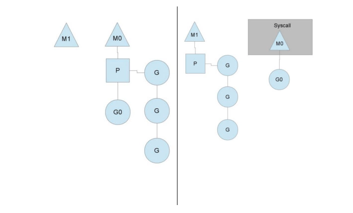

# [Go goroutine理解](https://segmentfault.com/a/1190000018150987)

## 线程与协程

- 线程（Thread）：有时被称为轻量级进程(Lightweight Process，LWP），是程序执行流的**最小单元**。一个标准的线程由**线程ID，当前指令指针(PC），寄存器集合和堆栈**组成。另外，线程是进程中的一个实体，是被系统独立调度和分派的**基本单位**，线程自己**不拥有系统资源**，只拥有一点儿在运行中必不可少的资源，但它可与同属一个进程的其它线程**共享进程所拥有的全部资源**。

线程拥有自己独立的栈和共享的堆，共享堆，不共享栈，线程的切换一般也**由操作系统调度**。

- 协程（coroutine）：又称微线程与子例程（或者称为函数）一样，协程（coroutine）也是一种程序组件。相对子例程而言，协程更为一般和灵活，但在实践中使用没有子例程那样广泛。

和线程类似，共享堆，不共享栈，协程的切换一般由程序员在代码中**显式控制**。它避免了**上下文切换的额外耗费，兼顾了多线程的优点，简化了高并发程序的复杂**。

Goroutine和其他语言的协程（coroutine）在使用方式上**类似**，但从字面意义上来看不同（一个是Goroutine，一个是coroutine），再就是协程是一种**协作任务控制机制**，在最简单的意义上，**协程不是并发的**，而Goroutine支持并发的。因此Goroutine可以理解为一种Go语言的协程。同时它可以**运行在一个或多个线程上**。

> 协程与goroutine的区别: 并发，多线程

## GO并发的实现原理 

Go实现了两种并发形式。

- 第一种是大家普遍认知的：**多线程共享内存**。其实就是Java或者C++等语言中的多线程开发。

- 另外一种是Go语言特有的，也是Go语言推荐的：**CSP**（communicating sequential processes）并发模型。

CSP并发模型是在1970年左右提出的概念，属于比较新的概念，不同于传统的**多线程通过共享内存**来通信，CSP讲究的是“以**通信的方式**来**共享内存**”。

普通的线程并发模型，就是像Java、C++、或者Python，他们**线程间通信都是通过共享内存的方式来进行的**。非常典型的方式就是，在访问共享数据（例如数组、Map、或者某个结构体或对象）的时候，通过**锁**来访问，因此，在很多时候，衍生出一种方便操作的数据结构，叫做“**线程安全的数据结构**”。例如Java提供的包”java.util.concurrent”中的数据结构。Go中**也**实现了传统的线程并发模型。

Go的CSP并发模型，是通过goroutine和channel来实现的。

- goroutine 是Go语言中并发的**执行单位**。有点抽象，其实就是和传统概念上的”线程“类似，可以理解为”线程“。
- channel是Go语言中各个并发结构体(goroutine)之前的**通信机制**。 通俗的讲，就是各个goroutine之间通信的”**管道**“，有点类似于Linux中的管道。

> 而且不管传还是取，必阻塞，直到另外的goroutine传或者取为止。

## GO并发模型的实现原理

我们先从线程讲起，无论语言层面何种并发模型，到了操作系统层面，**一定**是以**线程的形态**存在的。而操作系统根据资源访问权限的不同，体系架构可分为**用户空间和内核空间**；内核空间主要操作访问CPU资源、I/O资源、内存资源等**硬件资源**，为上层应用程序**提供**最基本的基础资源，用户空间呢就是上层应用程序的**固定活动空间**，用户空间不可以**直接**访问资源，必须通过“系统调用”、“库函数”或“Shell脚本”来调用**内核空间提供的资源**。

我们现在的计算机语言，可以狭义的认为是一种“软件”，它们中所谓的“线程”，往往是**用户态的线程**，和操作系统本身**内核态的线程**（简称KSE），还是有区别的。

### 用户级线程模型

如图所示，多个用户态的线程对应着一个内核线程，程序线程的创建、终止、切换或者同步等线程工作必须自身来完成。它可以做**快速的上下文切换**。缺点是**不能有效利用多核CPU**。

> 有点类似python的协程

### 内核级线程模型
这种模型直接调用操作系统的**内核线程**，所有线程的创建、终止、切换、同步等操作，都由**内核**来完成。一个用户态的线程**对应**一个系统线程，它可以利用多核机制，但上下文切换需要**消耗额外**的资源。C++就是这种。

### 两级线程模型
M个用户线程对应N个系统线程，缺点增加了**调度器的实现难度**。

Go语言的线程模型就是一种特殊的两级线程模型（GPM调度模型）。

## Go线程实现模型MPG

- M指的是Machine，一个M直接关联了一个**内核线程**。由操作系统管理。
- P指的是”processor”，代表了M所需的**上下文环境**，也是处理**用户级**代码逻辑的**处理器**。它负责衔接M和G的调度上下文，将等待执行的G与M对接。
- G指的是Goroutine，其实本质上也是一种**轻量级的线程**。包括了调用栈，重要的调度信息，例如channel等。

P的数量由环境变量中的GOMAXPROCS决定，通常来说它是和**核心数**对应，例如在4Core的服务器上回启动4个线程。G会有很多个，每个P会将Goroutine从一个**就绪的队列**中做**Pop**操作，为了**减小锁的竞争**，通常情况下**每个P会负责一个队列**。

> 多线程调度器的主要问题是调度时的锁竞争会严重浪费资源

上下文P(Processor)的数量在启动时设置为GOMAXPROCS环境变量的值或通过运行时函数GOMAXPROCS()。通常情况下，在程序执行期间不会更改。上下文数量固定意味着**只有固定数量的线程在任何时候运行Go代码**。我们可以使用它来调整Go进程到个人计算机的调用，例如4核PC在4个线程上运行Go代码。

> 所以多线程调度器引入了 GOMAXPROCS 变量帮助我们灵活控制程序中的最大处理器数，即活跃线程数。

## 抛弃P(Processor)
你可能会想，为什么一定需要一个上下文，我们能不能直接除去上下文，让Goroutine的runqueues挂到M上呢？答案是不行，需要上下文的**目的**，是让我们可以直接**放开**其他线程，当遇到**内核线程阻塞**的时候。

一个很简单的例子就是系统调用sysall，一个线程肯定不能同时执行代码和系统调用被阻塞，这个时候，此线程M需要放弃当前的上下文环境P，以便可以让其他的Goroutine被调度执行。

M0中的G0执行了syscall，然后就**创建了一个M1(也有可能来自线程缓存)**，（转向右图）然后M0**丢弃**了P，等待syscall的返回值，M1接受了P，将·**继续执行**Goroutine队列中的其他Goroutine。

当系统调用syscall结束后，M0会“**偷**”一个上下文，如果不成功，M0就把它的Gouroutine G0放到一个全局的**runqueue**中，将自己置于**线程缓存**中并进入**休眠状态**。全局runqueue是各个P在运行完自己的本地的Goroutine runqueue后用来拉取新goroutine的地方。P也会**周期性的检查**这个全局runqueue上的goroutine，否则，全局runqueue上的goroutines可能得不到执行而饿死。

> 理解：M内核线程是动态扩展的，P代表的是处理器，则是固定的，负责内核线程阻塞时的调度

## 均衡的分配工作

按照以上的说法，上下文P会定期的检查全局的goroutine 队列中的goroutine，以便自己在消费掉自身Goroutine队列的时候有事可做。假如全局goroutine队列中的goroutine也没了呢？就**从其他运行的中的P的runqueue里偷**。

每个P中的Goroutine不同导致他们运行的效率和时间也不同，在一个有很多P和M的环境中，不能让一个P跑完自身的Goroutine就没事可做了，因为或许其他的P有很长的goroutine队列要跑，得需要均衡。
该如何解决呢？

Go的做法倒也直接，从其他P中**偷一半**！

## 总结

### 优点：

1、开销小

POSIX的thread API虽然能够提供丰富的API，例如配置自己的CPU亲和性，申请资源等等，线程在得到了很多与进程相同的控制权的同时，**开销也非常的大**，在Goroutine中则不需这些**额外的开销**，所以一个Golang的程序中可以支持10w级别的Goroutine。

每个 goroutine (协程) 默认占用内存远比 Java 、C 的线程少（**goroutine：2KB ，线程：8MB**）

2、调度性能好

在Golang的程序中，操作系统级别的线程调度，通常不会做出合适的**调度决策**。例如在GC时，内存必须要达到一个一致的状态。在Goroutine机制里，Golang可以控制Goroutine的调度，从而在一个合适的时间进行GC。

> 在应用层**模拟的线程**，它避免了**上下文切换的额外耗费，兼顾了多线程的优点。简化了高并发程序的复杂度**。

### 缺点：

协程调度机制无法实现公平调度。

---

- [TODO:为什么Goroutine能有上百万个，Java线程却只能有上千个？](https://mp.weixin.qq.com/s/v-Q5aOnYVj7l-kMQopkPLA)

---

# [Go 语言设计与实现：调度器](https://draveness.me/golang/docs/part3-runtime/ch06-concurrency/golang-goroutine/)

> Go 语言的调度器通过使用与 CPU 数量相等的线程减少线程频繁切换的内存开销，同时在每一个线程上执行额外开销更低的 Goroutine 来降低操作系统和硬件的负载。

## 任务窃取调度器
2012 年 Google 的工程师 Dmitry Vyukov 在 Scalable Go Scheduler Design Doc 中指出了现有多线程调度器的问题并在多线程调度器上提出了两个改进的手段：

- 在当前的 G-M 模型中引入了处理器 P，增加中间层；
- 在处理器 P 的基础上实现基于工作窃取的调度器；

## 抢占式调度器
对 Go 语言并发模型的修改提升了调度器的性能，但是 1.1 版本中的调度器仍然不支持抢占式调度，程序只能依靠 Goroutine 主动让出 CPU 资源才能触发调度。Go 语言的调度器在 1.2 版本中引入基于协作的抢占式调度解决下面的问题：

- 某些 Goroutine 可以长时间占用线程，造成其它 Goroutine 的饥饿；
- 垃圾回收需要暂停整个程序（Stop-the-world，STW），最长可能需要几分钟的时间6，导致整个程序无法工作；

1.2 版本的抢占式调度虽然能够缓解这个问题，但是它实现的抢占式调度是基于协作的，在之后很长的一段时间里 Go 语言的调度器都有一些无法被抢占的边缘情况，例如：for 循环或者垃圾回收长时间占用线程，这些问题中的一部分直到 1.14 才被基于信号的抢占式调度解决。

## G

Gorotuine 就是 Go 语言调度器中待执行的任务，它**在运行时调度器中的地位与线程在操作系统中差不多，但是它占用了更小的内存空间，也降低了上下文切换的开销**。

Goroutine 只存在于 Go 语言的运行时，它是 Go 语言在用户态提供的线程，作为**一种粒度更细的资源调度单元**，如果使用得当能够在高并发的场景下更高效地利用机器的 CPU。

## M

Go 语言并发模型中的 M 是操作系统线程。调度器最多可以创建 10000 个线程，但是其中大多数的线程都不会执行用户代码（可能陷入系统调用），最多只会有 GOMAXPROCS 个**活跃线程**能够正常运行。

> M可以动态创建数量，但活跃线程最多只会有GOMAXPROCS个（P的数量）。其他可能陷入系统调用

在大多数情况下，我们都会使用 Go 的默认设置，也就是**线程数等于 CPU 个数**，在这种情况下**不会触发操作系统的线程调度和上下文切换，所有的调度都会发生在用户态，由 Go 语言调度器触发，能够减少非常多的额外开销**。

> 用户态的调度减少开销

## P
调度器中的处理器 P 是线程和 Goroutine 的中间层，它能提供线程需要的上下文环境，也会负责**调度**线程上的等待队列，通过处理器 P 的调度，每一个内核线程都能够执行多个 Goroutine，它**能在 Goroutine 进行一些 I/O 操作时及时切换，提高线程的利用率**。

因为调度器在启动时就会创建 GOMAXPROCS 个处理器，所以 Go 语言程序的处理器数量**一定会等于** GOMAXPROCS，这些处理器会绑定到不同的内核线程上并利用线程的计算资源运行 Goroutine。

---

# [Go 语言设计与实现：调度器（讨论）](https://draveness.me/golang/docs/part3-runtime/ch06-concurrency/golang-goroutine/#comment)

Q: go语言是封装了epoll
A: Go 语言里面有个东西叫网络轮询器 netpoller

Q: go启动后独立的一个线程?
A: 没有独立的线程做这个事情，但是会在一些时间点触发，例如：调度、GC 等

Q: epoll_await阻塞？
A: epoll_wait 有等待时间的，如果没有可读或者可写的文件，就会返回 0

Q: 如果都是系统调用在并发高的情况下，每个G和M都会经过阻塞调用，性能是不是就跟普通的多线程运行没有什么差别了？
A: I/O 操作再慢也会结束的，很难会达到 10000 个线程。理论上肯定存在边界，但是实践中很难达到，极端情况就是退化到跟使用 Thread 差不多或者稍微差一点。之前的回复里也没有说只进行计算，CPU 和 I/O 两种资源肯定都会使用的。

Q: 还是说通过网络io的程序因为epoll的存在不会做线程上下文切换？
A: 一旦发生了系统调用，运行时就可能**调用 runtime.handoffp 创建新的线程**来执行 Goroutine，触发的时机可能包括 — 垃圾回收、系统监控等。

### IO过程
**需要澄清一下整个 io 过程**：

- **io 与系统调用不能混淆，一个 io 过程可能包括多次系统调用**。
（经过一个系统调用发现文件描述符还未可用而）阻塞的 io 首先会导致 G 的挂起，此时 G 与 M 分离，且不在任何 P 的运行队列中，当前的 P 会调度下一个 G，这个阶段不涉及新线程的创建。
- 被 io 挂起的 **G 由网络轮询器维护，直到文件描述符可用**。
- 网络轮询器既会被（在独立线程中的）系统监控 Goroutine 触发，也会被其他各个活跃线程上的 Goroutine 触发。
- 当文件描述符可用时，G 会重新加入到原来的 P 中等待被调度。
- 当 G 被重新调度时，会重新发起读/写系统调用。
- 当 G 进行系统调用的时候，对应的 M 和 P **也阻塞在系统调用，并不会立刻发生抢占**，只有当这个阻塞持续时间过长（10 ms）时，才会将 P（及之上的其他 G）抢占并分配到空闲的 M 上，此时如果没有空闲的，**才会创建新的线程**。

通过以上过程可见，密集的 io 通常并不会产生过多的线程。

> 理解：阻塞IO会导致G的挂起，分离G与M。并通过网络轮询器(调度和系统调用)进行唤醒，加入原来的P的运行队列。除此之外，系统调用，只有阻塞调用过长(10 ms)才会抢占分配或创建新的线程。

Q: 请问，这个G与M分离，是M主动分离还是P的调度主动分离？

A: 如果文件描述符不可读或者不可写，当前 Goroutine 就会执行 runtime.poll_runtime_pollWait 检查 runtime.pollDesc 的状态并调用 runtime.netpollblock 等待文件描述符的可读或者可写：runtime.netpollblock 是 Goroutine 等待 I/O 事件的关键函数，它会使用运行时提供的 runtime.gopark **让出**当前线程，将 Goroutine 转换到**休眠状态并等待运行时的唤醒**。

A: 每一个M在执行的时候都有可能处理epoll事件轮询器的G。

---
# Netpoller

## 参考链接
- [Netpoller](https://draveness.me/golang/docs/part3-runtime/ch06-concurrency/golang-netpoller): 比较复杂，还可以再深入了解 

## 轮询等待
Go 语言的运行时会在调度或者系统监控中调用 runtime.netpoll 轮询网络，该函数的执行过程可以分成以下几个部分：

- 根据传入的 delay 计算 epoll 系统调用需要等待的时间；
- 调用 epollwait 等待可读或者可写事件的发生；
- 在循环中依次处理 epollevent 事件；

runtime.netpollunblock 会在读写事件发生时，将 runtime.pollDesc 中的读或者写信号量转换成 pdReady 并返回其中存储的 Goroutine；如果返回的 Goroutine 不会为空，那么该 Goroutine 就会被加入 toRun 列表，运行时会将列表中的全部 Goroutine 加入运行队列并等待调度器的调度。

## 小结

网络轮询器并不是由运行时中的**某一个线程独立**运行的，运行时中的**调度和系统调用**会通过 runtime.netpoll 与网络轮询器**交换消息**，获取待执行的 Goroutine 列表，并将待执行的 Goroutine **加入运行队列等待处理**。

**所有的文件 I/O、网络 I/O 和计时器**都是由**网络轮询器**管理的，它是 Go 语言运行时重要的组成部分。我们在本节中详细介绍了网络轮询器的设计与实现原理，相信各位读者对这个重要组件也有了比较深入的理解。

---
- [go语言实战](./go语言实战.md#goroutine)
- [Golang 并发模型之 GMP 浅尝](https://mp.weixin.qq.com/s/p_7qZH5Ix3vVJEvbPHyMng)

---
# [Golang调度器GMP原理与调度全分析](https://mp.weixin.qq.com/s?__biz=MzAxMTA4Njc0OQ==&mid=2651438895&idx=3&sn=d7328484410c825c6e35b51a324f0c65&chksm=80bb61ddb7cce8cba59349bcae7c067db08e66428650962450cd3a081b9e96fae8db45758087&scene=21#wechat_redirect)

> 这篇文章讲得很清晰，值得多读。很多点都说到了，M的回收与P的空闲与绑定。

### 进程与线程
进程阻塞所带来的CPU时间浪费。

进程拥有太多的资源，进程的创建、切换、销毁，都会占用很长的时间，CPU虽然利用起来了，但如果进程过多，CPU有很大的一部分都被用来进行进程调度了。

CPU调度切换的是进程和线程。尽管线程看起来很美好，但实际上多线程开发设计会变得更加复杂，要考虑很多同步竞争等问题，如锁、竞争冲突等。

为每个任务都创建一个线程是不现实的，因为会消耗大量的内存(进程虚拟内存会占用4GB[32位操作系统], 而线程也要大约4MB)。

其实一个线程分为“内核态“线程和”用户态“线程。

一个“用户态线程”必须要绑定一个“内核态线程”，但是CPU并不知道有“用户态线程”的存在，它只知道它运行的是一个“内核态线程”(Linux的PCB进程控制块)。

### 协程与goroutine
这样，我们再去细化去分类一下，内核线程依然叫“线程(thread)”，用户线程叫“协程(co-routine)"

协程跟线程是有区别的，线程由CPU调度是抢占式的，协程由用户态调度是协作式的，一个协程让出CPU后，才执行下一个协程。

Go为了提供更容易使用的并发方法，使用了goroutine和channel。goroutine来自协程的概念, **让一组可复用的函数运行在一组线程之上，即使有协程阻塞，该线程的其他协程也可以被runtime调度，转移到其他可运行的线程上**。最关键的是，程序员看不到这些底层的细节，**这就降低了编程的难度，提供了更容易的并发**。

> 阻塞，调度，转移

虽然一个goroutine的栈只占几KB，但实际是可伸缩的，如果需要更多内容，runtime会自动为goroutine分配。

非常轻量，一个goroutine只占几KB

### 被遗弃的goroutine调度器

M想要执行、放回G都必须访问全局G队列，并且M有多个，即多线程访问同一资源需要加锁进行保证互斥/同步，所以全局G队列是有互斥锁进行保护的。

- 很差的局部性
- 激烈的锁竞争
- 系统调用(CPU在M之间的切换)导致频繁的线程阻塞和取消阻塞操作增加了系统开销。

Processor，它包含了运行goroutine的资源，如果线程想运行goroutine，必须先获取P，P中还包含了可运行的G队列。

线程是运行goroutine的实体，调度器的功能**是把可运行的goroutine分配到工作线程上**。

所有的P都在程序启动时创建，并保存在数组中，最多有GOMAXPROCS(可配置)个。

线程想运行任务就得获取P，从P的本地队列获取G，P队列为空时，M也会尝试从全局队列拿一批G放到P的本地队列，或从其他P的本地队列偷一半放到自己P的本地队列。M运行G，G执行之后，M会从P获取下一个G，不断重复下去。

同全局队列类似，存放的也是等待运行的G，存的数量有限，不超过256个。新建G'时，G'优先加入到P的本地队列，如果队列满了，则会把本地队列中一半的G移动到全局队列。

Goroutine调度器和OS调度器是通过M结合起来的，每个M都代表了1个内核线程，OS调度器负责把内核线程分配到CPU的核上执行。

在程序执行的任意时刻都只有$GOMAXPROCS个goroutine在同时运行。

一个M阻塞了，会创建新的M。

**没有足够的M来关联P并运行其中的可运行的G。比如所有的M此时都阻塞住了，而P中还有很多就绪任务，就会去寻找空闲的M，而没有空闲的，就会去创建新的M。**

**当本线程无可运行的G时，尝试从其他线程绑定的P偷取G，而不是销毁线程。**

**当本线程因为G进行系统调用阻塞时，线程释放绑定的P，把P转移给其他空闲的线程执行。**

> **避免频繁的创建、销毁线程，而是对线程的复用。**

### 线程复用

在coroutine中要等待一个协程主动让出CPU才执行下一个协程，在Go中，一个goroutine最多占用CPU 10ms，防止其他goroutine被饿死，这就是goroutine不同于coroutine的一个地方。

> go与coroutine的不一样的地方

### 系统调用与阻塞的M表现

当M执行某一个G时候如果发生了syscall或则其余阻塞操作，M会阻塞，如果当前有一些G在执行，runtime会把这个线程M从P中摘除(detach)，然后再创建一个新的操作系统的线程(如果有空闲的线程可用就复用空闲线程)来服务于这个P

当M系统调用结束时候，这个G会尝试获取一个空闲的P执行，并放入到这个P的本地队列。如果获取不到P，那么这个线程M变成休眠状态， 加入到空闲线程中，然后这个G会被放入全局队列中

> M获取不到P的情况。M变为空闲线程，复用或者GC回收。G放全局队列

不需要在heap上分配，M0负责执行初始化操作和启动第一个G

G0仅用于负责调度的G，G0不指向任何可执行的函数, 每个M都会有一个自己的G0。在调度或系统调用时会使用G0的栈空间, 全局变量的G0是M0的G0。

初始化m0、栈、垃圾回收，以及创建和初始化由GOMAXPROCS个P构成的P列表。

m0已经绑定了P，会从P的本地队列获取G，获取到main goroutine。

G1运行完成后(函数：goexit)，M上运行的goroutine切换为G0，G0负责调度时协程的切换（函数：schedule）。从P的本地队列取G2，从G0切换到G2，并开始运行G2(函数：execute)。实现了线程M1的复用。

把P1中本地队列中前一半的G，还有新创建G转移到全局队列

M2尝试从全局队列(简称“GQ”)取一批G放到P2的本地队列（函数：findrunnable()）。M2从全局队列取的G数量符合下面的公式：

`n = min(len(GQ)/GOMAXPROCS + 1, len(GQ/2))`

M3和M4没有goroutine可以运行，M3和M4处于自旋状态，它们不断寻找goroutine。

**自旋本质是在运行，线程在运行却没有执行G，就变成了浪费CPU. 为什么不销毁现场，来节约CPU资源**。因为创建和销毁CPU也会浪费时间，我们希望当有新goroutine创建时，立刻能有M运行它，如果销毁再新建就增加了时延，降低了效率。当然也考虑了过多的自旋线程是浪费CPU，所以系统中最多有GOMAXPROCS个自旋的线程(当前例子中的GOMAXPROCS=4，所以一共4个P)，**多余的没事做线程会让他们休眠**。

> 绑定P的M，空闲也是在自旋，目的是为了是避免销毁和创建的损耗，即使浪费一定的

G8进行了阻塞的系统调用，M2和P2立即解绑，P2会执行以下判断：如果P2本地队列有G、全局队列有G或有空闲的M，P2都会立马唤醒1个M和它绑定，否则P2则会加入到空闲P列表，等待M来获取可用的p

复用空闲线程。如果没有任务则直接加入到空闲P。待M完成后，继续绑定会该

M2和P2会解绑，但M2会记住P2，然后G8和M2进入系统调用状态。当G8和M2退出系统调用时，会尝试获取P2，如果无法获取，则获取空闲的P，如果依然没有，G8会被记为可运行状态，并加入到全局队列,M2因为没有P的绑定而变成休眠状态(**长时间休眠等待GC回收销毁**)。

> 长时间休眠等待GC回收销毁

系统调用恢复的M的场景。长时间休眠等待GC回收销毁
