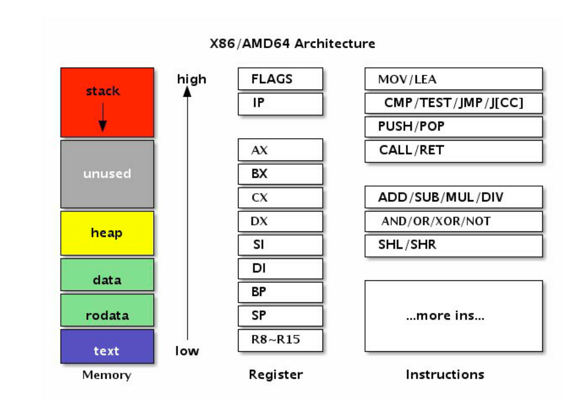

## 1.5 面向并发的内存模型

首先，每个系统级线程都会有一个固定大小的栈（一般默认可能是2MB），这个栈主要用来保存函数递归调用时参数和局部变量。固定了栈的大小导致了两个问题：一是对于很多只需要很小的栈空间的线程来说是一个巨大的浪费，二是对于少数需要巨大栈空间的线程来说又面临栈溢出的风险。针对这两个问题的解决方案是：要么降低固定的栈大小，提升空间的利用率；要么增大栈的大小以允许更深的函数递归调用，但这两者是没法同时兼得的。相反，一个Goroutine会以一个很小的栈启动（可能是2KB或4KB），当遇到深度递归导致当前栈空间不足时，Goroutine会根据需要动态地伸缩栈的大小（主流实现中栈的最大值可达到1GB）。因为启动的代价很小，所以我们可以轻易地启动成千上万个Goroutine。

原子操作配合互斥锁可以实现非常高效的单件模式。互斥锁的代价比普通整数的原子读写高很多，在性能敏感的地方可以增加一个数字型的标志位，通过原子检测标志位状态降低互斥锁的使用次数来提高性能。

我们创建了 setup 线程，用于对字符串 a 的初始化工作，初始化完成之后设置 done 标志为 true 。 main 函数所在的主线程中，通过 for !done {} 检测 done 变为 true 时，认为字符串初始化工作完成，然后进行字符串的打印工作。

但是Go语言并不保证在 main 函数中观测到的对 done 的写入操作发生在对字符串 a 的写入的操作之后，因此程序很可能打印一个空字符串。更糟糕的是，因为两个线程之间没有同步事件， setup 线程对 done 的写入操作甚至无法被 main线程看到， main 函数有可能陷入死循环中。

在Go语言中，同一个Goroutine线程内部，顺序一致性内存模型是得到保证的。但是不同的Goroutine之间，并不满足顺序一致性内存模型，需要通过明确定义的同步事件来作为同步的参考。如果两个事件不可排序，那么就说这两个事件是并发的。为了最大化并行，Go语言的编译器和处理器在不影响上述规定的前提下可能会对执行语句重新排序（CPU也会对一些指令进行乱序执行）。

因此，如果在一个Goroutine中顺序执行 a = 1; b = 2; 两个语句，虽然在当前的Goroutine中可以认为 a = 1; 语句先于 b =2; 语句执行，但是在另一个Goroutine中 b = 2; 语句可能会先于 a = 1; 语句执行，甚至在另一个Goroutine中无法看到它们的变化（可能始终在寄存器中）。也就是说在另一个Goroutine看来, a = 1; b = 2; 两个语句的执行顺序是不确定的。如果一个并发程序无法确定事件的顺序关系，那么程序的运行结果往往会有不确定的结果。

用前面的原子操作并不能解决问题，因为我们无法确定两个原子操作之间的顺序。解决问题的办法就是通过同步原语来给两个事件明确排序

严谨的并发程序的正确性不应该是依赖于CPU的执行速度和休眠时间等不靠谱的因素的。严谨的并发也应该是可以静态推导出结果的：根据线程内顺序一致性，结合Channel或 sync 同步事件的可排序性来推导，最终完成各个线程各段代码的偏序关系排序。如果两个事件无法根据此规则来排序，那么它们就是并发的，也就是执行先后顺序不可靠的。

解决同步问题的思路是相同的：使用显式的同步。

必须要和有异常的栈帧只隔一个栈帧， recover 函数才能正 常捕获异常。换言之， recover 函数捕获的是祖父一级调用 函数栈帧的异常（刚好可以跨越一层 defer 函数）！

Go汇编语言并不是一个独立的语言，因为Go汇编程序无法独 立使用。Go汇编代码必须以Go包的方式组织，同时包中至少 要有一个Go语言文件用于指明当前包名等基本包信息。如果 Go汇编代码中定义的变量和函数要被其它Go语言代码引用， 还需要通过Go语言代码将汇编中定义的符号声明出来。用于 变量的定义和函数的定义Go汇编文件类似于C语言中的.c文 件，而用于导出汇编中定义符号的Go源文件类似于C语言的.h 文件。

错误提示汇编中定义的NameData符号没有类型信息。其实Go 汇编语言中定义的数据并没有所谓的类型，每个符号只不过是 对应一块内存而已，因此NameData符号也是没有类型的。

冯·诺伊曼计算机中的指令和 数据存储器其实指的是计算机中的内存，然后在配合CPU处理 器就组成了一个最简单的计算机了。

汇编语言其实是一种非常简单的编程语言，因为它面向的计算 机模型就是非常简单的。让人觉得汇编语言难学主要有几个原 因：不同类型的CPU都有自己的一套指令；即使是相同的 CPU，32位和64位的运行模式依然会有差异；不同的汇编工具 同样有自己特有的汇编指令；不同的操作系统和高级编程语言 和底层汇编的调用规范并不相同。本节将描述几个有趣的汇编 语言模型，最后精简出一个适用于AMD64架构的精简指令集，以便于Go汇编语言的学习。

X86其实是是80X86的简称（后面三个字母），包括Intel 8086、80286、80386以及80486等指令集合，因此其架构被称 为x86架构。x86-64是AMD公司于1999年设计的x86架构的64 位拓展，向后兼容于16位及32位的x86架构。X86-64目前正式 名称为AMD64，也就是Go语言中GOARCH环境变量指定的 AMD64。

左边是内存部分是常见的内存布局。其中text一般对应代码 段，用于存储要执行指令数据，代码段一般是只读的。然后是 rodata和data数据段，数据段一般用于存放全局的数据，其中 rodata是只读的数据段。而heap段则用于管理动态的数据， stack段用于管理每个函数调用时相关的数据。在汇编语言中一 般重点关注text代码段和data数据段，因此Go汇编语言中专门 提供了对应TEXT和DATA命令用于定义代码和数据。

中间是X86提供的寄存器。寄存器是CPU中最重要的资源，每 个要处理的内存数据原则上需要先放到寄存器中才能由CPU处 理，同时寄存器中处理完的结果需要再存入内存。X86中除了 状态寄存器FLAGS和指令寄存器IP两个特殊的寄存器外，还有 AX、BX、CX、DX、SI、DI、BP、SP几个通用寄存器。在 X86-64中又增加了八个以R8-R15方式命名的通用寄存器。因 为历史的原因R0-R7并不是通用寄存器，它们只是X87开始引 入的MMX指令专有的寄存器。在通用寄存器中BP和SP是两个 比较特殊的寄存器：其中BP用于记录当前函数帧的开始位 置，和函数调用相关的指令会隐式地影响SP的值；SP则对应 当前栈指针的位置，和栈相关的指令会隐式地影响SP的值；而 某些调试工具需要BP寄存器才能正常工作。

右边是X86的指令集。CPU是由指令和寄存器组成，指令是每 个CPU内置的算法，指令处理的对象就是全部的寄存器和内 存。我们可以将每个指令看作是CPU内置标准库中提供的一个 个函数，然后基于这些函数构造更复杂的程序的过程就是用汇 编语言编程的过程。
