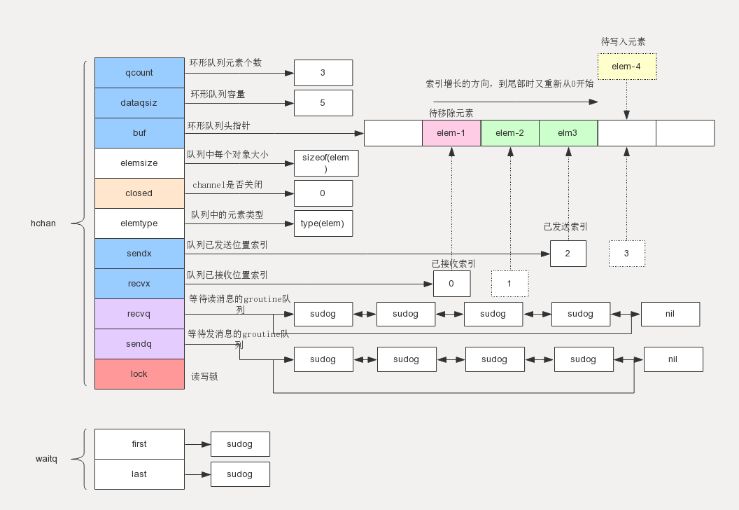

相关源码只需要到runtime包下，全局搜索就可以找到在文件runtime/chan.go下


- [图解Golang channel源码](https://juejin.im/post/6875325172249788429): 主要是围绕着一个环形队列和两个链表展开


---
# 协程池

1、NewTask：往协程池中添加任务

当第一次调用 NewTask 添加任务的时候，由于 work 是无缓冲通道，所以会一定会走第二个 case 的分支：使用 go worker 开启一个协程。
```
func (p *Pool) NewTask(task func()) {
    select {
        case p.work <- task:
        case p.sem <- struct{}{}:
            go p.worker(task)
    }
}
```
2、worker：用于执行任务

为了能够实现协程的复用，这个使用了 for 无限循环，使这个协程在执行完任务后，也不退出，而是一直在接收新的任务。
```
func (p *Pool) worker(task func()) {
    defer func() { <-p.sem }()
    for {
        task()
        task = <-p.work
    }
}
```

这两个函数是协程池实现的关键函数，里面的逻辑很值得推敲：

1、如果设定的协程池数大于 2，此时第二次传入往 NewTask 传入task，select case 的时候，如果第一个协程还在运行中，就一定会走第二个case，重新创建一个协程执行task

2、如果传入的任务数大于设定的协程池数，并且此时所有的任务都还在运行中，那此时再调用 NewTask 传入 task ，这两个 case 都不会命中，会一直阻塞直到有任务执行完成，worker 函数里的 work 通道才能接收到新的任务，继续执行。

- [如何实现一个协程池？](https://github.com/iswbm/GolangCodingTime/blob/master/source/c04/c04_10.rst)：使用通道的实现的方法很值得推敲。
