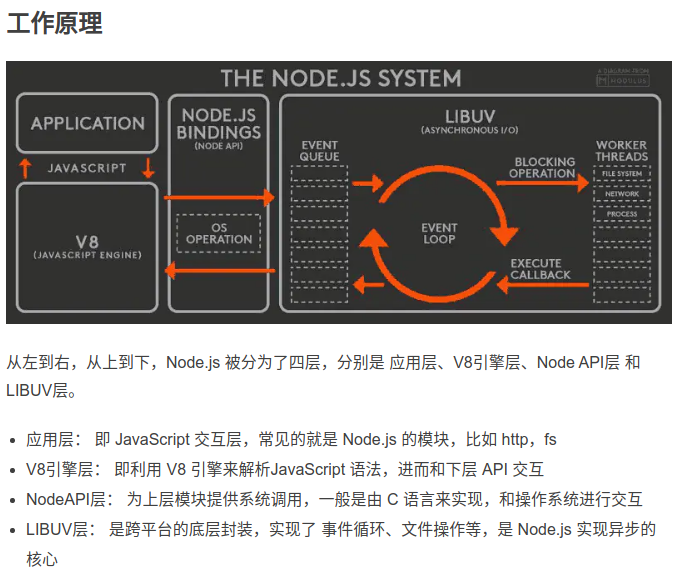

- [Reactor模式](https://www.jianshu.com/p/d224d0699a2b)

这就是最简单的Reactor模式，它其实也是I/O多路复用的一种具现，用户不需要考虑并发的问题，直接交给了事件处理器进行，同时也减少了高并发情况下多线程对系统资源的消耗。

> Nodejs是非阻塞的，源于它是基于事件循环的设计模式，该模式也称为Reactor模式。

# node 多线程

**Node.js 里 JavaScript 代码的执行是单线程的，但是在底层无论是 V8 还是 libuv 都不是**，比如 V8 是一个线程做编译执行一个线程做优化几个线程负责 GC 还有线程负责 profiling 找 JIT 目标， libuv 有**线程池配合 epoll 之类做 I/O 多路复用**，还有其他部分也是……

node.js中所有的逻辑都是事件的回调函数，所以node.js始终在事件循环中，程序入口就是事件循环第一个事件的回调函数。事件的回调函数中可能会发出I/O请求或直接发射（ emit）事件，执行完毕后返回事件循环。事件循环会检查事件队列中有没有未处理的事件，直到程序结束。**node.js的事件循环对开发者不可见**，由libev库实现，libev不断检查是否有活动的、可供检测的事件监听器，直到检查不到时才退出事件循环，程序结束。

- [Node.js机制及原理理解初步](https://blog.csdn.net/leftfist/java/article/details/41891407)

## libuv

libuv内部还维护着一个默认4个线程的线程池，这些线程负责执行文件I/O操作、DNS操作、用户异步代码。当 js 层传递给 libuv 一个操作任务时，libuv 会把这个任务加到队列中。之后分两种情况：

1. 线程池中的线程都被占用的时候，队列中任务就要进行排队等待空闲线程。
2. 线程池中有可用线程时，从队列中取出这个任务执行，执行完毕后，线程归还到线程池，等待下个任务。同时以事件的方式通知event-loop，event-loop接收到事件执行该事件注册的回调函数。

- [源码事件循环流程](https://juejin.im/post/5af1413ef265da0b851cce80)

---

- [Node.js 线程你理解的可能是错的](https://juejin.im/post/5b1e55cbe51d45067e6fcb84): 从问题出发，解析线程与异步操作

Q: Node.js启动的线程数不为1，是因为线程池？

答案：线程数不为1，不是因为线程池，而是因为V8。Node.js启动后会创建V8实例，V8实例是多线程的

Q: 线程池只能用于异步IO？

答案：并不是，除了一些IO密集操作外，Node.js对一些CPU密集的操作也会放到线程池里面执行(Crypto、Zlib模块)

Q: 异步IO都要占用线程池？

答案：并不是，网络IO不会占用线程池。阻塞在主线程，而文件IO才在工作线程。

> 理解：所以应该是node是一个主线程，事件循环，有事件返回则阻塞执行CPU操作。但是底层的v8会立刻创建相应的线程，然后libuv则线程池的形式，按需创建，默认是4。 [参考](./异步.md)

> 所以node是主线程的同步代码执行完成后再执行异步回调的 [同步优先、异步靠边、回调垫底](https://blog.csdn.net/u010297791/article/details/71158212)

---

## 不要阻塞你的事件循环

Node.js 通过事件循环机制（初始化和回调）的方式运行 JavaScript 代码，并且提供了一个线程池处理诸如文件 I/O 等高成本的任务。

Node.js 是用很少量的线程来处理大量客户端请求的。 在 Node.js 中，有两种类型的线程：**一个事件循环线程（也被称为主循环，主线程，事件线程等）。另外一个是在工作线程池里的 k 个工作线程（也被称为线程池）。**

如果一个线程执行一个回调函数（事件轮询线程）或者任务（工作线程）需要耗费很长时间，我们称之为“阻塞”。 当一个线程在处理某一个客户端请求时被阻塞了，它就无法处理其它客户端的请求了。

### 事件轮询线程
总体来说，**事件轮询线程执行事件的回调函数，并且负责对处理类似网络 I/O 的非阻塞异步请求**。

> 注意： 网络 I/O 的非阻塞异步请求

### 哪种代码运行在工作线程池？
Node.js 的工作线程池是通过 libuv（相关文档）来实现的，它对外提供了一个通用的任务处理 API。

Node.js 使用**工作线程池**来处理“高成本”的任务。 这包括**一些操作系统并没有提供非阻塞版本的 I/O 操作，以及一些 CPU 密集型的任务。**

Node.js 模块中有如下这些 API 用到了工作线程池：

I/O 密集型任务：
- DNS：dns.lookup()，dns.lookupService()。
- 文件系统：所有的文件系统 API。除 fs.FSWatcher() 和那些显式同步调用的 API 之外，都使用 libuv 的线程池。

CPU 密集型任务：
- Crypto：crypto.pbkdf2()、crypto.scrypt()、crypto.randomBytes()、crypto.randomFill()、crypto.generateKeyPair()。
- Zlib：所有 Zlib 相关函数，除那些显式同步调用的 API 之外，都适用 libuv 的线程池。

### Node 怎么决定下一步该运行哪些代码？

抽象来说，事件轮询线程和工作池线程分别为等待中的事件回调和等待中的任务维护一个队列。

**而事实上，事件轮询线程本身并不维护队列，它持有一堆(IO观察者)要求操作系统使用诸如 epoll (Linux)，kqueue (OSX)，event ports (Solaris) 或者 IOCP (Windows) 等机制去监听的文件描述符。 这些文件描述符可能代表一个网络套接字，一个监听的文件等等**。 当操作系统确定某个文件的**描述符**发生变化，**事件轮询线程将把它转换成合适的事件，然后触发与该事件对应的回调函数**。 你可以通过这里学习到更多有关这个过程的知识

> **主线程通过IO观察者进行转换和进行回调。而工作线程处理那些epoll的不能处理的阻塞任务，并且通过通知IO观察者，达到网络事件一样处理**[参考](./异步.md)

相对而言，工作线程池则使用一个**真实的队列**，里边装的都是要被处理的任务。 一个工作线程从这个队列中取出一个任务，开始处理它。当完成之后这个工作线程向事件循环线程中发出一个“至少有一个任务完成了”的消息。

> 工作线程从队列(一些IO或者CPU任务，会阻塞后面的任务)取出任务，进行内核数据到用户数据的复制等

### 对于应用设计而言，这意味着什么？

因为 Node.js 用少量的线程处理许多客户端连接，如果在处理某个客户端的时候阻塞了，在该客户端请求的回调或任务完成之前，其他等待中的任务可能都不会得到执行机会。 因此，保证每个客户端请求得到公平的执行机会变成了应用程序的责任。 这意味着，**对于任意一个客户端，你不应该在一个回调或任务中做太多的事情**。

事件轮询线程关注着每个新的客户端连接，协调产生一个回应。 所有这些进入的请求和输出的应答都要通过事件轮询线程。 这意味着如果你的事件轮询线程在某个地方**花费太多的时间**，所有当前和未来新的客户端请求都**得不到**处理机会了。

如果您在服务器上操作 JSON 对象（特别是来自客户端的输入），则应谨慎处理在事件循环线程上消费的对象或字符串的大小。

### 任务拆分

不要让复杂的计算阻塞事件循环

你可以把你的复杂计算 拆分开，然后让每个计算分别运行在事件循环中，不过你要定期地让其它一些等待的事件执行就会。

> 无法利用机器的多核硬件能力

### 任务分流
如果你需要做更复杂的任务，拆分可能也不是一个好选项。这是**因为拆分之后任务仍然在事件循环线程中执行，并且你无法利用机器的多核硬件能力。**

> 请记住，**事件循环线程只负责协调客户端的请求，而不是独自执行完所有任务**。 对一个复杂的任务，最好把它从事件循环线程转移到工作线程池上。

你有*两种方式将任务转移到工作线程池执行*。

- 你可以通过开发 C++ 插件 的方式使用内置的 Node.js 工作池。稍早之前的 Node.js 版本，通过使用 NAN 的方式编译你的 C++ 插件，在新版的 Node.js 上使用 N-API。 node-webworker-threads 提供了一个仅用 JavaScript 就可以访问 Node.js 的工作池的方式。
- 您可以创建和管理自己专用于计算的工作线程池，而不是使用 Node.js 自带的负责的 I/O 的工作线程池。最直接的方法就是使用 Child Process 或者是 cluster。

### 转移到工作线程池的缺陷

这种方法的缺点是**它增大了 通信开销 。 因为 Node.js 仅允许事件循环线程去查访问应用程序的“命名空间”**（保存着 JavaScript 状态）。 在工作线程中是无法操作事件循环线程的命名空间中的 JavaScript 对象的。 因此，**您必须序列化和反序列化任何要在线程间共享的对象**。 然后，工作线程可以对属于自己的这些对象的副本进行操作，并将修改后的对象（或“补丁”） 返回到事件循环线程。

> 事件循环和工作线程的通信开销，需要序列化和反序列化

## 总结 

**对于简单的任务：比如遍历任意长数组的元素，拆分可能是一个很好的选择。 如果计算更加复杂，则分流是一种更好的方法：通信成本（即在事件循环线程和工作线程之间传递序列化对象的开销）被使用多个物理内核的好处抵消。 但是，如果你的服务器严重依赖复杂的计算，则应该重新考虑 Node.js 是否真的很适合该场景？Node.js 擅长于 I/O 密集型任务，但对于昂贵的计算，它可能不是最好的选择。**

## 不要阻塞你的工作线程池

每个工作线程**必须完成其当前任务，才能继续执行工作线程池队列中的下一项**。

一个具有相对昂贵开销任务的客户端请求将减少工作线程池整体的吞吐量，从而降低服务器的吞吐量

### 避免任务拆分

我们需要明确任务拆分的目的是尽量减少任务执行时间的动态变化。 但是如果你可以**人工区分较短的任务和较长的任务**（例如，对数组求和或排序），则可以手动为每个类型的任务创建一个工作池。 将较短的任务和更长的任务分别路由到各自的工作线程池，也是减少任务时间动态变化的另一种方法。

建议这种方案的原因是，做**任务拆分会导致额外的开销（创建工作线程，表示和操作线程池任务队列），而避免拆分会为您节省这些外成本**，同时也会避免你在拆分任务的时候犯错误。

这种方案的缺点是：**所有这些工作池中的工作线程都将消耗空间和时间开销，并将相互竞争 CPU 时间片**。 请记住：每个 CPU 密集任务只在它被调度到的时候才会得到执行。 因此，您应该再仔细分析后才考虑此方案。

无论您只使用 Node.js 工作线程池还是维护单独的工作线程池，都应着力优化线程池的任务吞吐量。

为此，请使用**任务拆分最小化任务执行时间的动态变化范围**。

# 总结 

Node.js 有两种类型的线程：一个事件循环线程和 k 个工作线程。 **事件循环**负责 JavaScript 回调和非阻塞 I/O，**工作线程**执行与 C++ 代码对应的、完成异步请求的任务，包括**阻塞 I/O 和 CPU 密集型**工作。 这两种类型的线程**一次都只能处理一个活动**。 如果**任意一个回调或任务**需要**很长时间**，则运行它的线程将被**阻塞**。 如果你的应用程序发起阻塞的回调或任务，在好的情况下这可能只会导致吞吐量下降（客户端/秒），而在最坏情况下可能会导致**完全拒绝服务**。

要编写高吞吐量、防 DoS 攻击的 web 服务，您必须确保不管在良性或恶意输入的情况下，您的事件循环线程和您的工作线程都不会阻塞。

> 主线程的工作、工作线程的工作。主线程的任务拆分（无法利用机器的多核硬件能力）、任务分流(通信开销大)。

> 工作线程也不要阻塞，会让队列的其他任务无法处理。区分长短任务队列。

>> 都要使用任务拆分最小化任务执行时间的动态变化范围

> node的**局限性**: 适合高IO场景，并且需要注意线程的阻塞。 **Node.js 擅长于 I/O 密集型任务，但对于昂贵的计算，它可能不是最好的选择**

> 深入浅出node.js 还有master-worker模式的解释，笔记。总结node.js的异步原理。python的epoll的应用，go的epoll应用。libuv的作用。

- [不要阻塞你的事件循环](https://nodejs.org/zh-cn/docs/guides/dont-block-the-event-loop/): 对事件循环有很详细的介绍，适合多读。从而分析node的适用场景
- [数据结构](https://www.jianshu.com/p/548ef6a267ba)

---

- [Epoll缺陷](/notebook/network/epoll.md#Epoll缺陷): 结合epoll的缺点，理解libuv的工作原理。

**epoll 目前只支持 pipe, 网络等操作产生的 fd，暂不支持文件系统产生的 fd。**

**libuv** 使用 epoll 来构建 **event-loop** 的主体，其中：

- socket, pipe 等能通过 epoll 方式监听的 fd 类型，通过 epoll_wait 的方式进行监听；
- 文件处理 / DNS 解析 / 解压、压缩等操作，**使用工作线程的进行处理，将请求和结果通过两个队列建立联系，由一个 pipe 与主线程进行通信， epoll 监听该 fd 的方式来确定读取队列的时机**。

> 也就是上文所说的非阻塞的异步IO，网络IO直接通过epoll来监听相关的fd。文件系统则独立工作线程，也就是一些操作系统并没有提供非阻塞版本的 I/O 操作，以及一些 CPU 密集型的任务
