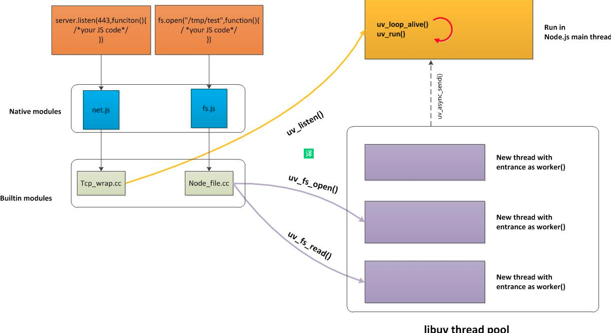
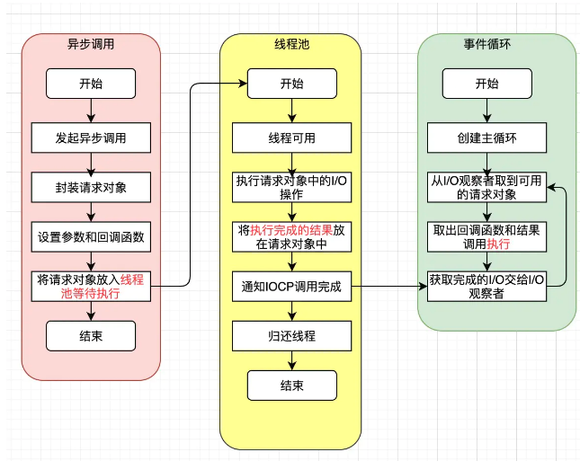

# Node 与底层之间的异步I/O调用流程

- [Node 与底层之间如何执行异步 I/O 调用](https://juejin.cn/post/6844904086949593101)

## libuv
Libuv是一个高性能的，事件驱动的异步I/O库，它本身是由C语言编写的，具有很高的可移植性。libuv封装了不同平台底层对于异步IO模型的实现，libuv 的 API 包含有时间，非阻塞的网络，异步文件操作，子进程等等，所以它还本身具备着Windows, Linux都可使用的跨平台能力。

libuv 对 Network I/O和 File I/O 采用不同的机制。

上图右半部分，主要分成两个部分：

- 主线程：主线程也是 node 启动时执行的现成。node 启动时，会完成一系列的初始化动作，启动 V8 engine，进入下一个循环。
- 线程池：**线程池的数量**可以通过环境变量 UV_THREADPOOL_SIZE 配置，最大不超过 128 个，默认为 4 个。

> 在Node.js 中经典的代码调用方式：都是从 JavaScript 调用 Node 核心模块，核心模块调用 C++ 内建模块，内建模块通过 libuv 进行系统调用。请记住这段话

## 事件循环
不管是server.listen还是fs.open，他们在开启一个 node 服务(进程)的时候，Node会创建一个while(true)的循环，这个循环就是事件循环。每执行一次循环体的过程，我们称之为Tick。每个Tick的过程就是查看是否有事件待处理，如果有，就取出事件及其相关的回调函数。如果存在关联的回调函数，就执行。然后进入下一个循环，如果不再有事件处理，退出进程。

## File I/O
（这里就用到了文初提到的模块分类知识）先是 javascript 代码，然后调用 lib/fs.js 核心模块代码 fs.open ，核心模块调用 C++ 内建模块 src/node_file.cc，内建模块c++代码会有一个平台判断，然后通过 libuv 进行系统调用。

从前面到达 libuv ，会有一个参数，请求对象，也就是open函数前面整个流程传递进来的请求对象，它保存了所有状态，包括送入线程池等待执行以及I/O操作完毕后的回调处理。

请求对象组装完成后，送入 libuv 中创建的 I/O 线程池，线程池中的 I/O 操作完毕后，会将获取的结果存储到 req->result 属性上，然后通知某函数通知 IOCP ，告知当前对象操作已经完成。

在这整个过程中，进程初期创建的事件循环中有一个 I/O 观察者，每次 Tick 的执行中，它会**调用 IOCP 相关的方法检查线程池中是否有执行完成的请求**，如果存在，会讲请求对象和之前绑定的 **result 属性**，加入到 I/O 观察者的队列中，然后将其当作事件处理。

> 理解：可以看到线程池是把内核数据复制到用户态数据，并将结果封装。然后主的事件循环检查和获取完成的IO，交给I/O观察者，以此在下一个循环进行执行。

## Network I/O

**重点**：虽然 libuv 的异步文件 I/O 操作是通过线程池实现的，但是网络 I/O 总是在单线程中执行的（epoll_wait后主线程读数据），注意最后还是会把完成的内容(指文件)作为事件加入事件循环，**事件循环就和文件I/O相同了**。

> 所以是主线程在进行同步读数据的？跟python一样？

## 总结

对比传统的服务器模型:
- 同步式: 同步的服务，一次只能处理一个请求，并且其余请求都处于等待状态。
- 每进程/每请求: 为每个请求启动一个进程，这样可以处理多个请求，但是不具有扩展性，系统资源有限，开启太多进程不太合适
- 每线程/每请求: 为每个请求启动一个线程来处理。尽管线程比进程轻量，但是每个线程也都会占用一定内存，当大并发请求的时候，也会占用很大内存，导致服务器缓慢。

看了文章前面的内容，Node **通过事件驱动的方式处理请求，无需为每个请求创建额外的对应线程**，可以省掉创建线程和销毁线程的开销，同时操作系统在调度任务时因为**线程较少，上下文切换的代价很低**。这也是 Node.js 高性能之一

> Nginx 目前也采用了和 Node 相同的事件驱动方式，有兴趣的也去了解下，不过 Nginx 采用 c 语言编写。

> 理解：网络IO总是在单线程执行，通过epoll进行优化。而文件IO则是通过多线程（固定的数量）进行同步阻塞处理，并将完成的IO交给I/O观察者。(这些都是libuv的特性, 可以进一步了解libuv的原理).所以说的node适合IO密集型，是相对于CPU密集和文件IO对比。而不是网络IO。

- [为什么Node.js只适合I/O密集型任务研究](https://jinyy.app/article/node.js-io/): 代码对比，对比的文件I/O。我们发现，请求是交替执行的。也就证明了，进行文件读取的时候。执行线程是可以处理其他请求的。
