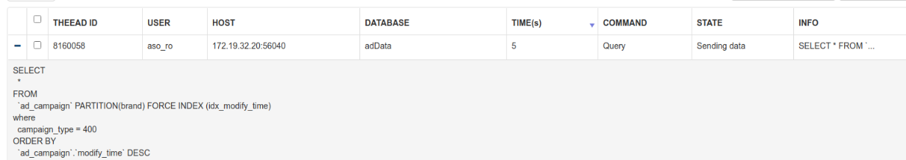

# 生产中的优化案例

- [5.7: statement-optimization](https://dev.mysql.com/doc/refman/5.7/en/statement-optimization.html)

---
## 分页

获取全量和增量数据，避免数据量过大时的慢查询语句。使用分页器，django的orm自带有个**Paginator的分页获取数据的东西**。

这个的原理是获取到查询语句的总数，然后进行limit, offset 的翻页操作。当数据量过大后，翻都后面的页效率很差。

1. 故改成primary key > 上页最后的offset limit 10000 order by primary key 这样分批获取数据。
2. 其实还可以通过子查询进行优化，获取到相应的primary_key的值范围后，在进行列数据的获取，减少回查。例子： [分页查询优化](./common.md#命中页)

---
## 自增

自增溢出问题，insert ignore 因为自增锁的特性，会导致自增主键空洞的问题。

可以通过一个互斥表去进行优化，生产环境则比较直接，先查，不存在再插。

互斥表：

```sql
insert into foo(name) select 'name' from mutex left outer join foo on foo.name='name' where mutex.i = 1 and foo.name is null;
```

原理是：通过mutex表left join插入表获取得到是否已存在的记录。已存在不会执行插入。所以也就不会刷新自增值。会锁表或者造成其他问题吗？

- [avoiding-auto-increment-holes-on-innodb-with-insert-ignore](https://www.percona.com/blog/2011/11/29/avoiding-auto-increment-holes-on-innodb-with-insert-ignore/)
- [自增锁](./自增锁.md)


---
## 索引失效

### 数据类型不匹配
MySQL对varchar型字段的索引，字段类型不同造成的隐式转换，导致索引失效

例子： usename (字符和数值)和 site_product_id 的查询(字符集的对比规则不用)

- [mysql-will-not-use-indexes-if-you-query-the-wrong-data-type](https://makandracards.com/makandra/14955-mysql-will-not-use-indexes-if-you-query-the-wrong-data-type)


### 索引和查询错误

```sql
SELECT `product`.`id`, `product`.`seller_company_id` FROM `product` WHERE (`product`.`first_monitor_time` IS NOT NULL AND `product`.`seller_company_id` IN (801155, ..., 802176) AND `product`.`id` < 4420531) ORDER BY `product`.`id` DESC LIMIT 1000;
```


背景：根据seller_company_id获取product，但是担心in集合过大，导致返回的数据量过多。故做了游标翻页的操作。每次记录下标后通过<、order、limit进行翻页

想要使用的索引是idx_company：
```
id | select_type | table | type | possible_keys | key | key_len | ref | rows | Extra
1	SIMPLE	product	range	PRIMARY,idx_company	idx_company	9	(null)	349	Using index condition; Using where; Using filesort
```

受数据量或者数据库负载，有时会变成直接用PRIMARY。没有用到idx_company的原因如下，当抽样执行计划的时候：
1. idx_company需要反查回primary key 进行 **first_monitor_time的判断**。（first_monitor_time并没有在idx_company上）
2. 而且需要**根据product.id的排序**。idx_company无法根据索引排序，只能通过Using filesort。

故**错误评估**使用了PRIMARY。而查询条件无法命中PRIMARY索引的过滤。只能每次查都需要全表查询。

解决办法：

1. 其实去掉order排序就会用会idx_company，但无法满足需求
2. 写sql的人没有理解清楚怎么做游标翻页。这些明确in范围的，就没有必要进行游标翻页了。如果数据量过大，应该在业务层做分批处理。

> 生产环境中还是比较常见的。还是的注意一些组合起来复杂语句的使用。

---
## 如何优化mysql批量更新操作

通过事务,默认是一条更新一条事务。所以不仅仅更新操作，还有一些事务的相关操作。

如何将批量的合成一个事务进行更新会快些。但是会阻止别人更新，当并发更新的时候有可能会阻塞。

所以先小批量数据合成事务进行更新操作。尽量避免长事务。


- [What's the most efficient way to batch UPDATE queries in MySQL?](https://dba.stackexchange.com/a/30842)

> 插入和更新都有相关的问题： 开启长事务能减少事务频繁开启与关闭的性能损耗，但是会有长事务的风险和失败恢复的成本。

---
## order by null

It's for performance; adding ORDER BY NULL after a GROUP BY clause will **make your query faster**.

5.7的文档：

> If a query includes GROUP BY but you want to **avoid the overhead of sorting the result**, you can suppress sorting by specifying ORDER BY NULL.

如果查询包含GROUP BY，但您希望避免对结果进行排序的开销，则可以通过指定ORDER BY NULL来抑制排序。

> The optimizer may still choose to use sorting to implement grouping operations. ORDER BY NULL suppresses sorting of the result, not prior sorting done by grouping operations to determine the result.

优化器可能仍选择使用排序来实现分组操作。 ORDER BY NULL禁止对结果进行排序，而不是通过group by操作确定结果的先前排序。


django的ORM会自动添加order by null

8.0版本:

> Previously (MySQL 5.7 and lower), GROUP BY sorted **implicitly under certain conditions**. In MySQL 8.0, that no longer occurs, so specifying ORDER BY NULL at the end to suppress implicit sorting (as was done previously) **is no longer necessary**. However, query results may differ from previous MySQL versions. To produce a given sort order, provide an ORDER BY clause.

以前（MySQL 5.7 及更低版本），GROUP BY 在某些条件下隐式排序。,从 MySQL 8.0 开始，GROUP BY 字段不再支持隐式排序。因此不再需要在末尾指定 ORDER BY NULL 来抑制隐式排序。

为了解决这个优美的 Bug，MySQL 团队在 8.0 版本引入了**倒排索引**。**正负向索引排序的优化思路**，给隐式排序体面的落下帷幕。

自此 Group by 隐式排序功能被删除，分组排序必须用 Order by 来进行，分组的算法依然可以基于正负向索引延续之前分组的高效性。

参考链接:
* [order-by-null-in-mysql](https://stackoverflow.com/questions/5231907/order-by-null-in-mysql)
* [order-by-optimization](https://dev.mysql.com/doc/refman/8.0/en/order-by-optimization.html)
* [MySQL 8.0不讲武德，给我挖坑！](https://mp.weixin.qq.com/s/OugxWan0iLxgaToEKoSCXA)

## 表锁
### 分区操作锁查
从库有慢查询，alter不了的话，后面的查询就会处于lock wait

#### Waiting for table metadata loc

问题： show processlist 发现大量的 Waiting for table metadata loc。而且网站所有的查询被卡死。

原因： 发现有一个很长的慢查询。应该是慢查询卡住了alter语句DDL 操作，alter语句卡住了后面的查询DML语句.

解决： kill掉慢查询语句。就恢复正常了。

小结： 长事务的恶劣影响


- 长事务很危险，运行需谨慎。
- 即使你没有显示的开启事务只是执行简单的查询语句，你也需要关注 autocommit 的值
- 使用事务需要小心，记得 commit，捕获异常 rollback
- 做 DDL 操作前先检查一遍 innodb_trx，实在不行先把 DDL 操作干掉，再排查问题
- 设置合理的 lock_wait_timeout

- [mysql: Waiting for table metadata lock](https://zhuanlan.zhihu.com/p/30551926)


### ddl语句锁表
问题： alter被慢查询锁住了
原因： 问题相关查询，是在进行一些alter table等DDL操作时，如果该表上有正在进行的操作(包括读)，则无法获取metadata 独占锁，会阻塞。还会阻塞后续的查询操作

#### 其他卡死原因
- 未提交事务，阻塞DDL，继而阻塞所有同表的后续操作。

MySQL在对DDL操作：

1：mysql 5.6支持**在线ddl操作**，在对表进行alter table 时，对该表的增，删，改，查均不会锁表。（线上用的是：MySQL 5.6.26）

2：但如果在该表被访问时，**执行DDL操作会导致表锁，会阻塞对表的任何操作**（所以在进行上线操作时一定要观察一下是否有对表操作的慢的查询语句或者事务）

3：如果有慢查询 -> 只有慢查询结束了之后，才能创建索引和其他的操作

注意：DDL操作尽量在业务低峰时候操作，以免影响正常业务

### 参考链接
* [sql卡死](https://1181731633.iteye.com/blog/2330291)
* [metadata-locking](https://dev.mysql.com/doc/refman/5.5/en/metadata-locking.html)
* [MySQL创建索引导致锁及表锁阻塞查询](https://blog.csdn.net/leyangjun/article/details/100115400)

---
## Null值

Q: 索引, 主键索引, 联合索引, 覆盖索引介绍, NULL值对于索引的关系

A: 对于NULL值列上的B树索引导致了is null/is not null不走索引？应该是新版有优化，5.6,5.7都可以走索引。

对MySQL来说，null是一个特殊的值，Conceptually, NULL means “a missing unknown value” and it is treated somewhat differently from other values。比如：不能使用=,<,>这样的运算符，对null做算术运算的结果都是null，count时不会包括null行等，

> null比空字符串需要更多的存储空间等?

官方文档说的是：And the row is shorter because the NULLs take no space.So if you have a lot of NULL's your storage should be significantly reduced.

Null值的列表，位图标识，null列所以就不用存值。

- 首先统计表中允许存储NULL的列有哪些。
- 如果表中没有允许存储NULL的列，则NULL值列表也不存在了，否则将每个允许存储NULL的列对应一个二进制位，二进制位按照列的顺序逆序排列
- 设计InnoDB的大叔规定NULL值列表必须用整数个字节的位表示，如果使用的二进制位个数不是整数个字节，则在字节的高位补0。


You start to see the savings here:
```
8 NULLs require 1 byte
8 Empty Strings require 8 bytes
8 Zeros require 32 bytes
```
> 结论：null值能节省更多的空间

参考链接：
- [MySQL中IS NULL、IS NOT NULL、!=不能用索引？胡扯！](https://juejin.im/post/5d5defc2518825591523a1db)
- [IS NULL Optimization](https://dev.mysql.com/doc/refman/5.7/en/is-null-optimization.html)
- [innodb-field-contents.html](https://dev.mysql.com/doc/internals/en/innodb-field-contents.html)
- [Advantage of using NULLS over Empty Strings or Zeros](https://stackoverflow.com/a/32063773)

> 还不如多折腾一下其他层面的更大收益的选择

### 为什么数据库字段要使用NOT NULL？
- [为什么数据库字段要使用NOT NULL？](https://mp.weixin.qq.com/s/_4BlsISjFrnbGk8gciS0Hw): 从各个方面分析尽量避免NULL。

如果查询中包含可为NULL的列，对MySql来说**更难优化**，因为可为NULL的列使得索引、索引统计和值比较都更复杂。可为NULL的列会使用更多的存储空间，在MySql里也需要特殊处理。当可为NULL的列被索引时，每个索引记录需要一个额外的字节，在MyISAM里甚至还可能导致固定大小的索引（例如只有一个整数列的索引）变成可变大小的索引。

通常把可为NULL的列改为NOT NULL带来的**性能提升比较小**，所以（调优时）没有必要首先在现有schema中查找并修改掉这种情况，除非确定这会导致问题。但是，如果计划在列上建索引，就应该尽量避免设计成可为NULL的列。

**当然也有例外，例如值得一提的是，InnoDB使用单独的位（bit）存储NULL值，所以对于稀疏数据有很好的空间效率**。但这一点不适用于MyISAM。

> 所以对于稀疏数据null值有很好的空间效率

书中的描述说了几个主要问题，我这里暂且抛开MyISAM的问题不谈，这里我针对InnoDB作为考量条件。

- 如果不设置NOT NULL的话，NULL是列的默认值，如果不是本身需要的话，**尽量就不要使用NULL**
- 使用NULL带来更多的问题，比如索引、索引统计、值计算更加复杂，如果使用索引，就要**避免列设置成NULL**
- 如果是**索引列**，会带来的**存储空间的问题**，需要额外的特殊处理，还会导致更多的存储空间占用
- 对于稀疏数据有更好的空间效率，稀疏数据指的是很多值为NULL，只有少数行的列有非NULL值的情况

> 但在索引列，null会导致更多的存储空间占用

---
## 时区与时间类型

Q: datetime / timestamp 字段类型区别, 时区/日期/时间戳几个概念的理清, `default current_timestamp update current_timestamp` 的使用场合和局限性

A: 首先 DATETIM 和 TIMESTAMP 类型所占的存储空间不同，前者 8 个字节，后者 4 个字节，这样造成的后果是两者能表示的时间范围不同。前者范围为 `1000-01-01 00:00:00 ~ 9999-12-31 23:59:59`，后者范围为 `1970-01-01 08:00:01 到 2038-01-19 11:14:07`。所以可以看到 TIMESTAMP 支持的范围比 DATATIME 要小,容易出现超出的情况.

> 经验： 一般存储都是时间戳，避免时区转换，业务取数据时候进行处理。

`update current_timestamp`使用场合： 获取增量更新数据？ 局限性？

- [客户端与服务端时区问题](../python/时区.md)

> 期待2038年

---
## 连接池

- [django的优化](../web/django/连接池.md)


---
## 没有命中索引

对于一般的缺失索引场景。一般的指标反映就是**wa值飙高**，也就是更高的IO消耗了。

但是如果是字符字段，场景却不太一样。即使是10万+的表，没有命中索引也是**能比较快响应的**。但是在并发比较高的场景下，**CPU的user值会飙升得很高**，主要还是全表查询，而且是字符比较匹配导致的。

---
# 分区索引

强制指定分区和索引都无法用到modify_time的索引

```sql
explain PARTITIONs SELECT * FROM `ad_campaign`  ORDER BY `ad_campaign`.`modify_time` DESC

-- 直接执行可以正常命中分区的索引，但是pma不行！
SELECT * FROM `ad_campaign`
where campaign_type = 400
ORDER BY `ad_campaign`.`modify_time` DESC limit 1,1000

explain PARTITIONs SELECT * FROM `ad_campaign`
PARTITION(brand)
FORCE INDEX (idx_modify_time) where campaign_type = 400
ORDER BY `ad_campaign`.`modify_time` DESC
```



原因： 没有加上limit导致的, 自以为pma会帮忙解析语句，加上limit。但看查询计划是没有的。加上limit就一切正常了

> Previously, index condition pushdown was not supported for partitioned tables. This limitation was removed in MySQL 5.7.3.

索引下推跟这个索引失效没有什么联系。
