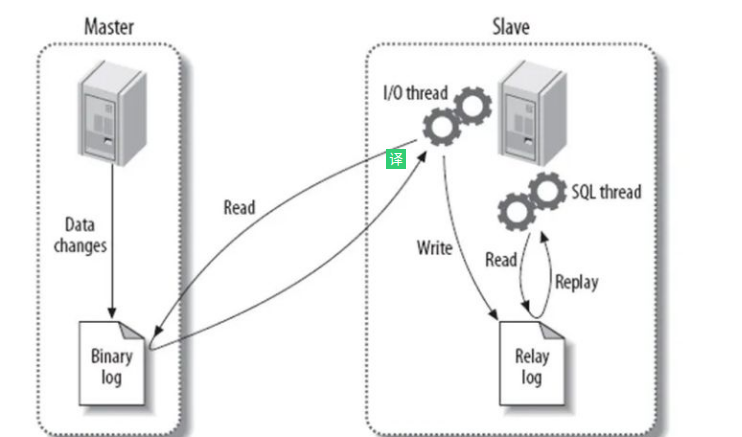

# 问题
### 6. MySQL的binlog有有几种录入格式？分别有什么区别？

有三种格式，**statement，row和mixed**。

- statement模式下，每一条会**修改数据的sql**都会记录在binlog中。**不需要记录每一行的变化**，**减少了binlog日志量，节约了IO，提高性能**。由于sql的执行是有**上下文的**，因此在保存的时候需要保存相关的信息，同时还有一些使用了**函数之类的语句无法被记录复制**。例如当前时间函数。
- row级别下，不记录sql语句上下文相关信息，**仅保存哪条记录被修改**。记录单元为**每一行的改动**，基本是可以全部记下来但是由于很多操作，会导致**大量行的改动**(比如alter table)，因此这种模式的文件保存的信息太多，日志量太大。
- mixed，一种折中的方案，**普通操作使用statement记录，当无法使用statement的时候使用row**。

此外，新版的MySQL中对row级别也做了一些**优化**，当**表结构发生变化**的时候，**会记录语句而不是逐行记录**。

### 6. 什么是游标？
游标是系统为用户开设的一个数据缓冲区，存放SQL语句的执行结果，每个游标区都有一个名字。用户可以通过游标**逐一获取记录并赋给主变量**，交由主语言进一步处理。


### 4. 超大分页怎么处理？
超大的分页一般从两个方向上来解决.

- **延迟关联或者子查询优化**。数据库层面,`select * from table where id in (select id from table where age > 20 limit 1000000,10)`.这样虽然也load了一百万的数据,但是由于**索引覆盖**,要查询的所有字段都在索引中,所以速度会很快.
- 同时如果ID连续的好,我们还可以select * from table where id > 1000000 limit 10,效率也是不错的,优化的可能性有许多种,但是核心思想都一样,就是减少load的数据.
- 解决超大分页,其实主要是靠**缓存**,可预测性的提前查到内容,**缓存至redis等k-V数据库中**,直接返回即可.

从需求的角度减少这种请求…主要是不做类似的需求(直接跳转到几百万页之后的具体某一页.只允许逐页查看或者按照给定的路线走,这样可预测,可缓存)以及防止ID泄漏且连续被人恶意攻击.


### 3. MySQL数据库cpu飙升到500%的话他怎么处理？
当 cpu 飙升到 500%时，先用操作系统命令 top 命令观察是不是 mysqld 占用导致的，如果不是，找出占用高的进程，并进行相关处理。

如果是 mysqld 造成的， show processlist，看看里面跑的 session 情况，是不是有消耗资源的 sql 在运行。找出消耗高的 sql，看看执行计划是否准确， index 是否缺失，或者实在是数据量太大造成。

一般来说，肯定要 **kill 掉**这些线程(同时观察 cpu 使用率是否下降)，等进行相应的调整(比如说加索引、改 sql、改内存参数)之后，再重新跑这些 SQL。

也有可能是每个 sql 消耗资源并不多，但是突然之间，有**大量的 session 连进来导致 cpu 飙升**，这种情况就需要跟应用一起来分析为何连接数会激增，再做出相应的调整，比如说**限制连接数**等


### 4. 大表怎么优化？某个表有近千万数据，CRUD比较慢，如何优化？分库分表了是怎么做的？分表分库了有什么问题？有用到中间件么？他们的原理知道么？
当MySQL单表记录数过大时，数据库的CRUD性能会明显下降，一些常见的优化措施如下：

- **限定数据的范围**：务必禁止不带任何限制数据范围条件的查询语句。比如：我们当用户在查询订单历史的时候，我们可以控制在一个月的范围内。；
- **读/写分离**：经典的数据库拆分方案，主库负责写，从库负责读；
- **缓存**：使用MySQL的缓存，另外对重量级、更新少的数据可以考虑使用应用级别的缓存；

参考链接：
- [分表](./分表.md)


### 5. MySQL的复制原理以及流程
主从复制：将主数据库中的**DDL和DML操作**通过**二进制日志（BINLOG）传输到从数据库上，然后将这些日志重新执行（重做）；从而使得从数据库的数据与主数据库保持一致**。

主从复制的作用

- 主数据库出现问题，可以**切换到从数据库**。
- 可以进行数据库层面的**读写分离**。
- 可以在从数据库上进行**日常备份**。

MySQL主从复制解决的问题

- **数据分布**：随意开始或停止复制，并在不同地理位置分布数据备份
- **负载均衡**：降低单个服务器的压力
- **高可用和故障切换**：帮助应用程序避免单点失败
- **升级测试**：可以用更高版本的MySQL作为从库

MySQL主从复制工作原理

- 在主库上把数据更高记录到二进制日志
- 从库将主库的日志复制到**自己的中继日志relay log**
- 从库读取中继日志的事件，将其**重放**到从库数据中

基本原理流程，3个线程以及之间的关联

主：binlog线程——记录下所有改变了数据库数据的语句，放进master上的binlog中；

从：io线程——在使用start slave 之后，负责从master上拉取 binlog 内容，放进自己的**relay log**中；

从：sql执行线程——执行relay log中的语句；



----
参考链接：

- [三万字、91道MySQL面试题和答案](https://zhuanlan.zhihu.com/p/114993399)

---

# Innodb的MVCC实现

> - [Innodb的MVCC实现](https://blog.csdn.net/qq_34083066/article/details/107736365)

- 每行记录后面保存两个隐藏列，**一个保存行的创建时间，一个保存行过期时间**，虽然说是时间，但其实他们存储的是系统版本号。
- 每当开启一个新的事务系统版本号会进行递增。也就是时间戳递增。当前系统版本号也会作为当前事务版本号。
- SELECT会附加查询条件：a，查询行创建时间字段小于等于当前事务版本号的数据。保证查询到的数据是当前事务开启前或当前事务增加的数据。b，查询行**过期时间为null或者大于当前事务版本号**的数据，保证当前读取到的数据在事务开启前未被删除。
- INSERT时会将当前事务版本号保存到创建时间。
- DELETE时将当前事务版本号保存到过期时间。
- UPDATE 比较特殊，Innodb会先插入一条新的当前数据，并dd且将当前事务版本号保存到创建时间。然后将当前事务版本号保存到当前数据原有数据行的过期时间。
- 优点：不用加锁减少开销。
- 缺点：每行记录多占用额外存储空间。多出很多维护工作。
- MVCC仅在RC和RR级别生效。
- 为什么RU不生效？？因为RU要求读取的永远是最新行，MVCC不符合标准。
- 那为什么串行化也不生效？？因为他会对所有读取到的数据加锁。保证只有一个事务可以操作数据，也就没机会做多版本控制。

---
# TEXT
> - [记一次关于 Mysql 中 text 类型和索引问题引起的慢查询的定位及优化](https://juejin.cn/post/6844903879318962183)

也就是说 “Sending data” 并不是单纯的发送数据，而是包括“收集 + 发送数据”，这个阶段一般是 query 中最耗时的阶段，那么为什么这个只有 800 行的查询会耗时这么久呢，难道这 800 行中平均每行数据量都很大？所以看一下该表定义：

上述表结构定义中发现有三个字段 query，init\_sql，rely\_list 都是 text 类型字段，而且 query 字段还是 longtext，从我们怀疑出发，试着在 select 查询中去掉 init\_sql 和 query 的查询后再观察结果：

天哪，从 1 秒左右变成了 0.04 秒，完全不是一个数量级的，看来 text 类型的字段对整个查询影响太大了，我们先不急追究为什么，先看如何在当前业务上优化查询，由于考虑到业务场景是前端获取 custom\_table 在某个 data\_connection\_id 下的列表，会返回 query，init\_sql 这两个字段，这个两个字段用户确实会用到，但是只有在用户点击某个 custom\_table 进行编辑或者查看详情时才会用到，那我们为什么不考虑延迟获取呢？只有当用户需要查看详情时再根据主键 ID 去获取对应的信息，这个时候属于 const 查询且只有一行数据，代价非常小。

### step4: 如何优化 Mysql 中 text 和 blob 类型：

##### 什么是行溢出数据？

*   InnoDB 会将一些大对象数据存放在数据页之外的 BLOB 页中，然后在查询时根据指针去对应的 BLOB 页中查询。
*   要不要将数据放在 BLOB 页中，取决于当前页中是否可以存放下至少两行数据，对于默认是 16 KB 大小的页，这个阈值长度是 8098，大于该值的会存放在 BLOB 页中。
*   BLOB 不只存放 text 和 blob 类型，varchar 类型的数据也有可能被存放在 BLOB 页中，而 blob 类型和 text 类型的数据也有可能不被存放在 BLOB 页中。
*   对于 Compact 和 Redundant 行存储格式存放的数据，采用的是部分行溢出存储，前 768 字节还是会存放在当前数据页中的。
*   对于 Compressed 和 Dynamic 行存储格式存放的数据，采用的完全行溢出存储，只用 20 个字节存放指针，其余所有数据都放在行溢出数据中。

##### 为什么要尽量少使用 text 和 blob 类型？
[](#bookmark)

*   首先对于 text 和 blob 类型，在遇到使用临时表的情况时，无法使用内存临时表，只能在磁盘上创建临时表。
*   对于行溢出数据，**InnoDB 一次只会为一个列分配一页的空间，但是当该列超过 32 个页后会一次性分配 64 个页面，存储空间有一定的浪费**。
*   行溢出数据**禁用了自适应哈希索引**，如果作为 where 条件时必须完整的比较整个列。
*   对于 text 和 blob 字段进行排序时，只能使用部分前缀进行排序，默认是 1024 字节，可以通过 max\_sort\_length 进行设置。
*   数据量太大，会导致 InnoDB 每个数据页中存放的行数减少，**从而影响对页面的缓存**。
*   如果存放在行溢出数据中，每次**会根据指针去对应的溢出页进行查询**，**增加页面访问次数**，而且每次查询都是随机 IO，text 字段越多查询次数越多。

##### 如何优化查询？

*   如果有许多大字段，可以**考虑合并这些字段到一个字段**，存储一个大的 200kb 比存储 20 个 10kb 更高效，检查随机页面访问次数。
*   **查询时尽量避免对大字段查询**，尤其是获取列表时，杜绝使用 select \* 查询。
*   可以考虑将大字段专门放在另外一张表中，只有在需要时再**关联查询**，增加 InnoDB 的当前表缓存命中率。
*   如果只需要获取大字段的部分数据，可以使用 SUBSTRING( ) 函数，这样可以**避免使用磁盘临时表**。
*   如果必须使用到磁盘临时表，可以考虑将磁盘临时表**指向在基于内存的文件系统中**，可以通过修改 tmpdir 参数实现。
*   必要时可以考虑**对大字段进行压缩后再存储到表中**。
*   尽量**不要使用大字段作为 where 中的查询条件**。


# 为什么阿里巴巴不建议MySQL使用Text类型

> - [为什么阿里巴巴不建议MySQL使用Text类型？](https://juejin.cn/post/6898479206087262222)

基本上已经确定是写入request_log的log字段引起的，导致binlog_cache频繁的flush，以及binlog过度切换，导致IOPS过高，影响了其他正常的DML操作。

跟开发同学沟通后，计划在下一个版本修复这个问题，不再将request信息写入表中，写入到本地日志文件，通过filebeat抽取到es进行查询，如果只是为了查看日志也可以接入grayLog等日志工具，没必要写入数据库。


## Text类型引发的问题

发现Avg_row_length基本都在150KB左右，Rows = 78w，表的大小约为780000*150KB/1024/1024 = 111.5G。

```sql

set profiling = 1;
update user set info = repeat('f',65535) where id = 11;
show profiles;
show profile cpu,block io for query 1;
```

可以看到主要耗时在updating这一步，IO输出次数16392次，在并发的表上通过id做update，也会变得很慢。

## 总结

由于MySQL是单进程多线程模型，一个SQL语句无法利用多个cpu core去执行，这也就决定了MySQL比较适合OLTP（特点：大量用户访问、逻辑读，索引扫描，返回少量数据，SQL简单）业务系统，同时要针对MySQL去制定一些建模规范和开发规范，尽量避免使用Text类型，它不但消耗大量的网络和IO带宽，同时在该表上的DML操作都会变得很慢。

另外建议将复杂的统计分析类的SQL，建议迁移到实时数仓OLAP中，例如目前使用比较多的clickhouse，里云的ADB，AWS的Redshift都可以，做到OLTP和OLAP类业务SQL分离，保证业务系统的稳定性。

---

# 行格式和溢出

> - [行格式和溢出](https://www.yuque.com/u2278269/gq5x74/pzkge7): 行格式分布和溢出分析

## 行格式

### 一、行有哪些格式？

#### Compact
其实MySQL的数据行有两种格式，
- 一种就是图中的 Compact 格式，
- 还有一种是 Redundant 格式。

Compact好的好处
- Compact是一种紧凑的行格式，设计的初衷就是为了让一个数据页中可以存放更多的数据行。
- Compact能比Redundant格式节约20%的存储。

#### 新格式：Barracuda

MySQL 5.1 中的 innodb_plugin 引入了新的文件格式：Barracuda，该文件格式拥有新的两种行格式：compressed和dynamic。并且把 compact 和 redundant 合称为Antelope。

可以通过命令SHOW TABLE STATUS LIKE 'table_name'；来查看当前表使用的行格式，其中 row_format 列表示当前所使用的行记录结构类型。

#### 其他
MySQL 5.6 版本中，默认 Compact 。

MySQL 5.7.9 及以后版本 ，默认行格式由 innodb\_default\_row\_format 变量决定，默认值是 DYNAMIC ，也可以在 create table 的时候指定 ROW\_FORMAT=DYNAMIC （通过这个可动态调整表的存储格式）。

如果要修改现有表的行模式为compressed或dynamic，
 - 必须先将文件格式设置成 Barracuda （ set global innodb\_file\_format=Barracuda; ）。
 - 再用 ALTER TABLE tablename ROW\_FORMAT=COMPRESSED; 去修改才能生效，否则修改无效却无提示

### 二、紧凑的行格式长啥样？

你肯定晓得表中有的列允许为null，有的列是变长的varchar类型。

那Compact行格式是如何组织描述这些信息的呢？如下图：


每部分包含的数据可能要比我上面标注的1、2、3还要多。

为了给大家更直观的感受和理解我只是挑了一部分展示给大家看。

### 三、MySQL单行能存多大体量的数据？

在MySQL的设定中， 单行数据最大能存储 65535 byte 的数据 （注意是byte，而不是字符）

但是当你像下面这样创建一张数据表时却发生了错误：


原因： MySQL 不允许创建一个长度为65535 byte的列 ， 因为数据页中每一行中都有我们上图提到的隐藏列 。

修改： 所以将 varchar 的长度 降低到65532byte 即可成功创建该表，另外 要注意字符编码为 latin1


注意： 65535指的是字节，而不是字符(字符占用更大)
- 这里的 65535指的是字节 ，而 不是字符(字符占用更大) 。
    - 假如encode= utf8 时 3个byte 表示一个字符。那么65535 / 3 = 21845个字符。。
    - 假如encode= gbk 时 2个byte 表示一个字符。那么65535 / 2= 32767个字符。
- 如果你将charset换成utf8这种编码格式，那varchar(N)中的N其实指的 N个字符 ，而不是N个byte。所以如果你像下面这样创建表就会报错， 修改为 varchar(21845)即可


### 四、compact格式是如何做到紧凑的？

MySQL 每次进行随机的IO读

默认情况下， 数据页的大小为16KB。数据页中存储着数行 。

那就意味着一个数据页中能存储越多的数据行，MySQL整体的进行的IO次数就越少？性能就越快？

Compact格式的实现思路是：当列的类型为 VARCHAR 、 VARBINARY 、 BLOB 、 TEXT 时，该列超过 768 byte 的数据放到其他数据页中去。

如下图：


看到这里来龙去脉是不是很清晰了呢？

**MySQL这样做， 有效的防止了单个varchar列或者Text列太大导致单个数据页中存放的行记录过少而让IO飙升的窘境且占内存的 。**

## 行溢出

### 五、什么是行溢出？

那什么是行溢出呢？

如果数据页默认大小为16KB，换算成byte： 16\*1024 = 16384 byte

那你有没有发现， 单页 能存储的 16384byte 和 单行 最大能存储的 65535byte 差了好几倍呢？

也就是说，
- 大于65532 byte： 假如你要存储的数据行很大超过了65532byte那么你是写入不进去的。
- \[16384byte,65532 byte\]： 假如你要存储的单行数据小于65535byte但是大于16384byte，这时你可以 成功insert ，但是 一个数据页又存储不了你插入的数据 。这时肯定会 行溢出 ！

注意：其实在MySQL的设定中，**发生行溢出并不是达到16384byte边缘才会发生**。

对于 varchar、text 等类型的行。当**这种列存储的长度达到 几百byte 时就会发生 行溢出** 。

变长大字段类型包括blob、text、varchar，其中varchar列值长度大于某数N时也会存溢出页，

在 latin1字符集 下 N值 可以这样计算：

innodb的块大小默认为 16kb ，由于innodb存储引擎表为索引组织表， 树底层的叶子节点为一双向链表，**因此每个页中至少应该有两行记录 ，这就决定了 innodb在存储一行数据的时候不能够超过8k ，减去其它列值所占字节数，约等于N**。

### 六、行如何溢出？

还是看这张图：


在MySQL设定中，当varchar列长度达到 768 byte 后，**会将该列的前768byte 当作prefix 存放在行中， 多出来的数据溢出存放到溢出页中 ，然后 通过一个偏移量指针将两者关联起来 ，这就是 行溢出机制** 。

为什么是768 byte呢？

因为不用的引擎对索引的限制有区别：
- innodb每个列的长度不能大于 767 bytes ；所有组成索引列的长度和不能大于3072 bytes
- myisam 每个列的长度不能大于1000 bytes，所有组成索引列的长度和不能大于1000 bytes

而这个 767字节是怎么计算的？
- 不同的字符集对字段可存储的max会有影响，例如，UTF8字符需要3个字节存储，对于 VARCHAR（255）CHARACTER SET UTF8 列，会占用 255×3 =765 的字节。故该表不能包含超过65,535/765=85这样的列。GBK是双字节的以此类推。
- 可变长度列在评估字段大小时还要考虑存储列实际长度的字节数。例如，VARCHAR（255） CHARACTER SET UTF8 列需要 额外的两个字节来存储值长度信息 ，所以 该列 需要多达 767个字节存储 ，其实最大可以存储65533 字节，剩余两个字节存储长度信息。

### 七、思考一个问题

不知道你有没有想过这样一个问题：

首先你肯定知道，MySQL使用的是B+Tree的聚簇索引，在这棵B+Tree中 非叶子节点是只存索引不存数据，叶子节点中存储着真实的数据。同时叶子结点指向数据页。

问题：那当单行存不下的时候，为啥不存储在两个数据页中呢？ 就像下图这样～。

单个节点存储下，我用多个节点存总行吧！说不定这样我的B+Tee还能变大长高（这其实是错误的想法）

这个错误的描述对应的脑图如下：


那MySQL不这样做的原因如下：
- MySQL想让一个数据页中能存放更多的数据行 ， **至少也得要存放两行数据**。 否则就失去了B+Tree的意义。B+Tree也退化成一个低效的链表。

你可以品一下这句话，他说的每个数据页至少要存放两行数据的意思不是说 数据页不能只存一行。你确确实实可以只往里面写一行数据，然后去吃个饭，干点别的。一直让这个数据页中只有一行数据。

这句话的意思是， 当你往这个数据页中写入一行数据时，即使它很大将达到了数据页的极限，但是通过行溢出机制。**依然能保证你的下一条数据还能写入到这个数据页中** 。

正确的脑图如下：


### 优化 BLOB这类变长大字段

最后参考了《高性能MySQL》，给出一些使用BLOB这类变长大字段类型的建议：
- **大字段在InnoDB里可能浪费大量空间**。例如，若存储字段值只是比行的要求多了一个字节，也会使用整个页面来存储剩下的字节，浪费了页面的大部分空间。同样的，如果有一个值只是稍微超过了32个页的大小，实际上就需要使用96个页面。

- 太长的值可能使得在查询中**作为WHERE条件不能使用索引**，因而执行很慢。在应用WHERE条件之前，MySQL需要把所有的列读出来，所以可能导致MySQL要求InnoDB读取很多扩展存储，然后检查WHERE条件，丢弃所有不需要的数据。

- 一张表里有很多大字段，**最好组合起来单独存到一个列里面**。让所有的大字段共享一个扩展存储空间，比每个字段用自己的页要好。

- 把大字段用COMPRESS()**压缩后再存为BLOB**，或者在发送到MySQL前在应用程序中进行压缩，可以获得显著的空间优势和性能收益。

- 扩展存储禁用了自适应哈希，因为需要完整的比较列的整个长度，才能发现是不是正确的数据。

参考：
- [MySQL数据行溢出的深入理解](https://www.php.cn/mysql-tutorials-414072.html)
- [详解MySQL的数据行和行溢出机制](https://www.jb51.net/article/200618.htm)
