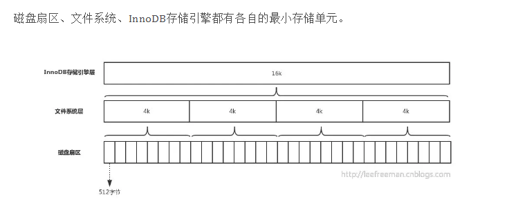

# 索引

### 6. 索引的基本原理
索引用来快速地寻找那些具有特定值的记录。如果没有索引，一般来说执行查询时遍历整张表。

> 索引的原理很简单，就是把无序的数据变成有序的查询

- 把创建了索引的列的内容进行排序
- 对排序结果生成倒排表
- 在倒排表内容上拼上数据地址链
- 在查询的时候，先拿到倒排表内容，再取出数据地址链，从而拿到具体数据

### 8. 索引设计的原则？
- 适合索引的列是出现在where子句中的列，或者连接子句中指定的列
- **基数较小的类，索引效果较差，没有必要在此列建立索引**
- 使用短索引，如果对长字符串列进行索引，应该指定一个**前缀长度，这样能够节省大量索引空间**
- 不要过度索引。**索引需要额外的磁盘空间，并降低写操作的性能**。在修改表内容的时候，索引会进行更新甚至重构，索引列越多，这个时间就会越长。所以只保持需要的索引有利于查询即可。

### 9. 创建索引的原则（重中之重）
索引虽好，但也不是无限制的使用，最好符合一下几个原则

1） **最左前缀匹配原则**，组合索引非常重要的原则，mysql会一直向右匹配直到遇到**范围查询**(>、<、between、like)就停止匹配，比如a = 1 and b = 2 and c > 3 and d = 4 如果建立(a,b,c,d)顺序的索引，d是用不到索引的，如果建立(a,b,d,c)的索引则都可以用到，a,b,d的顺序可以任意调整。

2）较频繁作为查询条件的字段才去创建索引

3）**更新频繁字段不适合创建索引**

4）若是不能有效区分数据的列不适合做索引列(如性别，男女未知，最多也就三种，区分度实在太低)

5）尽量的**扩展索引**，不要新建索引。比如表中已经有a的索引，现在要加(a,b)的索引，那么只需要修改原来的索引即可。

6）定义有外键的数据列一定要建立索引。

7）对于那些查询中很少涉及的列，重复值比较多的列不要建立索引。

8）对于定义为text、image和bit的数据类型的列不要建立索引。

### 14. 前缀索引
语法：index(field(10))，**使用字段值的前10个字符建立索引，默认是使用字段的全部内容建立索引**。

前提：前缀的标识度高。比如密码就适合建立前缀索引，因为密码几乎各不相同。

实操的难度：在于前缀截取的长度。

我们可以利用`select count(*)/count(distinct left(password,prefixLen))`，通过从调整prefixLen的值（从1自增）查**看不同前缀长度的一个平均匹配度，接近1时就可以了**（表示一个密码的前prefixLen个字符几乎能确定唯一一条记录）

### 15. 什么是最左前缀原则？什么是最左匹配原则
顾名思义，就是最左优先，在创建多列索引时，要根据业务需求，**where子句中使用最频繁的一列放在最左边**。

最左前缀匹配原则，非常重要的原则，mysql会一直向右匹配直到遇到**范围查询**(>、<、between、like)就停止匹配，比如a = 1 and b = 2 and c > 3 and d = 4 如果建立(a,b,c,d)顺序的索引，d是用不到索引的，如果建立(a,b,d,c)的索引则都可以用到，a,b,d的顺序可以任意调整。

=和in可以乱序，比如a = 1 and b = 2 and c = 3 建立(a,b,c)索引可以任意顺序，mysql的查询优化器会帮你优化成索引可以识别的形式

### 20.数据库为什么使用B+树而不是B树

- **B树只适合随机检索，而B+树同时支持随机检索和顺序检索**

- B+树的内部结点**并没有指向关键字具体信息的指针，只是作为索引使用，其内部结点比B树小，盘块能容纳的结点中关键字数量更多，一次性读入内存中可以查找的关键字也就越多**，相对的，**IO读写次数也就降低了**。而IO读写次数是影响索引检索效率的最大因素；

- **B树可以在内部节点同时存储键和值，因此，把频繁访问的数据放在靠近根节点的地方将会大大提高热点数据的查询效率**。这种特性使得**B树在特定数据重复多次查询的场景中更加高效**。**B+树的查询效率更加稳定**。B树搜索有可能会在非叶子结点结束，越靠近根节点的记录查找时间越短，只要找到关键字即可确定记录的存在，其性能等价于在关键字全集内做一次二分查找。而在B+树中，顺序检索比较明显，随机检索时，任何关键字的查找都**必须走一条从根节点到叶节点的路**，所有关键字的查找路径长度相同，导致每一个关键字的查询效率相当。

- B-树在**提高了磁盘IO性能的同时并没有解决元素遍历的效率低下的问题**。B+树的叶子节点使用**指针顺序连接在一起，只要遍历叶子节点就可以实现整棵树的遍历**。而且在数据库中基于**范围的查询是非常频繁的，而B树不支持这样的操作**。

- **增删文件（节点）时，效率更高**。因为B+树的**叶子节点包含所有关键字，并以有序的链表结构存储，这样可很好提高增删效率**。？

#### 参考链接

mongo是文档型数据存储，更多的是点查场景，而不是范围查询的场景。如果是范围查询的场景，大部分应该改成冗余数据进文档解决。

- [为什么 MySQL 使用 B+ 树](https://draveness.me/whys-the-design-mysql-b-plus-tree/)

> - [Mysql的索引为什么要使用B+树，而不是B树，红黑树等之类？](https://javamana.com/2021/03/20210315071117566r.html)

**总结：**

*   二叉查找树(BST)：**解决了排序的基本问题，但是由于无法保证平衡，可能退化为链表；**
*   平衡二叉树(AVL)：**通过旋转解决了平衡的问题，但是旋转操作效率太低；**
*   红黑树：**通过舍弃严格的平衡和引入红黑节点，解决了AVL旋转效率过低的问题，但是在磁盘等场景下，树仍然太高，IO次数太多**；
*   B树：**通过将二叉树改为多路平衡查找树，解决了树过高的问题**；
*   B+树：在**B树的基础上，将非叶节点改造为不存储数据的纯索引节点，进一步降低了树的高度；此外将叶节点使用指针连接成链表，范围查询更加高效。**

### 22. 什么是聚簇索引？何时使用聚簇索引与非聚簇索引

- 聚簇索引：将**数据存储与索引放到了一块**，找到索引也就找到了数据
- 非聚簇索引：将数据存储于索引分开结构，**索引结构的叶子节点指向了数据的对应行**

### 24. 联合索引是什么？为什么需要注意联合索引中的顺序？
MySQL可以使用**多个字段同时建立一个索引，叫做联合索引**。在联合索引中，如果想要命中索引，需要按照建立索引时的字段顺序挨个使用，否则无法命中索引。

---
### SQL优化: explain

id相同，执行顺序由上至下。id的序号会递增，id值越大优先级越高，越先被执行。union结果总是放在一个匿名临时表中，临时表不在SQL总出现，因此它的id是NULL。

type(非常重要，可以看到有没有走索引) 访问类型

- const, system：mysql能对查询的某部分进行优化并将其转化成一个**常量**（可以看show warnings 的结果）。用于 primary key 或 unique key 的所有列与常数比较时，所以表最多有一个匹配行，读取1次，速度比较快。
- eq_ref：primary key 或 unique key 索引的所有部分**被连接使用**，最多只会返回一条符合条件的记录。这可能是在 const 之外最好的联接类型了，简单的 select 查询不会出现这种 type。在join查询中使用PRIMARY KEY or UNIQUE NOT NULL索引关联。`explain select * from film_actor left join film on film_actor.film_id = film.id;`
- **ref**：相比 eq_ref，不使用唯一索引，而是**使用普通索引或者唯一性索引的部分前缀**，索引要和某个值**相比较，可能会找到多个符合条件的行**。
- ref_or_null：类似ref，但是可以搜索值为NULL的行。
- index_merge：表示使用了**索引合并的优化方法**。 例如下表：id是主键，tenant_id是普通索引。or 的时候没有用 primary key，而是使用了 primary key(id) 和 tenant_id 索引。`explain select * from role where id = 11011 or tenant_id = 8888;`
- **range**：**范围扫描**通常出现在 in(), between ,> ,<, >= 等操作中。使用**一个索引来检索给定范围的行**。
- **index**：和ALL一样，不同就是mysql**只需扫描索引树**，这通常比ALL快一些。
    - [索引树扫描](https://blog.csdn.net/lilongsy/article/details/95184594): a.当查询是索引覆盖的，即所有数据均可从索引树获取的时候（Extra中有Using Index）；b.以索引顺序从索引中查找数据行的全表扫描（无 Using Index）；c.如果Extra中Using Index与Using Where同时出现的话，则是利用索引查找键值的意思；d.如单独出现，则是用读索引来代替读行，但不用于查找
- ALL：即全表扫描，意味着mysql需要**从头到尾去查找**所需要的行。通常情况下这需要增加索引来进行优化了

system > const > eq_ref > ref > fulltext > ref_or_null > index_merge > unique_subquery > index_subquery > range > index > ALL

#### Extra列

- distinct: 一旦mysql**找到了与行相联合匹配的行，就不再搜索了**
- Using index：这发生在**对表的请求列都是同一索引的部分的时候**，返回的列数据**只使用了索引中的信息，而没有再去访问表中的行记录**。是性能高的表现。
- Using where：mysql服务器将在**存储引擎检索行后再进行过滤**。就是**先读取整行数据，再按 where 条件进行检查，符合就留下，不符合就丢弃**。
- Using temporary：mysql**需要创建一张临时表来处理查询**。出现这种情况一般是要进行优化的，首先是想到用索引来优化。
- Using filesort：mysql 会对结果使用一个**外部索引排序，而不是按索引次序从表里读取行**。此时mysql会根据联接类型浏览所有符合条件的记录，并保存排序关键字和行指针，然后排序关键字并按顺序检索行信息。这种情况下一般也是要**考虑使用索引来优化的**。

> 参考链接有具体的例子。TODO:谓词下推等mysql高级特性。

参考链接：

- [MySQL explain详解](https://www.cnblogs.com/butterfly100/archive/2018/01/15/8287569.html)
- [三万字、91道MySQL面试题和答案（2020收藏版）](https://zhuanlan.zhihu.com/p/114993399)
- [官方文档](https://dev.mysql.com/doc/refman/8.0/en/explain-output.html)

### 9. 主键使用自增ID还是UUID？
推荐使用自增ID，不要使用UUID。

因为在InnoDB存储引擎中，**主键索引是作为聚簇索引存在的**，也就是说，主键索引的B+树叶子节点上存储了主键索引以及全部的数据(按照顺序)，如果主键索引是自增ID，那么只需要不断向后排列即可，如果是UUID，由于到来的ID与原来的大小不确定，会造成**非常多的数据插入，数据移动**，**然后导致产生很多的内存碎片，进而造成插入性能的下降**。

总之，在数据量大一些的情况下，用自增主键性能会好一些。

关于主键是聚簇索引，**如果没有主键，InnoDB会选择一个唯一键来作为聚簇索引**，如果没有唯一键，**会生成一个隐式的主键**。

### 12. 优化查询过程中的数据访问
- 访问数据太多导致查询性能下降
- 确定应用程序是否在检索大量超过需要的数据，可能是**太多行或列**
- 确认MySQL服务器是否在分析大量不必要的数据行
- 避免犯如下SQL语句错误
    - 查询不需要的数据。解决办法：使用limit解决
    - 多表关联返回全部列。解决办法：指定列名
    - 总是返回全部列。解决办法：避免使用SELECT *
    - 重复查询相同的数据。解决办法：可以缓存数据，下次直接读取缓存
- 是否在扫描额外的记录。解决办法：
    - 使用explain进行分析，如果发现查询需要扫描大量的数据，但只返回少数的行，可以通过如下技巧去优化：
    - 使用索引覆盖扫描，把所有的列都放到索引中，这样存储引擎**不需要回表**获取对应行就可以返回结果。
    - 改变数据库和表的结构，修改数据表范式
    - 重写SQL语句，让**优化器可以以更优**的方式执行查询。

### InnoDB一棵B+树可以存放多少行数据？

这个问题的简单回答是：约 2 千万。

我们都知道计算机在存储数据的时候，有**最小存储单元**，这就好比我们今天进行现金的流通最小单位是一毛。在计算机中磁盘存储数据**最小单元是扇区**，一个扇区的大小是512字节，而**文件系统**（例如XFS/EXT4）他的**最小单元是块**，一个块的大小是4k，而对于我们的InnoDB存储引擎也有自己的**最小储存单元——页（Page）**，一个页的大小是16K。

数据表中的数据都是存储在页中的，所以一个页中能存储多少行数据呢？假设**一行数据的大小是1k，那么一个页可以存放16行这样的数据**。

如果数据库只按这样的方式存储，那么如何查找数据就成为一个问题，_因为我们不知道要查找的数据存在哪个页中，也不可能把所有的页遍历一遍_，那样太慢了。所以人们想了一个办法，用B+树的方式组织这些数据。

除了存放数据的页以外，还有**存放键值+指针的页**，如图中page number=3的页，该页存放键值和指向数据页的指针，这样的页**由N个键值+指针组成**。当然它也是**排好序的**。这样的数据组织形式，我们称为**索引组织表**。

InnoDB中主键索引B+树是如何组织数据、查询数据的:

1. InnoDB存储引擎的最小存储单元是页，**页可以用于存放数据也可以用于存放键值+指针**，在B+树中**叶子节点存放数据，非叶子节点存放键值+指针**。
2. 索引组织表通过**非叶子节点的二分查找法以及指针确定数据在哪个页中**，进而在去数据页中查找到需要的数据；

这里我们先假设B+树高为2，即存在一个根节点和若干个叶子节点，那么这棵B+树的存放总记录数为：`根节点指针数*单个叶子节点记录行数`。

上文我们已经说明单个叶子节点（页）中的记录数=16K/1K=16。（这里假设一行记录的数据大小为1k，实际上现在很多互联网业务**数据记录大小通常就是1K左右**）。

那么现在我们需要计算出非叶子节点能存放多少指针，其实这也很好算，我们假设主键ID为bigint类型，长度为8字节，而指针大小在InnoDB源码中设置为**6字节**，这样一共14字节，我们一个页中能存放多少这样的单元，其实就代表有多少指针，即`16384/14=1170`。那么可以算出一棵高度为2的B+树，能存放`1170*16=18720`条这样的数据记录。

> 假设数据大小1k，单页能记录16行。指针6字节+假设主键bigint8字节(64位)=14字节。一个页存放`16384(1024*16)/14=1170`个键值和指针。可得高度为2的B+树，能存放`1170(每个指针指向一页)*16(单页行数)=18720`条这样的数据记录。高度为3的B+树可以存放：`1170*1170*16=21902400`条。

根据同样的原理我们可以算出一个高度为3的B+树可以存放：`1170*1170*16=21902400`条这样的记录。

在InnoDB的表空间文件中，约定**page number为3的代表主键索引的根页**，而在**根页偏移量为64的地方存放了该B+树的page level**。

lineitem表的数据行数为600多万，B+树高度为3，customer表数据行数只有15万，B+树高度也为3。可以看出**尽管数据量差异较大**，这两个表树的高度都是3，换句话说这两个表**通过索引查询效率并没有太大差异**，因为都**只需要做3次IO**。那么如果有一张表行数是一千万，那么他的B+树高度依旧是3，查询效率仍然不会相差太大。

因为**B树**不管叶子节点还是非叶子节点，**都会保存数据**，这样导致在非叶子节点中能保存的指针数量**变少**（有些资料也称为**扇出**），指针少的情况下要保存大量数据，**只能增加树的高度**，导致**IO操作变多**，**查询性能变低**；

> 引出B树的缺点: 扇出，增加树的高度而增加IO操作

- [MySQL InnoDB一棵B+树可以存放多少行数据？](https://mp.weixin.qq.com/s/fV0UtOSVBz1n8Qzyt8kxsg)
