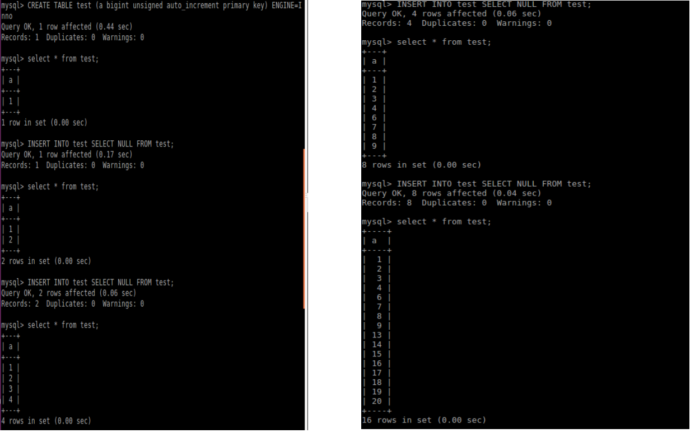
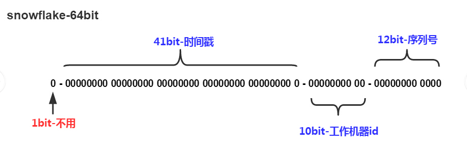

# 自增锁

## 理解AUTO_INCREMENT

- 概念对于每次插入时自动赋值为 max(id)+1。**可以主动赋值**，可以比当前最大值要小，甚至可以重复。

- AUTO_INCREMENT 可以不是主键，但**必须作为KEY 不要求是UNIQUE**。 一个表只能有一个 AUTO_INCREMENT 修饰字段。因此，不要将 AUTO_INCREMENT 和 PRIMARY KEY 或者 UNIQUE 等同起来。

- AUTO_INCREMENT 一定是要作为 KEY 是基于其实现上的考虑。**以便可以对表执行相当于索引的`SELECT MAX（ai_col）`查找以获取最大列值**。

- AUTO_INCREMENT计数器，一直维护在内存中，当server重启或是停止后启动，innodb会为每个表初始化这个计数器。


## INSERT-like statements

所有可以向表中增加行的语句,包括`INSERT, INSERT ... SELECT, REPLACE, REPLACE ... SELECT, and LOAD DATA`. **包括"simple-inserts", "bulk-inserts" and "mixed-mode"** inserts 三种类型。

### Simple inserts

可以**预先确定要插入的行数（当语句被初始处理时）的语句**。 这包括**没有嵌套子查询的单行和多行INSERT和REPLACE语句**，但**不包括**INSERT ... ON DUPLICATE KEY UPDATE。


### Bulk inserts
**事先不知道要插入的行数**（和所需自动递增值的数量）的语句。 这包括INSERT ... SELECT，REPLACE ... SELECT和LOAD DATA语句，但不包括纯INSERT。


### Mixed-mode inserts

Simple inserts语句但是指定一些（但**不是全部**）新行的自动递增值。
例如： `INSERT INTO t1 (c1,c2) VALUES (1,'a'), (NULL,'b'), (5,'c'), (NULL,'d')`
其中c1是表t1的AUTO_INCREMENT列。

`INSERT ... ON DUPLICATE KEY UPDATE，`实际上是INSERT语句随后又跟了一个UPDATE，其中AUTO_INCREMENT列的分配值不一定会在 UPDATE 阶段使用。


## innodb_autoinc_lock_mode

这个参数控制着在向有auto_increment 列的表插入数据时，相关锁的行为；

innodb_auto_lockmode有三个取值：

- 0：这个表示tradition 传统
- 1：这个表示consecutive 连续
- 2：这个表示interleaved 交错


### tradition

在此锁定模式下，**所有“INSERT-like”语句获得一个特殊的表级AUTO-INC锁**，用于插入具有AUTO_INCREMENT列的表。此锁定通常**保持到语句结束（不是事务结束）**，以**确保**为给定的INSERT语句序列以**可预测和可重复的顺序**分配自动递增值，并确保自动递增由**任何给定语句分配的值是连续的**。

因此，两个插入不能同时具有AUTO-INC锁定，因此我们**失去了并发性和性能**。长期运行的查询如`INSERT INTO table1 ... SELECT ... FROM table2`，问题更加严重  。

### consecutive

这是**默认**的锁定模式.在这个模式下,**“bulk inserts”仍然使用AUTO-INC表级锁,并保持到语句结束**.这适用于所有`INSERT ... SELECT，REPLACE ... SELECT和LOAD DATA`语句。同一时刻**只有一个语句可以持有AUTO-INC锁**.
> bulk语句获取AUTO-INC表级锁直到语句结束

Simple inserts（要插入的行数事先已知）通过在**mutex（轻量锁）的控制下获得所需数量的自动递增值来避免表级AUTO-INC锁**， **它只在分配过程的持续时间内保持，而不是直到语句完成**。 不使用表级AUTO-INC锁，**除非AUTO-INC锁由另一个事务保持**。 如果另一个事务保持AUTO-INC锁，则“简单插入”**等待AUTO-INC锁**，如同它是一个“批量插入”。
> 分配过程持有，而不是直到语句结束

### interleaved

在这种锁定模式下,所有类INSERT(“INSERT-like” )语句**都不会使用表级AUTO-INC lock**,并且**可以同时执行多个语句**。这是最快和最可扩展的锁定模式，但是当使用**基于语句的复制或恢复方案**时，从二进制日志**重播SQL语句时**，这是**不安全的**。

在此锁定模式下，自动递增值保证在所有并发执行的“类INSERT”语句中是**唯一且单调递增的**。但是，由于多个语句**可以同时生成数字**（即，跨语句交叉编号），为任何给定语句插入的行生成的值**可能不是连续的**。

> 并发导致递增但是不是连续

## 空洞的原因

### simple inserts
针对innodb_autoinc_lock_mode=0,1,2，只有在一个有auto_increment列操作的事务**出现回滚时**，分配的auto_increment的值会丢弃不再使用，从而造成空洞。


### bulk inserts
- innodb_autoinc_lock_mode=0,由于一直会持有AUTO-INC锁直到语句结束，生成的值都是连续的，不会产生空洞。
- innodb_autoinc_lock_mode=1，这时候一条语句内不会产生空洞，但是**语句之间可能会产生空洞**。
- innodb_autoinc_lock_mode=2，如果有并发的insert操作，那么**同一条语句的自增值不是连续自增的**。

```sql
DROP TABLE IF EXISTS test;
CREATE TABLE test (a bigint unsigned auto_increment primary key) ENGINE=InnoDB; INSERT INTO test SELECT NULL AS a;

/* #1 */ INSERT INTO test SELECT NULL FROM test;
/* #2 */ INSERT INTO test SELECT NULL FROM test;
/* #3 */ INSERT INTO test SELECT NULL FROM test;
/* #4 */ INSERT INTO test SELECT NULL FROM test;
SELECT * FROM test;
```



`/* #2 */ `这是第二次INSERT,此时表中有两行(1,2),但是MySQL不知道有多少行.
`MySQL Grab a chunk of auto_increment values `在chunk中有多少？ 一 只有一个,即'3',将其插入表中.

还有需要插入的行,所以Grab another chunk,这次是**前一次的两倍大小** 在chunk中有多少？ 一 两个,'4'和'5'. 插入'4'.

没有更多的行插入，所以一切完成,'5'被舍弃,但是此时 AUTO_INCREMENT的下一个值是6了

`/* #3 */`这是第三次INSERT,此时表中有四行(1,2,3,4),但是MySQL不知道有多少行.分配了1,2,4 一个7个值给这次插入


```sql
CREATE TABLE `t` (
  `a` bigint(20) unsigned NOT NULL AUTO_INCREMENT,
  PRIMARY KEY (`a`)
) ENGINE=InnoDB;
CREATE TABLE `t1` (
  `c1` int(11) NOT NULL AUTO_INCREMENT,
  `c2` varchar(10) DEFAULT NULL,
  PRIMARY KEY (`c1`)
) ENGINE=InnoDB
```

先主动插入**100万**的数据进t表

然后同时执行:
```sql
insert into t1(c2) select * from t;
insert into t1(c2) values(40000);
```

结果：
innodb_autoinc_lock_mode=0时：(40000,40000), (10000001,40000)。100万数据的插入时候锁保持到语句结束，而且无自增空洞。

innodb_autoinc_lock_mode=1时：(40000,40000), (10026856,40000)。100万数据的插入时候锁保持到语句结束，但是分配是按规则分配。

innodb_autoinc_lock_mode=2时：

1. (40001,40000), (Y,40000). y < 40000 时间有关
2. (40000,40000), (Y,40000). y > 40000 时间有关

第二个语句可能会在第一个语句的某一个时间分配，所以，第二个语句的自增值可能会在40000前或者后。


### mixed-mode inserts

这种模式下针对innodb_autoinc_lock_mode的值配置不同，结果也会不同，当然innodb_autoinc_lock_mode=0时**不会产生空洞的**，而innodb_autoinc_lock_mode=1以及innodb_autoinc_lock_mode=2是**会产生空洞**的。

```sql

CREATE TABLE `t1` (
  `c1` int(11) NOT NULL AUTO_INCREMENT,
  `c2` varchar(10) DEFAULT NULL,
  PRIMARY KEY (`c1`)
) ENGINE=InnoDB  AUTO_INCREMENT=100 ;

INSERT INTO t1 (c1,c2) VALUES (1,'a'), (NULL,'b'), (5,'c'), (NULL,'d');

```

当innodb_autoinc_lock_mode=0时:
`(1,a) (101,b) (5, c) (102, d)`

当innodb_autoinc_lock_mode=1时:
`(1,a) (101,b) (5, c) (102, d)`，但auto-increment值105

当innodb_autoinc_lock_mode=2时:
`(1,a) (x,b) (5, c) (y, d)`
x和y的值是唯一的，并大于任何先前生成的行。 然而，x和y的具体值**取决于通过并发执行语句生成的自动增量值的数量**。


---
## 唯一ID生成

### UUID

UUID是通用唯一识别码（Universally Unique Identifier)的缩写，开放软件基金会(OSF)规范定义了包括网卡MAC地址、时间戳、名字空间（Namespace）、随机或伪随机数、时序等元素。利用这些元素来生成UUID。示例：550e8400-e29b-41d4-a716-446655440000

16^32=2^128，约等于3.4 x 10^38, 也就是说若每纳秒（ns）产生1兆个UUID，要花100亿年才会将所有UUID用完。


UUID 的 **16 个 8 位字节（128位）表示为 32 个十六进制**（基数16）数字。


优点：**性能非常高：本地生成，没有网络消耗**。

缺点：
- 不易于存储：UUID太长，16字节128位，通常以36长度（32个16进制数字+4个破折号）的字符串表示，很多场景不适用。
- 信息不安全：基于**MAC地址生成UUID的算法可能会造成MAC地址泄露**，这个漏洞曾被用于寻找梅丽莎病毒的制作者位置。
- ID作为主键时在特定的环境会存在一些问题，比如做DB主键的场景下，UUID就非常不适用：
- MySQL官方有明确的建议**主键要尽量越短越好（非聚簇索引会消耗更多空间）**，36个字符长度的UUID不符合要求。
- 对MySQL索引不利：如果作为数据库主键，在InnoDB引擎下，**UUID的无序性可能会引起数据位置频繁变动，严重影响性能**。


### 类snowflake方案
这种方案大致来说是一种以划分命名空间（UUID也算）来生成ID的一种算法，这种方案把64-bit分别划分成多段，分开来标示机器、时间等，比如在snowflake中的64-bit分别表示如下图（图片来自网络）所示：



- **最高位是符号位**，始终为0，不可用。
- 41位的**时间序列，精确到毫秒级**，41位的长度可以使用69年。时间位还有一个很重要的作用是可以根据时间进行排序。
- 10位的**机器标识**，10位的长度最多支持部署1024个节点。
- 12位的**计数序列号**，序列号即一系列的自增id，可以支持同一节点同一毫秒生成多个ID序号，12位的计数序列号支持每个节点每毫秒产生4096个ID序号。

优点：
- **毫秒数在高位，自增序列在低位，整个ID都是趋势递增的**。
- **不依赖数据库等第三方系统**，以服务的方式部署，稳定性更高，生成ID的性能也是非常高的。
- 可以**根据自身业务特性分配bit位**，非常灵活。

缺点：
- **强依赖机器时钟**，如果机器上时钟**回拨**，会导致**发号重复或者服务会处于不可用状态**。
