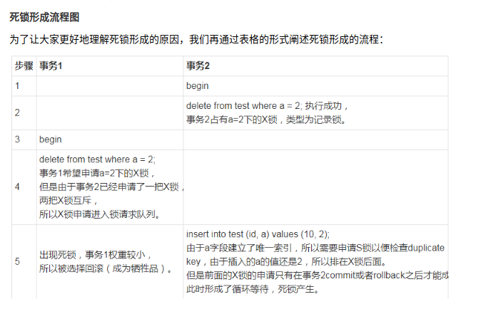
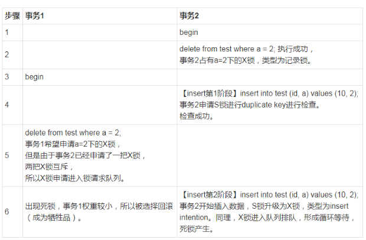

# MySQL 锁

## latch

一般称为**闩锁(轻量级的锁)**，因为其要求锁定的时间**必须非常短**。若持续的 时间长，则应用的性能会非常差。在innodb存储引擎中，latch又可以分为**mutex（互斥量）和rwlock(读写锁)**。其目的是**用来保证并发线程操作临界资源的正确性，并且通常没有死锁检测的机制**。

## lock

lock的对象是事务，用来**锁定**的是数据库中的**对象**，如表、页、行。并且一般lock的对象仅在事务commit或rollback后进行**释放**(不同事务隔离级别释放的时间可能不同)。此外，lock，正如在大多数数据库中一样，是**有死锁机制**的。

由于InnoDB存储引擎支持的是行级别的锁，因此意向锁其实不会阻塞除全表扫以外的任何请求

## Shared and Exclusive Locks （共享锁与排他锁）

它们都是标准的行级锁。

- 共享锁（S） 共享锁也称为读锁，**读锁允许多个连接可以同一时刻并发的读取同一资源**,互不干扰, **但任何事务都不能对数据进行修改**（获取数据上的排他锁），直到已释放所有共享锁；

- 排他锁（X） 排他锁也称为写锁，一个**写锁会阻塞其他的写锁或读锁**，保证同一时刻只有一个连接可以写入数据，同时防止其他用户对这个数据的读写。


## LOCK IN SHARE MODE

在查询语句后面增加 LOCK IN SHARE MODE ，Mysql会对查询结果中的**每行都加共享锁**，当**没有**其他线程对查询结果集中的**任何一行使用排他锁**时，可以成功申请共享锁，否则会被**阻塞**。 其他线程也可以读取使用了共享锁的表，而且这些线程读取的是**同一个版本**的数据。

> **同一个版本**的数据

# 乐观锁

用数据版本（Version）记录机制实现，这是乐观锁最常用的一种实现方式。何谓数据版本？即为数据增加一个版本标识，一般是通过为数据库表增加一个数字类型的 “version” 字段来实现。当读取数据时，将version字段的值一同读出，数据每更新一次，对此version值加1。当我们提交更新的时候，判断数据库表对应记录的当前版本信息与第一次取出来的version值进行比对，如果数据库表当前版本号与第一次取出来的version值相等，则予以更新，否则认为是过期数据。


# 间隙锁
当我们用范围条件而不是相等条件检索数据，并请求共享或排他锁时，InnoDB会给符合条件的已有数据记录的索引项加锁；**对于键值在条件范围内但并不存在的记录，叫做“间隙（GAP)”**，InnoDB也会对这个“间隙”加锁，这种锁机制就是所谓的**间隙锁（Next-Key锁）**

InnoDB使用间隙锁的目的，**一方面是为了防止幻读，另外一方面，是为了满足其恢复和复制的需要**。


# Innodb中的行锁与表锁
只有通过索引条件检索数据，InnoDB才使用行级锁，否则，InnoDB将使用表锁！

链接：https://juejin.im/post/5b82e0196fb9a019f47d1823


- mysql中有表锁，LOCK TABLE my_tabl_name READ, **用读锁锁表，会阻塞其他事务修改表数据**。LOCK TABLE my_table_name WRITE, 用**写锁锁表，会阻塞其他事务读和写**。
- innodb引擎又支持行锁，行锁分为**共享锁**，一个事务对一行的共享只读锁。**排它锁**，一个事务对一行的排他读写锁。

---
# 多版本并发控制

多数数据库都实现了多版本并发控制，并且都是靠保存数据快照来实现的。以 InnoDB 为例，每一行中都冗余了两个字断。

一个是行的创建版本，一个是行的删除（过期）版本。具体的版本号（trx_id）存在 information_schema.INNODB_TRX 表中。版本号（trx_id）随着每次事务的开启自增。

可重复读： 读取创建版本号<=当前事务版本号，删除版本号为空或>当前事务版本号。

> 过期版本大于当前版本的数据: 保证当前读取到的数据在事务开启前未被删除

## 一致性的非锁定读

也就快照读，各个隔离级别规则不一样。

一致性的非锁定读(consistent nonlocking read ）是指Innodb存储引擎通过**行多版控制**(multi versioning)的方式来读取当前执行时间数据库中行的数据。如果读取的行正在执行DELETE或UPDATE操作，这时读取操作**不会因此去等待行上锁的释放**。相反地，innodb存储引擎会去读取行的一个快照数据

> 之所以称其为非锁定读，因为不需要等待访问的行上X锁的释放。大大提高井发性。

## 快照数据
**可以看到，非锁定读机制极大地提高数据库的井发性。在innodb存储引擎的默 认设置下，这是默认的读取方式，即读取不会占用和等待表上的锁。但是在不同事务隔 离级别下，读取的方式不同，并不是在每个事务隔离级别下都是采用非锁定的一致性读。此外，即使都是使用非锁定的一致性读，但是对于快照数据的定义也各不相同。**

> 但是对于快照数据的定义也各不相同

在事务隔离级别READ CDMMITTED和REPEATABLE READ InnoDB存储引擎 的默认事务隔离级别)下，InnoDB存储引擎使用非锁定的一致性读。然而，对于快照数据的定义却不相同。在READ CDMMITTED事务隔离级别下，对于快照数据，非一致性读**总是读取被锁定行的最新一份快照数据**。而在REPEATABLE READ事务隔离级别下，对于快照数据，非一致性读总是**读取事务开始时的行数据版本**。

## 一致性锁定读

也叫当前读。

对于一致性非锁定读，即使读取的行已被执行了SELECT FOR UPDATE，也是可以进行读取的，这和之前讨论的情况一样。此外，SELECT FOR UPDATE、 LOCK IN SHARE MODE必须在一个事务中，当事务提交了，锁也就释放了。

> SELECT FOR UPDATE 加了X锁，但是单纯select默认是一致性非锁定读，不需要等待X锁，所以可以进行读取。但另一个事务的如果是SELECT FOR UPDATE 则不能读

## 脏读与幻读
脏读指的就是**在不同的事务下，当前事务可以读到另外事务未提交的数据**，简单来说就是可以读到脏数据。

在InnoDB存储引擎中，通过**使用Nexy-Key Lock算法来避免不可重复读**的问题。在 Mysql官方文档中将不可重复读的问题定义为Phantom Problem，即**幻像问题**。在Nexy-Key Lock算法下，对于索引的扫描，不仅是锁住扫描到的索引，而且还锁住这些**索引覆盖的范围(gap)**。因此在这个范围内的插人都是不允许的。这样就避免了另外的事务**在这个范围内插人数据导致的不可重复读的问题**。因此，InnoDB存储引擎的**默认事务隔离级别**是REPEATABLE READ，采用Nexy-Key Lock算法，避免了不可重复读的现象。

> 也就是通过主动声明一致性锁定读（当前读），锁住间隙来避免幻读。


Q: REPEATABLE READ 解决幻读问题？
- 不能：场景是，select 不存在，另一个事务插入，再次select，还是不存在，但再次插入，报插入重复错误。幻读
- 也就是版本在读的时候不会触发更新，但是在插入或者更新的时候会再次拉取版本数据，导致的幻读。
- 解决方案：select for updade 其实就是锁住了可能造成幻读的数据，阻止数据的写入操作。

A：
- 也可以说REPEATABLE READ+Nexy-Key Lock算法解决幻读。那么如果说REPEATABLE READ其实包含着Nexy-Key Lock算法，是不是就能说REPEATABLE READ解决幻读问题？上面所说的不能只是用法不对而已，同样的做法，也就是加上select for update，在read committed是不能解决幻读问题的，这样反推是不是就能说REPEATABLE READ解决幻读问题。

> 不能把快照读和当前读得到的结果不一样这种情况认为是幻读，这是两种不同的使用。见下

---
## 幻读与不可重复读讨论

在快照读读情况下，mysql通过mvcc来避免幻读。

在当前读读情况下，mysql通过mvcc+next-key来避免幻读。

select * from t where a=1;属于快照读

select * from t where a=1 lock in share mode;属于当前读

**不能把快照读和当前读得到的结果不一样这种情况认为是幻读**(如上疑惑的讨论的场景)，这是两种不同的使用。所以我认为mysql的rr级别是解决了幻读的。

- [MySQL到底是怎么解决幻读的？](https://database.51cto.com/art/201905/597093.htm): 讨论不可重复读是否解决幻读问题。不能把快照读和当前读得到的结果不一样这种情况认为是幻读，这是两种不同的使用。

高性能mysql的定义： 所谓**幻读，指的是当某个事务在读取某个范围内的记录时，另外一个事务又在该范围内插人了新的记录，当之前的事务再次读取该范围的记录时，会产生幻行(Phantom Row)**。 InnoDB和XtraDB存储引擎通过**多版本并发控制(MVCC, Multiversion Concurrency Control)解决了幻读**。
> 可以理解为快照读，通过mvcc解决

百度百科的定义： 事务A读取与搜索条件相匹配的若干行。事务B以插入或删除行等方式来修改事务A的结果集，然后再提交。
> 可以理解为当前读，通过next key解决

例子：

```sql

create table z (a int , b int , primary key(a), key(b));
insert into z select 1,1;
insert into z select 3,1;
insert into z select 5,3;
insert into z select 7,6;
insert into z select 10,8;
```

快照读造成的"幻读":

```sql
-- session1：
begin;
select * from z where  a > 2 and a < 7;
/*
+---+------+
| a | b    |
+---+------+
| 3 |    1 |
| 5 |    3 |
+---+------+
2 rows in set (0.00 sec)
*/


-- session2：
insert into z select 4,2;

-- session1：
select * from z where  a > 2 and a < 7;
-- 还是返回同样两行结果
-- 更新却是3行
mysql> update z set b = 99 where  a > 2 and a < 7;
Query OK, 3 rows affected (0.01 sec)
Rows matched: 3  Changed: 3  Warnings: 0

--session2:
select * from z;
--数据还没有更新

--session1:
mysql> commit;
-- 数据更新

```


```sql
--session1:
select * from z where  a > 2 and a < 7 lock in share mode;


--session2:
--被锁住，也就没有幻读
insert into z select 4,2;

--session1:
mysql> update z set b = 99 where  a > 2 and a < 7;
Query OK, 2 rows affected (0.00 sec)
Rows matched: 2  Changed: 2  Warnings: 0


```


---
# 行级锁的算法

- Record Lock: 单个行记录上的锁
- Gap Lock: 间隙锁，锁定一个范围，但不包含记录本身
- Next-Key Lock: GapLock+RecordLock，锁定一个范围，并且锁定记录本身

正如前面所介绍的，Next-KeyLock**降级**为RecordLock仅在查询的列**是唯一索引的情况下**。若是**辅助索引**，则情况会完全不同。会锁定索引之间（前后）的间隙。


## 辅助索引的next-lock解析

一个例子：
```sql
create table z (a int , b int , primary key(a), key(b));
insert into z select 1,1;
insert into z select 3,1;
insert into z select 5,3;
insert into z select 7,6;
insert into z select 10,8;

select * from z where b = 3 for update;
```
也就是a=5, b=3 行

很明显，这时SQL语句通过索引列b进行查询，因此其使用传统的Next-Key Locking技术加锁，并且由于有两个索引，其需要分别进行锁定。
- 对于聚集索引，其**仅对列a等于5的索引加上RecordLock**。
- 而对于辅助索引，其加上的是Nexy-Key Lock，锁定的范围是(1，3），特别需要注意的是，InnoDB存储引擎还会对辅助索引**下一个键值**加上gaplock，即还有一个辅助索引范围为（3，6）的锁。

```sql
select * from z where a = 5 lock in share mode; 锁了

insert into z select 4,0;  没锁
insert into z select 2,1;  没锁!!! Q:为啥（2, 1）没锁？ A:因为左边的节点是（3, 1）
insert into z select 4,1;  锁了!!! A: (4,1)>(3,1) 而 (2,1)<(3,1)
insert into z select 9,1;  锁了 下面的例子都是大于(3, 1)　
insert into z select 999,1;  锁了
insert into z select 2,2;  锁了
insert into z select 9,2;  锁了

insert into z select 6,5;  锁了
insert into z select 0,6;  锁了
insert into z select 6,6;  锁了
insert into z select 8,6;  没锁!!!Q: 因为右边的节点是(7,6)，而(8,6)>(7,6)
```

疑问: 锁定的范围为什么是(1，3）而不是(1,3]?导致还需要加上下一个键值的gaplock（3，6），而且是不包括6的

疑问：为啥b列还会给a列影响到？

原因：辅助索引的查询锁定的是该辅助索引的前后两个范围，也就是 (1,3), (3,6)。然后还得看辅助索引的**叶子节点最左和最右**为 <1, 3> 和 <6, 7>) 。也会锁定叶子节点的范围，所以<1, 3>的右边也就是 <1, x> x>3 都被锁定 和 <6, 7> 的左边<6, x> x < 7 被锁。

> 辅助索引并不是单纯锁的是该索引列的范围，而是整个B+树的前后范围。


另一个例子：
```sql
CREATE TABLE `test` (
`id` int(11) primary key auto_increment,
`xid` int, KEY `xid` (`xid`) )
ENGINE=InnoDB DEFAULT CHARSET=utf8;
insert into test(xid) values (1), (3), (5), (8), (11);

select * from test where xid = 8 for update;

-- (5, 8], (8, 11]
insert into test(xid) values (x);
-- x为5,6,7,8,9,10 被锁
```

解析: 之所以可以插入11不可以插入5是因为辅助索引的叶子节点中得数据是顺序存放的，由于**id自增长**，所以会在辅助索引的叶子节(5,3)的右侧插入(5,x) x>3,但是这个是在gap范围内，所以不允许，插入11得问题也是如此


参考链接：
- https://zhuanlan.zhihu.com/p/35477890

---
## alter

慢查询或者长事务会阻塞alter操作，alter操作会阻塞后面的所有请求。阻塞所有的操作，但是可以通过online-schema-change进行操作

---
# 死锁
## 什么是死锁？怎么解决？

### 解决一

死锁是指两个或多个事务在同一资源上相互占用，并请求锁定对方的资源，从而导致恶性循环的现象。

常见的解决死锁的方法:

1. 如果不同程序会并发存取多个表，尽量**约定以相同的顺序**访问表，可以大大降低死锁机会。
2. 在同一个事务中，尽可能做到**一次锁定所需要的所有资源**，减少死锁产生概率；
3. 对于非常容易产生死锁的业务部分，可以尝试使用**升级锁定颗粒度**，通过**表级锁定来减少死锁产生的概率**；

如果业务处理不好可以用分布式事务锁或者使用乐观锁
> 约定以相同的顺序

- https://zhuanlan.zhihu.com/p/114993399

### 解决二
1. 合理的设计索引，区分度高的列放到组合索引前面，使业务 SQL 尽可能通过索引定位更少的行，减少锁竞争。
2. 调整业务逻辑 SQL 执行顺序， 避免 update/delete 长时间持有锁的 SQL 在事务前面。
3. 避免大事务，尽量将大事务拆成多个小事务来处理，小事务发生锁冲突的几率也更小。
4. 以固定的顺序访问表和行。比如两个更新数据的事务，事务 A 更新数据的顺序为 1，2;事务  B 更新数据的顺序为 2，1。这样更可能会造成死锁。
5. 在并发比较高的系统中，不要显式加锁，特别是是在事务里显式加锁。如 select … for update 语句，如果是在事务里（运行了 start transaction 或设置了autocommit 等于0）, 那么就会锁定所查找到的记录。
6. 尽量按主键/索引去查找记录，范围查找增加了锁冲突的可能性，也不要利用数据库做一些额外额度计算工作。比如有的程序会用到 “select … where … order by rand()；”这样的语句，由于类似这样的语句用不到索引，因此将导致整个表的数据都被锁住。
7. 优化 SQL 和表设计，减少同时占用太多资源的情况。比如说，减少连接的表，将复杂 SQL分解为多个简单的 SQL。

- [说说你是怎么解决MySQL死锁问题的！](https://juejin.cn/post/6936083717051908104)

---
## 一次并发插入死锁带来的 MySql 锁知识点整理

- [一次并发插入死锁带来的 MySql 锁知识点整理](https://juejin.cn/post/6927197371227095047): 锁相关的介绍，但是内容有待商榷，可以看里面的例子作为参考

概念：
1. 间隙锁(gap lock): 针对索引之间的间隙
2. Next-key锁（Next-key lock)：可以简单理解为行锁 + 间隙锁

索引 | 场景 | 锁范围
---| ---|---
无索引 | S/X锁 | 锁全表
唯一索引 | 精确匹配，且命中 | 行锁
唯一索引 | 精确匹配，未命中 | gap lock
唯一索引 | 范围查询 | next key lock (上个记录下个记录的区间，左闭右开） 右边记录行锁
普通索引 | 精确匹配，且命中 | 行锁 + **gap lock** (上一个记录和下个记录区间，左闭右开，左边记录非行锁)
普通索引 | 精确匹配，未命中 | gap lock |
普通索引 | 范围查询 | next key lock |

> 左闭右开是不正确的。gap lock是锁住节点之间的范围。

> ？：　**for update的gap lock之间不会相互影响。会阻塞insert的插入意向锁。**

## 死锁案例

死锁日志查看: `SHOW ENGINE INNODB STATUS;`

### 案例一

场景一： 三个事务同时插入相同主键的记录。事务1正常提交，事务2，3插入失败，没有死锁问题。

场景二： 三个事务同时插入相同主键的记录。事务1插入后回滚，事务2，3一个插入成功，一个死锁错误。

step1:
```
session1: 插入(id=2)，会添加一个X + Next Lock锁
session2/3: 插入(id=2)，**插入意向锁被阻塞，改为持有S + Next Lock锁**
```
step2:
```
session1: 回滚，释放X锁
session2/3: **竞争X锁，只有对方释放S锁**，才能竞争成功；相互等待，导致死锁
```

> 注意： **插入意向锁被阻塞，改为持有S + Next Lock锁**

#### 插入意向锁

- [并发insert死锁验证](https://juejin.cn/post/6894624297961127944)
- [Insert into 加锁机制](https://blog.csdn.net/and1kaney/article/details/51214001)

官方文档对于insert 加锁的描述: insert会对插入**成功的行**加上排它锁，这个排它锁是个**记录锁**，而非next-key锁（当然更不是gap锁了），不会阻止其他并发的事务往这条记录之前插入记录。在插入之前，会先在插入记录所在的间隙加上一个**插入意向gap锁**（简称I锁吧），并发的事务**可以对同一个gap加I锁**。

如果insert 的事务出现了duplicate-key error ，事务会对duplicate index record**加共享锁**。这个**共享锁在并发的情况下是会产生死锁的**，比如有两个并发的insert都对要对同一条记录加共享锁，而此时这条记录又被其他事务加上了排它锁，排它锁的事务提交或者回滚后，两个并发的insert操作是会发生死锁的。

> 注意插入意向锁和意向锁的区别。插入意向锁在写入冲突时候会变成共享锁。两个共享锁共同竞争排他锁写入导致死锁。

场景一： select for update，数据表中没有b=5的记录，所以加的是X gap锁，锁住的间隙是(4,8)。因此INNODB_LOCKS表中显示的lock_mode是X和GAP，lock_type是行级锁

场景二： insert会对插入**成功的行**加上排它锁，这个排它锁是个记录锁，而非next-key锁。在插入之前，会先在插入记录所在的间隙加上一个**插入意向gap锁**（简称I锁吧），并发的事务可以对同一个gap加I锁。这个场景证明，对于同一个gap，I锁是不冲突的，事务1和事务2没有锁等待，都插入成功。

从上面死锁日志，我们可以很容易理解死锁为何发生。事务1插入记录，事务2插入同一条记录，主键冲突，事务2将事务1的**隐式锁转为显式锁**，同时事务2向队列中加入一个**s锁请求**;当事务1回滚后，事务2和事务3获得s锁，但随后事务2和事务3又先后**请求插入意向锁，和共享锁冲突**。

> 插入意向锁是间隙锁，但不会锁不同行的记录。但如果是同一行，则会变成共享锁该行。并发情况下，多个事务持有同一行的共享锁，会有死锁错误。主要原因是各个事务插入需要获取X锁，都需要等待其他事务的S锁释放。

避免措施： 业务系统设计时候，尽量避免高并发插入相同记录业务，可在数据库之前做过滤。如Java锁，分布式锁。

> - [记一次插入意向锁和Next-Key引起的死锁](https://segmentfault.com/a/1190000019745324): 插入意向锁和其他锁的关系

注1：兼容性和**加锁顺序有关系**，因此兼容性表格不是对称的

注2：此表格阅读方式为**按列读**；

| 是否兼容 | gap | insert intention | record | next-key |
| --- | --- | --- | --- | --- |
| gap | 是 | 是 | 是 | 是 |
| insert intention | **否** | 是 | 是 | **否** |
| record | 是 | 是 | **否** | **否** |
| next-key | 是 | 是 | **否** | **否** |

从图中可以看出， 如果前一个事务 **持有 gap 锁， 或者 next-key 锁的时候，后一个事务如果想要持有 insert intention 锁的时候会 不兼容，出现锁等待**


### 案例二
insert语句在普通情况下是会申请排他锁，也就是X锁，但是这里出现了S锁。这是因为a字段是一个唯一索引，所以insert语句会在插入前进行一次duplicate key的检查，为了使这次检查成功，需要申请S锁防止其他事务对a字段进行修改。

那么为什么该S锁会失败呢？这是对同一个字段的锁的申请是需要排队的。S锁前面还有一个未申请成功的X锁，所以S锁必须等待，所以形成了循环等待，死锁出现了。



高并发场景才能复现。主要原因是insert唯一索引会分为两个阶段，一个是S锁检查唯一冲突，成功后会将S锁升级为X锁。



*   delete的where子句没有满足条件的记录，而**对于不存在的记录 并且在RR级别**下，delete加锁类型为gap lock，gap lock之间是兼容的，所以两个事务都能成功执行delete；关于gap lock可以参考文章[加锁分析](https://www.oschina.net/action/GoToLink?url=http%3A%2F%2Fhedengcheng.com%2F%3Fp%3D771%23_Toc374698318 "加锁分析")。这里的gap范围是索引a列(3,5)的范围。
*   insert时，其加锁过程为先在插入间隙上获取插入意向锁，插入数据后再获取插入行上的排它锁。又插入意向锁与gap lock和 Next-key lock冲突，即一个事务想要获取插入意向锁，如果有其他事务已经加了gap lock或 Next-key lock，则会阻塞。
*   场景中两个事务都持有gap lock，然后又申请插入意向锁，此时都被阻塞，循环等待造成死锁。

### 案例三

```sql
CREATE TABLE `t7` (
  `id` INT NOT NULL AUTO_INCREMENT,
  `a` INT NOT NULL,
  PRIMARY KEY (`id`),
  UNIQUE INDEX `a_UNIQUE` (`a` ASC))
AUTO_INCREMENT = 26;


INSERT INTO `t7` (`id`, `a`) VALUES ('1', '1');
INSERT INTO `t7` (`id`, `a`) VALUES ('5', '4');
INSERT INTO `t7` (`id`, `a`) VALUES ('25', '12');
INSERT INTO `t7` (`id`, `a`) VALUES ('20', '20');

-- trx1
begin;
INSERT INTO `adData`.`t7` (`id`, `a`) VALUES ('26', '10');

-- trx2
begin;
INSERT INTO `adData`.`t7` (`id`, `a`) VALUES ('30', '10');
-- 等待

-- trx1
INSERT INTO `adData`.`t7` (`id`, `a`) VALUES ('40', '9');
-- 则trx2死锁错误
INSERT INTO `adData`.`t7` (`id`, `a`) VALUES ('40', '13');
-- 则trx2没有死锁错误
```

事务 T1 insert a=10 则发生唯一键冲突,需要申**请对冲突的唯一索引加上S Next-key Lock**
( 即 lock mode S waiting ) 这是一个间隙锁会申请锁住~~(,10],(10,20]~~ (,10],(10,12]之间的 gap 区域。

事务 T2 insert into t7(id,a) values (40，9)该语句插入的 a=9 的值**在事务 T1 申请的 gap 锁**

> 唯一键冲突加next-key锁、插入不存在的唯一键也会加next-key锁

- [说说你是怎么解决MySQL死锁问题的！](https://juejin.cn/post/6936083717051908104)

# 参考链接
- [Innodb中的事务隔离级别和锁的关系](https://tech.meituan.com/2014/08/20/innodb-lock.html)
- [一次 MySQL 线上死锁分析实战](https://mp.weixin.qq.com/s/B4Bdm2FKzi41SPPM2GXdYg): Index Merge导致的死锁。


# 加锁分析

- [MySQL加锁分析](http://www.fanyilun.me/2017/04/20/MySQL%E5%8A%A0%E9%94%81%E5%88%86%E6%9E%90): 对于唯一索引、普通索引的加锁分析
- [超全面 MySQL 语句加锁分析（上篇）](https://learnku.com/articles/40624)
