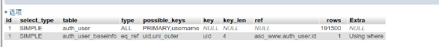

[toc]

## 慢查询

```
select hash_val, sum(freq) as s_f, flag from app_keyword_freq where created_time between '2018-08-02' and '2019-01-28' and ((campaign_type = 201 and campaign_id in (262,1239,6423,2398578,2419409)) or (campaign_type = 101 and campaign_id in (171235,270955))) group by hash_val order by s_f desc limit 100
```

问题：

原因： 分区过多导致, 并且每个分区的数目较小，速度都去查分区去了

待评估： 是不是涉及到查180天的分区的相关语句也会有相应的问题？

更新原因： 测试后发现是buffer资源不足(见下面说明)，不是分区问题

## 慢查询

```

select advertisement.id, campaign_id, count(distinct(advertisement.id)) as adverts, count(distinct(channel_id)) as channels, GROUP_CONCAT(DISTINCT (channel_id)) AS c_ids, count(distinct(ad_log_summary.createdAt)) as duration, count(*) from advertisement right join ad_log_summary on (advertisement.id = ad_log_summary.adid  and  ad_log_summary.createdAt >= "2018-09-01"  and  ad_log_summary.createdAt < "2019-01-30" )  where campaign_id in (201857,172034,343939,263812,163587,257416,1601545,502286,162703,276881,162838,331286,176156,182565,159528,4679085,191922,271413,168119,205626,5448507,1453372,1603515,7492410,7440705,159816,197200,5664853,7452889,7554146,164326,163581,5505897,1625838,180722,1623797,1407353)  and campaign_type=101 and purpose = 1  and platform =  2 group by campaign_id;


select ad_id, campaign_id, count(distinct(ad_id)) as adverts, count(distinct(channel_id)) as channels, GROUP_CONCAT(DISTINCT (channel_id)) AS c_ids from ad_aggs_outer where campaign_id in (201857,172034,343939,263812,163587,257416,1601545,502286,162703,276881,162838,331286,176156,182565,159528,4679085,191922,271413,168119,205626,5448507,1453372,1603515,7492410,7440705,159816,197200,5664853,7452889,7554146,164326,163581,5505897,1625838,180722,1623797,1407353)  and purpose = 1  and platform =  2 and campaign_type = 101 and ad_year_month in (1811, 1901, 1810, 1806)
group by campaign_id;
```

```sql
SELECT GROUP_CONCAT(id) from ( SELECT id FROM `campaign_record` where type_id = 101 ORDER by rand() LIMIT 20) as t;

select hash_val, sum(freq) as s_f, flag from app_keyword_freq where created_time between '2018-08-02' and '2019-01-28' and ((campaign_type = 201 and campaign_id in (262,1239,6423,2398578,2419409)) or (campaign_type = 101 and campaign_id in (171235,270955))) group by hash_val order by s_f desc limit 100;

select ad_id, campaign_id, count(distinct(ad_id)) as adverts, count(distinct(channel_id)) as channels, GROUP_CONCAT(DISTINCT (channel_id)) AS c_ids from ad_aggs_outer where campaign_id in (201857,172034,343939,263812,163587,257416,1601545,502286,162703,276881,162838,331286,176156,182565,159528,4679085,191922,271413,168119,205626,5448507,1453372,1603515,7492410,7440705,159816,197200,5664853,7452889,7554146,164326,163581,5505897,1625838,180722,1623797,1407353)  and purpose = 1  and platform =  2 and campaign_type = 101 and ad_year_month in (1811, 1901, 1810, 1806)
group by campaign_id;

```
问题： 命中索引并且数目较小，第一次查很慢，下一次查就很

原因： 机器的buffer不足导致，查询索引的时候就需要磁盘io把所需的索引页load进buffer里面

解决办法： 把测试库迁移出去/升级机器。结合到一些查询语句，是查大表的大字符字段，会导致缓存命中率很低。思考怎么提高缓存命中率。

---
# mysql并发重复插入

原因： get or create高并发是重复插入了

方案：

1. 应该需要ignore？

2. django 的orm应该是 get_or_create，好像也是无法解决, get_or_create也是先select后事务插入

3. select...for update？查询加锁？

4. from threading import Lock  不行，这是线程锁

5. uwsgi的锁 https://uwsgi-docs-zh.readthedocs.io/zh_CN/latest/Locks.html

## select...for update
- 测试后发现仅仅对主键行表锁，对非主键的唯一索引全表锁;
- 并且不会对查不到的行进行锁;

|      事务1            | 事务2|
| ----------------- | ---------------------------- |
|set autocommit=0; | |
| | set autocommit=0;|
| select * from auth_user where id = 2 for update; # empty set| |
| | select * from auth_user where id = 2 for update; # empty set|

| 事务1                 | 事务2                        |
| ----------------- | ---------------------------- |
|set autocommit=0; | |
| | set autocommit=0;|
| select * from auth_user where username = 18819423815 for update;| |
| | select * from auth_user where username = 10000000006 for update; # wati util commit |
所以不能解决

## 参考链接
* [How do I deal with this race condition in django?](https://stackoverflow.com/questions/2235318/how-do-i-deal-with-this-race-condition-in-django)

小结： 要对锁表的各种场景进行总结分析。

---

## 增量更新疑问

是假设这一秒之间内取了数据，但是这一秒又插入了数据。这时候select的这一秒会有遗漏，需要进行读写整体开事务。

`select ... from tbl where modify_time > @last_modify_time and modify_time <= now();`

那能通过now() - 1秒 去解决么？

每小时跑该小时的数据, 具体也有类似的错误？

如何处理事务里的数据？事务数据提交的modify_time是旧的？导致遗漏？

A： 长事务会造成遗漏!

---
## 索引失效
用上索引UNIQUE `username` (`username`) USING BTREE;
```sql
explain select *
from auth_user
where  auth_user.username in ("15068102426")
limit 10

where  auth_user.username in (15068102426)
```
用不上索引!!类型转换？！

```sql
explain select *
from auth_user inner JOIN
     auth_user_baseinfo on ( auth_user.id = auth_user_baseinfo.uid )
where  auth_user.username in ("15068102426") or auth_user_baseinfo.outer_id in ("b7904d23-e729-39af-9990-e83a090c6f03", "c9602a01-8761-3f3c-87b7-c91eee1b28d5")
limit 10
```
join后的or 操作是用不上索引的任意一个都不行。


