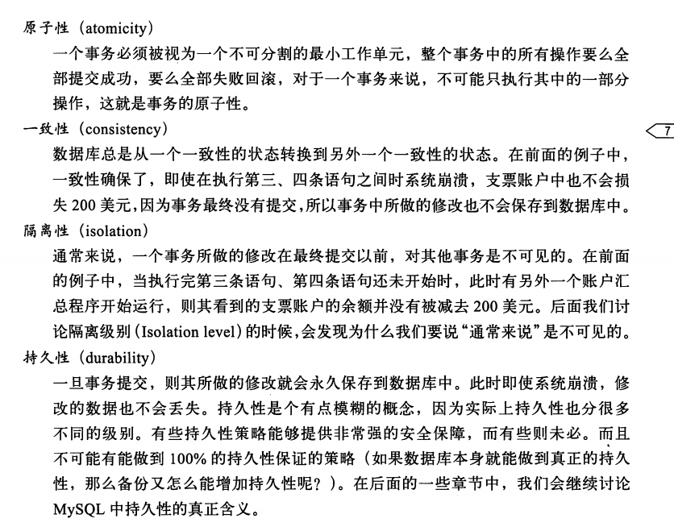
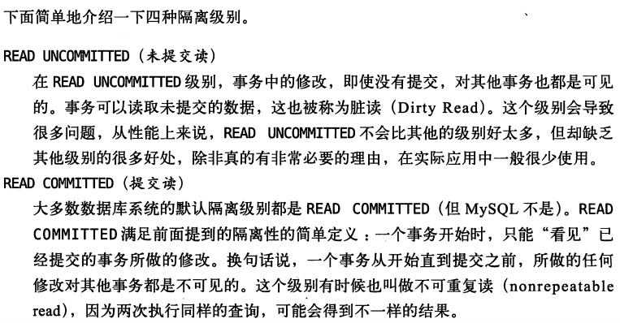
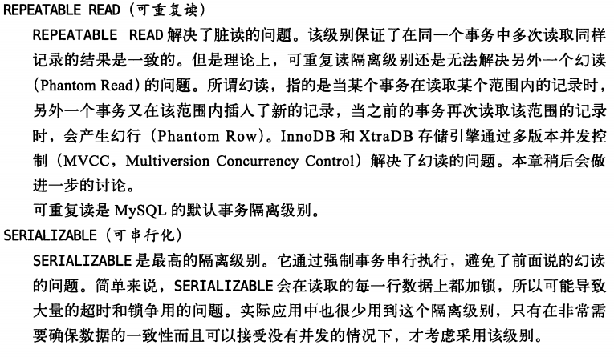

最上层的服务并不是MySQL所独有的，大多数基于网络的客户端/服务器的工具或者服务都有类似的架构。比如连接处理、授权认证、安全等等。

第二层架构是MySQL比较有意思的部分。大多数MySQL的核心服务功能都在这一层，包括**查询解析、分析、优化、缓存以及所有的内置函数**(例如，日期、时间、数学和加密函数)，所有跨存储引擎的功能都在这一层实现:**存储过程、触发器、视图**等。

第三层包含了存储引擎。存储引擎负责MySQL中数据的存储和提取。和GNU/Linux下的各种文件系统一样，每个存储引擎都有它的优势和劣势。**服务器通过API与存储引擎进行通信**。这些接口**屏蔽了不同存储引擎之间的差异，使得这些差异对上层的查询过程透明**。存储引擎API包含几十个底层函数，用于执行诸如“开始一个事务”或者“根据主键提取一行记录”等操作。但**存储引擎不会去解析SQL'，不同存储引擎之间也不会相互通信，而只是简单地响应上层服务器的请求**。

---
## 事务

> 而张三必须扣100，李四必须加100，这个就是一致性了，如果因为某些逻辑原因，导致张三扣了100，流水记录100转账，而李四只加了60。然后这3条操作都成功了，那原子性就符合了，但是一致性就不符合了。

隔离级别：

## READ UNCOMMITTED(未提交读)

在READ UNCOMMITTED级别，事**务中的修改，即使没有提交，对其他事务也都是可见的**。

## READ COMMITTED(提交读)

一个事务开始时，**只能“看见”已经提交的事务所做的修改**。换句话说，一个事务从开始**直到提交之前**，所做的任何修改对其他事务都是不可见的。这个级别有时候也叫做**不可重复读**(nonrepeatable read)，因为两次执行同样的查询，可能会得到不一样的结果。

## REPEATABLE READ(可重复读)

REPEATABLE READ解决了**脏读**的问题。该级别**保证了在同一个事务中多次读取同样记录的结果是一致的**。但是理论上，可重复读隔离级别还是**无法解决**另外一个**幻读**(Phantom Read )的问题。

所谓**幻读，指的是当某个事务在读取某个范围内的记录时，另外一个事务又在该范围内插人了新的记录，当之前的事务再次读取该范围的记录时，会产生幻行(Phantom Row)**。 InnoDB和XtraDB存储引擎通过**多版本并发控制(MVCC, Multiversion Concurrency Control)解决了幻读**。

> **无法解决**另外一个**幻读**: 这里的幻行指的不是读出去是不一致了，读是可重复的，幻行指的是当进行范围的非读取操作，如更新时。幻行才会体现。

## SERIALIZABLE(可串行化)

SERIALIZABL〔是最高的隔离级别。它通过强制事务串行执行，避免了前面说的幻读的问题。简单来说，SERIALIZABLE会**在读取的每一行数据上都加锁**，所以可能导致大量的超时和锁争用的问题。实际应用中也很少用到这个隔离级别，只有在非常需要确保数据的一致性而且可以接受没有并发的情况下，才考虑采用该级别。

