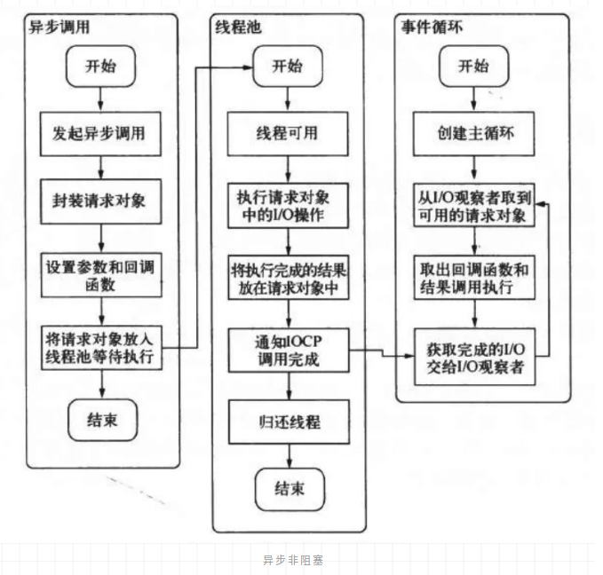

# 异步非阻塞

异步一般配合非阻塞，才能发挥其作用。

### 阻塞 IO

阻塞 IO 如同其名字，主线程会在调用 IO 方法时进入阻塞态，直到 IO 结果返回，再继续运行，相当于需要整个操作全部结束了，调用才会返回。

### 非阻塞 IO

非阻塞 IO 的特点与阻塞相对，在操作系统发起 IO 调用之后，可以先不带数据直接返回，这样主线程不会被阻塞，然后操作系统来处理读磁盘这一系列操作，而不需要主进程被阻塞，这就是我们所说的非阻塞 IO 了。

回到我们的非阻塞 IO，他的好处显而易见，进程不用等待函数返回，可以做做别的事情。

但也有一个明显的**缺陷**，我们想要读取的时候在函数返回时并没有就位。个人的理解是，如果你接下来的操作马上就**强依赖** IO 的数据，那阻塞与否并无区别。

如果你接下来的操作并**非强依赖**，那可以先把非强依赖的程序执行了，再去看 IO 有没有好，这样 **cpu 等待 IO 这段时间就可以被利用起来**。

### 轮询
我们无法预知数据什么时候好，所以我们也要去主动的探查 IO 数据是否就位，因为是我们主动的探查，那可以确定的就是，轮询技术并非异步，他并不是一个响水壶。

> 我们要读取一个文件，是分为两步的。首先是去读取文件，然后是获取读取的结果。

> 读取文件需要调用的是 recv，recv 可以**根据参数来决定是否阻塞**，我们所讨论的非阻塞 IO，只是在读取这一步，而 select、epoll 都是第二步（获取结果）做的事情，他们是**阻塞**的方法。大家切莫把两个步奏混为一谈。（对应[epoll与异步](./epoll.md)）

### read

read 是最原始的轮询方式，read 本身就是读取文件的方法，在 C++的调用里面，如果设置了 NONBLCOK 属性，那就会立即返回，但返回的值是-1。

read 的弊端是很明显的，需要不断轮询。针对不断的空轮询问题，和多文件监听问题，操作系统给出了更优的解决方案，select 调用。

### select

我们在发起 read 操作之后，能拿到一个 fd（文件描述符）

如果我们发起 100 次 read 调用，那就会有 100 个 fd，select 可以批量监听文件描述符，我们在调用 select 方法的时候，当前进程进入阻塞状态（注意，之前讲的非阻塞 IO 是 read 调用，select 是阻塞调用）。

当监听的这一批文件描述符里，有属于某个文件描述符的**IO 操作结束**的时候，操作系统会发起**中断**，中断程序做的事情很简单，**唤醒阻塞的进程**。

这个时候意味着某个文件描述符的数据已经**就绪**了，但问题是哪一个呢？母鸡。咋办呢？轮询。把**所有监听的 fd 扫一遍**，取出就绪的文件描述符，读取响应数据。

这样的话，之前两个问题就得到了解决，**轮询消耗 cpu** 问题通过**阻塞进程**，**中断唤醒**来解决，**多文件监听**问题通过 select 的**多句柄监听**特性来搞定。

> 轮询消耗CPU，所以阻塞进程

缺点：

select 解决了大多数的问题，但却带来了新的问题，如上面描述的一样，进程在被唤醒的时候一脸迷茫，是谁唤醒的我？？他要一个一个看。

如果文件过多，这种遍历对性能的影响是很大的，所以 select 设计之初便规定监听的文件描述符是有上限的，一般是 1024 个。

### epoll

epoll 最关键的优化点在于，引入了一个介于进程和 fd 之间的东西：eventpoll。

在有 IO 结束的时候，中断程序不是直接唤醒进程，而是**会先把 IO 就绪的文件描述符放在 eventpoll 里面，后续在进程被唤醒后**，不需要轮询整个 fd 列表，只需要在 eventpoll 里面拿就绪的文件描述符即可。

- [异步非阻塞](https://juejin.im/post/5e8ab5a551882573c15ed44c)

---------
# 事件循环

## 线程池
先看我们的问题，频繁的创建和销毁线程。解决的办法是啥呢？必然是线程复用。

一个线程被创建之后，即使这一次响应结束了，也不让他被回收，下一次请求来的时候依然让他去处理。

这里很关键的点在于如何让一个**线程不被回收**。

看似很神奇，一个线程执行完了操作还能继续存在？这么持久？做法其实很简单，写一个死循环即可。线程一直处于循环中，当有请求来的时候处理请求，当没有的时候就一直等待，等到了再执行处理，处理完再等待，反复横跳，无限循环。

这里引申出了第二个关键点，处于**死循环中的线程怎么知道啥时候有请求要给他处理**？

这里不同语言实现方式不完全相同，但大同小异，本质上一定是基于阻塞唤醒。当没有任务的时候，所有线程处于阻塞状态，当任务来的时候，空闲线程去竞争这个任务，取到的线程开始执行，未取到的继续阻塞。

最后总结下就是，线程池利用**死循环**让线程无法结束，在等待任务期间处于**阻塞**状态，利用阻塞**唤醒**来让线程接收任务（本质上阻塞唤醒基于**信号量**），从而达到线程复用，结束当前任务后进入下一次循环，周而复始。

## eventloop(事件循环)

说的通俗一点其实就是一个 while(true) 循环，循环里面做的事情就是不断的 check 有没有待处理的任务，如果有就处理任务，如果没有就继续下一次循环。

每个事件循环中都会有观察者，每轮循环都会去观察者中拿事件，然后执行。其实这个所谓的watcher 就是一个用来存放事件的queue（队列）。

### 如何用线程池和 eventpoll其来实现异步非阻塞?

一个 IO 调用要么是**阻塞调用**，要么是先**非阻塞的发起**IO，再在需要看结果的时候**阻塞的去获取**，显然这两种模式都不是我们想要的。

我们要的是异步非阻塞，所以这个 IO 调用一定不是在**主线程**中执行，这个时候我们就能联想到上面的线程池。

主线程不能被阻塞，但线程池里面的线程可以，主线程只需要把 IO 调用交给线程池来执行，自己就可以愉快的玩耍，以此达到了我们的第一个目标：**非阻塞**。

那异步呢？如何让线程池里面的调用在结束的时候去执行回调？这个时候eventloop 闪亮登场。

在线程池IO处理结束后，会**主动**的把结束的请求放入 eventloop 的**观察者**（watcher）中，也就是我们的 queue 中，eventloop 处于**不断循环**的状态，当下一次循环 check 到 queue 里有请求的时候，就会取出来然后**执行回调**，这样我们想要的异步就达到了。

最终通过线程池和 eventloop 结合，呈现出的效果就是，当你发起一次 IO 调用，你无需阻塞的等待 IO 结束，也无需在想利用 IO 结果的时候不断的轮询，整个 IO 过程对主线程而言非阻塞，并且自动结束时执行回调，达到我们想要的异步非阻塞。

如上图，**在发起异步调用后，会封装一个请求参数，里面会包括参数和结束时要执行的回调**。

这个 request (请求参数)封装好后会扔给线程池执行，线程池里面的线程如果有空闲，就会在线程池的 queue 中去取这个 request 并**执行 IO 操作**。

在执行结束之后通知 IOCP，其实就是把这个 requeat 放入一个 queue，这个队列就是线程池和事件循环之间的枢纽。

事件循环在循环的时候发现队列里面有请求，就会取出来并执行相应的回调，一次完美的异步非阻塞就此完成。

> 一个 IO 调用要么是**阻塞调用**，要么是先**非阻塞的发起**IO，再在需要看结果的时候**阻塞的去获取**

> 总结：事件循环：通过线程池达到非阻塞，然后epoll的作用是，这个进程能更有效率监听多个socket。线程阻塞后的唤醒操作，把相关的回调放进队列，事件循环遍历触发异步回调。

- [《大前端进阶 Node.js》系列 异步非阻塞（下）](https://mp.weixin.qq.com/s/G_NMZ8MqFo9FTC0FLcOxCw)
