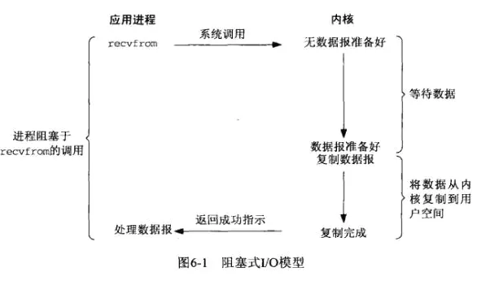
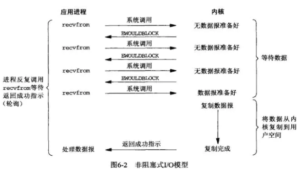
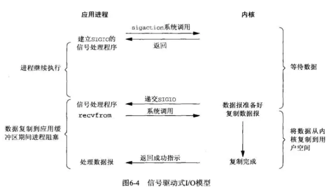
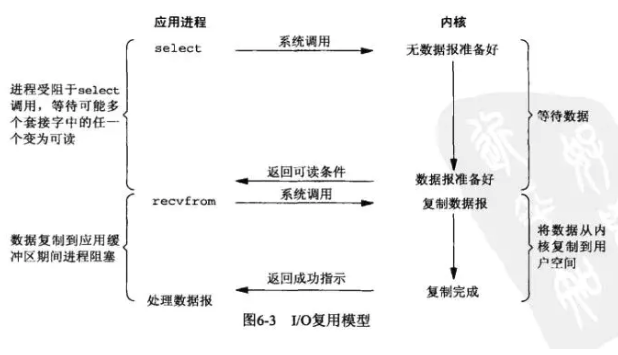
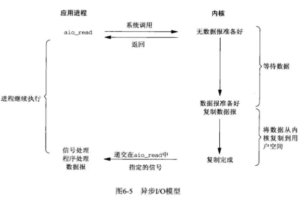
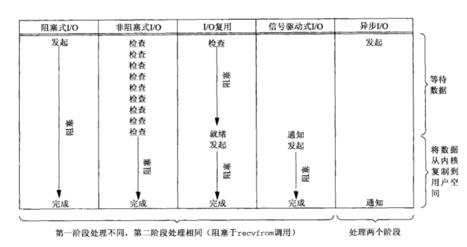

## 阻塞IO模型
应用进程通过系统调用 recvfrom 接收数据，但由于内核还未准备好数据报，应用进程就会阻塞住，直到内核准备好数据报，recvfrom 完成数据报复制工作，应用进程才能结束阻塞状态。

## 非阻塞IO模型
映射到Linux操作系统中，这就是非阻塞的IO模型。应用进程与内核交互，目的未达到之前，不再一味的等着，而是**直接返回**。然后通过**轮询**的方式，不停的去问内核数据准备有没有准备好。如果某一次轮询发现数据已经准备好了，那就把数据拷贝到用户空间中。

## 信号驱动IO模型
映射到Linux操作系统中，这就是信号驱动IO。应用进程在读取文件时通知内核，如果某个 socket 的某个事件发生时，请向我发一个信号。在收到信号后，信号对应的处理函数会进行后续处理。

应用进程预先向内核注册一个信号处理函数，然后用户进程返回，并且不阻塞，当内核数据准备就绪时会发送一个信号给进程，用户进程便在信号处理函数中开始把数据拷贝的用户空间中。

## IO复用模型
映射到Linux操作系统中，这就是IO复用模型。**多个进程的IO可以注册到同一个管道上**，这个管道会统一和内核进行交互。当管道中的某一个请求需要的数据准备好之后，进程再把对应的数据拷贝到用户空间中。

IO多路转接是多了一个select函数，多个进程的IO可以注册到同一个select上，当用户进程调用该select，select会监听所有注册好的IO，如果所有被监听的IO需要的数据都没有准备好时，select调用进程会阻塞。当任意一个IO所需的数据准备好之后，select调用就会返回，然后进程**再通过recvfrom来进行数据拷贝**。

这里的IO复用模型，并没有向内核注册信号处理函数，所以，他并不是非阻塞的。进程在发出select后，要等到select监听的所有IO操作中至少有一个需要的数据准备好，才会有返回，并且也需要再次发送请求去进行文件的拷贝。

> 多路复用这个图和blocking IO的图其实并没有太大的不同，事实上，还更差一些。因为这里需要使用两个system call (select 和 recvfrom)，而blocking IO只调用了一个system call (recvfrom)。但是，用select的优势在于它可以同时处理多个connection。

> 以上四种都是同步的。原因是因为，无论以上那种模型，**真正的数据拷贝过程**，都是同步进行的。

## 异步IO模型
映射到Linux操作系统中，这就是异步IO模型。**应用进程把IO请求传给内核后，完全由内核去操作文件拷贝**。内核完成相关操作后，会发信号告诉应用进程本次IO已经完成。

用户进程发起aio_read操作之后，给内核传递描述符、缓冲区指针、缓冲区大小等，告诉内核当整个操作完成时，如何通知进程，然后就立刻去做其他事情了。当内核收到aio_read后，会立刻返回，然后内核开始等待数据准备，数据准备好以后，直接把数据拷贝到用户控件，然后再通知进程本次IO已经完成。

> linux下的asynchronous IO其实用得很少

## 5种IO模型对比

---
## 参考链接：
- [Linux的五种IO模型](https://juejin.cn/post/6844903687626686472)
- [Linux IO模式及 select、poll、epoll详解](https://segmentfault.com/a/1190000003063859)

> 理解： IO一般是同步的，真正的异步IO很少使用。同步IO实现异步需要针对哪一个通信层次，例如异步框架的实现。[参考: epoll与异步](epoll.md)
>> **io分两个阶段，1.询问内核准备好数据没有 2.从内核读数据。阻塞，非阻塞都是指阶段一。同步异步指阶段2。** 

---
# 深入理解网络IO模型
- [重大事故！IO问题引发线上20台机器同时崩溃](https://juejin.im/post/6875176737274724366)

5种Linux网络IO模型包括：同步阻塞IO、同步非阻塞IO、多路复用IO、信号驱动IO和异步IO。

为了更好地理解网络IO模型，我们先了解几个基本概念。

## socket
Socket（套接字）：Socket可以理解成，**在两个应用程序进行网络通信时，分别在两个应用程序中的通信端点**。通信时，一个应用程序将数据写入Socket，然后通过网卡把数据发送到另外一个应用程序的Socket中。**我们平常所说的HTTP和TCP协议的远程通信，底层都是基于Socket实现的**。5种网络IO模型也都要基于Socket实现网络通信。

## 阻塞与非阻塞
阻塞与非阻塞：所谓阻塞，就是发出一个请求不能立刻返回响应，要等所有的逻辑(内核还未准备好数据报)全处理完才能返回响应。非阻塞反之，发出一个请求立刻返回应答，不用等处理完所有逻辑。

## 内核空间与用户空间
内核空间与用户空间：在Linux中，**应用程序稳定性远远比不上操作系统程序，为了保证操作系统的稳定性，Linux区分了内核空间和用户空间**。可以这样理解，内核空间运行操作系统程序和驱动程序，用户空间运行应用程序。Linux以这种方式隔离了操作系统程序和应用程序，避免了应用程序影响到操作系统自身的稳定性。这也是Linux系统超级稳定的主要原因。**所有的系统资源操作都在内核空间进行，比如读写磁盘文件，内存分配和回收，网络接口调用等**。所以在一次网络IO读取过程中，数据**并不是直接从网卡读取到用户空间中的应用程序缓冲区**，而是**先从网卡拷贝到内核空间缓冲区，然后再从内核拷贝到用户空间中的应用程序缓冲区**。对于网络IO写入过程，过程则相反，先将数据从用户空间中的应用程序缓冲区拷贝到内核缓冲区，再从内核缓冲区把数据通过网卡发送出去。

### 同步非阻塞IO
用户线程在发起Read请求后立即返回，不用等待内核准备数据的过程。如果Read请求没读取到数据，用户线程会不断轮询发起Read请求，直到数据到达（内核准备好数据）后才停止轮询。非阻塞IO模型虽然避免了由于线程阻塞问题带来的大量线程消耗，但是**频繁的重复轮询大大增加了请求次数，对CPU消耗也比较明显**。这种模型在实际应用中很少使用。

### 多路复用IO模型

多路复用IO模型，建立在多路事件分离函数select，poll，epoll之上。在发起read请求前，先更新select的socket监控列表，然后等待select函数返回（此过程是阻塞的，所以说**多路复用IO也是阻塞IO模型**）。当某个socket有数据到达时，select函数返回。此时用户线程才正式发起read请求，读取并处理数据。这种模式用一个专门的监视线程去检查多个socket，如果某个socket有数据到达就交给工作线程处理。由于等待Socket数据到达过程非常耗时，所以这种方式解决了**阻塞IO模型一个Socket连接就需要一个线程的问题，也不存在非阻塞IO模型忙轮询带来的CPU性能损耗的问题**。多路复用IO模型的实际应用场景很多，比如大家耳熟能详的Java NIO，Redis以及Dubbo采用的通信框架Netty都采用了这种模型。

> 解决了**阻塞IO模型一个Socket连接就需要一个线程的问题，也不存在非阻塞IO模型忙轮询带来的CPU性能损耗的问题**

> 监控线程阻塞。交给工作线程。
