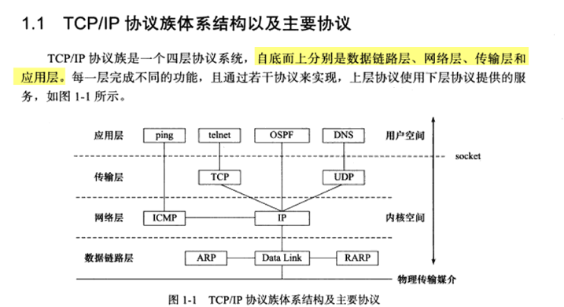
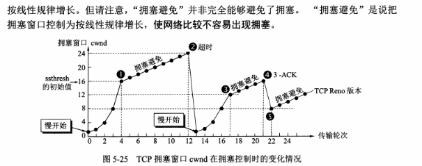

# 《图解HTTP》

## 第一章
TCP/IP 是互联网相关的各类协议族的总称

TCP/IP 协议族按层次分别分为以下 4 层:应用层、传输层、网络层和数据链路层。

应用层:

- FTP(File Transfer Protocol,文件传输协议)和 DNS(Domain Name System,域名系统)服务就是其中两类;
- HTTP

传输层有两个性质不同的协议:
- TCP(Transmission Control Protocol,传输控制协议)
- UDP(User Data Protocol,用户数据报协议)。

与对方计算机之间通过多台计算机或网络设备进行传输时,网络层所起的作用就是在众多的选项内选择一条传输路线

用来处理连接网络的硬件部分。包括控制操作系统、硬件的设备驱动、NIC(Network Interface Card,网络适配器,即网卡),及光纤等 物理可见部分(还包括连接器等一切传输媒介)。硬件上的范畴均在链路层的作用范围之内。

### 过程
**在传输层(TCP 协议)把从应用层处收到的数 据(HTTP 请求报文)进行分割,并在各个报文上打上标记序号及端口号后转发给网络层;在网络层(IP 协议),增加作为通信目的地的 MAC 地址后转发给链 路层**

IP 协议的作用是把各种数据包传送给对方。而要保证确实传送到对方 那里,则需要满足各类条件。其中两个重要的条件是 IP 地址和 MAC 地址(Media Access Control Address)。使用 ARP 协议凭借 MAC 地址进行通信

TCP 协议为了**更容易传送大数据才把数据分割**,而且 TCP 协议**能够确认数据最终是否送达到对方**。三次握手、四次挥手、滑动窗口

DNS 协议提供通过域名查找 IP 地址,或逆向从 IP 地址反查域名的服务

HTTP 是一种不保存状态,即无状态(stateless)协议。HTTP 协议自 身不对请求和响应之间的通信状态进行保存。也就是说在 HTTP 这个 级别,协议对于发送过的请求或响应都不做持久化处理。HTTP/1.1 虽然是无状态协议,但为了实现期望的保持状态功能,于是引入了 Cookie 技术。

HTTP/1.1 和一部分的 HTTP/1.0 想出了 **持久连接**(HTTP Persistent Connections,也称为 HTTP keep-alive 或 HTTP connection reuse)的方法。持久连接的特点是,只要任意一端 没有明确提出断开连接,则保持 TCP 连接状态。**减少了 TCP 连接的重复建立和断开所造成的额 外开销,减轻了服务器端的负载。另外,减少开销的那部分时间,使 HTTP 请求和响应能够更早地结束**

> HTTP/1.1与HTTP/1.0的区别

## 第二章
HTTP 报文大致可分为**报文首部和报文主体两块**。两者由最初出现的空行(CR+LF)来划分。

报文(message)是 HTTP 通信中的基本单位,由 8 位组字节流(octet sequence, 其中 octet 为 8 个比特)组成,通过 HTTP 通信传输。

实体(entity)作为请求或响应的有效载荷数据(补充项)被传输,其内容由**实体首部和实体主体组成**。

报文主体等于实体主体。只有当传输中进行编码操作时,实体主体的内容发生变化,才导致它和报文主体产生差异。

把实体主体分块的功能称为分块传输编码(Chunked Transfer Coding)。实体主体的最后一块会使用“0(CR+LF)”来标记

HTTP 协议中也采纳了多部分对象集合,发送的一份报文主体内可含有多类型实体。使用 boundary 字符串来划分多部分对象集合指明的各类实体。多部分对象集合的每个部分类型中,都可以含有首部字段。

执行范围请求时,会用到首部字段 Range 来指定资源的 byte 范围。针对范围请求,响应会返回状态码为 206 Partial Content 的响应报 文。另外,对于多重范围的范围请求,响应会在首部字段 Content- Type 标明 multipart/byteranges 后返回响应报文。


内容协商机制是指客户端和服务器端就响应的资源内容进行交涉,然 后提供给客户端最为适合的资源。内容协商会以响应资源的语言、字 符集、编码方式等作为判断的基准。

网关的工作机制和代理十分相似。而网关能使通信线路上的服务器提供非 HTTP 协议服务。

HTTP 响应报文：在响应中,HTTP 报文由 HTTP 版本、状态码(数字和原因短语)、HTTP 首部字段 3 部分构成。

> 当 HTTP 报文首部中出现了两个或两个以上具有相同首部字段名时 会怎么样?这种情况在规范内尚未明确,根据浏览器内部处理逻辑 的不同,结果可能并不一致。有些浏览器会优先处理第一次出现的 首部字段,而有些则会优先处理最后出现的首部字段。

- 通用首部字段(General Header Fields)
请求报文和响应报文两方都会使用的首部。

- 请求首部字段(Request Header Fields)
从客户端向服务器端发送请求报文时使用的首部。补充了请求的附加内容、客户端信息、响应内容相关优先级等信息。

- 响应首部字段(Response Header Fields)
从服务器端向客户端返回响应报文时使用的首部。补充了响应的附加内容,也会要求客户端附加额外的内容信息。

- 实体首部字段(Entity Header Fields)
针对请求报文和响应报文的实体部分使用的首部。补充了资源内容更新时间等与实体有关的信息。

## 第七章
HTTP 协议中没有加密机制,SSL(Secure Socket Layer,安全套接层)或 TLS(Transport Layer Security,安全层传输协议)的组合使用, 加密 HTTP 的通信内容。用 SSL 建立安全通信线路之后,就可以在这条线路上进行 HTTP 通信了。与 SSL 组合使用的 HTTP 被称为 HTTPS(HTTP Secure,超文本传输安全协议)或 HTTP over SSL。

请求或响应在传输途中,遭攻击者拦截并篡改内容的攻击称为中间人攻击

提供文件下载服务的 Web 网站也会提供相应的以 PGP(Pretty Good Privacy,完美隐私)创建的数字签名及 MD5 算法生成的散 列值。 arch

HTTPS 并非是应用层的一种新协议。只是 HTTP 通信接口部分用 SSL(Secure Socket Layer)和 TLS(Transport Layer Security)协议代 替而已。

SSL 采用一种 叫做公开密钥加密(Public-key cryptography)的加密处理方式。 近代的加密方法中加密算法是公开的,而密钥却是保密的。通过这种 方式得以保持加密方法的安全性。

使用公开密钥加密方式,发送密文的一方使用对方的公开密钥进 行加密处理,对方收到被加密的信息后,再使用自己的私有密钥 进行解密。利用这种方式,不需要发送用来解密的私有密钥,也 不必担心密钥被攻击者窃听而盗走。要想根据密文和公开密钥,恢复到信息原文是异常困难 的,因为解密过程就是在对离散对数进行求值

公开密钥加密与共享密钥加密相比,其处 理速度要慢, 所以在交换密钥环节使用公开密钥加密方式,之后的建立通信交 换报文阶段则使用共享密钥加密方式。

使用由数字证书认证机构(CA,Certificate Authority)和其相关机关颁发的公开密钥证书解决公开密钥本身就是货真价实的公开密钥。

### 过程:
数字证书认证 机构在判明提出申请者的身份之后,会对已申请的公开密钥做**数字签名**,然后分配这个已签名的公开密钥,并将该公开密钥放入公钥证书 后绑定在一起。

服务器会将这份由数字证书认证机构颁发的公钥证书发送给客户端, 以进行公开密钥加密方式通信。公钥证书也可叫做数字证书或直接称 为证书。

接到证书的客户端可使用数字证书认证机构的公开密钥,对那张证书 上的数字签名进行验证,一旦验证通过,客户端便可明确两件事: 一,认证服务器的公开密钥的是真实有效的数字证书认证机构。二, 服务器的公开密钥是值得信赖的。多数浏览器开发商发布版本时,会事先在内部植入常用认证机关的公开密钥。

### OpenSSL
使用 OpenSSL 这套开源程序,每个人都可以构建一套属于自己的认证机构,从而自己给自己颁发服务器证书。自认证机构能够产生的作用顶多也就是自己 对外宣称“我是○○”的这种程度。因为 就算加密通信,也不能排除正在和已经过伪 装的假服务器保持通信。

> OpenSSL heartbleed 心脏流血 漏洞

---
TSL 是以 SSL 为原型开发的协议,有时会统一称该协议为 SSL。

2011 年 7 月,荷兰的一家名叫 DigiNotar 的认证机构曾遭黑客不法入侵,颁布了 google.com 和 twitter.com 等网站的伪造证书事件

---

### ARP （地址解析协议）
ARP 协议负责通过 IP 地址找到 MAC 地址（物理地址 ），在以太网中，是利用 MAC 地址来通讯的。

ARP协议是这样工作的：如主机B需要给主机A（IP为192.168.1.100)发送数据，为了知道谁是主机A，首先主机B发送一个广播包给网内所有机器“谁是192.168.1.10”，正常情况其他机器忽略该消息，仅主机A回复“我是192.168.1.10”，于是通信就可以开始。所有的主机维护他们自己的ARP缓存表，所以不会每一次都发送广播，ARP表中包含IP对应的MAC地址。

### SSLStrip 攻击

DNS劫持、全站Https的重要性, 只要**入口页**是不安全的，那么之后的页面再安全也无济于事。

**SSLStrip 攻击也叫 https 降级攻击，攻击者拦截用户流量后，欺骗用户与攻击者进行 http 通信，攻击者与服务器保持正常通信 （http 或 https），从而获取用户信息**。

有关波兰遭遇大规模DNS劫持用户网上银行的事件中，**因为使用SSLStrip会提醒用户连接没有使用SSL加密，黑客为了迷惑用户，重写了URL，在域名前加了“ssl-.”的前缀，当然这个域名是不存在的，只能在黑客的恶意DNS才能解析**。

这件事情的源头是因为ZynOS路由器出现漏洞，导致的大批量DNS劫持，有关ZynOS漏洞利用攻击代码已经在Github上有人放出来了，整个流程如下：
- 攻击者批量劫持用户DNS
- 重写URL迷惑用户
- 使用SSLStrip进行请求劫持
- 完成劫持

SSLStrip的工作原理：
- 进行中间人攻击来劫持HTTP请求流量。
- 将出现（重定向链接）的HTTPS链接全部替换为HTTP，同时记录所有改变的链接。
- 使用HTTP与受害者机器链接。
- 同时与合法的服务器建立HTTPS。
- 受害者与合法服务器之间的全部通信请求经过代理（攻击者服务器）转发。
- 完成劫持请求

> 需要用户注意提示，在访问加密网页的时候注意看看地址栏。没有带锁的安全标识、非 https:// 开头。

- [使用 HTTPS 的网站也能被黑客监听到数据吗？](https://www.zhihu.com/question/22779469/answer/22603020)

SSL 的慢分两种。一种是指通信慢。另一种是指由于大量消耗 CPU 及内存等资源,导致处理速度变慢。 和使用 HTTP 相比,网络负载可能会变慢 2 到 100 倍。除去和 TCP 连接、发送 HTTP 请求 • 响应以外,还必须进行 SSL 通信, 因此整体上处理通信量不可避免会增加。

SSL 必须进行加密处理。在服务器和客户端都需要进行 加密和解密的运算处理。因此从结果上讲,比起 HTTP 会更多地 消耗服务器和客户端的硬件资源,导致负载增强。

> 小结： https本身是安全的，但是如果被dns劫持，将https替换到http，然后用户也没有注意到。后面会拦截所有的http请求，然后通过中间人与正常的https进行正常的连接。全站https的重要性

---
# CDN

CDN可以选择网络跳数最少的服务器或响应时间最快的服务器

https://github.com/urllib3/urllib3/blob/master/dummyserver/proxy.py

- 常见的网络层协议：IP协议、ICMP、IGMP、MPLS、ARP
- 常见的传输层协议：TCP、UDP
- 常见的应用层协议：TELNET、SMTP、HTTP、FTP、DHCP、SNMP

---

# https

数字证书认证 机构在判明提出申请者的身份之后,会对已申请的公开密钥做**数字签名**,然后分配这个已签名的公开密钥,并将该公开密钥放入公钥证书 后绑定在一起。

服务器会将这份由数字证书认证机构颁发的公钥证书发送给客户端, 以进行公开密钥加密方式通信。公钥证书也可叫做数字证书或直接称 为证书。

接到证书的客户端可使用数字证书认证机构的公开密钥,对那张证书上的**数字签名进行验证**,一旦验证通过,客户端便可明确两件事: 一,认证服务器的公开密钥的是真实有效的数字证书认证机构。二, 服务器的公开密钥是值得信赖的。多数浏览器开发商发布版本时,会事先在内部植入常用认证机关的公开密钥。


HTTPS在传输数据之前需要客户端（浏览器）与服务端（网站）之间进行一次握手，在握手过程中将确立双方加密传输数据的密码信息。TLS/SSL协议不仅仅是一套加密传输的协议，更是一件经过艺术家精心设计的艺术品，TLS/SSL中使用了非对称加密，对称加密以及HASH算法。握手过程的简单描述如下：
```
1.浏览器将自己支持的一套加密规则发送给网站。
2.网站从中选出一组加密算法与HASH算法，并将自己的身份信息以证书的形式发回给浏览器。证书里面包含了网站地址，加密公钥，以及证书的颁发机构等信息。
3.获得网站证书之后浏览器要做以下工作：
a) 验证证书的合法性（颁发证书的机构是否合法，证书中包含的网站地址是否与正在访问的地址一致等），如果证书受信任，则浏览器栏里面会显示一个小锁头，否则会给出证书不受信的提示。
b) 如果证书受信任，或者是用户接受了不受信的证书，浏览器会生成一串随机数的密码，并用证书中提供的公钥加密。
c) 使用约定好的HASH计算握手消息，并使用生成的随机数对消息进行加密，最后将之前生成的所有信息发送给网站。
4.网站接收浏览器发来的数据之后要做以下的操作：
a) 使用自己的私钥将信息解密取出密码，使用密码解密浏览器发来的握手消息，并验证HASH是否与浏览器发来的一致。
b) 使用密码加密一段握手消息，发送给浏览器。

5.浏览器解密并计算握手消息的HASH，如果与服务端发来的HASH一致，此时握手过程结束，之后所有的通信数据将由之前浏览器生成的随机密码并利用对称加密算法进行加密。
这里浏览器与网站互相发送加密的握手消息并验证，目的是为了保证双方都获得了一致的密码，并且可以正常的加密解密数据，为后续真正数据的传输做一次测试。
```
另外，HTTPS一般使用的加密与HASH算法如下：
- 非对称加密算法：RSA，DSA/DSS
- 对称加密算法：AES，RC4，3DES
- HASH算法：MD5，SHA1，SHA256

> 客户端发起请求client_hello(随机数)，服务器端server_hello，返回数字证书（随机数）。服务器把公钥放到证书，发给客户端。客户端根据证书信息（受信任的机构）去验证合法性，然后生成随机密码，并用**公钥加密发给服务端。服务端私钥解密取出密码**，并用密码发送hash后的信息给浏览器，浏览器验证后，后面的通信用这个随机密码和对称加密算法进行加密。

> 机构的作用是内嵌在浏览器上，可以使客户端能够知道服务端是否是跟自身请求一致，受信任。

---

HTTP/1.1 和一部分的 HTTP/1.0 想出了 持久连接(HTTP Persistent Connections,也称为 HTTP keep-alive 或 HTTP connection reuse)的方法。持久连接的特点是,只要任意一端 没有明确提出断开连接,则保持 TCP 连接状态。减少了 TCP 连接的重复建立和断开所造成的额 外开销,减轻了服务器端的负载。另外,减少开销的那部分时间,使 HTTP 请求和响应能够更早地结束

---
# 计算机网络

> - [网络](https://note.grianchan.com/%E7%BD%91%E7%BB%9C/%E7%BD%91%E7%BB%9C.html): 一些常见问题与总结

## TCP/IP四层协议（数据链路层、网络层、传输层、应用层）

- 应用层

    应用层最靠近用户的一层，是为计算机用户提供应用接口，也为用户直接提供各种网络服务。我们常见应用层的网络服务协议有：HTTP，HTTPS，FTP，TELNET等。

- 传输层

    建立了主机端到端的链接，**传输层的作用是为上层协议提供端到端的可靠和透明的数据传输服务，包括处理差错控制和流量控制等问题**。该层向高层屏蔽了下层数据通信的细节，使高层用户看到的只是在两个传输实体间的一条主机到主机的、可由用户控制和设定的、可靠的数据通路。我们通常说的，TCP UDP就是在这一层。端口号既是这里的“端”。

- 网络层

    **本层通过IP寻址来建立两个节点之间的连接**，为源端的运输层送来的分组，选择合适的路由和交换节点，正确无误地按照地址传送给目的端的运输层。就是通常说的IP层。这一层就是我们经常说的IP协议层。IP协议是Internet的基础。

- 数据链路层

    通过一些规程或协议来控制这些数据的传输，以保证被传输数据的正确性。实现这些规程或协议的硬件和软件加到物理线路，这样就构成了数据链路，


### 主要协议



数据链路层实现了网卡接口的网络驱动程序，以处理数据在物理媒介（比如以太网、令 牌环等）上的传输。不同的物理网络具有不同的电气特性，网络驱动程序隐藏了这些细节, 为上层协议提供一个统一的接口。

数据链路层两个常用的协议是ARP协议（Address Resolve Protocol,地址解析协议）和  RARP协议（Reverse Address Resolve Protocol,逆地址解析协议）.它们实现了 **IP地址和机 器物理地址（通常是MAC地址，以太网、令牌环和802.11无线网络都使用MAC地址）之 间的相互转换**。

**网络层最核心的协议是IP协议**（Internet Protocol,因特网协议）。IP协议根据数据包的 目的IP地址来决定如何投递它・如果数据包不能直接发送给目标主机，那么IP协议就为它找一个**合适的下一跳**（next hop）路由器，并将数据包交付给该路由器来转发。多次重复 这一过程，数据包最终到达日标主机，或者由于发送失败而被丢弃。可见，IP协议使用逐跳 （hop by hop）的方式确定通信路径。

网络层另外一个重要的协议是**ICMP协议**（Internet Control Message Protocol.因特网控 制报文协议）。它是IP协议的重要补充，主要用于**检测网络连接**.ICMP协议使用的报文格式。

8位类型字段用于区分报文类型。它将ICMP报文分为两大类：一类是差错报文，这类报文主要用来回应网络错误，比如目标不可到达（类型值为3）和重定向（类型 值为5）：另一类是査询报文，这类报文用来査询网络信息，比如ping程序就是使用ICMP 报文査看目标是否可到达（类值为8）的。有的ICMP报文还使用8位代码字段来进一步 细分不同的条件。比如重定向报文使用代码值0表示对网络価定向，代码值1表示对主机政 定向。ICMP报文使用16位校羚和字段对整个报文（包括头部和内容部分）进行循环冗余校 验（Cyclic Redundancy Check, CRC）,以检验报文在传输过程中是否损坏。不同的1CMP报 文类型具有不同的正文内容。

**需要指出的是，ICMP协议并非严格意义上的网络层协议，因为它使用处于同一层的IP 协议提供的服务（一般来说，上层协议使用下层协议提供的服务）。**

传输层协议主要有三个：TCP协议、UDP协议和SCTP协议。

- TCP协议（Transmission Control Protocol,传输控制协议）为应用层提供可靠的、面向 连接的和基于流（stream）的服务。TCP协议使用超时重传、数据确认等方式来确保数据 包被正确地发送至目的端，因此TCP服务是可靠的。使用TCP协议通信的双方必须先建立 TCP连接，并在内核中为该连接维持一些必要的数据结构，比如连接的状态、读写缓冲区，以及诸多定时器等。通信结束时，双方必须关闭连接以释放这些内核数据。TCP服务是基于流的。基于流的数据没有边界（长度）限制，它源源不断地从通信的-端流入另一端。发送端可以逐个字节地向数据流中写入数据，接收端也可以逐个字节地将它们读出。

- UDP协议（User Datagram Protocol,用户数据报协议）则与TCP协议完全相反，它为 应用层提供不可标、无连接和基于数据报的服务・“不可靠”意味着UDP协议无法保证数据 从发送端正确地传送到目的端。如果数据在中途丢失，或者目的端通过数据校验发现数据错 误而将其丢弃，则UDP协议只是简単.地通知应用程序发送失败。因此，使用UDP协议的应用程序通常要自己处理数据确认、超时IR传等逻辑。UDP协议是无连接的，即通信双方不保持一个长久的联系，因此应用程序每次发送数据都要明确指定接收端的地址（IP地址等信 息）.基于数据报的服务，是相对基于流的服务而言的。每个UDP数据报都有一个长度，接 收端必须以该K度为最小单位将其所有内容一次性读出，否则数据将被截断。

- SCTP协议（Stream Control Transmission Protocol,流控制传输协议）是一种相对较新的 传输层协议，它是为了在因特网上传输电话信号而设计的。


应用层协议很多，图M仅列挙了其中的几个：
- ping是应用程序，而不是协议，前面说过它利用ICMP报文检测网络连接，是调试网络 环境的必备工具。
- telnet协议是•种远程登录协议，它使我们能在本地完成远程任务，本书后续章节将会 多次使用telnet客户端登录到其他服务上.
- OSPF （Open Shortest Path First,开放最短路径优先）协议是一种动态路由更新协议，用 于路由器之冋的通信，以告知对方各自的路由信息。
- DNS （Domain Name Service,域名服务）协议提供机器域名到IP地址的转换，我们将 在后面简要介绍DNS协议。

应用层协议（或程序）可能跳过传输层直接使用网络层提供的服务，比如ping程序和 OSPF协议.应用层协议（或程序）通常既可以使用TCP服务，又可以使用UDP服务，比 如DNS协议。我们可以通过/etc/scrvices文件査看所有知名的应用层协议，以及它们都能使用哪些传输层服务。

## TCP / UDP相关问题

### 什么是TCP/IP和UDP

TCP/IP即传输控制/网络协议，是面向连接的协议，发送数据前要先建立连接(发送方和接收方的成对的两个之间必须建 立连接)，TCP提供可靠的服务，也就是说，通过TCP连接传输的数据不会丢失，没有重复，并且按顺序到达

UDP它是属于TCP/IP协议族中的一种。是无连接的协议，发送数据前不需要建立连接，是没有可靠性的协议。因为不需要建立连接所以可以在在网络上以任何可能的路径传输，因此能否到达目的地，到达目的地的时间以及内容的正确性都是不能被保证的。


### TCP与UDP区别：

- TCP是面向连接的协议，发送数据前要先建立连接，TCP提供可靠的服务，也就是说，通过TCP连接传输的数据不会丢失，没有重复，并且按顺序到达；

- UDP是无连接的协议，发送数据前不需要建立连接，是没有可靠性；

- TCP通信类似于于要打个电话，接通了，确认身份后，才开始进行通行；

- UDP通信类似于学校广播，靠着广播播报直接进行通信。

- TCP只支持点对点通信，UDP支持一对一、一对多、多对一、多对多；

- TCP是面向字节流的，UDP是面向报文的；面向字节流是指发送数据时以字节为单位，一个数据包可以拆分成若干组进行发送，而UDP一个报文只能一次发完。

- TCP首部开销（20字节）比UDP首部开销（8字节）要大

- UDP 的主机不需要维持复杂的连接状态表

### TCP和UDP的应用场景：

对某些实时性要求比较高的情况使用UDP，比如游戏，媒体通信，实时直播，即使出现传输错误也可以容忍；其它大部分情况下，HTTP都是用TCP，因为要求传输的内容可靠，不出现丢失的情况

### 运行在TCP 或UDP的应用层协议分析。


运行在TCP协议上的协议：

- HTTP（Hypertext Transfer Protocol，超文本传输协议），主要用于普通浏览。
- HTTPS（HTTP over SSL，安全超文本传输协议）,HTTP协议的安全版本。
- FTP（File Transfer Protocol，文件传输协议），用于文件传输。
- POP3（Post Office Protocol, version 3，邮局协议），收邮件用。
- SMTP（Simple Mail Transfer Protocol，简单邮件传输协议），用来发送电子邮件。
- TELNET（Teletype over the Network，网络电传），通过一个终端（terminal）登陆到网络。
- SSH（Secure Shell，用于替代安全性差的TELNET），用于加密安全登陆用。

运行在UDP协议上的协议：

- BOOTP（Boot Protocol，启动协议），应用于无盘设备。
- NTP（Network Time Protocol，网络时间协议），用于网络同步。
- DHCP（Dynamic Host Configuration Protocol，动态主机配置协议），动态配置IP地址。

运行在TCP和UDP协议上：

- DNS（Domain Name Service，域名服务），用于完成地址查找，邮件转发等工作。
- ECHO（Echo Protocol，回绕协议），用于查错及测量应答时间（运行在TCP和UDP协议上）。
- SNMP（Simple Network Management Protocol，简单网络管理协议），用于网络信息的收集和网络管理。
- DHCP（Dynamic Host Configuration Protocol，动态主机配置协议），动态配置IP地址。
- ARP（Address Resolution Protocol，地址解析协议），用于动态解析以太网硬件的地址。


### 连接队列
半连接队列: 储存 SYN 后的连接

全连接队列: 储存 ACK 后的连接

队列满策略: 由参数/proc/sys/net/ipv4/tcp_abort_on_overflow控制, 默认为0
- 0: 全连接队列溢出, 服务端 Server 扔掉客户端 Client 发送的数据包信息 (客户端并不知道连接失败)
- 1: 全连接队列移除, 服务端发送 RST 包到客户端 Client 强制断开连接 (客户端会知道自己被断开了)

三次握手前，服务端的状态从CLOSED变为LISTEN, 同时在内部创建了两个队列：半连接队列和全连接队列，即SYN队列和ACCEPT队列。

- 半连接队列

    当客户端发送SYN到服务端，服务端收到以后回复ACK和SYN，状态由LISTEN变为**SYN_RCVD**，此时这个连接就被推入了SYN队列，也就是半连接队列。

- 全连接队列

    当客户端返回ACK, 服务端接收后，三次握手完成。这个时候连接等待被具体的应用取走，在被取走之前，它会被推入另外一个 TCP 维护的队列，也就是全连接队列(Accept Queue)。

### TCP 通过什么来保证可靠传输的?
- 确认和重传: 接收方收到报文就会确认, 发送方发送一段时间后没有收到确认就重传.
- 数据校验
- 数据合理分片和排序(接收方会缓存未按照顺序到达的数据, 重新排序后再交给应用层)
- 流量控制: 当接收方来不及处理发送方的数据, 能提示发送方降低发送的速率, 防止包丢失
- 阻塞控制: 当网络阻塞时, 减少数据的发送

### Tcp发送数据时, 服务器宕机了会怎么样? 然后服务器又好了又会怎么样?

客户端会收不到 TCP 的确认包, 然后会尝试重传, 对应的有流量拥塞控制机制, 会逐渐减少发包量.

当达到设置的重试次数后, 将断开链接.


### TCP 阻塞控制怎么实现?

拥塞: 是指数据发送速度超出网络所能承受的极限, 经常造成路由器丢包的现象

拥塞窗口cwnd（congestion window）

慢开始门限ssthresh状态变量

ssthresh的用法如下：

- 当cwnd<ssthresh时，使用慢开始算法。
- 当cwnd>ssthresh时，改用拥塞避免算法。
- 当cwnd=ssthresh时，慢开始与拥塞避免算法任意

通过阻塞窗口实现的, 包含几种常见方法:

1. 慢开始 (1开始, **增加, (拥塞控制: 到达上限速度变为++))

    TCP 开始发送报文时段先设置 cwnd = 1, 然后再逐渐增大 (*2 增加)

    发送方维持阻塞窗口, 阻塞窗口的大小取决于网络的阻塞程度, 是动态变化的.

    发送方让自己的发送窗口等于阻塞窗口, 另外考虑到接收方的接收能力, 发送窗口可能小于阻塞窗口

    慢开始的思路是, 不要一开始就发送大量数据, 先探测一下网络的阻塞程度, 也就是说由小到大逐渐增加阻塞窗口的大小

2. 拥塞避免 (**乘法减小, 加法增大**)

    让拥塞窗口缓慢增长, 每经过一个往返时间 RTT 就把发送方的阻塞窗口 cwnd++, 而不是加倍, 这样阻塞窗口按线性规律缓慢增长

    拥塞窗口大于慢开始门限, 就执行拥塞避免算法

3. 快重传

    发送方只要一连收到三个重复的确认时就应当重传对方尚未收到的报文. 而不必等到该分组的重传计时器到期.

4. 快恢复 (门限上线减半, 然后从这一半开始++)

    当发送方连续收到三个重复确认时, 就执行 "**乘法减少**" 算法, 吧 ssthresh 门减半, 但是接下去并不执行慢开始算法

    考虑到如果网络出现拥塞的话就不会收到好几个重复的确认, 所以发送方现在认为网络可能没有出现拥塞. 所以此时不执行慢开始算法, 而是将 cwnd 设置为ssthresh 减半后的值, 然后执行拥塞避免算法, 使 cwnd 缓慢增大



以上我们讨论了发送端在未检测到拥塞时所采用的积极避免拥塞的方法。接下来介绍拥塞发生时（可能发生在慢启动阶段或者拥塞避免阶段）拥塞控制的行为。不过我们先要搞清楚发送端是如何判断拥塞已经发生的。发送端**判断拥塞发生的依据**有如下两个∶

- 传输超时，或者说 TCP 重传定时器溢出。
- 接收到重复的确认报文段。

拥塞控制对这两种情况有**不同的处理方式**。
- 对第一种情况仍然使用慢启动和拥塞避免。
- 对第二种情况则使用快速重传和快速恢复（如果是真的发生拥塞的话）。

注意，第二种情况如果发生在重传定时器溢出之后，则也被拥塞控制当成第一种情况来对待。

### 如何使用 UDP 实现 TCP ?

实现 TCP 实际上就是指用 UDP 实现 TCP 的几个特性:

1. 确认: 接收方收到包后会回复确认
2. 超时重传: 超过时间后没有收到确认会发送重传
3. 数据包排序: 对数据包进行排序
4. 缓存区: 对未接受完整的数据包, 放入缓存区, 等待接收完整后拼装给应用层
5. 流量控制和拥塞控制: 使用头信息实现滑动窗口, 用来流量控制和拥塞控制

### 如何可靠化 UDP ?

1. 确认重传机制
2. 发送包有递增序号, 接收方发现中间丢包就要发重传请求
3. 网络太差时要有发送窗口限制(流量控制)
4. 接收方缓存区慢了要有停发机制

### tcp发送数据时, 服务器宕机了会怎么样? 然后服务器又好了又会怎么样?

客户端会收不到 TCP 的确认包, 然后会尝试重传, 对应的有流量拥塞控制机制, 会逐渐减少发包量.

当达到设置的重试次数后, 将断开链接.

> 当有一方因为网络故障或者宕机导致连接失效，由于 TCP 并不是一个轮询的协议，在下一个数据包到达之前，对端对连接失效的情况是一无所知的

### close_wait, time_wait

close_wait 在四次挥手的第一次接收方产生, 表明接收方接收到了请求方的关闭连接的请求, 但还没有准备好关闭连接.

time_wait 在四次挥手的最后一次产生, 发送方在最后确认包发生后, 将进入 2MSL 的等待期, 在没有收到服务器端的 ACK, 认为接收方已经正常的关闭连接了, 于是自己也关闭连接, 进入 CLOSED 状态


### 网站请求过程中做了什么?

1. DNS 解析, 将域名解析成 IP
2. tcp 连接
3. 发起 HTTP 请求
4. 请求到达 Nginx 处理
5. Nginx worker 处理, 转发给 fast-cgi 模块处理
6. 通过 fastcgi_pass 转发给 php-fpm 处理
7. php-fpm master 指派 worker 进程进行请求处理, 如果没有可用进程, 则返回 502
    - ZendVM 处理阶段
        - 词法语法分析, 生成 AST
        - 解析 AST, 生成 zend_op_array
        - ZendVM 执行 zend_op_array
8. worker 处理请求, 如果超时, 则返回 504
9. 请求处理结束, 返回结果给 nginx

### Http 502 和 504 的区别
- 501: HTTP `**501**` **`Not Implemented`** 服务器错误响应码表示请求的方法不被服务器支持，因此无法被处理。服务器必须支持的方法（即不会返回这个状态码的方法）只有 `GET` 和 `HEAD`。
- 502：作为网关或者代理工作的服务器尝试执行请求时，从上游服务器接收到无效的响应。
- 503：由于临时的服务器维护或者过载，服务器当前无法处理请求。**这个状况是临时的，并且将在一段时间以后恢复**。如果能够预计延迟时间，那么响应中可以包含一个 Retry-After 头用以标明这个延迟时间。如果没有给出这个 Retry-After 信息，那么客户端应当以处理500响应的方式处理它。　　注意：503状态码的存在并不意味着服务器在过载的时候必须使用它。某些服务器只不过是希望拒绝客户端的连接。
- 504：作为网关或者代理工作的服务器尝试执行请求时，未能及时从上游服务器（URI标识出的服务器，例如HTTP、FTP、LDAP）或者辅助服务器（例如DNS）收到响应。

> - [http-status-code](https://www.bookstack.cn/books/http-status-code)
　　
> 注意：某些代理服务器在DNS查询超时时会返回400或者500错误。

#### 502
上面说到nginx收到了无法理解的响应，什么是无法理解的响应呢？

- nginx无法与php-fpm进行连接。
- nginx在连接php-fpm一段时间后发现与php-fpm的连接被断开。

那么什么时候会出现上面的情况呢？

- **php-fpm没有启动**,nginx无法将请求交给php-fpm
- **php-fpm运行脚本超时**，php-fpm终止了脚本的执行和执行脚本的Worker进程，nginx发现自己与php-fpm的连接断开。

#### 504

504即nginx超过了自己设置的超时时间，不等待php-fpm的返回结果，直接给客户端返回504错误。但是此时php-fpm依然还在处理请求（在没有超出自己的超时时间的情况下）。


### csrf 原理

跨站点请求伪造(Cross-site request forgery), 是一种网络攻击方式.

CSRF 攻击利用网站对于用户网页浏览器的信任, 挟持用户的一登录身份, 去执行非用户本意的操作

- 防护
    - **只使用 JSON API**, 让 form 表单伪造提交无效。避免简单请求
    - 验证 HTTP Referer
    - 在请求地址中添加 token 验证

### http 缓存机制有哪些? 什么是CDN? header中涉及到缓存的字段有哪些?

- 机制
    - 强缓存: 当有缓存时, 直接使用缓存, 不需要对比
        - Expires (HTTP 1.0): 缓存过期时间, 超过时间意味着资源过期了, 有 Cache-Control 时会优先使用 Cache-Control
        - Cache-Control: 可以由多个字段组成
            - max-age: 指定过期时长, 单位为秒,
            - s_maxage: 同 max-age, 覆盖 max-age, Expires, 但仅适用于共享缓存, 在私有缓存中被忽略
            - private: 响应只能被单个用户(操作系统用户或浏览器用户)缓存, 是非共享的, 不能被代理服务器缓存
            - public: 声明响应可以被任何对象(操作系统用户或浏览器用户)缓存, 是共享的
            - no-cache: 强制所有缓存了该响应的用户, **在使用已缓存的数据前, 发送带验证器的请求到服务器. 不是字面上的不缓存**
            - no-store: 禁止缓存, 每次请求都需要向服务器重新获取数据
    - 协商缓存: 当缓存到期时, 并不意味着资源一定发生了改变, 第一次请求时会将数据和响应头部标识存储起来, 再次请求时会带上这些头部字段,
    服务端验证是否可用. 如果返回 304 Not Modified 代表资源没有发生改变, 可以继续用. 返回 200 相当于又请求了一次, 替换旧资源
        - Last-modified/If-Modified-Since: 服务器端资源最后修改时间
        - Etag/If-None-Match: 服务器端生成的一端 hash 字符串, 第一次响应中会带有, 之后的请求中带上 If-None-Match, 服务器检查 Etag, 返回 304 或 200.


### restful 的作用? 有哪些优点和缺点?

restful 是一种风格,

1. 状态无关 —— 确保系统的横向拓展能力
2. 超文本驱动，Fielding的原话是”hypertext-driven" —— 确保系统的演化能力
3. 对 resource 相关的模型建立统一的原语，例如：uri、http的method定义等 —— 确保系统能够接纳多样而又标准的客户端

- 优点
    - 开放性高
    - 行为和资源分离, 更容易理解
    - 提出使用版本号, 更加规范
- 缺点
    - 对后端开发人员要求高, **业务逻辑有时难以被抽象为资源的增删改查**
    - 对前端开发人员不友好, **API粒度较粗, 难以查询符合特殊要求的数据, 同样的业务比普通的 API 需要请求更多次 HTTP 请求**

### select poll epoll 比较

- select
    - 查询 fd_set 中, 是否有就绪的 fd, 可以设置一个超时时间, 当有 fd (File description)就绪或超时返回
    - fd_set 是一个位集合, 是在编译内核时的常量, 默认大小为 1024
    - 特点
        - 连接数限制: fd_set 可以表示的 fd 数量太小了
        - 线性扫描: 判断 fd 是否就绪, 需要遍历一遍 fd_set
        - 数据复制: 用户空间和内核空间, 复制连接就绪状态信息
- poll
    - 解决了连接数限制
    - poll 中将 select 中的 fd_set 替换成了一个 pollfd 数组
    - 数据复制: 用户控件和内核空间, 复制连接就绪状态信息
- epoll: event 事件驱动
    - 事件机制: 避免线性扫描, 为每个fd, 注册一个监听事件, fd变为就绪时, 将 fd 添加到就绪链表
    - fd 数量, 无限制(OS级别的限制, 单个进程能打开多少个 fd)

### epoll 水平触发和边缘触发

- 水平触发(level-trggered)
    - 只要文件描述符关联的读内核缓冲区非空，有数据可以读取，就一直发出可读信号进行通知，
      当文件描述符关联的内核写缓冲区不满，有空间可以写入，就一直发出可写信号进行通知
      LT模式支持阻塞和非阻塞两种方式。epoll默认的模式是LT。
- 边缘触发(edge-triggered)
    - 当文件描述符关联的读内核缓冲区由空转化为非空的时候，则发出可读信号进行通知，
      当文件描述符关联的内核写缓冲区由满转化为不满的时候，则发出可写信号进行通知

### epoll 使用的数据结构

- 红黑树: 储存所有socket
- 链表: 储存所有已就绪的事件

### epoll 高效的本质

- 减少了用户态和内核态的文件句柄拷贝
- 减少了对可读可写文件句柄的遍历
- mmap 加速了内核与用户空间的信息传递，epoll是通过内核与用户mmap同一块内存，避免了无谓的内存拷贝
- IO性能不会随着监听的文件描述的数量增长而下降
- 使用红黑树存储fd，以及对应的回调函数，其插入，查找，删除的性能不错，相比于hash，不必预先分配很多的空间
