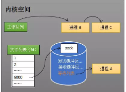
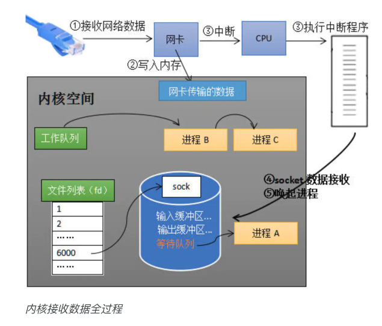
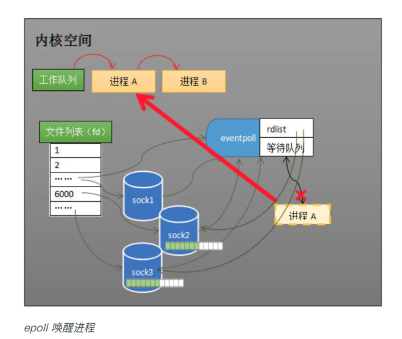
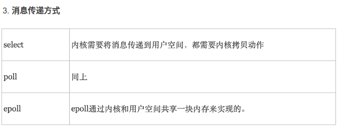

# 从硬件入手深入理解epoll 的本质

## 网卡接收数据
从网卡接收数据的流程讲起，串联起 CPU 中断、操作系统进程调度等知识；再一步步分析阻塞接收数据、select 到 epoll 的进化过程；最后探究 epoll 的实现细节。

这个过程涉及到 DMA 传输、IO 通路选择等硬件有关的知识，但我们只需知道：网卡会把接收到的数据写入内存。通过硬件传输，网卡接收的数据存放到内存中，操作系统就可以去读取它们。

## 如何知道接收了数据
计算机执行程序时，会有优先级的需求。比如，当计算机收到断电信号时，它应立即去保存数据，保存数据的程序具有较高的优先级

由硬件产生的信号需要 CPU 立马做出回应，不然数据可能就丢失了，所以它的优先级很高。CPU 理应中断掉正在执行的程序，去做出响应；当 CPU 完成对硬件的响应后，再重新执行用户程序。中断的过程如下图，它和函数调用差不多，**只不过函数调用是事先定好位置，而中断的位置由“信号”决定**。

以键盘为例，当用户按下键盘某个按键时，键盘会给 CPU 的中断引脚发出一个高电平，CPU 能够捕获这个信号，然后执行键盘中断程序。下图展示了各种硬件通过中断与 CPU 交互的过程。

现在可以回答“如何知道接收了数据？”这个问题了：**当网卡把数据写入到内存后，网卡向 CPU 发出一个中断信号，操作系统便能得知有新数据到来，再通过网卡中断程序去处理数据**。

> 内存的含义：应该不是指程序的内存，指的是系统的内存的地址上，是指内核空间的内存。

## 进程阻塞为什么不占用 CPU 资源

阻塞是进程调度的关键一环，指的是进程在等待某事件（如接收到网络数据）发生之前的等待状态，recv、select 和 epoll 都是阻塞方法。

下边分析一下进程阻塞为什么不占用 CPU 资源？

## 工作队列
操作系统为了支持多任务，实现了进程调度的功能，会把进程分为“运行”和“等待”等几种状态。运行状态是进程获得 CPU 使用权，正在执行代码的状态；等待状态是阻塞状态，比如上述程序运行到 recv 时，程序会从运行状态变为等待状态，**接收到数据后又变回运行状态**。操作系统会分时执行各个运行状态的进程，由于速度很快，看上去就像是同时执行多个任务。

## 等待队列
当进程 A 执行到创建 socket 的语句时，操作系统会创建一个由文件系统管理的 socket 对象（如下图）。这个 socket 对象包含了发送缓冲区、接收缓冲区与等待队列等成员。等待队列是个非常重要的结构，它指向所有需要等待该 socket 事件的进程。

当程序执行到 recv 时，操作系统会**将进程 A 从工作队列移动到该 socket 的等待队列中**（如下图）。由于工作队列只剩下了进程 B 和 C，依据进程调度，CPU 会轮流执行这两个进程的程序，不会执行进程 A 的程序。所以进程 A 被阻塞，不会往下执行代码，也不会占用 CPU 资源。

当 socket 接收到数据后，操作系统将**该 socket 等待队列上的进程重新放回到工作队列，该进程变成运行状态**，继续执行代码。同时由于 socket 的接收缓冲区已经有了数据，recv 可以返回接收到的数据。

注：操作系统添加等待队列只是添加了对这个“等待中”进程的引用，以便在接收到数据时获取进程对象、将其唤醒，而非直接将进程管理纳入自己之下。上图为了方便说明，直接将进程挂到等待队列之下。

## 内核接收网络数据全过程

以上是内核接收数据全过程，这里我们可能会思考两个问题：

- 其一，操作系统如何知道网络数据对应于哪个 socket？
- 其二，如何同时监视多个 socket 的数据？

第一个问题：因为一个 socket 对应着一个端口号，而网络数据包中包含了 ip 和端口的信息，内核可以通过端口号找到对应的 socket。当然，为了提高处理速度，操作系统**会维护端口号到 socket 的索引结构，以快速读取**。
> 指的是源的IP和端口

第二个问题是多路复用的重中之重，也正是本文后半部分的重点。

----

## 同时监视多个 socket 的简单方法

### select
**服务端需要管理多个客户端连接，而 recv 只能监视单个 socket**，这种矛盾下，人们开始寻找监视多个 socket 的方法。epoll 的要义就是高效地监视多个 socket。

假如能够预先传入一个 socket 列表，如果列表中的 socket 都没有数据，挂起进程，直到有一个 socket 收到数据，唤醒进程。这种方法很直接，也是 select 的设计思想。

为方便理解，我们先复习 select 的用法。在下边的代码中，**先准备一个数组 fds，让 fds 存放着所有需要监视的 socket。然后调用 select，如果 fds 中的所有 socket 都没有数据，select 会阻塞，直到有一个 socket 接收到数据，select 返回，唤醒进程。用户可以遍历 fds，通过 FD_ISSET 判断具体哪个 socket 收到数据，然后做出处理。**

> select的过程。可以结合其他文章更详细些。

select 的实现思路很直接，假如程序同时监视如下图的 sock1、sock2 和 sock3 三个 socket，那么在调用 select 之后，操作系统把进程 A **分别加入这三个 socket 的等待队列中**。

sock2 接收到了数据，中断程序唤起进程 A。所谓唤起进程，就是将进程从所有的等待队列中移除，加入到工作队列里面。经由这些步骤，当进程 A 被唤醒后，它知道至少有一个 socket 接收了数据。程序只需遍历一遍 socket 列表，就可以得到就绪的 socket。

#### 缺点
但是简单的方法往往有缺点，主要是：

- 其一，**每次调用 select 都需要将进程加入到所有监视 socket 的等待队列，每次唤醒都需要从每个队列中移除**。这里涉及了两次遍历，而且每次都要将整个 fds 列表传递给内核，有一定的开销。正是因为遍历操作开销大，出于效率的考量，才会规定 select 的最大监视数量，默认只能监视 1024 个 socket。

- 其二，进程被唤醒后，程序并不知道哪些 socket 收到数据，还需要遍历一次。

> select的缺点

## Epoll 的设计思路

### 功能分离
select 低效的原因之一是**将“维护等待队列”和“阻塞进程”两个步骤合二为一**。如下图所示，每次调用 select 都需要这两步操作，然而大多数应用场景中，**需要监视的 socket 相对固定，并不需要每次都修改。epoll 将这两个操作分开**，先用 epoll_ctl 维护等待队列，再调用 epoll_wait 阻塞进程。显而易见地，效率就能得到提升。

> ? 怎么理解？只需要添加一次等待队列吗？是因为操作系统把进程 A **分别加入这三个 socket 的等待队列中**

### 就绪列表
select 低效的另一个原因在于程序**不知道哪些 socket 收到数据，只能一个个遍历**。如果**内核维护一个“就绪列表”，引用收到数据的 socket，就能避免遍历**。如下图所示，计算机共有三个 socket，收到数据的 sock2 和 sock3 被就绪列表 rdlist 所引用。当进程被唤醒后，只要获取 rdlist 的内容，就能够知道哪些 socket 收到数据。

## epoll 的原理与工作流程

> 理解epoll 过程

如下图所示，当某个进程调用 epoll_create 方法时，内核会创建一个 eventpoll 对象（也就是程序中 epfd 所代表的对象）。**eventpoll 对象也是文件系统中的一员，和 socket 一样，它也会有等待队列**。

创建 epoll 对象后，**可以用 epoll_ctl 添加或删除所要监听的 socket**。以添加 socket 为例，如下图，如果通过 epoll_ctl 添加 sock1、sock2 和 sock3 的监视，内核会将 eventpoll 添加到这三个 socket 的等待队列中。

**当 socket 收到数据后，中断程序会操作 eventpoll 对象，而不是直接操作进程。**

当 socket 收到数据后，**中断程序会给 eventpoll 的“就绪列表”添加 socket 引用**。如下图展示的是 sock2 和 sock3 收到数据后，**中断程序让 rdlist 引用这两个 socket**。

eventpoll 对象相当于 socket 和进程之间的中介，socket 的数据接收并不直接影响进程，而是**通过改变 eventpoll 的就绪列表来改变进程状态**。

> 中断程序让 rdlist 引用这两个 socket

当程序执行到 epoll_wait 时，如果 rdlist 已经引用了 socket，那么 epoll_wait 直接返回，如果 rdlist 为空，阻塞进程。

当 socket 接收到数据，**中断程序一方面修改 rdlist，另一方面唤醒 eventpoll 等待队列中的进程，进程 A 再次进入运行状态（如下图）**。也因为 rdlist 的存在，进程 A 可以知道哪些 socket 发生了变化。

---

## 实现细节

### 就绪列表的数据结构

就绪列表引用着就绪的 socket，所以它**应能够快速的插入数据**。

程序可能随时调用 epoll_ctl 添加监视 socket，也**可能随时删除**。当删除时，若该 socket **已经存放在就绪列表**中，它**也应该被移除**。所以就绪列表应是一种能够**快速插入和删除的数据结构**。

双向链表就是这样一种数据结构，epoll 使用**双向链表来实现就绪队列**（对应上图的 rdllist）。

> 场景分析与数据结构

### 索引结构

既然 epoll 将“维护监视队列”和“进程阻塞”分离，也意味着需要有个数据结构来**保存监视的 socket，至少要方便地添加和移除，还要便于搜索，以避免重复添加**。红黑树是一种自平衡二叉查找树，搜索、插入和删除时间复杂度都是O(log(N))，效率较好，epoll 使用了红黑树作为索引结构（对应上图的 rbr）。

注：因为操作系统要兼顾多种功能，以及由更多需要保存的数据，rdlist 并非直接引用 socket，而是通过 epitem 间接引用，红黑树的节点也是 epitem 对象。同样，文件系统也并非直接引用着 socket。为方便理解，本文中省略了一些间接结构。

> eventpoll 对象也是文件系统中的一员，和 socket 一样，它也会有等待队列。当 socket 收到数据后，中断程序会操作 eventpoll 对象，而不是直接操作进程

> 就绪队列： 每当socket就绪后，中断程序一方面修改 rdlist，另一方面唤醒 eventpoll 等待队列中的进程，进程 A 再次进入运行状态。也因为 rdlist 的存在，进程 A 可以知道哪些 socket 发生了变化。

> 双向链表来实现就绪队列。红黑数实现监听的socket列表。

> select每次都需要遍历列表添加等待队列（用户复制到内核），唤醒需要进行删除。而且需要遍历获知哪个fd就绪。而epoll则通过eventpoll对象进行管理，epoll_ctl添加到socket的等待队列中，而且唤醒时，添加到eventpoll的队列中，避免再次遍历。

- [从硬件入手深入理解epoll 的本质](https://juejin.cn/post/6844904006301843464)
- [node异步非阻塞](../js/多线程.md)

---
# 图解系统

## select/poll

select 实现多路复⽤的⽅式是，将已连接的 Socket 都放到⼀个⽂件描述符集合，然后调⽤ select 函数将⽂件描述符集合**拷贝到内核**⾥，让内核来检查是否有⽹络事件产⽣，检查的⽅式很粗暴，就是**通过遍历⽂件描述符集合的⽅式**，当检查到有事件产⽣后，将此 Socket 标记为可读或可写， 接着再把整个⽂件描述符集合**拷贝回⽤户态**⾥，然后⽤户态还需要**再通过遍历的⽅法找到可读或可写的 Socket，然后再对其处理**。

所以，对于 select 这种⽅式，需要进⾏ **2 次「遍历」⽂件描述符集合，⼀次是在内核态⾥，⼀个次是在⽤户态⾥ ，⽽且还会发⽣ 2 次「拷贝」⽂件描述符集合，先从⽤户空间传⼊内核空间，由内核修改后，再传出到⽤户空间中**。

select 使⽤**固定长度的 BitsMap，表示⽂件描述符集合**，⽽且所⽀持的⽂件描述符的个数是有限制的，在Linux 系统中，由内核中的 FD_SETSIZE 限制， 默认最⼤值为 1024 ，只能监听 0~1023 的⽂件描述符。

**poll 不再⽤ BitsMap 来存储所关注的⽂件描述符，取⽽代之⽤动态数组，以链表形式来组织，突破了select 的⽂件描述符个数限制，当然还会受到系统⽂件描述符限制**。但是 poll 和 select 并没有太⼤的本质区别，都是使⽤「线性结构」存储进程关注的 Socket 集合，因此都需要遍历⽂件描述符集合来找到可读或可写的 Socket，时间复杂度为 O(n)，⽽且也需要在⽤户态与内核态之间拷贝⽂件描述符集合，这种⽅式随着并发数上来，性能的损耗会呈指数级增长。

## epoll
epoll通过两个⽅⾯，很好解决了 select/poll 的问题。

- 第⼀点，epoll 在内核⾥使⽤红⿊树来跟踪进程所有待检测的⽂件描述字，把**需要监控的 socket 通过epoll_ctl() 函数加⼊内核中的红⿊树**⾥，红⿊树是个⾼效的数据结构，增删查⼀般时间复杂度是O(logn) ，通过对这棵⿊红树进⾏操作，这样就不需要像 select/poll 每次操作时都传⼊整个 socket 集合，只需要传⼊⼀个待检测的 socket，**减少了内核和⽤户空间⼤量的数据拷贝和内存分配**。

- 第⼆点， **epoll 使⽤事件驱动的机制**，内核⾥维护了⼀个链表来记录就绪事件，当某个 socket 有事件发⽣时，通过回调函数内核会将其加⼊到这个就绪事件列表中，当⽤户调⽤ epoll_wait() 函数时，只会返回有事件发⽣的⽂件描述符的个数，不需要像 select/poll 那样轮询扫描整个 socket 集合，⼤⼤提⾼了检测的效率。

epoll 的⽅式即使监听的 Socket 数量越多的时候，效率不会⼤幅度降低，能够同时监听的 Socket 的数⽬也⾮常的多了，上限就为系统定义的进程打开的最⼤⽂件描述符个数。因⽽，epoll 被称为解决 C10K 问题的利器。

插个题外话，⽹上⽂章不少说， epoll_wait 返回时，对于就绪的事件，epoll使⽤的是共享内存的⽅式，即⽤户态和内核态都指向了就绪链表，所以就避免了内存拷贝消耗。

这是错的！看过 epoll 内核源码的都知道，压根就没有使⽤共享内存这个玩意。你可以从下⾯这份代码看到， epoll_wait 实现的内核代码中调⽤了 __put_user 函数，这个函数就是将数据从内核拷贝到⽤户空间。

epoll ⽀持两种事件触发模式，分别是边缘触发（edge-triggered，ET）和⽔平触发（level-triggered，LT）。

这两个术语还挺抽象的，其实它们的区别还是很好理解的。

- 使⽤边缘触发模式时，当被监控的 Socket 描述符上有可读事件发⽣时，服务器端只会从 epoll_wait中苏醒⼀次，即使进程没有调⽤ read 函数从内核读取数据，也依然只苏醒⼀次，因此我们程序要保证⼀次性将内核缓冲区的数据读取完；
- 使⽤⽔平触发模式时，当被监控的 Socket 上有可读事件发⽣时，服务器端不断地从 epoll_wait 中苏醒，直到内核缓冲区数据被 read 函数读完才结束，⽬的是告诉我们有数据需要读取；

举个例⼦，你的快递被放到了⼀个快递箱⾥，如果快递箱只会通过短信通知你⼀次，即使你⼀直没有去取，它也不会再发送第⼆条短信提醒你，这个⽅式就是边缘触发；如果快递箱发现你的快递没有被取出，它就会不停地发短信通知你，直到你取出了快递，它才消停，这个就是⽔平触发的⽅式。

这就是两者的区别，⽔平触发的意思是只要满⾜事件的条件，⽐如内核中有数据需要读，就⼀直不断地把这个事件传递给⽤户；⽽边缘触发的意思是只有第⼀次满⾜条件的时候才触发，之后就不会再传递同样的事件了。

如果使⽤⽔平触发模式，当内核通知⽂件描述符可读写时，接下来还可以继续去检测它的状态，看它是否依然可读或可写。所以在收到通知后，没必要⼀次执⾏尽可能多的读写操作。

如果使⽤边缘触发模式，I/O 事件发⽣时只会通知⼀次，⽽且我们不知道到底能读写多少数据，所以在收到通知后应尽可能地读写数据，以免错失读写的机会。因此，我们会循环从⽂件描述符读写数据，那么**如果⽂件描述符是阻塞的，没有数据可读写时，进程会阻塞在读写函数那⾥，程序就没办法继续往下执⾏**。

所以，边缘触发模式⼀般和⾮阻塞 I/O 搭配使⽤，程序会⼀直执⾏ I/O 操作，**直到系统调⽤（如 read 和write ）返回错误**，错误类型为 EAGAIN 或 EWOULDBLOCK 。

⼀般来说，边缘触发的效率⽐⽔平触发的效率要⾼，因为边缘触发可以**减少 epoll_wait 的系统调⽤次数，系统调⽤也是有⼀定的开销的的，毕竟也存在上下⽂的切换**。

select/poll 只有⽔平触发模式，epoll 默认的触发模式是⽔平触发，但是可以根据应⽤场景设置为边缘触发模式。另外，使⽤ I/O 多路复⽤时，最好搭配⾮阻塞 I/O ⼀起使⽤。

---
# epoll
- [聊聊IO多路复用之select、poll、epoll详解](https://www.jianshu.com/p/dfd940e7fca2): select、poll说得有些绕，摘抄epoll部分

目前支持I/O多路复用的系统调用有 select，pselect，poll，epoll，I/O多路复用就是通过一种机制，一个进程可以监视多个描述符，一旦某个描述符就绪（一般是读就绪或者写就绪），能够通知程序进行相应的读写操作。**但select，pselect，poll，epoll本质上都是同步I/O，因为他们都需要在读写事件就绪后自己负责进行读写，也就是说这个读写过程是阻塞的**，而异步I/O则无需自己负责进行读写，异步I/O的实现会负责把数据从内核拷贝到用户空间。

epoll使用一个文件描述符管理多个描述符，将用户关系的文件描述符的事件存放到内核的一个事件表中，这样**在用户空间和内核空间的copy只需一次**。

## 基本原理

epoll支持水平触发和边缘触发，最大的特点在于**边缘触发，它只告诉进程哪些fd刚刚变为就绪态，并且只会通知一次**。还有一个特点是，epoll使用“事件”的就绪通知方式，通过epoll_ctl注册fd，一旦该fd就绪，内核就会采用类似callback的回调机制来激活该fd，epoll_wait便可以收到通知。

epoll对文件描述符的操作有两种模式：LT（level trigger）和ET（edge trigger）。LT模式是默认模式，LT模式与ET模式的区别如下：

- LT模式：当epoll_wait检测到描述符事件发生并将此事件通知应用程序，应用程序可以不立即处理该事件。下次调用epoll_wait时，会再次响应应用程序并通知此事件。

- ET模式：当epoll_wait检测到描述符事件发生并将此事件通知应用程序，应用程序必须立即处理该事件。如果不处理，下次调用epoll_wait时，不会再次响应应用程序并通知此事件。

## epoll的优点：

- 没有最大并发连接的限制，能打开的FD的上限远大于1024（1G的内存上能监听约10万个端口）。

- 效率提升，不是轮询的方式，不会随着FD数目的增加效率下降。只有活跃可用的FD才会调用callback函数；即Epoll最大的优点就在于它只管你“活跃”的连接，而跟连接总数无关，因此在实际的网络环境中，Epoll的效率就会远远高于select和poll。

- 内存拷贝，利用mmap()文件映射内存加速与内核空间的消息传递；即epoll使用mmap减少复制开销。
> 并没有?

> 消息传递，epoll是通过共享内存实现的？

---
# select/epoll与IO的联系

IO multiplexing多路复用就是我们说的select，poll，epoll。select/epoll的好处就在于单个process就可以同时处理多个网络连接的IO。

多路复用这个图和blocking IO的图其实并没有太大的不同，事实上，还更差一些。因为这里需要使用两个system call (select 和 recvfrom)，而blocking IO只调用了一个system call (recvfrom)。但是，用select的优势在于它可以同时处理多个connection。

select，poll，epoll本质上都是同步I/O，因为他们都需要在读写事件就绪后自己负责进行读写，也就是说这个读写过程是阻塞的，而异步I/O则无需自己负责进行读写，异步I/O的实现会负责把数据从内核拷贝到用户空间。

- [Linux IO模式及 select、poll、epoll详解](https://segmentfault.com/a/1190000003063859)

----
# Epoll与异步

- [讨论：IO多路复用到底是不是异步的？](https://www.zhihu.com/question/59975081)

简单来说同步和异步需要说明针对哪一个通信层次来讨论，异步编程框架是说框架内的业务代码与框架的接口是异步的，而框架与操作系统的接口是同步非阻塞。

- [怎样理解阻塞非阻塞与同步异步的区别？ - 灵剑的回答 - 知乎](https://www.zhihu.com/question/19732473/answer/117012135)

而2和6，其他答主已经说得很好了，其实都需要调用方自己把数据在内核和用户空间里搬来搬去，其实都是**同步接口**，除非是IOCP这样的专门的异步传输接口，所以这一级其实是同步的，阻塞与非阻塞的区别其实是影响调用接口的结果（在特定条件下是否提前返回结果），而不是调用方式。

- [IO多路复用到底是不是异步的？ - 至尊宝的回答 - 知乎](https://www.zhihu.com/question/59975081/answer/170957752)

> **io分两个阶段，1.询问内核准备好数据没有 2.从内核读数据。阻塞，非阻塞都是指阶段一。同步异步指阶段2。** 

> **unix只有同步io**

Q: 那究竟是如何实现异步的？epoll不是也要wait吗？为什么还能继续处理？

A: 有等待时间配置项

---
## Epoll缺陷

但 epoll 就没有缺陷吗？答案是否定的：

**epoll 目前只支持 pipe, 网络等操作产生的 fd，暂不支持文件系统产生的 fd。**

异步 I/O上面介绍的，无论是阻塞 I/O 还是 非阻塞 I/O 还是 I/O 多路复用，都是同步 I/O。都需要**用户等待 I/O操作完成，并接收返回的内容**(阻塞)。而操作系统本身也提供了异步 I/O 的方案，对应到不同的操作系统：Linuxaio，目前比较被诟病，比较大缺陷是只支持 Direct I/O（文件操作）io_uring， Linux Kernel 在 5.1 版本加入的新东西，被认为是 Linux 异步 I/O 的新归宿windowsiocp，作为 libuv 在 windows 之上的异步处理方案。（笔者对 windows 研究不多，不多做介绍了。）至此，介绍了常见的几种 I/O 模型。而目前在 Linux 上比较推荐的方案还是 epoll 的机制。但 epoll 不支持监听文件 fd 的问题，还需要动点脑筋，我们来看看 libuv 怎么解决的。

**libuv** 使用 epoll 来构建 **event-loop** 的主体，其中：

- socket, pipe 等能通过 epoll 方式监听的 fd 类型，通过 epoll_wait 的方式进行监听；
- 文件处理 / DNS 解析 / 解压、压缩等操作，**使用工作线程的进行处理，将请求和结果通过两个队列建立联系，由一个 pipe 与主线程进行通信， epoll 监听该 fd 的方式来确定读取队列的时机**。

参考链接：

- [Node.js 异步非阻塞 I/O 机制剖析](https://juejin.im/post/5d9c28dbf265da5b6723e3a1)

---
# 深入理解Linux IO模型(二)
> - [深入理解Linux IO模型(二)](https://mp.weixin.qq.com/s/6AXO0mY2xSiQ7140f9UJuQ)

#### select的缺陷

应用进程是否在每次调用系统调用，询问内核有事件发生的TCP连接时，把这100万个连接告诉内核，由内核找出其中有事件发生的TCP连接呢？这正是select的做法。

select有明显的缺陷，因为这100万个TCP连接中，大部分是没有事件发生的。如果应用程序每次收集事件时，都把这100万个socket fd传给内核。有以下问题：

1.  导致用户空间到内核空间的大量复制。

2.  内核需要遍历所有的socket fd，判断哪些有事件到来。

3.  应用进程仍需要遍历所有的socket fd，来判断哪些socket fd可读。

所以select限制了同时监听的socket fd数量，最多只能同时处理1024个并发连接。

### epoll的原理

当应用进程调用epoll\_create时，内核会在内核空间创建一个独立的eventpoll结构体对象，用于维护使用epoll\_ctl向其添加的事件。

#### 数据结构

epoll的数据结构如图所示。eventpoll有两个核心的数据结构：

1.  红黑树(rbr)：维护通过epoll\_ctl添加的事件。

2.  就绪链表(rdllist)：保存就绪的事件，当事件发生时，由内核的中断处理程序插入该就绪链表。

> 说明: 这张图来自于《深入理解Nginx》，网上很多博客用了这张图，但是这张图关于就绪链表的描述有个小错误。"红黑树中每个节点都是基于epitem结构中的rdllink成员"应该改成"就绪链表中每个节点都是基于epitem结构中的rdllink成员"。

#### 实现原理

在epoll中，为每个事件都建立一个epitem结构体对象。这些事件都会添加到rbr红黑树中（重复添加的事件可以通过红黑树高效地识别出来）。从红黑树中查找事件非常快。

所有添加到epoll对象中的事件都会与设备驱动程序（如网卡驱动程序）建立回调关系，当相应的事件发生时，会调用回调函数（中断处理程序）。这个回调函数在内核叫`ep_poll_callback`，回调函数会把就绪的事件写入rdllist双向链表中。

当应用程序调用epoll\_wait检查是否有事件发生的连接时，内核只是检查eventpoll对象的rdllist双向链表是否有epitem元素而已。如果rdllist链表不为空，内核把这里的事件复制到用户空间，同时返回对应的事件数量。

#### 高效原因

最后总结分析下epoll之所以可以处理百万级别的并发连接，而且效率很高的原因。

1.  应用程序在调用系统调用epoll\_create创建epoll时，内核为它开辟了一片内存空间。把listen fd存在里面，以及当每次来客户端请求，三次握手后建立的client fd都会存在内核态的这个内存空间。这样不同于select，**避免了用户空间和内核空间之间重复传递fd的过程**。

2.  应用程序要知道哪些事件可读了，不同于在select中应用程序需要主动遍历所有fd，内核只是将**就绪列表中的事件复制到用户空间的event数组中**（应用程序提前申请好的内存），这样应用程序只需要遍历这些就绪的事件。

3.  就绪事件是怎么放入就绪列表的？答案是epoll利用了事件驱动。当数据包进入网卡，网卡将数据包通过DMA方式写入内存。网卡raise硬件中断IRQ，通知CPU有数据包到来了。CPU查询中断向量表，得到中断服务程序的指针，这个中断服务程序会调用网卡驱动程序。这里的中断服务程序是事先注册的，所以也可以理解CPU根据中断号回调中断处理程序，**从内存读取数据，得到事件的fd，写入就绪列表rdllist中**。

----
# Tornado

大部分服务器会使用多线程技术来让服务器一次接收多个客户端的请求，我们假设你有20个线程，你将在性能上获得20倍的提高，所以现在你的服务器效率是每秒接受4个请求，但这还是太低了。

当然，你可以通过不断地提高线程的数量来解决这个问题，但是，线程在内存和调度方面的开销是昂贵的，大多数Linux发布版中都是默**认线程堆大小为8MB**。为每个打开的连接维护一个大的线程池等待数据极易迅速耗光服务器的内存资源。可能这种提高线程数量的方式将永远不可能达到每秒100个请求的效率。

AIO的思想是当我们在等待结果的时候不阻塞，转而我们给框架一个回调函数作为参数，让框架在收到结果的时候通过回调函数继续操作。这样，服务器就可以被解放去接受其他客户端的请求了。

Q： Tornado，类似node.js，那也就是事件循环是主线程监听epoll并回调。那是在哪里进行新的客户端连接监听的，放到epoll里的？回调是会阻塞下一个请求的回调吗？

A: 建立连接也是一个事件。其他模式，例如netty，会分离监听事件和读写事件。

- [Tornado异步原理详析](https://www.jianshu.com/p/de7f04e65618)
- [Tornado原理浅析及应用场景探讨](https://www.jiqizhixin.com/articles/2019-04-10-15)
- [深入理解tornado的ioloop](https://blog.csdn.net/runner668/article/details/82930988)

---
## 异步

当然异步还有第二层含义是:

- 当我们通过监听系统io读写事件到达时，可以立刻就用当前线程去处理io读写事件，比如tornado就是这么做的。Q: node也是？A: node也是，网络IO读取在主线程会有工作线程！

> **tornado使用单一线程处理还有一个很重要的原因也是受python全局GIL锁的影响**，统一时刻，只能有一个线程真实的在运行，所以在生产环境部署中，一般会创建和cpu核心数相同的进程来充分使用系统资源。

- 也可以把这个事件一个队列里，之后再调度这个队列去处理io读写，调度的过程可以仍然由这个线程完成也可以由其他线程完成，比如java的Reactor(netty)，go语言的协程实现。第二种设计中，会使用一个线程(go:网络轮询器?)监听select或epoll等待系统io事件，而用和**cpu核心数相同的线程数**(go的MPG)处理io读写事件。

> 也就是异步架构的不同

Q：2、为什么一个线程可以既处理select监听系统io事件，handle_event，又可以发起注册handler

？：注册handler这个过程大部分情况会在handle_event的过程中发起，或者由外部的其他线程发起，所以虽然是个while死循环，但是仍然可以不停的处理各种事情。

- [一个线程也能来轮询 + 注册handler之类的吗？](https://github.com/snower/TorMySQL/issues/28#issuecomment-358540466): 

TODO:
- nginx 如何实现异步?
- tornado 异步原理？

Q: 所以是listen的时候，socket默认就能进行epoll的模式，能够监听新来的多个客户端链接的?所以只有一个线程监听epoll？

A: 去阅读一下源码就知道了。是可以的，会同时监听accept和客户端连接。

