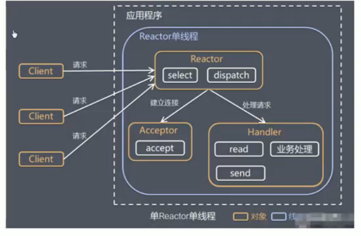
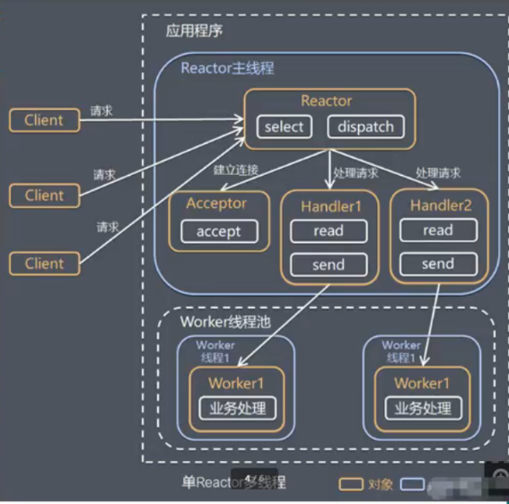
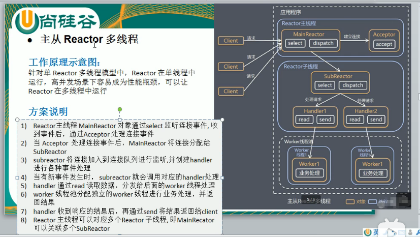
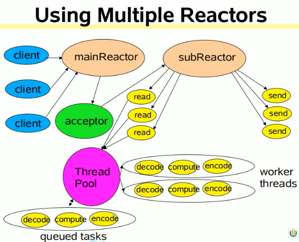
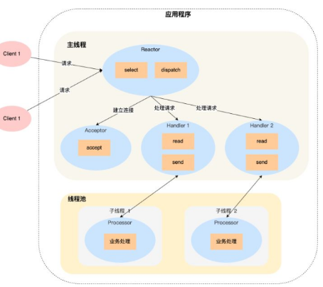
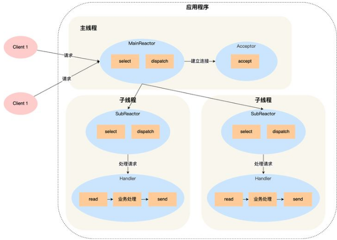

# 高山仰之可极，谈半同步/半异步网络并发模型

> - [谈半同步/半异步网络并发模型](https://zhuanlan.zhihu.com/p/58860015)

## 平民级的多线程IO

主线程创建多个线程（pthread或者std::thread），然后每个线程内部开启死循环，循环体内进行accept。当无客户端连接的时候accept是阻塞的，当有连接到时候，则会被激活，accept开始返回。这种模式在上古时代，存在accept的『惊群』问题（Thundering herd Problem），即当有某个客户端连接的时候，多个阻塞的线程会被唤醒。当然这个问题在Linux内核2.6版本就已经解决。

## 半同步/半异步

**异步IO层+队列层+同步处理层**

当然也使用了多线程，一般是一个IO线程和多个工作线程。**IO线程也可以是主线程，负责异步地从客户端fd获取客户端的请求数据，而工作线程则是并发的对该数据进行处理。工作线程不关心客户端fd，不关心通信。而IO线程不关心处理过程**。

通过队列来作为数据交换的桥梁。因此可以看出，在HSHA模式中，有我们熟悉的『生产者、消费者』模型。当然由于涉及到多线程的同时操作队列，所以加锁是必不可以少的。

### 异步IO与同步处理

所谓**异步：在接收客户端连接，获取请求数据，以及向队列中写入数据的时候是异步的**。在写入完成可能会执行预设的回调函数，进行预处理和其他通知操作。也便是Proactor模式（与之相对的是Reactor，下文有述）。

**关于异步IO，严重依赖内核的支持**，比如Windows的IOCP就是公认的不错的异步IO实现，而Linux的AIO系列API虽然模拟了异步操作的接口，但是内部还是用多线程来模拟，实则为伪异步，十分鸡肋。另外请注意**epoll不是异步IO！，epoll虽然可以一次返回多个fd的就绪状态，但若要获取数据，单线程的话还是同步一个fd一个fd的read的**。

> 异步IO。所以半同步半异步的异步是真的异步吗？（epoll不是异步IO，还是说隐射linux通过多线程模拟）。A: 下文有说到是真正的异步I/O

所谓同步：**一个客户端连接的一次请求，其具体处理过程（业务逻辑）是同步的。虽然在消费队列的时候是多线程，但并不会多个线程并行处理一次请求**。

综上，也就是说当一个客户端发送请求的时候，整个服务端的逻辑一分为二。**第一部分，接收请求数据是异步的；第二部分，在收完数据之后的处理逻辑是同步的。所谓半同步，半异步因此得名。**

> 第一部分，接收请求数据是异步的；第二部分，在收完数据之后的处理逻辑是同步的。所谓半同步，半异步因此得名。

### 返回数据是怎么发送的？

它的实现方式可以有很多，比如在工作线程中，处理完成之后，直接在工作线程向客户端发送数据。或者再弄一个写入队列，将返回数据和客户端信息（比如fd）放入该队列（在工作线程中侵入了IO逻辑，违背解耦初衷）。然后有一组专门负责发送的线程来取元素和发送（这种方式会增加额外的锁）。总之也不需要过分追求，什么标准、什么定义。

### 队列思考

**队列中元素为封装了请求数据和其他元数据的结构体，可以称之为任务对象**。**HSHA模式不一定是多线程实现的，也可以是多进程。那么此时队列可能是一个共享内存，通过信号量同步来完成队列的操作。如果是多线程实现的。那么队列可以是一个普通的数组，多线程API若使用pthread，则同步即可使用pthread_mutext_t**。当然也可以使用C++11的std::thread。

关于工作线程消费队列数据的方式，和一般的『队列』模型相同，即可分为『推』和『拉』两种模型。通常HSHA为推模型，**即若队列尚无数据，则工作线程阻塞休眠，等待数据产生。而当IO线程写入了数据之后，则会唤醒休眠的工作线程来处理**。很明显在pthread的语义下，这必然是一个条件变量（pthread_cond_t）。**需要注意的是条件变量的惊群问题，即可能同时唤醒多个工作线程。前文虽然提到accept的惊群问题早被内核解决，但是条件变量的惊群问题仍在**。这里需要注意的是虽然 pthread_cond_wait 本身便能阻塞线程，但一般还是要用while而非if来做阻塞判断，一方面便是为了避免惊群，另一个方面是某些情况下，阻塞住的线程可能被虚假唤醒（即没有pthread_cond_signal就解除了阻塞）。

> 需要注意的是条件变量的惊群问题，即可能同时唤醒多个工作线程。前文虽然提到accept的惊群问题早被内核解决，但是条件变量的惊群问题仍在

再谈一下拉模型。**即不需要条件变量，工作线程内做死循环，去不停的轮训队列数据**。两种模型各有利弊，主要要看实际业务场景和业务规模，**抛开业务谈架构，常常是狭隘的**。**如果是IO密集型的，比如并发度特别高，以至于几乎总能取到数据，那么就不需要推模型**。

> 如果是IO密集型的，比如并发度特别高，以至于几乎总能取到数据，那么就不需要推模型

另外关于队列的数据结构，多进程需要使用到共享内存，相对麻烦，实际用多线程就OK了

## 半同步半反应堆

**HSHA模式十分依赖异步IO，然而实现真异步通常是比较困难**，即便Linux有AIO系列API，但其实**十分鸡肋，内部用pthread模拟，在这方面不如Windows的IOCP**。而当时IO多路复用技术的发展，带给了人们新的思路，用**IO多路复用代替异步IO，对HSHA进行改造**。这就是『半同步/半反应堆』模型（Half-Sync/Half-Reactor，以下简称HSHR）。

**循环之初，Polling API（select/poll/epoll/kqueue）只监听服务端socket，当监测到服务端socket可读，就会进行进行accept，获得客户端fd放入队列**。**也就是说和HSHA不同，HSHR的队列中存放的不是请求数据，而是fd。工作线程从队列中取的不是数据，而是客户端fd**。**和HSHA不同，HSHR将IO的过程侵入到了工作线程中。工作线程的逻辑循环内从队列取到fd后，对fd进行read/recv获取请求数据，然后进行处理，最后直接write/send客户端fd，将数据返回给客户端**。可以看出来，这种IO的方式是一种Reactor模式，这就是该模型中，半反应堆（Half-Reactor）一词的由来。

> 也就是说和HSHA不同，HSHR的队列中存放的不是请求数据，而是fd

**当然队列中存储的元素并不是简单的int来表示fd，而是一个结构体，里面除了包含fd以外还会包含一些其他信息，比如状态之类的**。如果队列是数组，则需要有状态标记，fd是否就绪，是否已被消费等等。工作线程每次取的时候不是简单的竞争队首元素，而是也要判断一下状态。当然如果是链表形式的队列，也可以通过增删节点，来表示fd是否就绪，这样工作线程每次就只需要竞争队首了，只不过在每个连接频繁发送数据的时候，会频繁的增删相同的fd节点，这样的链表操作效率未必比数组高效。

### epoll一定比select效率高吗

**貌似很多人对select的理解存在误区，认为只有监视的fd个数足够多的时候**，由于select的线性扫描fd集合操作效率才比较低，所以就想当然的认为当监视的fd个数不是很多的时候，它的效率可能比摆弄红黑树和链表的epoll要更高。**其实不是，这个扫描效率和fd集合的大小无关，而是和最大的fd的数值有关。比如你只监视一个fd，这个fd是1000，那么它也会从0到1000都扫描一遍**。当然这也不排除fd比较少的时候，有更大的概率它的数值一般也比较小，但是我不想玩文字游戏，如果硬要说fd集合小的时候，epoll效率未必最优的话，那也是和poll比，而不是select。

**poll没有select那种依赖fd数值大小的弊端，虽然他也是线性扫描的，但是fd集合有多少fd，他就扫描多少。绝不会多**。所以**在fd集合比较小的时候，poll确实会有由于epoll的可能。但是这种场景使用epoll也完全能胜任。当然poll也并不总是优于select的**。因为这两货**还有一个操作就是每次select/poll的时候会将监视的fd集合从用户态拷贝到内核态。select用bitmask描述fd，而poll使用了复杂的结构体，所以当fd多的时候，每次poll需要拷贝的字节数会更多。所以poll和select的比较也是不能一概而论的**。

虽然总体来说select不如epoll，但select本身的效率也没你想象中那么低。如果你在老系统上看到select，也运行的好好的，那真的只是Old-Fashion，不存在什么很科学的解释，说这个系统为什么没采用epoll。Anyway，除非你不是Linux系统，否则为什么对epoll说不呢？

---
# Netty

> - [尚硅谷Netty视频教程](https://www.bilibili.com/video/BV1DJ411m7NR)

## Reactor模式

Reactor模式中核心组成：
 - Reactor：Reactor在一个单独的线程中运行，**负责监听和分发事件**，分发给适当的处理程序来对IO事件做出反应。它就像公司的电话接线员，它接听来自客户的电话并将线路转移到适当的联系人
 - Handlers：处理程序执行I/O事件要完成的实际事件， 类似于客户想要与之交谈的公司中的实际官员。Reactor通过调度适当的处理程序来响应I/O事件， 处理程序执行非阻塞操作。

## 单reactor单线程

方案优缺点分析：

优点：
 - 模型简单，没有多线程、进程通信、竞争的问题，全部都在一个线程中完成

缺点：
 - 性能问题， 只有一个线程， 无法完全发挥多核CPU的性能。Handler在处理某个连接上的业务时，整个进程无法处理其他连接事件，很容易导致性能瓶颈
 - 可靠性问题，线程意外终止，或者进入死循环，会导致整个系统通信模块不可用，不能接收和处理外部消息，造成节点故障

使用场景：客户端的数量有限， 业务处理非常快速， 比如Redis在业务处理的时间复杂度O(1)的情况

## 单reactor多线程

优点：可以充分的利用多核cpu的处理能力

缺点：多线程数据共享和访问比较复杂， reactor处理所有的事件的监听和响应， 在单线程运行，在高并发场景容易出现性能瓶颈.

> 这应该不属于reactor模型。因为交换的是数据，而不是fd。可以说是半同步/半异步模型。

## 主从reactor多线程

方案优缺点说明：

优点：
- 父线程与子线程的数据交互简单职责明确，父线程只需要接收新的连接，子线程完成后续的业务处理。
- 父线程与子线程的数据交互简单， Reactor主线程只需要把新连接传给子线程，子线程无需返回数据。

缺点：
- 编程复杂度较高

结合实例：这种模型在许多项目中广泛使用， 包括Nginx主从Reactor多进程模型，Memcached主从多线程， Netty主从多线程模型的支持

> 这是reactor模型。主reactor建立连接，分发给从reactor监听连接，而且加了一层工作线程进行业务处理

## 小结
38到41的reactor的教程, 优缺点的文字总结和解说都很详细：
- 介绍了单reactor单线程（写在一起），redis
- 单reactor多线程（Worker线程完成真正的业务处理，主线程的reactor会分发到主线程的handler(同一个线程， 是阻塞的)做read、send，然后才将结果分发到多个Worker线程）
- 主从reactor模型（**主线程只监听**、独立(**多个**)子reactor线程(类似nginx)，进行read、send的I/O读取并分配任务给多个Worker线程、worker线程进行业务处理，三层）的对比。

---

[Node.js从design pattern上属于Reactor or Proactor？](https://www.zhihu.com/question/38545748/answer/76927494): Node的背后是V8和libuv和IOCP(windows)，libuv接受V8解析后的请求事件，用event loop来注册事件，并提交给后面的线程池来进行实际操作，libuv是属于所谓的reactor pattern的，即用户可以注册一个”读回调“来处理发生在字节流上的读操作。。。。

---
# 如何深刻理解Reactor和Proactor？
> - [如何深刻理解Reactor和Proactor？](https://www.zhihu.com/question/26943938/answer/1856426252)

是的，基本是基于 I/O 多路复用，用过 I/O 多路复用接口写网络程序的同学，肯定知道是面向过程的方式写代码的，这样的开发的效率不高。

于是，大佬们基于面向对象的思想，对 I/O 多路复用作了一层封装，让使用者不用考虑底层网络 API 的细节，只需要关注应用代码的编写。

大佬们还为这种模式取了个让人第一时间难以理解的名字：**Reactor 模式**。

Reactor 翻译过来的意思是「反应堆」，可能大家会联想到物理学里的核反应堆，实际上并不是的这个意思。

这里的反应指的是「**对事件反应**」，也就是**来了一个事件，Reactor 就有相对应的反应/响应**。

事实上，Reactor 模式也叫 `Dispatcher` 模式，我觉得这个名字更贴合该模式的含义，即 **I/O 多路复用监听事件，收到事件后，根据事件类型分配（Dispatch）给某个进程 / 线程**。

Reactor 模式主要由 Reactor 和处理资源池这两个核心部分组成，它俩负责的事情如下：

*   Reactor 负责监听和分发事件，事件类型包含连接事件、读写事件；
*   处理资源池负责处理事件，如 read -> 业务逻辑 -> send；

Reactor 模式是灵活多变的，可以应对不同的业务场景，灵活在于：

*   Reactor 的数量可以只有一个，也可以有多个；
*   处理资源池可以是单个进程 / 线程，也可以是多个进程 /线程；

方案具体使用进程还是线程，要看使用的编程语言以及平台有关：

*   Java 语言一般使用线程，比如 Netty;
*   C 语言使用进程和线程都可以，例如 Nginx 使用的是进程，Memcache 使用的是线程。

接下来，分别介绍这三个经典的 Reactor 方案。
## Reactor

### 单 Reactor 单进程 / 线程

一般来说，C 语言实现的是「**单 Reactor** ***单进程***」的方案，因为 C 语编写完的程序，运行后就是一个独立的进程，不需要在进程中再创建线程。

而 Java 语言实现的是「**单 Reactor** ***单线程***」的方案，因为 Java 程序是跑在 Java 虚拟机这个进程上面的，虚拟机中有很多线程，我们写的 Java 程序只是其中的一个线程而已。

单 Reactor 单进程的方案因为全部工作都在同一个进程内完成，所以实现起来比较简单，不需要考虑进程间通信，也不用担心多进程竞争。

但是，这种方案存在 2 个缺点：

*   第一个缺点，因为只有一个进程，**无法充分利用 多核 CPU 的性能**；
*   第二个缺点，Handler 对象在业务处理时，整个进程是无法处理其他连接的事件的，**如果业务处理耗时比较长，那么就造成响应的延迟**；

所以，单 Reactor 单进程的方案**不适用计算机密集型的场景，只适用于业务处理非常快速的场景**。

Redis 是由 C 语言实现的，它采用的正是「单 Reactor 单进程」的方案，因为 Redis 业务处理主要是在内存中完成，操作的速度是很快的，性能瓶颈不在 CPU 上，所以 Redis 对于命令的处理是单进程的方案。

### 单 Reactor 多线程 / 多进程

如果要克服「单 Reactor 单线程 / 进程」方案的缺点，那么就需要引入多线程 / 多进程，这样就产生了**单 Reactor 多线程 / 多进程**的方案。

详细说一下这个方案：

*   Reactor 对象通过 select （IO 多路复用接口） 监听事件，收到事件后通过 dispatch 进行分发，具体分发给 Acceptor 对象还是 Handler 对象，还要看收到的事件类型；
*   如果是连接建立的事件，则交由 Acceptor 对象进行处理，Acceptor 对象会通过 accept 方法 获取连接，并创建一个 Handler 对象来处理后续的响应事件；
*   如果不是连接建立事件， 则交由当前连接对应的 Handler 对象来进行响应；

上面的三个步骤和单 Reactor 单线程方案是一样的，接下来的步骤就开始不一样了：

*   Handler 对象不再负责业务处理，只负责数据的接收和发送，Handler 对象通过 read 读取到数据后，会将数据发给子线程里的 Processor 对象进行业务处理；
*   子线程里的 Processor 对象就进行业务处理，处理完后，将结果发给主线程中的 Handler 对象，接着由 Handler 通过 send 方法将响应结果发送给 client；

单 Reator 多线程的方案优势在于**能够充分利用多核 CPU 的能**，那既然引入多线程，那么自然就带来了多线程竞争资源的问题。

事实上，单 Reactor 多进程相比单 Reactor 多线程实现起来很麻烦，主要因为要考虑**子进程 <-> 父进程的双向通信**，并且父进程还得知道子进程要将数据发送给哪个客户端。

而多线程间可以**共享数据，虽然要额外考虑并发问题，但是这远比进程间通信的复杂度低得多**，因此实际应用中**也看不到单 Reactor 多进程的模式**。

另外，「单 Reactor」的模式还有个问题，**因为一个 Reactor 对象承担所有事件的监听和响应，而且只在主线程中运行，在面对瞬间高并发的场景时，容易成为性能的瓶颈的地方**。

### 多 Reactor 多进程 / 线程

要解决「单 Reactor」的问题，就是将「单 Reactor」实现成「多 Reactor」，这样就产生了第 **多 Reactor 多进程 / 线程**的方案。

方案详细说明如下：

*   主线程中的 MainReactor 对象通过 select 监控连接建立事件，收到事件后通过 Acceptor 对象中的 accept 获取连接，将新的连接分配给某个子线程；
*   子线程中的 SubReactor 对象将 MainReactor 对象分配的连接加入 select 继续进行监听，并创建一个 Handler 用于处理连接的响应事件。
*   如果有新的事件发生时，SubReactor 对象会调用当前连接对应的 Handler 对象来进行响应。
*   Handler 对象通过 read -> 业务处理 -> send 的流程来完成完整的业务流程。

多 Reactor 多线程的方案虽然看起来复杂的，但是实际实现时比单 Reactor 多线程的方案要简单的多，原因如下：

*   主线程和子线程分工明确，**主线程只负责接收新连接，子线程负责完成后续的业务处理**。
*   主线程和子线程的交互很简单，**主线程只需要把新连接传给子线程，子线程无须返回数据，直接就可以在子线程将处理结果发送给客户端**。

> 多个SubReactor处理网络IO，多个线程处理业务处理。SubReactor跟Handler是一对一的吗？是一个事件循环。

大名鼎鼎的两个开源软件 Netty 和 Memcache 都采用了「多 Reactor 多线程」的方案。

采用了「多 Reactor 多进程」方案的开源软件是 Nginx，不过方案与标准的多 Reactor 多进程有些差异。

具体差异表现在主进程中仅仅用来初始化 socket，并没有创建 mainReactor 来 accept 连接，而是由子进程的 Reactor 来 accept 连接，通过锁来控制一次只有一个子进程进行 accept（防止出现惊群现象），子进程 accept 新连接后就放到自己的 Reactor 进行处理，不会再分配给其他子进程。

---
# 参考链接：
- [NIO入门](https://juejin.im/post/5ef56d445188252e96311704)
- [见识一下linux高性能网络IO+Reactor模型](https://juejin.cn/post/6892687008552976398)
- [谈半同步/半异步网络并发模型](https://zhuanlan.zhihu.com/p/58860015)
- [主从reactor模型](https://www.bilibili.com/video/BV1DJ411m7NR?t=1296&p=41)
- [nginx不是使用epoll么? epoll貌似是同步的吧! 那nginx的异步非阻塞到底异步在哪里?](https://www.zhihu.com/question/63193746/answer/206682206)

> reactor上面有两个说法：1. 数据交换是fd而不是数据的 2. 单单只是分发作用（单reactor多线程，这应该不属于？）
