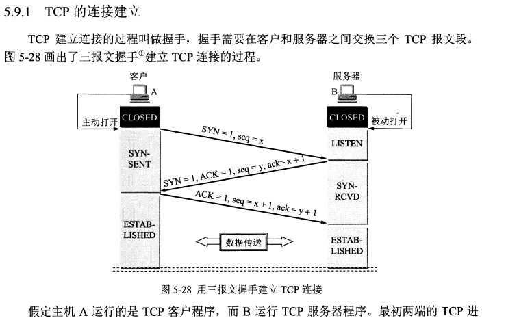
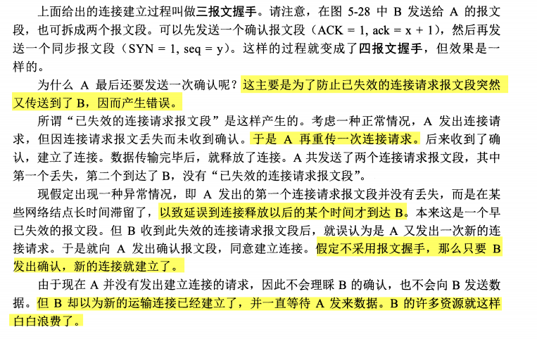
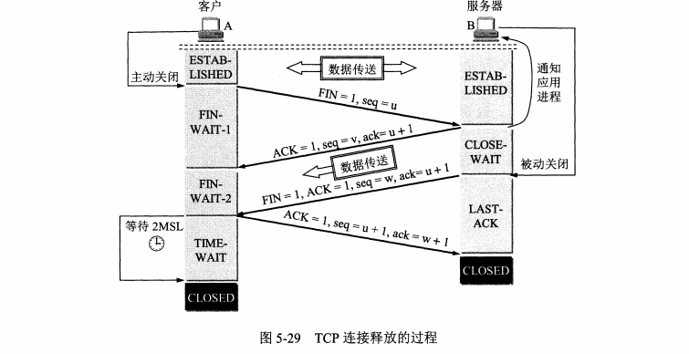
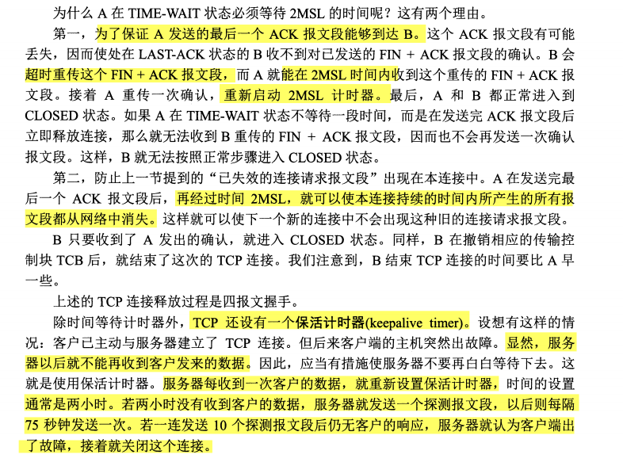
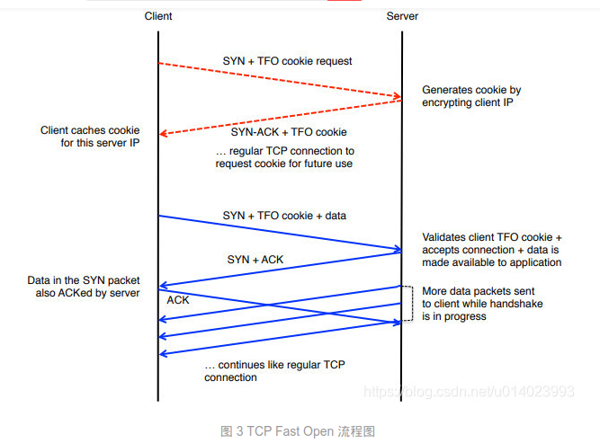

# 为什么 TCP 建立连接需要三次握手

> - [**为什么 TCP 建立连接需要三次握手**](https://mp.weixin.qq.com/s/XGpIjrnxAAuHa8EVSotBQw)

在具体分析今天的问题之前，我们首先可以了解一下最常见的错误类比，这个对 TCP 连接过程的错误比喻误导了很多人，作者在比较长的一段时间内也认为它能够很好地描述 TCP 建立连接为什么需要三次握手：

- 你听得到吗？
- 我能听到，你听得到？
- 我也能听到；

这种用类比来解释问题往往就会面临『十个类比九个错』的尴尬局面，如果别人用类比回答你的为什么，你需要仔细想一想它的类比里究竟哪里有漏洞；

很多人尝试回答或者思考这个问题的时候其实关注点都放在了三次握手中的三次上面，这确实很重要，但是如果重新审视这个问题，我们对于『什么是连接』真的清楚？只有知道连接的定义，我们才能去尝试回答为什么 TCP 建立连接需要三次握手。

**用于保证可靠性和流控制机制的信息，包括 Socket、序列号以及窗口大小叫做连接。**

所以，建立 TCP 连接就是通信的双方需要对上述的三种信息达成共识，连接中的一对 Socket 是由互联网地址标志符和端口组成的，窗口大小主要用来做流控制，最后的序列号是用来追踪通信发起方发送的数据包序号，接收方可以通过序列号向发送方确认某个数据包的成功接收。

到这里，我们将原有的问题转换成了『为什么需要通过三次握手才可以初始化 Sockets、窗口大小和初始序列号？』，那么接下来我们就开始对这个细化的问题进行分析并寻找解释。

## 设计
这篇文章主要会从以下几个方面介绍为什么我们需要通过三次握手才可以初始化 Sockets、窗口大小、初始序列号并建立 TCP 连接：

- 通过三次握手才能阻止重复历史连接的初始化；

- 通过三次握手才能对通信双方的初始序列号进行初始化；

- 讨论其他次数握手建立连接的可能性；

## 历史连接

RFC 793 - Transmission Control Protocol 其实就指出了 TCP 连接使用三次握手的首要原因 —— **为了阻止历史的重复连接初始化造成的混乱问题，防止使用 TCP 协议通信的双方建立了错误的连接**。

想象一下这个场景，如果通信双方的通信次数只有两次，那么发送方一旦发出建立连接的请求之后它就没有办法撤回这一次请求，如果在网络状况复杂或者较差的网络中，**发送方连续发送多次建立连接的请求，如果 TCP 建立连接只能通信两次，那么接收方只能选择接受或者拒绝发送方发起的请求，它并不清楚这一次请求是不是由于网络拥堵而早早过期的连接**。

所以，TCP 选择使用三次握手来建立连接并在连接引入了 RST 这一控制消息，接收方当收到请求时会将发送方发来的 SEQ+1 发送回接收方，这时由发送方来判断当前连接是否是历史连接：

- 如果当前连接是历史连接，即 SEQ 过期或者超时，那么发送方就会直接发送 RST 控制消息中止这一次连接；

- 如果当前连接不是历史连接，那么发送方就会发送 ACK 控制消息，通信双方就会成功建立连接；

使用三次握手和 RST 控制消息**将是否建立连接的最终控制权交给了发送方**，因为**只有发送方有足够的上下文来判断当前连接是否是错误的或者过期的，这也是 TCP 使用三次握手建立连接的最主要原因**。

## 初始序列号

另一个使用三次握手的重要的原因就是**通信双方都需要获得一个用于发送信息的初始化序列号**，作为一个可靠的传输层协议，TCP 需要在不稳定的网络环境中构建一个可靠的传输层，网络的不确定性可能会导致数据包的缺失和顺序颠倒等问题，常见的问题可能包括：

- 数据包被发送方**多次发送**造成数据的重复；
- 数据包在传输的过程中被路由或者其他节点**丢失**；
- 数据包到达接收方可能**无法按照发送顺序**；

为了解决上述这些可能存在的问题，TCP 协议要求发送方在数据包中**加入『序列号』字段**，有了数据包对应的序列号，我们就可以：

- 接收方可以通过序列号对重复的数据包进行去重；
- 发送方会在对应数据包未被 ACK 时进行重复发送；
- 接收方可以根据数据包的序列号对它们进行重新排序；

序列号在 TCP 连接中有着**非常重要**的作用，初始序列号作为 TCP 连接的一部分也需要在三次握手期间进行初始化，由于 TCP 连接通信的双方都需要获得初始序列号，**所以它们其实需要向对方发送 SYN 控制消息并携带自己期望的初始化序列号 SEQ，对方在收到 SYN 消息之后会通过 ACK 控制消息以及 SEQ+1 来进行确认**。

> 序列号的重要性。都需要得到对方的ack确认。

如上图所示，通信双方的两个 TCP A/B 分别向对方发送 SYN 和 ACK 控制消息，等待通信双方都获取到了自己期望的初始化序列号之后就可以开始通信了，由于 TCP 消息头的设计，我们可以将中间的两次通信合成一个，TCP B 可以向 TCP A 同时发送 ACK 和 SYN 控制消息，这也就帮助我们将**四次通信减少至三次**。

除此之外，网络作为一个分布式的系统，其中并不存在一个用于计数的全局时钟，而 TCP 可以通过不同的机制来初始化序列号，**作为 TCP 连接的接收方我们无法判断对方传来的初始化序列号是否过期，所以我们需要交由对方来判断**，TCP 连接的**发起方可以通过保存发出的序列号判断连接是否过期**，如果让接收方来保存并判断序列号却是不现实的，这也再一次**强化**了我们在上一节中提出的观点 —— 避免历史错连接的初始化。

## 通信次数

当我们讨论 TCP 建立连接需要的通信次数时，我们经常会执着于为什么通信三次才可以建立连接，而不是两次或者四次；讨论使用更多的通信次数来建立连接往往是没有意义的，因为**我们总可以使用更多的通信次数交换相同的信息**，所以使用四次、五次或者更多次数建立连接在技术上都是完全可以实现的。

这种增加 TCP 连接通信次数的问题往往没有讨论的必要性，我们追求的其实是用更少的通信次数（理论上的边界）完成信息的交换，也就是为什么我们在上两节中也一再强调使用『两次握手』没有办法建立 TCP 连接，**使用三次握手是建立连接所需要的最小次数**。

## 总结

我们在这篇文章中讨论了为什么 TCP 建立连接需要经过三次握手，在具体分析这个问题之前，我们首先重新思考了 TCP 连接究竟是什么，RFC 793 - Transmission Control Protocol - IETF Tools 对 TCP 连接有着非常清楚的定义 —— **用于保证可靠性和流控制机制的数据，包括 Socket、序列号以及窗口大小**。

TCP 建立连接时**通过三次握手可以有效地避免历史错误连接的建立，减少通信双方不必要的资源消耗，三次握手能够帮助通信双方获取初始化序列号，它们能够保证数据包传输的不重不丢，还能保证它们的传输顺序，不会因为网络传输的问题发生混乱**，到这里不使用『两次握手』和『四次握手』的原因已经非常清楚了：

-『两次握手』：无法避免历史错误连接的初始化，浪费接收方的资源；
-『四次握手』：TCP 协议的设计可以让我们同时传递 ACK 和 SYN 两个控制信息，减少了通信次数，所以不需要使用更多的通信次数传输相同的信息；

我们重新回到在文章开头提的问题，为什么使用类比解释 TCP 使用三次握手是错误的？这主要还是因为，这个类比没有解释清楚核心问题 —— **避免历史上的重复连接**。到最后，我们还是来看一些比较开放的相关问题，有兴趣的读者可以仔细想一下下面的问题：

- 除了使用序列号是否还有其他方式保证消息的不重不丢？

- UDP 协议有连接的概念么，它能保证数据传输的可靠么？


# TCP的建立





- [TCP、UDP、Socket、HTTP网络编程题](https://juejin.cn/post/6844904125692379143)

### 1.6.6 第三次握手中，如果客户端的ACK未送达服务器，会怎样？

Server端：由于Server没有收到ACK确认，因此会每隔 3秒 重发之前的SYN+ACK（默认重发五次，之后自动关闭连接进入CLOSED状态），Client收到后会重新传ACK给Server。
> tcp攻击

Client端，会出现两种情况：

- 在Server进行超时重发的过程中，如果Client向服务器发送数据，数据头部的ACK是为1的，所以服务器收到数据之后会读取 ACK number，进入 establish 状态
- 在Server进入CLOSED状态之后，如果Client向服务器发送数据，服务器会以RST包应答。


# time_wait

- [为什么 TCP 协议有 TIME_WAIT 状态](https://mp.weixin.qq.com/s/QTZJdxVzDNEvz7htDgGU-w):

**使用 TCP 协议通信的双方会在关闭连接时触发 TIME_WAIT 状态，关闭连接的操作其实是告诉通信的另一方自己没有需要发送的数据，但是它仍然保持了接收对方数据的能力**

一个常见的关闭连接过程如下[^1]：

- 当客户端没有待发送的数据时，它会向服务端发送 FIN 消息，发送消息后会进入 FIN_WAIT_1 状态；
- 服务端接收到客户端的 FIN 消息后，会进入 CLOSE_WAIT 状态并向客户端发送 ACK 消息，客户端接收到 ACK 消息时会进入 FIN_WAIT_2 状态；
- 当服务端没有待发送的数据时，服务端会向客户端发送 FIN 消息；
- 客户端接收到 FIN 消息后，会进入 TIME_WAIT 状态并向服务端发送 ACK 消息，服务端收到后会进入 CLOSED 状态；
- 客户端等待两个最大数据段生命周期（Maximum segment lifetime，MSL）[^2]的时间后也会进入 CLOSED 状态；

从上述过程中，我们**会发现 TIME_WAIT 仅在主动断开连接的一方出现，被动断开连接的一方会直接进入 CLOSED 状态，进入 TIME_WAIT 的客户端需要等待 2 MSL 才可以真正关闭连接**。TCP 协议需要 TIME_WAIT 状态的原因和客户端需要等待两个 MSL 不能直接进入 CLOSED 状态的原因是一样的[^3]：

- 防止**延迟的数据段**被其他使用相同源地址、源端口、目的地址以及目的端口的 TCP 连接收到；
- 保证 TCP 连接的远程**被正确关闭**，即等待被动关闭连接的一方收到 FIN 对应的 ACK 消息；


## 阻止延迟数据段

每一个 TCP 数据段都包含唯一的序列号，这个序列号能够保证 TCP 协议的可靠性和顺序性，在不考虑序列号溢出归零的情况下，序列号唯一是 TCP 协议中的重要约定，一旦违反了这条规则，就可能造成令人困惑的现象和结果。**为了保证新 TCP 连接的数据段不会与还在网络中传输的历史连接的数据段重复，TCP 连接在分配新的序列号之前需要至少静默数据段在网络中能够存活的最长时间，即 MSL**
> 注意：指的是分配新的序列号之前！

在如上图所示的 TCP 连接中，服务端发送的 SEQ = 301 消息由于网络延迟直到 TCP 连接关闭后也没有收到；当使用相同端口号的 TCP 连接被重用后，SEQ = 301 的消息才发送到客户端，然而这个过期的消息却可能被客户端正常接收，这就会带来比较严重的问题，所以我们在调整 TIME_WAIT 策略时要非常谨慎，必须清楚自己在干什么。

### 为啥是2倍的MSL
RFC 793 中虽然指出了 TCP 连接需要在 TIME_WAIT 中等待 2 倍的 MSL，但是并没有解释清楚这里的两倍是从何而来，比较合理的解释是 — **网络中可能存在来自发起方的数据段，当这些发起方的数据段被服务端处理后又会向客户端发送响应，所以一来一回需要等待 2 倍的时间**

> 两倍是从何而来： 需要对比“tcp的超时重传时间的选择”小节

> 原因一：如果没有等到足够长的时间，服务器在连接正常的时候发送的数据包，延迟达到新的连接上(**客户端不等待重新建立了连接**)，造成严重后果。服务端处于ESTABLTSHED正常阶段

在 Linux 上，客户端的可以使用端口号 32,768 ~ 61,000，总共 28,232 个端口号与远程服务器建立连接，应用程序可以在将近 3 万的端口号中任意选择一个：

> FIN + ACK重发 b) 假如这个时候，A已经从TIME_WAIT状态变成了CLOSED状态: A收到这个FIN包后，认为这是一个错误的连接，向B发送一个RST包，当B收到这个RST包，进入CLOSED状态

## 保证连接关闭
从 RFC 793 对 TIME_WAIT 状态的定义中，我们可以发现该状态的另一个重要作用，等待足够长的时间以确定远程的 TCP 连接接收到了其发出的终止连接消息 FIN 对应的 ACK：

如果客户端等待的时间不够长，当服务端还没有收到 ACK 消息时，客户端就重新与服务端建立 TCP 连接就会造成以下问题 — **服务端因为没有收到 ACK 消息，所以仍然认为当前连接是合法的，客户端重新发送 SYN 消息请求握手时会收到服务端的 RST 消息，连接建立的过程就会被终止**。

只要客户端等待 2 MSL 的时间，客户端和服务端之间的连接就会正常关闭，新创建的 TCP 连接收到影响的概率也微乎其微，保证了数据传输的可靠性。

> 原因二：也就是如果不等待，同样的端口发起新的连接，但是服务端还认为之前的连接还存在，因为没有收到最后的ack确认。导致新建立的连接出错，如果等待足够长的时间，就能极大避免这个场景。服务端卡在在LAST_ACK阶段

> 下面的《计算机网络》理由是为了让last_ack状态的服务器能正常关闭。2 MSL 的时间能接受到重发延迟的第三步FIN + ACK。

## 解决办法

在某些场景下，60 秒的等待销毁时间确实是难以接受的，例如：高并发的压力测试。当我们通过并发请求测试远程服务的吞吐量和延迟时，本地就可能产生大量处于 TIME_WAIT 状态的 TCP 连接

当我们在主机上通过几千个并发来测试服务器的压力时，这些用于压力测试的连接会迅速消耗主机上的 TCP 连接资源，几乎所有的 TCP 都会处于 TIME_WAIT 状态等待销毁。如果我们真遇到不得不处理单机上的 TIME_WAIT 状态的时候，那么可以通过以下几种方法处理：

- 使用 SO_LINGER 选项并设置暂存时间 l_linger 为 0，在这时如果我们关闭 TCP 连接，内核就会**直接丢弃缓冲区中的全部数据并向服务端发送 RST 消息直接终止当前的连接**[^7]；
- 使用 net.ipv4.tcp_tw_reuse 选项，通过 TCP 的时间戳选项**允许内核重用处于 TIME_WAIT 状态的 TCP 连接**[^8]；
- 修改 net.ipv4.ip_local_port_range 选项中的可用端口范围，**增加可同时存在的 TCP 连接数上限**；
> tcp_tw_recycle见下

如果客户端等待的时间不够长，那么使用相同端口号重新与远程建立连接时会造成以下问题：

- 因为数据段的网络传输时间不确定，所以可能会收到上一次 TCP 连接中未被收到的数据段；
- 因为客户端发出的 ACK 可能还没有被服务端接收，服务端可能还处于 LAST_ACK 状态，所以它会回复 RST 消息终止新连接的建立；


---
## net.ipv4.tcp_tw_recycle
> - [tcp_tw_recycle](https://blog.csdn.net/whatday/article/details/113427085): 比较详细的方案分析，附带源码介绍。

网上的帖子，大多都写开启net.ipv4.tcp_tw_recycle这个开关，可以快速回收处于TIME_WAIT状态的socket（针对Server端而言）。

而实际上，这个开关，需要net.ipv4.tcp_timestamps（默认开启的）这个开关开启才有效果。

更不为提到却很重要的一个信息是：当tcp_tw_recycle开启时（tcp_timestamps同时开启，快速回收socket的效果达到），对于位于NAT设备后面的Client来说，是一场灾难——会导到NAT设备后面的Client连接Server不稳定（有的Client能连接server，有的Client不能连接server）。也就是说，tcp_tw_recycle这个功能，是为“内部网络”（网络环境自己可控——不存在NAT的情况）设计的，对于公网，不宜使用。

> 经过专家意见才能开启

这里的HZ是1s，因此可以得出RTO最大是120s，最小是200ms，对于局域网的机器来说，正常情况下RTO基本上就是200ms，因此3.5 RTO就是700ms
也就是说，**快速回收是TIME_WAIT的状态持续700ms，而不是正常的2MSL**（Linux是1分钟，请参考：include/net/tcp.h 109行TCP_TIMEWAIT_LEN定义）。


## 参考链接
- [tcp_tw_recycle](https://blog.csdn.net/whatday/article/details/113427085): 比较详细的方案分析，附带源码介绍。
- [一个因tcp_tw_recycle引起的跨机房连接超时问题](https://zhuanlan.zhihu.com/p/35684094)
- [用nginx做grpc反向代理，nginx到后端server不能维持长连接问题](https://juejin.cn/post/6844903809534148622)
- [解决Linux TIME_WAIT过多造成的问题](https://blog.csdn.net/zhangjunli/article/details/89321202): 具体源码分析


---
# TCP的连接释放





> 半关闭、time_wait、保活计时器（长连接的缺点）

- [TCP、UDP、Socket、HTTP网络编程题](https://juejin.cn/post/6844904125692379143)

### 1.7.4 为什么不能把服务器发送的ACK和FIN合并起来，变成三次挥手（CLOSE_WAIT状态意义是什么）？

因为服务器收到客户端断开连接的请求时，可能还有一些数据没有发完，这时先回复ACK，表示接收到了断开连接的请求。等到数据发完之后再发FIN，断开服务器到客户端的数据传送。

---
# 线上大量CLOSE_WAIT的原因深入分析

> - [线上大量CLOSE_WAIT的原因深入分析](https://juejin.cn/post/6844903734300901390):

结合上面的信息，我用文字说明下：**MySQL负载均衡器** 给我的服务发送 **FIN** 包，我进行了响应，此时我进入了 **CLOSE\_WAIT** 状态，但是后续作为被动关闭方的我，并没有发送 **FIN**，导致我服务端一直处于 **CLOSE\_WAIT** 状态，无法最终进入 **CLOSED** 状态。

那么我推断出现这种情况可能的原因有以下几种：

1.  **负载均衡器** 异常退出了，

    `这基本是不可能的，他出现问题绝对是大面积的服务报警，而不仅仅是我一个服务`

2.  **MySQL负载均衡器** 的超时设置的太短了，导致业务代码还没有处理完，**MySQL负载均衡器** 就关闭tcp连接了

    `这也不太可能，因为这个服务并没有什么耗时操作，当然还是去检查了负载均衡器的配置，设置的是60s。`

3.  代码问题，**MySQL** 连接无法释放

    `目前看起来应该是代码质量问题，加之本次数据有异常，触发到了以前某个没有测试到的点，目前看起来很有可能是这个原因`

理一下正确的分析思路：

1.  出现问题后，立马应该检查日志，确实日志没有发现问题；
2.  监控明确显示了socket不断增长，很明确立马应该使用 `netstat` 检查情况看看是哪个进程的锅；
3.  根据 `netstat` 的检查，使用 `tcpdump` 抓包分析一下为什么连接会**被动断开**（TCP知识非常重要）；
4.  如果熟悉代码应该直接去检查业务代码，如果不熟悉则可以使用 `perf` 把代码的调用链路打印出来；
5.  不论是分析代码还是火焰图，到此应该能够很快定位到问题。

那么本次到底是为什么会出现 **CLOSE\_WAIT** 呢？大部分同学应该已经明白了，我这里再简单说明一下：

由于那一行代码没有对事务进行回滚，导致服务端没有主动发起close。因此 **MySQL负载均衡器** 在达到 60s 的时候主动触发了close操作，但是通过tcp抓包发现，服务端并没有进行回应，这是因为代码中的事务没有处理，因此从而导致大量的端口、连接资源被占用。

## 总结
- 一次 MySQL 主动关闭，导致服务出现大量 CLOSE_WAIT 的全流程排查过程。
- 从问题分析到解决思路，文章都写得很有条理。**火焰图分析**。
- MySQL负载均衡器 给我的服务发送 FIN 包，我进行了响应，此时我进入了 CLOSE_WAIT 状态，但是后续作为被动关闭方的我，并没有发送 FIN，导致我服务端一直处于 CLOSE_WAIT 状态，无法最终进入 CLOSED 状态。
- getMapNil 返回了nil，但是下面的判断条件没有进行回滚。

---
# 如何防御SYN攻击？

- [服务器遭到SYN攻击怎么办？如何防御SYN攻击？](https://developer.aliyun.com/article/669876)


SYN洪水攻击是DDOS攻击中最常见的攻击类型之一。是一种利用TCP 协议缺陷，攻击者向被攻击的主机发送大量伪造的TCP连接请求,从而使得被攻击方主机服务器的资源耗尽(CPU 满负荷或内存不足) 的攻击方式。SYN攻击的目标不止于服务器，任何网络设备，都可能会受到这种攻击，针对网络设备的SYN攻击往往会导致整个网络瘫痪。企业遭到SYN攻击该如何防御呢？墨者安全通过以往的高防经验来分享一下如何利用iptables来缓解SYN攻击。

1.修改等待数

```
sysctl -w net.ipv4.tcp_max_syn_backlog=2048
```


2.启用syncookies

```
sysctl -w net.ipv4.tcp_syncookies=1
```

3.修改**重试**次数

```
sysctl -w net.ipv4.tcp_syn_retries = 0
```

重传次数设置为0，只要收不到客户端的响应，立即丢弃该连接，默认设置为5次

4.限制**单IP**并发数

使用iptables限制单个地址的并发连接数量：
```
iptables -t filter -A INPUT -p tcp --dport 80 --tcp-flags FIN,SYN,RST,ACK SYN -m connlimit --connlimit-above 10 --connlimit-mask 32 -j REJECT
```

5.限制**C类子网**并发数

使用iptables限制单个c类子网的并发链接数量：
```
iptables -t filter -A INPUT -p tcp --dport 80 --tcp-flags FIN,SYN,RST,ACK SYN -m connlimit --connlimit-above 10 --connlimit-mask 24 -j REJECT
```

6.限制**单位时间内连接数**

设置如下：
```
iptables -t filter -A INPUT -p tcp --dport 80 -m --state --syn -m recent --set
iptables -t filter -A INPUT -p tcp --dport 80 -m --state --syn -m recent --update --seconds 60 --hitcount 30 -j DROP
```

7.修改modprobe.conf

为了取得更好的效果，需要修改/etc/modprobe.conf

`options ipt_recent ip_list_tot=1000 ip_pkt_list_tot=60`

作用：记录10000个地址，每个地址60个包，ip_list_tot最大为8100,超过这个数值会导致iptables错误

8.限制**单个地址**最大连接数

```
iptables -I INPUT -p tcp --dport 80 -m connlimit --connlimit-above 50 -j D
```

---

## 深入浅出DDoS攻击防御--防御篇

> - [深入浅出DDoS攻击防御--防御篇](https://blog.csdn.net/zzhongcy/article/details/41692411)

### 1.2. SYN Flood防御

前文描述过，SYN Flood攻击大量消耗服务器的CPU、内存资源，并占满SYN等待队列。相应的，我们修改内核参数即可有效缓解。主要参数如下：
- net.ipv4.tcp_syncookies = 1
- net.ipv4.tcp_max_syn_backlog = 8192
- net.ipv4.tcp_synack_retries = 2

**分别为启用SYN Cookie、设置SYN最大队列长度以及设置SYN+ACK最大重试次数。**

**SYN Cookie的作用是缓解服务器资源压力**。启用之前，服务器在接到SYN数据包后，立即分配存储空间，并随机化一个数字作为SYN号发送SYN+ACK数据包。然后保存连接的状态信息等待客户端确认。**启用SYN Cookie之后，服务器不再分配存储空间，而且通过基于时间种子的随机数算法设置一个SYN号，替代完全随机的SYN号。发送完SYN+ACK确认报文之后，清空资源不保存任何状态信息。**直到服务器接到客户端的最终ACK包，通过Cookie检验算法鉴定是否与发出去的SYN+ACK报文序列号匹配，匹配则通过完成握手，失败则丢弃。当然（http://security.aliyun.com/doc/view/13675730.html），前文的高级攻击中有SYN混合ACK的攻击方法，则是对此种防御方法的反击，其中优劣由双方的硬件配置决定。

- tcp_max_syn_backlog则是使用服务器的内存资源，换取更大的等待队列长度，让攻击数据包不至于占满所有连接而导致正常用户无法完成握手。
- net.ipv4.tcp_synack_retries是降低服务器SYN+ACK报文重试次数，尽快释放等待资源。

这三种措施与攻击的三种危害一一对应，完完全全地对症下药。但这些措施也是双刃剑，可能消耗服务器更多的内存资源，甚至影响正常用户建立TCP连接，需要评估服务器硬件资源和攻击大小谨慎设置。

除了定制TCP/IP协议栈之外，**还有一种常见做法是TCP首包丢弃方案，利用TCP协议的重传机制识别正常用户和攻击报文**。当防御设备接到一个IP地址的SYN报文后，简单比对该IP是否存在于白名单中，存在则转发到后端。如不存在于白名单中，检查是否是该IP在一定时间段内的首次SYN报文，不是则检查是否重传报文，是重传则转发并加入白名单，不是则丢弃并加入黑名单。是首次SYN报文则丢弃并等待一段时间以试图接受该IP的SYN重传报文，等待超时则判定为攻击报文加入黑名单。

首包丢弃方案对用户体验会略有影响，**因为丢弃首包重传会增大业务的响应时间，有鉴于此发展出了一种更优的TCP Proxy方案**。所有的SYN数据报文由清洗设备接受，按照SYN Cookie方案处理。和设备成功建立了TCP三次握手的IP地址被判定为合法用户加入白名单，由设备伪装真实客户端IP地址再与真实服务器完成三次握手，随后转发数据。而**指定时间内没有和设备完成三次握手的IP地址，被判定为恶意IP地址屏蔽一定时间**。除了SYN Cookie结合TCP Proxy外，清洗设备还具备多种畸形TCP标志位数据包探测的能力，通过对SYN报文返回非预期应答测试客户端反应的方式来鉴别正常访问和恶意行为。

清洗设备的硬件具有特殊的网络处理器芯片和特别优化的操作系统、TCP/IP协议栈，可以处理非常巨大的流量和SYN队列

### 1.3. HTTP Flood防御

HTTP Flood攻击**防御主要通过缓存的方式进行**，尽量由设备的缓存直接返回结果来保护后端业务。大型的互联网企业，会有庞大的CDN节点缓存内容。

当高级攻击者穿透缓存时，清洗设备会截获HTTP请求做特殊处理。**最简单的方法就是对源IP的HTTP请求频率做统计，高于一定频率的IP地址加入黑名单**。这种方法过于简单，容易带来误杀，并且无法屏蔽来自代理服务器的攻击，因此逐渐废止，**取而代之的是JavaScript跳转人机识别方案**。

HTTP Flood是由程序模拟HTTP请求，一般来说不会解析服务端返回数据，更不会解析JS之类代码。因此当清洗设备截获到HTTP请求时，返回一段特殊JavaScript代码，正常用户的浏览器会处理并正常跳转不影响使用，而攻击程序会攻击到空处。

### 1.4 DNS Flood防御

DNS攻击防御也有类似HTTP的防御手段，**第一方案是缓存**。其次是**重发**，可以是直接**丢弃DNS报文导致UDP层面的请求重发**，可以是返回特殊响应**强制要求客户端使用TCP协议重发DNS查询请求**。

特殊的，对于授权域DNS的保护，设备会在业务正常时期提取收到的DNS域名列表和ISP DNS IP列表备用，在攻击时，非此列表的请求一律丢弃，大幅降低性能压力。对于域名，实行同样的域名白名单机制，非白名单中的域名解析请求，做丢弃处理。

### 1.5 慢速连接攻击防御

Slowloris攻击防御比较简单，主要方案有两个。

- 第一个是**统计每个TCP连接的时长并计算单位时间内通过的报文数量即可做精确识别**。一个TCP连接中，HTTP报文太少和报文太多都是不正常的，过少可能是慢速连接攻击，过多可能是使用HTTP 1.1协议进行的HTTP Flood攻击，在一个TCP连接中发送多个HTTP请求。
- 第二个是**限制HTTP头部传输的最大许可时间**。超过指定时间HTTP Header还没有传输完成，直接判定源IP地址为慢速连接攻击，中断连接并加入黑名单。

## 参考链接
- [应用层(DNS/HTTP/HTTPS)攻击与防御原理](https://cshihong.github.io/2019/05/14/%E5%BA%94%E7%94%A8%E5%B1%82-DNS-HTTP-HTTPS-%E6%94%BB%E5%87%BB%E4%B8%8E%E9%98%B2%E5%BE%A1%E5%8E%9F%E7%90%86/) 、 [网络层(TCP/UDP)攻击与防御原理](https://cshihong.github.io/2019/05/14/%E7%BD%91%E7%BB%9C%E5%B1%82-TCP-UDP-%E6%94%BB%E5%87%BB%E4%B8%8E%E9%98%B2%E5%BE%A1%E5%8E%9F%E7%90%86/): 文章虽多但入门有门槛
- [深入浅出DDoS攻击防御——攻击篇](https://www.dell.com/community/%E7%BB%BC%E5%90%88%E8%AE%A8%E8%AE%BA%E5%8C%BA/%E5%88%86%E4%BA%AB-%E6%B7%B1%E5%85%A5%E6%B5%85%E5%87%BADDoS%E6%94%BB%E5%87%BB%E9%98%B2%E5%BE%A1-%E6%94%BB%E5%87%BB%E7%AF%87/td-p/7002378) 、 [深入浅出DDoS攻击防御--防御篇](https://developer.aliyun.com/article/1797): 深入浅出各种攻击介绍！ [深入浅出DDoS攻击防御--防御篇](https://blog.csdn.net/zzhongcy/article/details/41692411): 总结


---
# TCP Fast Open

> - [wiki](https://zh.wikipedia.org/wiki/TCP%E5%BF%AB%E9%80%9F%E6%89%93%E5%BC%80)

TCP快速打开（英语：TCP Fast Open，简称TFO）是对计算机网络中传输控制协议（TCP）连接的一种简化握手手续的拓展，用于提高两端点间连接的打开速度。

它通过握手开始时的SYN包中的TFO cookie（一个TCP选项）来验证一个之前连接过的客户端。如果验证成功，它可以在三次握手最终的ACK包收到之前就开始发送数据，这样便跳过了一个绕路的行为，更在传输开始时就降低了延迟。这个加密的Cookie被存储在客户端，在一开始的连接时被设定好。然后每当客户端连接时，这个Cookie被重复返回。

此Cookie通常采用一种分组密码，私钥由服务器根据客户端的IP地址保存，生成一个第三方难以仿冒的消息认证码标签，即便第三方可以伪造源IP地址或从其他IP地址制造到同一个服务器的连接。尽管使用了加密技术来生成cookie，但TFO并不着眼于提供比它所替换的三次握手有更多的安全性，并且不对所产生的TCP连接提供任何形式的加密保护或端点身份认证。它的目的不是为了抵挡中间人攻击。

## 过程

### 请求Fast Open Cookie

1.  客户端发送SYN数据包，该数据包包含Fast Open选项，且该选项的Cookie为空，这表明客户端请求Fast Open Cookie；
2.  支持TCP Fast Open的服务器生成Cookie，并将其置于SYN-ACK数据包中的Fast Open选项以发回客户端；
3.  客户端收到SYN-ACK后，缓存Fast Open选项中的Cookie。

### 实施TCP Fast Open

以下描述假定客户端在此前的TCP连接中已完成请求Fast Open Cookie的过程并存有有效的Fast Open Cookie。

1.  客户端发送SYN数据包，该数据包包含数据（对于非TFO的普通TCP握手过程，SYN数据包中不包含数据）以及此前记录的Cookie；
2.  支持TCP Fast Open的服务器会对收到Cookie进行校验：如果Cookie有效，服务器将在SYN-ACK数据包中对SYN和数据进行确认（Acknowledgement），服务器随后将数据递送至相应的应用程序；否则，服务器将丢弃SYN数据包中包含的数据，且其随后发出的SYN-ACK数据包将仅确认（Acknowledgement）SYN的对应序列号；
3.  如果服务器接受了SYN数据包中的数据，服务器可在握手完成之前发送数据；
4.  客户端将发送ACK确认服务器发回的SYN以及数据，但如果客户端在初始的SYN数据包中发送的数据未被确认，则客户端将重新发送数据；
5.  此后的TCP连接和非TFO的正常情况一致。

注：客户端在请求并存储了Fast Open Cookie之后，可以不断重复TCP Fast Open直至服务器认为Cookie无效（通常为过期


## 问题

理想是美好的，现实是残酷的。到目前为止，极少浏览器支持TFO功能。即使有，TFO默认也是关闭的。究竟是什么原因让一个这么好的方案在现实中不受待见呢？

原因之一是与许多现有的软硬件不兼容，例如各种路由器、中间件等。其次使用了能跟踪用户行为的cookie，带来隐私问题。最后即将到来的HTTP/3、已经普及的TLS 1.3有更好的解决方法。因此，TFO在实践中较少用到，虽然Nginx等主流软件支持。

## TCP 的那些事 | TCP Fast Open
> - [TCP 的那些事 | TCP Fast Open](https://blog.csdn.net/u014023993/article/details/85928026)



