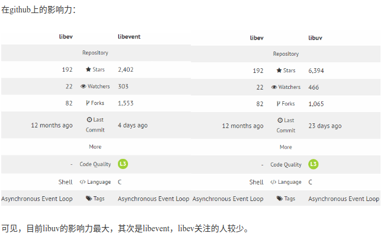

Libevent、libev、libuv三个网络库，都是c语言实现的异步事件库Asynchronousevent library）。

异步事件库本质上是提供异步事件通知（Asynchronous Event Notification，AEN）的。异步事件通知机制就是根据发生的事件，调用相应的回调函数进行处理。

- 事件（Event）：事件是异步事件通知机制的核心，比如**fd事件、超时事件、信号事件、定时器事件**。有时候也称事件为事件处理器（EventHandler），这个名称更形象，因为Handler本身表示了包含处理所需数据（或数据的地址）和处理的方法（回调函数），更像是面向对象思想中的称谓。

- 事件循环（EventLoop）：**等待并分发事件。事件循环用于管理事件**。

对于应用程序来说，这些只是异步事件库提供的API，封装了异步事件库跟操作系统的交互，异步事件库会选择一种操作系统提供的机制来实现某一种事件，比如利用Unix/Linux平台的epoll机制实现网络IO事件，在同时存在多种机制可以利用时，异步事件库会采用最优机制。

**对比下三个库**：
- libevent :名气最大，应用最广泛，**历史悠久的跨平台事件库**；

- libev :较libevent而言，**设计更简练，性能更好，但对Windows支持不够好**；

- libuv :开发node的过程中需要一个跨平台的事件库，他们**首选了libev，但又要支持Windows，故重新封装了一套，linux下用libev实现，Windows下用IOCP实现**；

可见，目前libuv的影响力最大，其次是libevent，libev关注的人较少。

**对于Unix/Linux平台，没有什么大不同，优先选择epoll**。对于windows，libevent、libev都使用**select检测和分发事件**（不I/O），libuv在windows下使用IOCP。libevent有一个socket handle, 在windows上使用IOCP进行读写。libev没有类似的。但是libevent的IOCP支持也不是很好（性能不高）。所以如果是在windows平台下，使用原生的IOCP进行I/O，或者使用libuv。

异步架构程序设计原则
1. **回调函数不可以执行过长时间**，因为一个loop中可能包含其他事件，尤其是会影响一些准确度要求比较高的timer。
2. 尽量采用库中所缓存的时间，有时候需要根据时间差来执行timeout之类的操作。当然能够利用库中的timer最好。

- [网络库libevent、libev、libuv对比](https://blog.csdn.net/lijinqi1987/java/article/details/71214974)

---

## IOCP

概念:输入输出完成端口（Input/Output Completion Port，IOCP）, 是支持多个同时发生的异步I/O操作的应用程序编程接口，在Windows NT的3.5版本以后，或AIX5版以后或Solaris第十版以后，开始支持。

我直接这么说概念你可能也不太懂。可以暂时知道 Windows 下注意通过 IOCP 来向系统内核发送 I/O 调用和从内核获取已完成的 I/O 操作，配以事件循环，完成异步I/O的过程。在 linux 下通过 epoll 实现这个过程，也就是由 libuv 自行实现。

- [Node 与底层之间如何执行异步 I/O 调用](https://juejin.im/post/5e1adbc05188253664549bab)

---
# libuv使用原因

- [epoll缺陷](epoll.md#Epoll缺陷)

