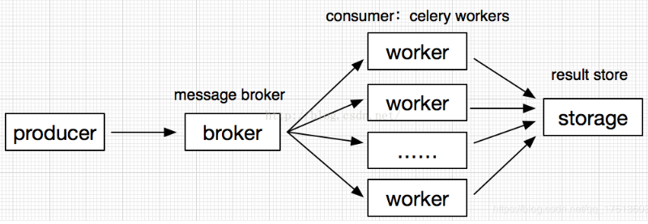

# celery 和 rabbitMQ的区别

首先，RabbitMQ是个**消息队列的实现**。 将消息队列应用到何种场景，得看自己需求。 你可以拿它自己实现**任务分发**（自己实现一个Celery），也可以拿它实现消息推送，甚至只是用它解耦应用的物理结构，等等等等...

其次，Celery是一个**分布式的任务分发系统**。 任务分发系统目的很明确，就是利用后端待命的无数worker实现一系列任务的快速处理。 它跟消息队列的关系不过是**利用其在分发者和执行者之间进行任务的发布/订阅**。 所以RabbitMQ和redis等**具有发布/订阅能力的工具，理论上都能为其所用**。

- [Rabbitmq 和 Celery 是怎样工作的?](https://www.zhihu.com/question/24166423)

## celery

思考一下，如果我们用rabbitMQ自己实现任务队列，有一天我们不想用rabbit了怎么办？我们换个思维，如果没有celery，让你自己设计一个异步任务队列你怎么做。

好吧，这个不就是celery所做的事儿么，celery兼容多个broker，既是任务发起者又是执行者，另外支持多进程…还有好多通用功能考虑。



### 并发、序列化、压缩:

celery任务并发执行支持prefork、eventlet、gevent、threads的方式；

序列化支持pickle,json,yaml,msgpack等；

##  Celery 好在哪里

1. 把你从消息的细节中解脱出来，专注与 Task 的编写
2. 方便快捷的进行**限流** (ratelimit), 对 Task 和 Workder 的管理 / 查看 / 控制。
3. 自带定时任务 / 周期任务 / ETA / Countdown
4. 自带 Task 的[原语](http://docs.celeryproject.org/en/master/userguide/canvas.html#the-primitives) (group/chain/chord/map/starmap/chunks)
5. 稳定以及 Scale

- [Celery 好在哪里](https://www.zhihu.com/question/24166423/answer/645224422)

# rabbitMQ

## exchange
生产者不是将消息直接放到queue（队列）中，而是先到exchange中，exchange主要用于**控制消息到队列的路由**,根据具体的exchange type将消息传给需要的队列或者直接废弃，exchange可以通过参数 routing_key 指定消息发送到哪个队列。

RabbitMQ常用的ExchangeType有fanout、direct、topic、headers这四种，不同的类型有着不同的路由策略。
- fanout-exchange: fanout类型的Exchange路由规则非常简单，它会把所有发送到该Exchange的消息路由到所有与它绑定的Queue中；
- direct-exchange：direct类型的Exchange路由规则也很简单，它会把消息路由到**那些bindingkey与routingkey完全匹配**的Queue中；
- topic-exchange：binding key中可以存在两种特殊字符“*”与“#”，用于做模糊匹配，    其中“*”用于匹配一个单词，“#”用于匹配多个单词（可以是零个）

## redis vs rabbitMQ
- redis： 轻量级，低延迟，高并发，低可靠性；
- rabbitMQ：重量级，高可靠，异步，不保证实时；
rabbitMQ是一个专门的AMQP协议队列，他的优势就在于**提供可靠的队列服务**，并且可做到**异步**，而redis主要是用于缓存的，redis的发布订阅模块，可用于**实现及时性，且可靠性低的功能**。

> redis做不到异步吗？

## 参考链接
- [celery redis rabbitMQ各是什么及之间的区别？](https://www.lizenghai.com/archives/26670.html)

---
# django-celery

- https://docs.celeryproject.org/en/master/django/first-steps-with-django.html

```python
import os

from celery import Celery
from kombu import Exchange
from kombu import Queue

# set the default Django settings module for the 'celery' program.
os.environ.setdefault("DJANGO_SETTINGS_MODULE", "config.settings")

app_name = "%s_%s" % (os.getenv("CFGAPP", "app"), os.getenv("CFGENV", "feature"))
app = Celery(app_name)

# Using a string here means the worker doesn't have to serialize
# the configuration object to child processes.
# - namespace='CELERY' means all celery-related configuration keys
#   should have a `CELERY_` prefix.
app.config_from_object('django.conf:settings', namespace='CELERY')

# Load task modules from all registered Django app configs.
app.autodiscover_tasks()
app.conf.timezone = "Asia/Shanghai"
app.autodiscover_tasks(["apps.schedulers.tasks"])
app.conf.task_queues = (Queue(app_name, exchange=Exchange(app_name + "_exchange"), routing_key="default"),)
app.conf.task_default_queue = app_name
app.conf.task_default_exchange_type = "direct"
app.conf.task_default_routing_key = "default"

```
> namespace表示配置键值需要以`CELERY_`作为前缀


```bash
# 启动命令
celery --app=apps.schedulers.tasks worker --loglevel=info -Ofair -Q app_feature -n app_feature
```

