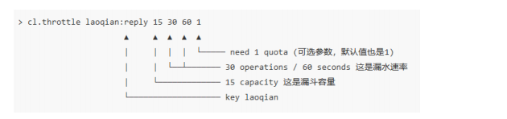

# Redis深度历险：核心原理和应用实践

标签（空格分隔）： 未分类

---

# 应用 1：千帆竞发 —— 分布式锁

注意锁不释放问题：setnx 和 expire 是两条指令而不是原子指令，也不能通过事务来解决，因为 expire 是依赖于 setnx 的执行结果的，如果 setnx 没抢到锁，expire 是不应该执行的。2.8版本支持：`set lock:codehole true ex 5 nx OK`组合原子指令。

注意超时问题：其他线程释放不是自己线程的锁，通过设置随机value来校验。注意：匹配和删除也需要进行原子性的操作，通过LUA脚本。

可重入性问题：需要对**客户端的 set 方法进行包装**，使用线程的 Threadlocal 变量存储当前持有锁的计数。 添加客户端的复杂性，不推荐使用。

---
# 应用 2：缓兵之计 —— 延时队列

不可靠：Redis 的消息队列不是专业的消息队列，它没有非常多的高级特性，没有 ack 保证，如果对消息的可靠性有着极致的追求，那么它就不适合使用。

## 异步消息队列

使用redis的**list数据结构**，并且通过lpop/rpop操作队列，但**pop当队列时空的时候，可能会导致忙等待，导致CPU过高**

阻塞读在队列没有数据的时候，**会立即进入休眠状态，一旦数据到来，则立刻醒过来。消息的延迟几乎为零**。用blpop/brpop替代前面的lpop/rpop，就完美解决了上面的问题。

如果线程一直阻塞在哪里，**Redis 的客户端连接就成了闲置连接，闲置过久，服务器一般会主动断开连接，减少闲置资源占用**。这个时候 blpop/brpop会抛出异常，**注意异常处理**。

## 延迟队列

延迟队列：延时队列**可以通过 Redis 的 zset(有序列表) 来实现**。我们将消息序列化成一个字符串作为 zset 的 value，这个消息的到期处理时间作为 score，然后用多个线程轮询 zset 获取到期的任务进行处理，多个线程是为了保障可用性，万一挂了一个线程还有其它线程可以继续处理。因为有多个线程，所以需要考虑并发争抢任务，确保任务不能被多次执行。

Redis 的 **zrem(从消息队列中移除该消息) 方法是多线程多进程争抢任务的关键，它的返回值决定了当前实例有没有抢到任务**，因为 loop 方法可能会被多个线程、多个进程调用，同一个任务可能会被多个进程线程抢到，通过 zrem 来决定唯一的属主

上面的算法中同一个任务可能会被多个进程取到之后再使用 zrem 进行争抢，那些没抢到的进程都是白取了一次任务，这是浪费。可以考虑使用 lua scripting 来优化一下这个逻辑，将**zrangebyscore 和 zrem 一同挪到服务器端进行原子化操作**，这样多个进程之间争抢任务时就不会出现这种浪费了。

> 获取第一条，但是要避免多线程的抢占，所以通过zrem 获取到的值，来判断移除是否成功，能进行抢占的操作。最好是写成lua脚本获取，避免抢占浪费，保证获取到值肯定能删掉。抢占到了但消费可能会出错，所以这个队列时不可靠的。

# 应用 3：节衣缩食 —— 位图

**位图不是特殊的数据结构，它的内容其实就是普通的字符串，也就是 byte 数组**。我们可以使用普通的 get/set 直接获取和设置整个位图的内容，也可以使用位图操作 getbit/setbit 等将 byte 数组看成「位数组」来处理。

Redis 的位数组是自动扩展，如果设置了某个偏移位置超出了现有的内容范围，就会自动将位数组进行零扩充

「零存」就是使用 setbit对位值进行逐个设置，「整存」就是使用字符串一次性填充所有位数组，覆盖掉旧值。

> `setbit s 1 1`: 逐个设置"hello"字符的ascii码二进制值，`get s`:获取字符

bitcount 用来统计指定位置范围内 1 的个数，bitpos 用来查找指定范围内出现的第一个 0 或 1。**start 和 end 参数是字节索引，也就是说指定的位范围必须是 8 的倍数**，
而不能任意指定。bitfield 有三个子指令，分别是get/set/incrby，它们都可以对指定位片段进行读写，但是最多只能处理 64 个连续的位，如果超过 64 位，就得使用多个子指令，bitfield 可以一次执行多个子指令。

```
bitcount w 0 1 # 前两个字符中 1 的位数
bitpos w 1 2 2 # 从第三个字符算起，第一个 1 位
bitfield w set u8 8 97 # 从第 8 个位开始，将接下来的 8 个位用无符号数 97 替换
bitfield w incrby u4 2 1 # 从第三个位开始，对接下来的 4 位无符号数 +1
```

---
# 应用 4：四两拨千斤 —— HyperLogLog

HyperLogLog **提供不精确的去重计数方案**，虽然不精确但是也不是非常不精确，**标准误差是 0.81%**，这样的精确度已经可以满足上面的 UV 统计需求了。

pfadd 用法和 set 集合的 sadd 是一样的，来一个用户 ID，就将用户 ID 塞进去就是。pfcount和scard用法是一样的，直接获取计数值。pfmerge，用于将多个 pf 计数值累加在一起形成一个新的 pf 值。

Redis 对 HyperLogLog的存储进行了优化，**在计数比较小时，它的存储空间采用稀疏矩阵存储，空间占用很小，仅仅在计数慢慢变大，稀疏矩阵占用空间渐渐超过了阈值时才会一次性转变成稠密矩阵，才会占用 12k 的空间**。

给定一系列的随机整数，我们记录下低位连续零位的最大长度 k，通过这个 k 值可以估算出随机数的数量。

> TODO: 原理比较复杂，没看懂

---
# 应用 6：断尾求生 —— 简单限流

每一个行为到来时，都维护一次时间窗口，计算窗口的数量。将时间窗口外的记录全部清理掉，只保留窗口内的记录。

```python
def is_action_allowed(user_id, action_key, period, max_count):
    # 记录行为
    key = 'hist:%s:%s' % (user_id, action_key)
    now_ts = int(time.time() * 1000) # 毫秒时间戳
    with client.pipeline() as pipe: # client 是 StrictRedis 实例
        # 记录行为
        pipe.zadd(key, now_ts, now_ts) # value 和 score 都使用毫秒时间戳
        # 移除时间窗口之前的行为记录，剩下的都是时间窗口内的
        pipe.zremrangebyscore(key, 0, now_ts - period * 1000)
        # 获取窗口内的行为数量，长度
        pipe.zcard(key)
        # 设置 zset 过期时间，避免冷用户持续占用内存
        # 过期时间应该等于时间窗口的长度，再多宽限 1s
        pipe.expire(key, period + 1)
        # 批量执行
        _, _, current_count, _ = pipe.execute()
    # 比较数量是否超标
    return current_count <= max_count
```

因为这几个连续的 Redis 操作都是针对同一个 key 的，使用 pipeline 可以显著提升Redis 存取效率。但这种方案也有缺点，因为它要记录时间窗口内所有的行为记录，如果这个量很大，比如限定 60s 内操作不得超过 100w 次这样的参数，它是不适合做这样的限流的，因为会消耗大量的存储空间。

---
# 应用 7：一毛不拔 —— 漏斗限流

Funnel 对象的 make_space 方法是漏斗算法的核心，其在**每次灌水前都会被调用以触发漏水，给漏斗腾出空间来。能腾出多少空间取决于过去了多久以及流水的速率**。Funnel 对象占据的空间大小不再和行为的频率成正比，它的空间占用是一个常量。

但是有个问题，我们无法保证整个过程的原子性。从hash结构中取值，然后在内存里运算，再回填到hash结构，这三个过程无法原子化，意味着需要进行适当的加锁控制。而一旦加锁，就意味着会有加锁失败，加锁失败就需要选择重试或者放弃.

Redis 4.0 提供了一个限流Redis模块，它叫**redis-cell。该模块也使用了漏斗算法，并提供了原子的限流指令**。

在执行限流指令时，如果被拒绝了，就需要丢弃或重试。cl.throttle 指令考虑的非常周到，连重试时间都帮你算好了，直接取返回结果数组的第四个值进行 sleep 即可，如果不想阻塞线程，也可以异步定时任务来重试。

```
cl.throttle laoqian:reply 15 30 60
```



上面这个指令的意思是允许「用户老钱回复行为」的频率为每 60s 最多 30 次(漏水速率)，漏斗的初始容量为 15，也就是说一开始可以连续回复 15 个帖子，然后才开始受漏水速率的影响。

> 每次请求的时候，判断上一次的漏出时间戳，然后添加剩余空间，再判断剩余空间是否足够。 TODO：cell底层实现。

---
# 应用 9：大海捞针 —— Scan

在 Redis 中所有的 key 都存储在一个很大的字典中

keys 算法是遍历算法，复杂度是 O(n)，如果实例中有千万级以上的 key，这个指令就会导致 Redis 服务卡顿，所有读写 Redis 的其它的指令都会被延后甚至会超时报错，因为Redis 是单线程程序，顺序执行所有指令，其它指令必须等到当前的 keys 指令执行完了才可以继续。

limit 不是限定返回结果的数量，而是限定服务器单次遍历的字典槽位数量

scan 的遍历顺序非常特别。它不是从第一维数组的第 0 位一直遍历到末尾，而是采用了高位进位加法来遍历。之所以使用这样特殊的方式进行遍历，是**考虑到字典的扩容和缩容时避免槽位的遍历重复和遗漏**

> 扩容和缩容对scan命令的影响。

很精妙：扩容相当于高位+1

011 => 1011 (011+ 8)
然后直接遍历**1011后**的数据就可以了。

缩容则不太一样。011缩成11，会忽略了111的遍历，所以要**重新遍历11**的的数据

## 大key的危害
这样的对象对 Redis 的集群数据迁移带来了很大的问题，因为在集群环境下，如果**某个 key 太大，会数据导致迁移卡顿**。另外在内存分配上，如果一个 key 太大，那么当它需要扩容时，**会一次性申请更大的一块内存，这也会导致卡顿**。如果这个大 key 被删除，内存会一次性回收，卡顿现象会再一次产生。

如果你观察到 Redis 的**内存大起大落**，这极有可能是因为大 key 导致的，这时候你就需要定位出具体是那个 key，进一步定位出具体的业务来源，然后再改进相关业务代码设计。

定位：`redis-cli -h 127.0.0.1 -p 7001 --bigkeys -i 0.1`
上面这个指令每隔 100 条 scan 指令就会休眠 0.1s，ops 就不会剧烈抬升，但是扫描的时间会变长

# 原理 1：鞭辟入里 —— 线程 IO 模型

**莫要瞧不起单线程，除了 Redis 之外，Node.js 也是单线程，Nginx 也是单线程，但是它们都是服务器高性能的典范。**

Redis 同样也会为每个客户端套接字关联一个响应队列。Redis 服务器通过响应队列来将指令的返回结果回复给客户端。 如果队列为空，那么意味着连接暂时处于空闲状态，不需要去获取写事件，也就是可以将当前的客户端描述符从 write_fds 里面移出来。等到队列有数据了，再将描述符放进去。避免 select 系统调用立即返回写事件，结果发现没什么数据可以写。出这种情况的线程会飙高 CPU。
> 响应队列关联客户端，当队列有响应的时候，才将写描述符关联，避免一直监听写事件（一般都是可写）但没数据可写。

Redis 的定时任务会记录在一个称为**最小堆**的数据结构中。这个堆中，最快要执行的任
务排在堆的最上方。在每个循环周期，Redis 都会将最小堆里面已经到点的任务立即进行处理。处理完毕后，将最快要执行的任务还需要的时间记录下来，这个时间就是 select 系统调用的 timeout 参数。因为 Redis 知道未来 timeout 时间内，没有其它定时任务需要处理，所以可以安心睡眠 timeout 的时间。
Nginx 和 Node 的事件处理原理和 Redis 也是类似的

> 最新版已经是最小堆吗？还是链表？跟Redis设计与实现有不同。不过获取最新的定时事件来作为sleep是一样的。node、Nginx的定时也是类似

---
# 原理 3：未雨绸缪 —— 持久化
[](#bookmark)

Redis 的持久化机制有两种，**第一种是快照，第二种是 AOF 日志。快照是一次全量备份，AOF 日志是连续的增量备份**。快照是内存数据的二进制序列化形式，在存储上非常紧凑，而 AOF 日志记录的是内存数据修改的指令记录文本

### 快照原理

Redis 使用**操作系统的多进程 COW(Copy On Write) 机制来实现快照持久化**

> COW(Copy On Write)

Redis **在持久化时会调用 glibc 的函数 fork 产生一个子进程，快照持久化完全交给子进程来处理，父进程继续处理客户端请求**。子进程刚刚产生时，它和父进程**共享内存里面的代码段和数据段**。这时你可以将父子进程想像成一个连体婴儿，共享身体。这是 Linux 操作系统的机制，为了节约内存资源，所以尽可能让它们共享起来。在进程分离的一瞬间，**内存的增长几乎没有明显变化**。

这个时候就**会使用操作系统的 COW 机制来进行数据段页面的分离**。数据段是由很多操作系统的页面组合而成，当父进程对其中一个页面的数据进行修改时，**会将被共享的页面复制一份分离出来**，然后对这个复制的页面进行修改。这时子进程相应的页面是没有变化的，还是进程产生时那一瞬间的数据。

随着父进程修改操作的持续进行，越来越多的共享页面被分离出来，内存就会持续增长。**但是也不会超过原有数据内存的 2 倍大小**。另外一个 Redis 实例里**冷数据占的比例往往是比较高的，所以很少会出现所有的页面都会被分离**，被分离的往往只有其中一部分页面。每个页面的大小只有 4K，一个 Redis 实例里面一般都会有成千上万的页面。

子进程**因为数据没有变化，它能看到的内存里的数据在进程产生的一瞬间就凝固了，再也不会改变，这也是为什么 Redis 的持久化叫「快照」的原因**。接下来子进程就可以非常安心的遍历数据了进行序列化写磁盘了。

### AOF原理

**Redis 会在收到客户端修改指令后，先进行参数校验，如果没问题，就立即将该指令文本存储到 AOF 日志中，也就是先存到磁盘，然后再执行指令**。这样即使遇到突发宕机，已经存储到 AOF 日志的指令进行**重放一下就可以恢复到宕机前的状态**。

Redis 提供了 **bgrewriteaof 指令用于对 AOF 日志进行瘦身**。其原理就是开辟一个子进程**对内存进行遍历转换成一系列 Redis 的操作指令**，序列化到一个新的 AOF 日志文件中。序列化完毕后再将操作期间发生的增量 AOF 日志追加到这个新的 AOF日志文件中，追加完毕后就立即替代旧的 AOF 日志文件了，瘦身工作就完成了。

AOF 日志是以文件的形式存在的，当程序对 AOF 日志文件进行写操作时，**实际上是将内容写到了内核为文件描述符分配的一个内存缓存中，然后内核会异步将脏数据刷回到磁盘的**。

所以在生产环境的服务器中，Redis 通常是每隔 1s 左右执行一次 fsync 操作，周期 1s是可以配置的。这是在数据安全性和性能之间做了一个折中，在保持高性能的同时，尽可能使得数据少丢失

### 运维

快照是通过开启子进程的方式进行的，它是一个比较耗资源的操作。
 1、遍历整个内存，大块写磁盘会加重系统负载
 2、AOF 的 fsync 是一个耗时的 IO 操作，它会降低 Redis 性能，同时也会增加系统 IO 负担

所以通常 Redis 的主节点是不会进行持久化操作，持久化操作主要在从节点进行。从节点是备份节点，没有来自客户端请求的压力，它的操作系统资源往往比较充沛。

但是如果出现网络分区，从节点长期连不上主节点，就会出现数据不一致的问题，特别是在网络分区出现的情况下又不小心主节点宕机了，那么数据就会丢失，所以在生产环境要做好实时监控工作，保证网络畅通或者能快速修复。另外还应该再增加一个从节点以降低网络分区的概率，只要有一个从节点数据同步正常，数据也就不会轻易丢失

Redis 4.0 为了解决这个问题，带来了一个新的持久化选项——**混合持久化**。将 rdb 文件的内容和增量的 AOF 日志文件存在一起。这里的 AOF 日志不再是全量的日志，而是自持久化开始到持久化结束的这段时间发生的增量 AOF 日志，通常这部分 AOF 日志很小


---
# 拓展 5：优胜劣汰 —— LRU

allkey-xxx、volatile-xxx 淘汰策略。

实现 LRU 算法除了需要 key/value 字典外，还需要附加一个链表，链表中的元素按照
一定的顺序进行排列。当空间满的时候，会踢掉链表尾部的元素。当字典的某个元素被访问时，它在链表中的位置会被移动到表头。所以链表的元素排列顺序就是元素最近被访问的时间顺序

> LRU实现算法：dict、链表。表头移动。 一个Python的例子： OrderedDict支持顺序，所以类似一个链表。popitem(last=True)来进行最后的元素移除。

## 近似 LRU 算法

Redis 为实现近似 LRU 算法，它给每个 key 增加了一个额外的小字段，这个字段的长度是 24 个 bit，也就是最后一次被访问的时间戳

近似LRU算法，避免大量额外的内存：

这个算法也很简单，就是**随机采样出 5(可以配置) 个 key，然后淘汰掉最旧的 key**，如果淘汰后内存还是超出maxmemory，那就继续随机采样淘汰，直到内存低于maxmemory 为止。

从图中可以看出采样数量越大，近似 LRU 算法的效果越接近严格 LRU算法。同时 Redis3.0 在算法中增加了淘汰池，进一步提升了近似 LRU 算法的效果。

> 采样数量越大，越近似。

淘汰池：新算法会维护一个候选池（大小为16），池中的数据根据访问时间进行排序，**第一次随机选取的key都会放入池中**，随后每次随机选取的key**只有在访问时间小于池中最小的时间才会放入池中，直到候选池被放满**。当放满后，如果有新的key需要放入，则将池中最后访问时间最大（最近被访问）的移除。

TODO：有啥作用提升了算法效果？

每次随机5个，淘汰一个最旧的。但是淘汰池会保存所有随机的最旧的16个，增加旧key的淘汰几率。

---
# 拓展 6：平波缓进 —— 懒惰删除

如果删除的 key 是一个非常大的对象，比如一个包含了千万元素的 hash，那么删除操作就会导致单线程卡顿

Redis 为了解决这个卡顿问题，在 4.0 版本引入了 unlink 指令，它能对删除操作进行懒处理，丢给后台线程来异步回收内存

> unlink的线程安全问题：已经不能访问到了。标记为删除。

flushdb 和 flushall 指令：Redis 4.0 同样给这两个指令也带来了异步化，**在指令后面增加 async 参数就可以将整棵大树连根拔起，扔给后台线程慢慢焚烧**。

主线程封**装异步操作到异步任务队列，后台线程从异步队列取任务**。任务队列被主线程和异步线程同时操作，所以必须是一个线程安全的队列。

**执行 AOF Sync 操作的线程是一个独立的异步线程，和前面的懒惰删除线程不是一个线程，同样它也有一个属于自己的任务队列，队列里只用来存放 AOF Sync 任务。**

Redis 回收内存除了 del 指令和 flush 之外，还会存在于在 key 的过期、LRU 淘汰、rename 指令以及从库全量同步时接受完 rdb 文件后会立即进行的 flush 操作。

---
# 原理 8：有备无患 —— 主从同步

分布式系统的节点往往都是分布在不同的机器上进行网络隔离开的，这意味着必然会有网络断开的风险，这个网络断开的场景的专业词汇叫着「网络分区」

Redis 的主从数据是异步同步的，所以分布式的 Redis 系统并不满足「一致性」要求。 Redis 满足「可用性」，Redis 保证「最终一致性」

Redis 同步的是**指令流**，主节点会将那些对自己的状态**产生修改性影响的指令记录在本地的内存 buffer 中**，然后**异步**将 buffer 中的指令同步到从节点，从节点一边执行同步的指令流来达到和主节点一样的状态，一遍向主节点**反馈自己同步到哪里了** (偏移量)

因为内存的 buffer 是有限的，所以 Redis 主库不能将所有的指令都记录在内存 buffer中。Redis 的复制内存 buffer 是一个定长的环形数组，如果数组内容满了，就会从头开始覆盖前面的内容。

快照同步是一个非常耗费资源的操作，它首先需要在主库上进行一次 bgsave 将当前内存的数据全部快照到磁盘文件中，然后再将快照文件的内容全部传送到从节点。

在整个快照同步进行的过程中，**主节点的复制 buffer 还在不停的往前移动，如果快照同步的时间过长或者复制 buffer 太小，都会导致同步期间的增量指令在复制 buffer 中被覆盖，这样就会导致快照同步完成后无法进行增量复制，然后会再次发起快照同步，如此极有可能会陷入快照同步的死循环**

**所以务必配置一个合适的复制 buffer 大小参数，避免快照复制的死循环。**

所以从 Redis 2.8.18 版开始支持无盘复制。所谓无盘复制是指**主服务器直接通过套接字将快照内容发送到从节点，生成快照是一个遍历的过程，主节点会一边遍历内存，一遍将序列化的内容发送到从节点，从节点还是跟之前一样，先将接收到的内容存储到磁盘文件中，再进行一次性加载**。

wait 提供两个参数，第一个参数是从库的数量 N，第二个参数是时间 t，以毫秒为单位。它表示等待 wait 指令之前的所有写操作同步到 N 个从库 (也就是确保 N 个从库的同步没有滞后)，最多等待时间 t

---
# 集群 1：李代桃僵 —— Sentinel

所以我们必须有一个高可用方案来抵抗**节点故障，当故障发生时可以自动进行从主切换，程序可以不用重启**，运维可以继续睡大觉，仿佛什么事也没发生一样。

我们**可以将 Redis Sentinel 集群看成是一个 ZooKeeper 集群**，它是集群高可用的心脏，它一般是由 3～5 个节点组成，这样挂了个别节点集群还可以正常运转。

它负责持续监控主从节点的健康，当主节点挂掉时，**自动选择一个最优的从节点切换为主节点**。**客户端**来连接集群时，会首先连接 sentinel，**通过 sentinel 来查询主节点的地址**，然后**再去连接主节点进行数据交互**。当主节点发生故障时，客户端会重新向 sentinel 要地址，sentinel 会**将最新的主节点地址告诉客户端**。如此应用程序将无需重启即可自动完成节点切换。

Redis 主从采用异步复制，意味着当主节点挂掉时，从节点可能没有收到全部的同步消息，这部分未同步的消息就丢失了。如果主从延迟特别大，那么丢失的数据就可能会特别多。Sentinel**无法保证消息完全不丢失，但是也尽可能保证消息少丢失**。

Q: sentinel 进行主从切换时，客户端如何知道地址变更了

A: 连接池**建立新连接时**，会去查询主库地址，然后跟内存中的主库地址进行比对，如果变更了，就断开所有连接，重新使用新地址建立新连接。如果是旧的主库挂掉了，那么**所有正在使用的连接都会被关闭**，然后在重连时就会用上新地址。

Q: 如果是 sentinel 主动进行主从切换，主库并没有挂掉

A: 那就是在**处理命令的时候捕获了一个特殊的异常ReadOnlyError**，在这个异常里将所有的旧连接全部关闭了，后续指令就会进行重连。

- [Redis Sentinel安装与部署](https://www.cnblogs.com/youzhibing/p/8466491.html)

---
# 集群 3：众志成城 —— Cluster

**每个节点负责整个集群的一部分数据**，每个节点负责的数据多少可能不一样。这三个节点相互连接组成一个对等的集群，它们之间通过**一种特殊的二进制协议相互交互集群信息**

Redis Cluster 将所有数据划分为 16384 的 slots，它比 Codis 的 1024 个槽划分的更为精细，**每个节点负责其中一部分槽位**。**槽位的信息存储于每个节点中**，它不像 Codis，它不需要另外的分布式存储来存储节点槽位信息。

Redis Cluster **将所有数据划分为 16384 的 slots, 它不需要另外的分布式存储来存储节点槽位信息**。当 Redis Cluster 的**客户端来连接集群时，它也会得到一份集群的槽位配置信息**。这样当客户端要查找某个 key 时，可以**直接定位**到目标节点。

Cluster 默认会对 key 值使用 crc32 算法进行 hash 得到一个整数值，然后用这个整数值对 16384 进行取模来得到具体槽位。

当客户端向一个错误的节点发出了指令，该节点会发现指令的 key 所在的槽位并不归自己管理，这时它**会向客户端发送一个特殊的跳转指令携带目标操作的节点地址**，告诉客户端去连这个节点去获取数据。

Redis **迁移的单位是槽**，Redis 一个槽一个槽进行迁移，当一个槽正在迁移时，这个槽就处于中间过渡状态。这个槽在原节点的状态为migrating，在目标节点的状态为 importing，表示数据正在从源流向目标。

迁移工具 redis-trib 首先会在源和目标节点设置好中间过渡状态，然后一次性获取源节点槽位的所有 key 列表(keysinslot 指令，可以部分获取)，再挨个 key 进行迁移。每个 key的迁移过程是以原节点作为目标节点的「客户端」，原节点对当前的 key 执行 dump 指令得到序列化内容，然后通过「客户端」向目标节点发送指令 restore 携带序列化的内容作为参数，目标节点再进行反序列化就可以将内容恢复到目标节点的内存中，然后返回「客户端」OK，原节点「客户端」收到后再把当前节点的 key 删除掉就完成了单个 key 迁移的整个过程。

注意这里的**迁移过程是同步的**，在目标节点**执行 restore 指令到原节点删除 key 之间，原节点的主线程会处于阻塞状态**，直到 key 被成功删除。如果 key 的内容很大，因为 migrate 指令是阻塞指令会同时导致原节点和目标节点卡顿，影响集群的稳定型。所以在集群环境下业务逻辑**要尽可能避免大 key 的产生**

如果迁移过程中突然出现网络故障，整个 slot 的迁移只进行了一半。这时两个节点依旧处于中间过渡状态。待下次迁移工具重新连上时，会提示用户继续进行迁移

首先新旧两个节点对应的槽位都存在部分 key 数据。客户端先尝试访问旧节点，如果对应的数据还在旧节点里面，那么旧节点正常处理。如果对应的数据不在旧节点里面，那么有两种可能，要么该数据在新节点里，要么根本就不存在。旧节点不知道是哪种情况，所以它会向客户端返回一个-ASK targetNodeAddr 的重定向指令。客户端收到这个重定向指令后，先去目标节点**执行一个不带任何参数的 asking 指令，然后在目标节点再重新执行原先的操作指令**。

asking 指令的目标就是打开目标节点的选项，告诉它下一条指令不能不理，而要当成自己的槽位来处理。

Redis Cluster 可以为每个主节点设置若干个从节点，单主节点故障时，集群会自动将其中某个从节点提升为主节点。如果某个主节点没有从节点，那么当它发生故障时，集群将完全处于不可用状态。不过 Redis 也提供了一个参数 cluster-require-full-coverage 可以允许部分节点故障，其它节点还可以继续提供对外访问

为解决这种问题，Redis Cluster 提供了一种选项 cluster-node-timeout，表示当某个节点持续 timeout 的时间失联时，才可以认定该节点出现故障，需要进行主从切换。如果没有这个选项，网络抖动会导致主从频繁切换 (数据的重新复制)

所以集群还得经过一次协商的过程，只有**当大多数节点都认定了某个节点失联了**，集群才认为该节点需要进行主从切换来容错。

Redis 集群节点采用 Gossip协议来广播自己的状态以及自己对整个集群认知的改变。

**Cluster 不支持事务**，Cluster 的 mget 方法相比 Redis 要慢很多，被拆分成了多个 get 指令，Cluster 的 rename 方法不再是原子的，它需要将数据从原节点转移到目标节点。

> 类似ES的集群，去中心化。

---

总结：这本书相当于工作中的老师，很希望把redis的特性简单明了，由浅入深得跟你说清楚，并且都立于应用与实际。受益匪浅。而且每一个章节最后的参考链接都很有帮助，看得出作者希望我们能学习更多。
