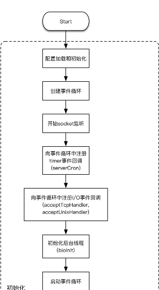
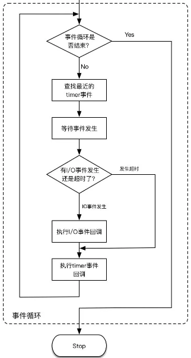
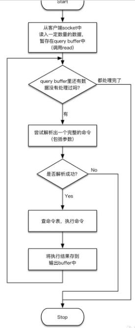

- [Redis源码从哪里读起？](https://mp.weixin.qq.com/s?__biz=MzA4NTg1MjM0Mg==&mid=2657261663&idx=1&sn=949aec03a6edf0b2281d5d83147ba367&chksm=84479186b33018903b9a3664d4de17ab83b62760e456ffcf32e9319d03964892fac6d0a7c208&scene=21#wechat_redirect)

为了表述清楚，本文按照如下思路进行：

1. 先概括地介绍整个代码初始化流程（从main函数开始）和事件循环的结构；

2. 再概括地介绍对于Redis命令请求的处理流程；

3. 重点介绍事件机制；

4. 对于前面介绍的各个代码处理流程，给出详细的代码调用关系，方便随时查阅；

## 启动过程

### 配置加载和初始化
- 配置加载和初始化。这一步表示Redis服务器**基本数据结构和各种参数的初始化**。

### 创建事件循环
- 创建事件循环。在Redis中，事件循环是用一个叫aeEventLoop的struct来表示的。事件循环的执行**依赖系统底层的I/O多路复用机制**(I/O multiplexing)，比如Linux系统上的epoll机制[1]。因此，这一步也包含对于底层I/O多路复用机制的初始化（调用系统API）。

### 开始socket监听
- 开始socket监听。服务器程序需要监听才能收到请求。根据配置，这一步可能会打开两种监听：**对于TCP连接的监听和对于Unix domain socket[2]的监听**。但不管是哪一种监听，程序都会获得**文件描述符**，并存储到server**全局变量**中。对于TCP的监听来说，由于监听的IP地址和端口可以绑定多个，**因此获得的用于监听TCP连接的文件描述符也可以包含多个**。后面，程序就可以拿这一步获得的文件描述符去**注册I/O事件回调了**。

> Unix domain socket」是一种高效的进程间通信(IPC[3])机制，在POSIX规范[4]中也有明确的定义[5]，用于在同一台主机上的两个不同进程之间进行通信，比使用TCP协议性能更高（因为省去了协议栈的开销）。

### 注册timer事件回调
- 注册timer事件回调。Redis作为一个单线程(single-threaded)的程序，它如果想调度一些异步执行的任务，比如**周期性地执行过期key的回收动作**，除了依赖事件循环机制，没有其它的办法。
    - 这一步就是向前面刚刚创建好的事件循环中注册一个timer事件，并配置成可以**周期性地执行一个回调函数**：serverCron。
    - 由于Redis只有一个主线程，因此这个函数周期性的执行也是在这个线程内，它由事件循环来驱动（即在合适的时机调用），但**不影响同一个线程上其它逻辑的执行**（相当于按时间分片了）。
    - serverCron函数**到底做了什么呢**？实际上，它除了周期性地执行过期key的回收动作，还执行了很多其它任务，比如主从重连、Cluster节点间的重连、BGSAVE和AOF rewrite的触发执行，等等。

### 注册I/O事件回调
- 注册I/O事件回调。Redis服务端最主要的工作就是监听I/O事件，从中分析出**来自客户端的命令请求**，执行命令，然后返回响应结果。对于I/O事件的监听，自然也是依赖事件循环。
    - 前面提到过，Redis可以打开两种监听：对于TCP连接的监听和对于Unix domain socket的监听。因此，这里就包含对于这两种I/O事件的回调的注册，两个回调函数分别是acceptTcpHandler和acceptUnixHandler。对于来自Redis客户端的请求的处理，就会走到这两个函数中去。
    - 另外，其实Redis在这里还会注册一个I/O事件，用于通过**管道**(pipe[6])机制与module进行双向通信。

### 初始化后台线程
- 初始化后台线程。Redis会创建一些额外的线程，在后台运行，专门用于处理一些耗时的并且可以被延迟执行的任务（一般是一些清理工作）。在Redis里面这些后台线程被称为bio(Background I/O service)。它们负责的任务包括：
    - 可以延迟执行的**文件关闭操作**(比如unlink命令的执行)，
    - AOF的**持久化写库**操作(即fsync调用，但注意只有可以被延迟执行的fsync操作才在后台线程执行)，
    - 还有一些**大key的清除操作**(比如flushdb async命令的执行)。

可见bio这个名字有点名不副实，它做的事情不一定跟I/O有关。对于这些后台线程，我们可能还会产生一个疑问：前面的初始化过程，已经注册了一个timer事件回调，即serverCron函数，按说后台线程执行的这些任务似乎也可以放在serverCron中去执行。因为serverCron函数也是可以用来执行后台任务的。实际上这样做是不行的。

前面我们已经提到过，serverCron由事件循环来驱动，**执行还是在Redis主线程上**，相当于和主线程上执行的其它操作（主要是对于命令请求的执行）按时间进行分片了。这样的话，serverCron里面就**不能执行过于耗时的操作**，否则它就会影响Redis执行命令的响应时间。因此，对于**耗时的、并且可以被延迟执行的任务，就只能放到单独的线程中去执行了。**

> 后台线程的目的：**执行耗时并且可以被延迟执行的任务**。

- 启动事件循环。前面创建好了事件循环的结构，但还没有真正进入循环的逻辑。过了这一步，事件循环就运行起来，驱动前面注册的timer事件回调和I/O事件回调不断执行。

## 事件循环

Redis启动后必定要进入一个无限循环。显然，程序在每一次的循环执行中，如果有事件（包括客户端请求的I/O事件）发生，就会去处理这些事件。但如果没有事件发生呢？程序显然**也不应该空转**，而是应该等待，把整个循环**阻塞住**。这里的等待，就是上面流程图里的「等待事件发生」这个步骤。那么，当整个循环被阻塞住之后，什么时候再恢复执行呢？自然是**等待的事件发生的时候**，程序被重新唤醒，循环继续下去。这里需要的等待和唤醒操作，怎么实现呢？它们都需要依赖系统的能力才能做到

> 空转浪费CPU时间，等待也就是操作系统的程序等待状态，等待唤醒。

timer事件和I/O事件是两种截然不同的事件，如何由事件循环来**统一调度**呢？假设事件循环在空闲的时候去等待I/O事件的发生，那么有可能一个timer事件先发生了，这时事件循环就没有被及时唤醒（仍在等待I/O事件）；反之，如果事件循环在等待timer事件，而一个I/O事件先发生了，那么同样没能够被及时唤醒。**因此，我们必须有一种机制能够同时等待这两种事件的发生**。而恰好，一些系统的API可以做到这一点（比如我们前面提到的epoll机制）。

> 能够同时等待这两种事件的发生

### 查找最近的timer事件。

如前所述，事件循环需要等待timer和I/O两种事件。对于I/O事件，只需要明确要等待的是哪些文件描述符就可以了；而对于timer事件，还需要**经过一番比较**，明确在当前这一轮循环中**需要等待多长时间**。

由于系统运行过程中可能注册多个timer事件回调，比如先要求在100毫秒后执行一个回调，同时又要求在200毫秒后执行另一个回调，这就要求事件循环在它的每一轮执行之前，首先**要找出最近需要执行的那次timer事件**。这样事件循环在接下来的等待中就知道**该等待多长时间**（在这个例子中，我们需要等待100毫秒）。

### 等待事件发生。

这一步我们需要能够同时等待timer和I/O两种事件的发生。要做到这一点，我们依赖系统底层的I/O多路复用机制(I/O multiplexing)。这种机制一般是这样设计的：它允许我们针对多个文件描述符来等待对应的I/O事件发生，并同时可以指定一个最长的阻塞超时时间。如果在这段阻塞时间内，有I/O事件发生，那么程序会被唤醒继续执行；如果一直没有I/O事件发生，而是指定的时间先超时了，那么程序也会被唤醒。对于?:**timer事件的等待，就是依靠这里的超时机制。**

当然，这里的超时时间也**可以指定成无限长**，这就相当于只等待I/O事件。我们再看一下上一步查找最近的timer事件，查找完之后可能有三种结果，因此这一步等待也可能出现三种对应的情况：

- 第一种情况，查找到了一个最近的timer事件，它要求在未来某一个时刻触发。那么，这一步只需要把这个**未来时刻转换成阻塞超时时间**即可。

> 如何查找？

- 第二种情况，查找到了一个最近的timer事件，但它要求的时刻**已经过去**了。那么，这时候它应该**立刻被触**发，而不应该再有任何等待。当然，在实现的时候还是调用了事件等待的API，只是把超时事件设置成0就可以达到这个效果。

- 第三种情况，**没有查找到任何注册的timer事件**。那么，这时候应该把超时时间设置成无限长。接下来只有I/O事件发生才能唤醒。

> 阻塞时间来触发定时任务。

### 判断有I/O事件发生还是超时。

这里是程序从上一步（可能的）阻塞状态中恢复后执行的判断逻辑。如果是I/O事件发生了，那么先执行I/O事件回调，然后根据需要把到期的timer事件的回调也执行掉（如果有的话）；如果是超时先发生了，那么表示**只有timer事件**需要触发（没有I/O事件发生），那么就直接把到期的timer事件的回调执行掉。

### 执行I/O事件回调。

我们前面提到的对于TCP连接的监听和对于Unix domain socket的监听，这两种I/O事件的回调函数acceptTcpHandler和acceptUnixHandler，就是在这一步被调用的。

### 执行timer事件回调。

我们前面提到的周期性的回调函数serverCron，就是在这一步被调用的。一般情况下，**一个timer事件被处理后，它就会被从队列中删除，不会再次执行了**。但serverCron却是被周期性调用的，这是怎么回事呢？这是因为Redis对于timer事件回调的处理设计了一个小机制：**timer事件的回调函数可以返回一个需要下次执行的毫秒数。如果返回值是正常的正值，那么Redis就不会把这个timer事件从事件循环的队列中删除，这样它后面还有机会再次执行**。例如，按照默认的设置，serverCron返回值是100，因此它每隔100毫秒会执行一次（当然这个执行频率可以在redis.conf中通过hz变量来调整）。

## Redis命令请求的处理流程概述
Redis客户端向服务器发送命令，其实可以细分为两个过程：

- 连接建立。客户端发起连接请求（通过TCP或Unix domain socket），服务器接受连接。

- 命令发送、执行和响应。连接一旦建立好，客户端就可以在这个新建立的连接上发送命令数据，服务器收到后执行这个命令，并把执行结果返回给客户端。而且，在新建立的连接上，这整个的「命令发送、执行和响应」的过程就可以**反复执行**。

接下来，从socket编程的角度，服务器应该调用accept系统API[7]来接受连接请求，**并为新的连接创建出一个socket**。这个新的socket也就对应着一个**新的文件描述符**。为了在新的连接上能接收到客户端发来的命令，接下来必须在事件循环中为这个新的文件描述符注册一个I/O事件回调。

上述流程图有几个需要注意的点：

- 从socket中读入数据，是按照流的方式。也就是说，站在应用层的角度，从底层网络层读入的数据，是由一个个字节组成的字节流。而我们需要从这些字节流中解析出完整的Redis命令，才能知道接下来如何处理。但由于网络传输的特点，我们并不能控制一次读入多少个字节。实际上，即使服务器只是收到一个Redis命令的部分数据（哪怕只有一个字节），也有可能触发一次I/O事件回调。这时我们是调用read系统API[8]来读入数据的。虽然调用read时我们可以指定期望读取的字节数，但它**并不会保证一定能返回期望长度的数据**。比如我们想读100个字节，但可能只能读到80个字节，剩下的20个字节可能还在网络传输中没有到达。这种情况给接收Redis命令的过程造成了很大的麻烦：
    - 首先，可能我们读到的数据还不够一个完整的命令，这时我们**应该继续等待更多的数据到达**。
    - 其次，我们可能一次性收到了大量的数据，里面包含不止一个命令，这时我们必须把里面包含的所有命令都解析出来，而且要**正确解析到最后一个完整命令的边界**。
    - 如果最后一个完整命令后面还有多余的数据，那么这些数据应该**留在下次有更多数据到达时再处理**。这个复杂的过程一般称为「粘包」。

- 「粘包」处理的第一个表现，就是当尝试解析出一个完整的命令时，如果解析失败了，那么上面的流程就**直接退出**了。接下来，如果有更多数据到达，事件循环会**再次触发**I/O事件回调，**重新进入**上面的流程继续处理。

- 「粘包」处理的第二个表现，是上面流程图中的大循环。只要**暂存输入数据**的query buffer中还有数据可以处理，那么就**不停地去尝试解析完整命令**，直到把里面所有的完整命令都处理完，才退出循环。

- 查命令表那一步，就是查找本文前面提到的由populateCommandTable初始化的命令表，这个命令表存储在server.c的全局变量redisCommandTable当中。命令表中存有各个Redis命令的执行入口。

- 对于命令的执行结果，在上面的流程图中**只是最后存到了一个输出buffer中**，并没有真正输出给客户端。输出给客户端的过程不在这个流程当中，而是由另外一个**同样是由事件循环驱动的过程来完成**。这个过程涉及很多细节，我们在这里先略过，留在后面第四部分再来讨论。

> 粘包的处理：解析失败退出，数据扔在query buffer中，等待更多数据到达触发再次解析。不断解析完整命令进行执行。结果输出到buffer，同样通过事件循环驱动完成。

## 事件驱动

业界已经有一些比较成熟的开源的事件库了，典型的比如libevent[20]和libev[21]。一般来说，这些开源库屏蔽了非常复杂的底层系统细节，并对不同的系统版本实现做了兼容，是非常有价值的。**那为什么Redis的作者还是自己实现了一套呢**？在Google Group的一个帖子上，Redis的作者给出了一些原因。帖子地址如下：

https://groups.google.com/group/redis-db/browse_thread/thread/b52814e9ef15b8d0/

**原因大致总结起来就是**：

- 不想引入太大的外部依赖。比如libevent太大了，比Redis的代码库还大。

- 方便做一些定制化的开发。

- 第三方库有时候会出现一些意想不到的bug。

---
# 定时任务

- [Redis(5.0.3)定时任务serverCron](http://cbsheng.github.io/posts/redis%E5%AE%9A%E6%97%B6%E4%BB%BB%E5%8A%A1servercron/)

定时任务是在IO事件处理完之后才被执行的，所以**redis的定时任务并不一定准点执行的**。

在等待IO事件之前，会先**获取下次定时任务应该被执行的时间点，减去当前时间，得出来的值就是阻塞等待IO事件的timeout**。总不能无限等待下去。要是timeout前IO事件已经到来了也没关系，最后真正在执行定时任务前会做检查，没到时间点是不会被执行的。
> 也就是定时任务并没有不是事件，而是通过阻塞时间来触发的额？

开篇也说到，有多种redis功能是需要定时任务来协助的。它们就是小任务，全被写在一个大任务里(serverCron)。

而大任务就是时间事件。也即全局其实只有一个定时任务，每次执行它的时候，里面再执行各种小任务。

---

- [Redis的事件循环与定时器模型](https://itindex.net/detail/26944-redis-%E4%BA%8B%E4%BB%B6%E5%BE%AA%E7%8E%AF-%E5%AE%9A%E6%97%B6%E5%99%A8)

## aeCreateTimeEvent

同样是初始化数据结构，但没有调用aeApiAddEvent()这个函数，当然，**定时器又不需要文件描述符**，当然**不需要添加相关事件**，定时器的实现**只是使用了epoll_wait()的定时功能**，aeAddMillisecondsToNow()这个函数顾名思义是把当前时间加上一个给定的毫秒数，然后算出一个when_sec和when_ms，eventloop对象的timeEventHead实际上是一个**单向链表**，它用于保存所有的定时器事件，当添加一个定时器事件时其实只是向**该链表头中插入了一个元素**，其会后由aeProcessEvents()这个函数**遍历该链表取出超时的事件进行处理**

就是**遍历刚才的提到的那个timeEventHead链表，来找出时间值最小的一个，注意是遍历，因为链表中的定时器也是无序的**，不过我相信作者有一天会把它换成红黑树或者其它的数据结构吧。

如果定时器队列为空，或者说没有任何定时器事件，则可以根据AE_DONT_WAIT这个标志来决定epoll_wait()是non-blocking立即返回，还是**一直阻塞**在那里。

aeApiPoll()函数返回时，有两种情况，一种是IO事件被触发，另一种是定时器超时，当IO事件被触发时，遍历所有活跃描述符并调用相关的回调函数对其进行处理。当没有IO事件被触发，而是超时时，则**返回值numevents为0，函数会转向processTimeEvents()来遍历定时器列表**，调用定时器回调函数处理定时器事件，当**IO事件被触发而并没有定时器超时时**，如果**设置了AE_TIME_EVENTS标志则也会对定时器列表进行遍历**，主循环便是如此，我认为这会多少对效率有一定的影响，当然可能现在的Redis定时器列表并不太大，所以效率问题也可以忽略。

> AE_TIME_EVENTS: 控制IO事件触发执行后是否执行时间时间？

---

- [Redis事件循环器(AE)实现剖析](https://zhuanlan.zhihu.com/p/92739237)
当时我看到这里源码的时候，还是很震惊的。因为一般来说，定时器都会采用最小堆或者时间轮等有序数据结构进行存储， 为什么Redis的定时器做的这么简陋？

《Redis的设计与实现》一书中说，**在Redis 3.0版本中，只使用到了serverCon这一个超时事件。 所以这种情况下，也无所谓性能了，虽然是个链表，但其实用起来就只有一个元素，相当于当做一个指针在用**。

虽然还不清楚5.0.6版本里面超时事件有没有增多，不过可以肯定的是，目前依然达不到花点时间去优化的程度。 Redis在注释里面也说明了这事，并且给出了以后的优化方案： 用skiplist代替现有普通链表，查询的时间复杂度将优化为O(1), 插入的时间复杂度将变成O(log(N))

- [redis-eventloop](https://draveness.me/redis-eventloop/)
