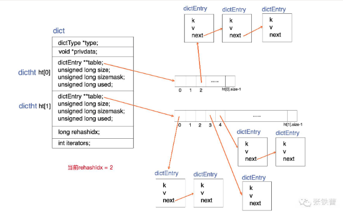
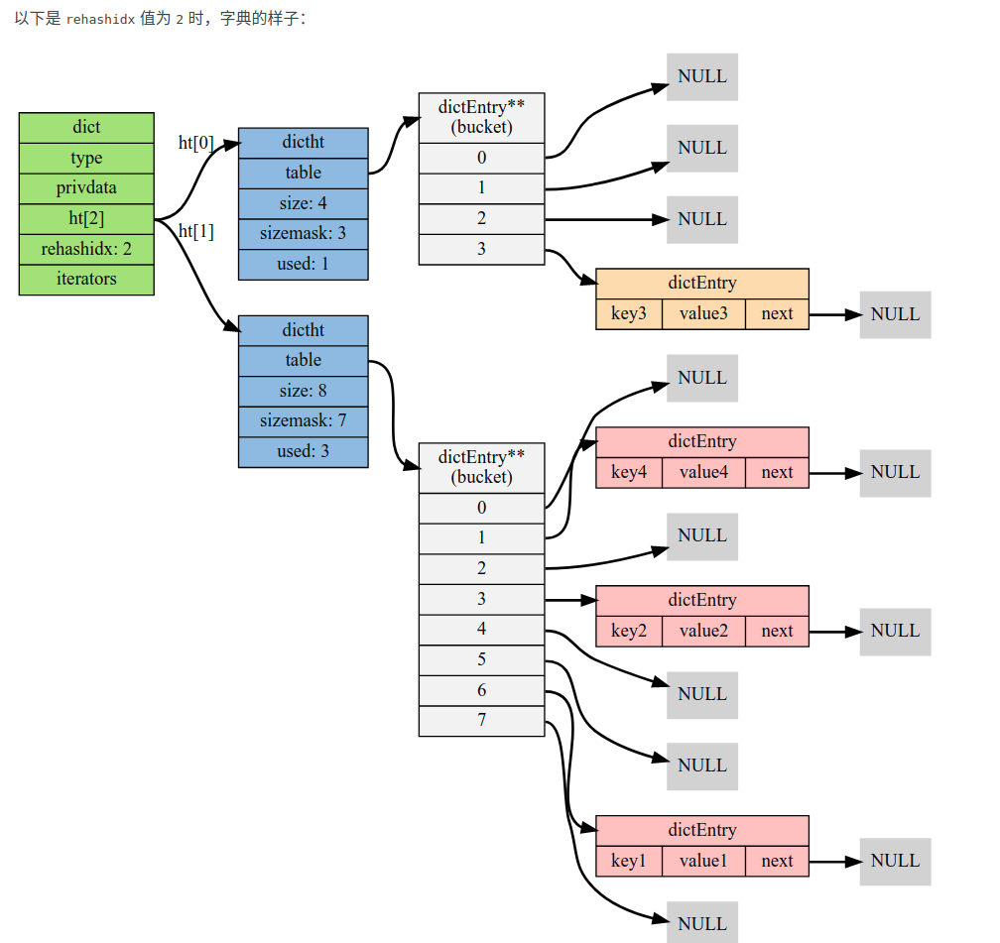

# Redis内部数据结构详解(1)——dict

## Redis的关注点
关注以下几点：

- 存储效率（memory efficiency）。**Redis是专用于存储数据的，它对于计算机资源的主要消耗就在于内存，因此节省内存是它非常非常重要的一个方面**。这意味着Redis一定是非常精细地考虑了**压缩数据、减少内存碎片**等问题。

- 快速响应时间（fast response time）。**与快速响应时间相对的，是高吞吐量（high throughput）**。Redis是用于提供在线访问的，对于单个请求的响应时间要求很高，因此，快速响应时间是比高吞吐量**更重要的目标**。有时候，这两个目标是矛盾的。

- 单线程（single-threaded）。Redis的性能**瓶颈不在于CPU资源**，而在于**内存访问和网络IO**。而采用单线程的设计带来的好处是，极大简化了**数据结构和算法的实现**。相反，Redis通过**异步IO和pipelining**等机制来实现**高速的并发访问**。显然，单线程的设计，对于单个请求的**快速响应时间**也提出了更高的要求。

> Redis配合使用dict和skiplist来共同维护一个sorted set。

dict本质上是为了解决算法中的查找问题（Searching），一般查找问题的解法分为两个大类：**一个是基于各种平衡树**，**一个是基于哈希表**。我们平常使用的各种Map或dictionary，大都是基于哈希表实现的。**在不要求数据有序存储，且能保持较低的哈希值冲突概率的前提下，基于哈希表的查找性能能做到非常高效，接近O(1)，而且实现简单**。

在Redis中，dict**也是一个基于哈希表的算法**。和传统的哈希算法类似，它采用某个哈希函数从key计算得到在哈希表中的位置，**采用拉链法解决冲突**，并在**装载因子（load factor）超过预定值时自动扩展内存，引发重哈希（rehashing）**。Redis的dict实现**最显著**的一个特点，就在于它的重哈希。它采用了一种称为**增量式重哈希**（incremental rehashing）的方法，在需要扩展内存时**避免一次性对所有key进行重哈希**，而是将重哈希操作**分散**到对于dict的**各个增删改查**的操作中去。这种方法能做到每次只对一小部分key进行重哈希，而每次**重哈希之间不影响dict的操作**。dict之所以这样设计，是为了避免重哈希期间**单个请求的响应时间剧烈增加**，这与前面提到的“快速响应时间”的设计原则是相符的。

## _dictRehashStep

dictRehash每次将重哈希至少向前推进n步（除非不到n步整个重哈希就结束了），每一步都将ht[0]上某一个bucket（即一个dictEntry链表）上的每一个dictEntry**移动**到ht[1]上，它在ht[1]上的新位置根据ht[1]的**sizemask进行重新计算**。**rehashidx记录了当前尚未迁移**（有待迁移）的ht[0]的bucket位置。

> **rehashidx记录了当前尚未迁移**（有待迁移）的ht[0]的bucket位置

如果dictRehash被调用的时候，rehashidx指向的bucket里一个dictEntry也没有，那么它就没有可迁移的数据。这时它尝试在ht[0].table数组中不断向后遍历，直到找到下一个存有数据的bucket位置。如果一直找不到，则最多走**`n*10`步**，本次重哈希暂告结束。

最后，如果ht[0]上的数据都迁移到ht[1]上了（即d->ht[0].used == 0），那么整个重哈希结束，ht[0]变成ht[1]的内容，而ht[1]重置为空。

> 重哈希，两个hash表，新的是旧的2倍，然后在增删查改触发重哈希，避免单次操作的耗时。既有扩展也有收缩。

## dictAdd

dictAdd插入新的一对key和value，如果key已经存在，则插入失败。

以上是dictAdd的关键实现代码。我们主要需要注意以下几点：

- 它也会**触发**推进一步重哈希（_dictRehashStep）。

- 如果正在重哈希中，它会把数据**插入到ht[1]**；否则插入到ht[0]。

- 在对应的bucket中插入数据的时候，**总是插入到dictEntry的头部**。因为新数据接下来被访问的概率可能比较高，这样再次查找它时就比较次数较少。

- _dictKeyIndex在dict中寻找插入位置。如果不在重哈希过程中，它**只查找**ht[0]；否则查找ht[0]和ht[1]。

- _dictKeyIndex可能触发dict内存扩展?

> dictAdd只会执行不存在的key，触发重哈希、直接插入ht[1]、先插头部、查找规律、

## dictReplace

dictReplace也是插入一对key和value，不过在key存在的时候，它会更新value。

在key已经存在的情况下，dictReplace会同时调用dictAdd和dictFind，这其实相当于两次查找过程。这里Redis的代码不够优化。

> replace通过dictAdd添加，如果ok代表旧的key不存在，失败代表已存在，通过dictFind、dictSetVal重设

## 参考链接
- [Redis内部数据结构详解(1)——dict](https://mp.weixin.qq.com/s?__biz=MzA4NTg1MjM0Mg==&mid=2657261203&idx=1&sn=f7ff61ce42e29b874a8026683875bbb1&scene=21#wechat_redirect)

---
# 字典

## 实现字典
实现字典的方法有很多种：

- 最简单的就是使用链表或数组，但是这种方式只适用于**元素个数不多**的情况下；
- 要兼顾高效和简单性，可以使用哈希表；
- 如果追求更为稳定的性能特征，并希望**高效地实现排序操作**的话，则可使用更为**复杂的平衡树**；

> 字典实现与各个优缺点对比。高效地实现排序操作。可以通过对比各个操作的时间复杂度对比O(1)。

## 哈希算法
Redis 目前使用两种不同的哈希算法：

- MurmurHash2 32 bit 算法：这种算法的分布率和速度都非常好， 具体信息请参考 MurmurHash 的主页： http://code.google.com/p/smhasher/ 。
- 基于 djb 算法实现的一个**大小写无关散列**算法：具体信息请参考 http://www.cse.yorku.ca/~oz/hash.html 。

使用哪种算法取决于具体应用所处理的数据：

- 命令表以及 Lua 脚本缓存都用到了算法 2 。
- 算法 1 的应用则更加广泛：数据库、集群、哈希键、阻塞操作等功能都用到了这个算法。

## 碰撞

对于使用链地址法来解决碰撞问题的哈希表 dictht 来说， 哈希表的性能取决于大小（size属性）与保存节点数量（used属性）之间的比率：

- 哈希表的大小与节点数量，比率在 **1:1** 时，哈希表的性能最好；
- 如果节点数量比哈希表的大小要大很多的话，那么哈希表就会**退化成多个链表**，哈希表本身的性能优势便不复存在；

dictAdd 在每次向字典添加新键值对之前， 都会对哈希表 ht[0] 进行检查， 对于 ht[0] 的 size 和 used 属性， 如果它们之间的比率 ratio = used / size 满足以下任何一个条件的话，rehash 过程就会被激活：

- **自然 rehash** ： ratio >= 1 ，且变量 dict_can_resize 为真。
- **强制 rehash** ： ratio 大于变量 dict_force_resize_ratio （目前版本中， dict_force_resize_ratio 的值为 5 ）。

## 什么时候 dict_can_resize 会为假？

在前面介绍字典的应用时也说到过， 数据库就是字典， 数据库里的哈希类型键也是字典， 当 Redis 使用子进程对数据库执行**后台持久化任务**时（比如执行 BGSAVE 或 BGREWRITEAOF 时）， 为了最大化地利用系统的 **copy on write** 机制， 程序会暂时将 dict_can_resize 设为假， 避免执行自然 rehash ， 从而减少程序对**内存的触碰**（touch）。

当持久化任务完成之后， dict_can_resize 会重新被设为真。

另一方面， 当字典**满足了强制 rehash**的条件时， 即使 dict_can_resize 不为真（有 BGSAVE 或 BGREWRITEAOF 正在执行）， 这个字典一样会被 rehash 。

## 渐进式 rehash

在上一节，我们了解了字典的 rehash 过程， 需要特别指出的是， rehash 程序并不是在激活之后，就马上执行直到完成的， 而是**分多次、渐进式**地完成的。

假设这样一个场景：在一个有很多键值对的字典里， 某个用户在添加新键值对时触发了 rehash 过程， 如果这个 rehash 过程必须将所有键值对迁移完毕之后才将结果返回给用户， 这样的处理方式将是非常不友好的。

另一方面， 要求服务器必须**阻塞直到 rehash 完成**， 这对于 Redis 服务器本身也是**不能接受**的。

为了解决这个问题， Redis 使用了渐进式（incremental）的 rehash 方式： 通过将 rehash **分散到多个步骤中进行， 从而避免了集中式的计算**。

渐进式 rehash 主要由 _dictRehashStep 和 dictRehashMilliseconds 两个函数进行：

- _dictRehashStep 用于对数据库字典、以及哈希键的字典进行被动 rehash ；
- dictRehashMilliseconds 则由 Redis 服务器**常规任务程序**（server cron job）执行，用于对数据库字典进行**主动 rehash** ；

### _dictRehashStep
每次执行 _dictRehashStep ， ht[0]->table 哈希表**第一个不为空的索引上的所有节点**就会全部迁移到 ht[1]->table 。

在 rehash 开始进行之后（d->rehashidx 不为 -1）， **每次执行一次添加、查找、删除操作**， _dictRehashStep 都会被执行一次：

> 第一个不为空的索引，或者n*10个空索引

### dictRehashMilliseconds
dictRehashMilliseconds 可以在指定的毫秒数内， 对字典进行 rehash 。

当 Redis 的服务器**常规任务执行**时， dictRehashMilliseconds 会被执行， 在**规定的时间内**， **尽可能**地对数据库字典中那些需要 rehash 的字典进行 rehash ， 从而**加速数据库字典的 rehash 进程**

> 定时任务加速字典redash，但也限制了时间

### 其他措施
在哈希表进行 rehash 时， 字典还会采取一些特别的措施， 确保 rehash 顺利、正确地进行：

- 因为在 rehash 时，字典会同时使用两个哈希表，所以在这期间的**所有查找、删除**等操作，除了在 ht[0] 上进行，**还需要**在 ht[1] 上进行。
- 在执行添加操作时，新的节点会**直接添加到 ht[1]** 而不是 ht[0] ，这样保证 ht[0] 的节点数量在整个 rehash 过程中都**只减不增**。

> 查找、添加的rehash过程

## 字典的收缩

上面关于 rehash 的章节描述了通过 rehash 对字典进行扩展（expand）的情况， 如果哈希表的可用节点数比已用节点数大很多的话， 那么也可以通过对哈希表进行 rehash 来收缩（shrink）字典。

收缩 rehash 和上面展示的扩展 rehash 的操作几乎一样

在默认情况下， REDIS_HT_MINFILL 的值为 10 ， 也即是说， 当字典的**填充率低于10%时**， 程序就可以对这个字典进行收缩操作了。

字典收缩和字典扩展的一个区别是：

- 字典的扩展操作是自动触发的（不管是自动扩展还是强制扩展）；
- 而字典的收缩操作则是由**程序手动执行**。

因此， 使用字典的程序可以决定何时对字典进行收缩：

- 当字典用于实现哈希键的时候， 每次从字典中删除一个键值对， 程序就会执行一次 **htNeedsResize** 函数， 如果字典达到了收缩的标准， 程序将立即对字典进行收缩；
- 当字典用于实现数据库键空间（key space）的时候， **收缩的时机**由 redis.c/tryResizeHashTables 函数决定

> 收缩时机

## 字典的迭代

字典带有自己的迭代器实现 —— 对字典进行迭代实际上就是对字典所使用的哈希表进行迭代：

- 迭代器首先迭代字典的第一个哈希表，然后，如果 rehash 正在进行的话，就继续对第二个哈希表进行迭代。
- 当迭代哈希表时，找到第一个不为空的索引，然后迭代这个索引上的所有节点。
- 当这个索引迭代完了，继续查找下一个不为空的索引，如此反覆，直到整个哈希表都迭代完为止。

> 单线程的好处。不需要处理事务和并发

## 总结
- 字典被广泛用于实现 Redis 的各种功能， 其中包括数据库和哈希键。
- Redis 中的字典使用哈希表作为底层实现， 每个字典带有两个哈希表， 一个用于平时使用， 另一个仅在进行 rehash 时使用。
- 当字典被用作数据库的底层实现， 或者哈希键的底层实现时， Redis 使用 MurmurHash2 算法来计算键的哈希值。
- 哈希表使用链地址法来解决键冲突， 被分配到同一个索引上的多个键值对会连接成一个单向链表。
- 在对哈希表进行扩展或者收缩操作时， 程序需要将现有哈希表包含的所有键值对 rehash 到新哈希表里面， 并且这个 rehash 过程并不是一次性地完成的， 而是渐进式地完成的。

## 参考链接

- [字典](https://redisbook.readthedocs.io/en/latest/internal-datastruct/dict.html)
